--- 
title: "DNA Hydroxymethylation in Hepatocellular Carcinoma"
author: "Francois Collin"
#date: "2020-10-06"
date: 2020
site: bookdown::bookdown_site
### see https://community.rstudio.com/t/bookdown-pdf-generation/12359
knit: "bookdown::render_book"  
documentclass: book
bibliography: [bib/HCC5hmc.bib]
#biblio-style: apalike
csl: csl/cell-numeric.csl
#csl: csl/american-medical-association-alphabetical.csl
link-citations: yes
description: "Data from Cai et al. (2019) paper are explored"
---

<!-- ONLY THIS FILE SHOULD HAVE YAML -->

<!-- THIS FILE DOESN'T HAVE TO HAVE ANY CONTENT ... -->
 

<style>

.watermark {
  opacity: 0.2;
  position: fixed;
  top: 50%;
  left: 50%;
  font-size: 500%;
  color: #00407d;
}

</style>

<!-- THIS DIDN'T DO ANYTHING
<div class="watermark">DRAFT</div>
-->


<!--chapter:end:index.Rmd-->

# Preamble {.unnumbered #index} 


This vignette offers some exploratory data analyses of 
DNA Hydroxymethylation data available from 
NCBI GEO [Series GSE112679](https://www.ncbi.nlm.nih.gov/geo/query/acc.cgi?acc=GSE112679).
These data can be conveniently accessed through an R data package.
See [GSE112679 R Data Package page](https://12379monty.github.io/GSE112679/).

## License {-}

<!-- From https://github.com/santisoler/cc-licenses -->
<!-- THis doesnt work with pdf -->
<!-- COMMENT OUT FOR bookdown::pdf_book ????


-->


This work by Francois Collin is licensed under a
[Creative Commons Attribution 4.0 International License](http://creativecommons.org/licenses/by/4.0/)


# Introduction {#intro}


The goal of detecting
cancer at the earliest stage of development with a non-invasive procedure
has busied many groups with the task of perfecting techniques to support
what has become commonly known as a 
liquid biopsy - the analysis of biomarkers circulating in fluids such as blood,
saliva or urine.  Epigenetic biomarkers present themselves as good candidates for this application
(Gai and Sun (2019) [@Gai:2019aa]).  In particular,
given their prevalence in the human genome, 
close correlation with gene expression and high chemical stability,
DNA modifications such as 5-methylcytosine (5mC) and 5-hydroxymethylcytosine (5hmC)
are DNA epigenetic marks that provide much promise as
cancer diagnosis biomarkers that could be profitably analyzed in liquid biopsies
[@Cai:2019aa; @Li:2017aa; @Song:2017aa; @Collin:2018aa].


<!--
This work has already led to some commercial products.
Thrive Earlier Detection Corp.  launched CancerSEEK, a liquid biopsy test to detect multiple cancers early in 2019.  Guardant Health offers a liquid biopsy test, Guardant360, for advanced solid 
tumor cancers. Others in the space include Karius, which focuses on a liquid biopsy for 
infectious disease, and GRAIL Bio, which was launched by Illumina in January 2016. 
In 2017, Verily Life Sciences, one of Google/Alphabet’s companies, invested in Freenome, 
another liquid biopsy company.
-->
Li et al. (2017) [@Li:2017aa] used a sensitive and selective chemical labeling technology
to extract genome-wide 5hmC profiles from circulating cell-free DNA (cfDNA) 
as well as from genomic DNA (gDNA) 
collected from a cohort of 260 patients recently diagnosed with colorectal, 
gastric, pancreatic, liver or thyroid cancer and normal tissues from 90 healthy individuals
They found 5hmC-based biomarkers of circulating cfDNA to be highly predictive of some cancer types.
Similar small sample size findings were reported in Song et al. (2017) [@Song:2017aa].  

Focusing on hepatocellular carcinoma, Cai et al. (2019) [@Cai:2019aa] assembled a sizable dataset
to demonstrate the feasibility of using features derived from 
5-hydroxymethylcytosines marks in circulating cell-free DNA as 
a non-invasive approach for the early detection of
hepatocellular carcinoma.  The data that are the basis of that
report are available on the NCBI GEO web site 
([Series GSE112679](https://www.ncbi.nlm.nih.gov/geo/query/acc.cgi?acc=GSE112679)).
The data have also been bundled in a R data package which can be installed from github:

```
if (!requireNamespace("devtools", quietly = TRUE))
    install.packages("devtools")
devtools::install_github("12379Monty/GSE112679")
```

An important question in the early development of classifiers of the sorts
that are the basis of any liquid biopsy diagnostic tool is how many samples
should be collected to make properly informed decisions.  In this
report we will explore the GSE112679 data to shed some light on
the relationship between sample size and model performance
in the context classifying samples based on 5hmC data.
The same analyses are repeated on Breast Cancer RNA-Seq data 
to provide a different signal to noise context in which to evaluate
classification model performance in relation to sample size.

The layout of the report is the following:  

* In Section \@ref(modeling-background) we provide background on fitting and
analyzing predictive models in the `n << p` context and 
give some detail about the primary tool used in this report.

* In Section \@ref(hcc-5hmcseq-preproc) we pre-process the 5hmC data that
we will use for the classification analysis and perform some light QC analyses.  

* In Section \@ref(hcc-5hmcseq-explore-sparsity) we explore sparse models
that discriminate between early stage HCC and control samples based on
5hmC gene body intensity data.

* In Section \@ref(hcc-5hmcseq-model-suite) we examine the results of fitting a 
suite of models to the HCC 5hmC data investigate the effect of sample 
size on model performance.  

* Sections \@ref(brca-rnaseq-preproc), \@ref(brca-rnaseseq-explore-sparsity)
and \@ref(brca-rnaseq-model-suite) repeat the analyses run on the HCC 5hmC data 
on breast cancer RNA-Seq data.

<!-- LEAVE FEATURE OUT IS NOT INFORMATIVE
* In Section \@ref(variable-importance) we look at the question of assessing variable importance.
-->

* Concluding remarks are in Section \@ref(conclusions).


<!--chapter:end:01-intro.Rmd-->

# Classification Analysis in the `n << p` Context {#modeling-background}

<!--
Refer to [first pass study](https://hcc-5hmc-analysis.netlify.app/) for
relevant exploratory data  analysis results.
-->

<!--
In the section we look at  some models fitted to discriminate between
early stage HCC and healthy and benign samples (grouped as Controls here)
from the GSE112679 data set.  


* Some questions to address with the baseline model 
   - how separable are the data: what accuracy do we expect 
   - individual sample quality scores: which samples are hard to classify?  Compute a score
in [0, 1], where 1 is perfectly good classification and 0 is perfectly bad.

-->


The main challenge in calibrating predictive models to genomic data is that
there are many more features than there are example cases to fit to;
the  now classic $n << p$ problem.
In this scenario, fitting methods tend to over fit.  The problem
can be addressed by selecting variables, regularizing the fit or both.

<!--
See the Trevor Hastie talk: 
[Statistical Learning with Big Data - Trevor Hastie](https://web.stanford.edu/~hastie/TALKS/SLBD_new.pdf)
for a good discussion of this problem and potential solutions.
-->

In this report, we use genomic data to illustrate analyses of regularized regression
models in the `n << p` context.  Much of the analysis focuses on lasso models fitted
and analyzed using tools from the `glmnet` R package.  

Before providing some background on that glmnet package and the 
models that it supports, we briefly describe another R package
which is an essential tool for anyone who is doing predictive analytics in R - `caret` R package.


## caret for model evaluation

[The `caret` Package](https://topepo.github.io/caret/index.html)
provides a rich set of functions that streamline the process for fitting and
evaluating a large number of predictive models in parallel. The package contains tools for:

* data splitting  
* pre-processing  
* feature selection  
* model tuning using re-sampling  
* variable importance estimation  

The tools facilitate the process of automating randomly splitting data sets into training, 
testing and evaluating so that predictive models can be evaluated on a comparable and
exhaustive basis.  Especially useful is the functionality that is provided to
repeatedly randomly stratify samples into train and test set so that any
sample selection bias is removed.  


What makes the `caret` package extremely useful is that it provides a common interface 
to an exhaustive collection of fitting procedures.  Without
this common interface one has to learn the specific syntax that
used in each fitting procedure to be included in a comparative analysis,
which can be quite burdensome.  

Some of the models which can be evaluated with caret include: 
(only some of these can be used with multinomial responses)

* FDA - Flexible Discriminant Analysis  
* stepLDA - Linear Discriminant Analysis with Stepwise Feature Selection  
* stepQDA - Quadratic Discriminant Analysis with Stepwise Feature Selection  
* knn - k nearest neighbors  
* pam - Nearest shrunken centroids  
* rf - Random forests  
* svmRadial - Support vector machines (RBF kernel)  
* gbm - Boosted trees  
* xgbLinear - eXtreme Gradient Boosting  
* xgbTree - eXtreme Gradient Boosting  
* neuralnet - neural network  

Many more models can be implemented and evaluated with `caret`, 
including some `deep learning` methods, `Simulated Annealing Feature Selection` 
and `Genetic Algorithms`.
Many other methods found [here](https://topepo.github.io/caret/available-models.html)
are also worth investigating.

We mention `caret` here because it is an extremely useful tool for 
anyone interested in exploring and comparing the performance of
many predictive models which could be applied to a given predictive
analysis context.  We have gone through this exercise with a number
of genomic scale, RNA-Seq data sets in the past and have found 
that in this context regularized regression models perform
as well as any.  For this report, we will only consider regularized classification
models and will focus on the particular set of tools for fitting and analyzing
these models provided by the `glmnet` R package [@Friedman:2010aa].


## The `glmnet` R package

Several factors favor using the `glmnet` R package to analyze
classification models fitted to genomic scale data:

* the glmnet package is a well supported package providing
extensive functionality for regularized regression and classification models.

* the hyper-parameters of the elastic net enable us to explore
the relationship between model size, or sparsity, and predictive accuracy.
ie. we can investigate the "bet on sparsity" principle:
*Use a procedure that does well in sparse problems, since no procedure
does well in dense problems*.

* in our experience building classifiers from genomic scale data, regularized
classification models using the elastic net penalty do as well as any other,
and are more economical in terms of computing time, especially in comparison to
the more exotic boosting algorithms.

* the `lasso` has been shown to be near optimal for the $n<<p$ problem
over a wide range of signal-to-noise regiments (Hastie et al. (2017) [@Hastie:2017aa]).


***


Much of the following comes from the 
[Glmnet Vignette](https://web.stanford.edu/~hastie/glmnet/glmnet_alpha.html).


Glmnet is a package that fits a generalized linear model via penalized maximum likelihood. 
The regularization path is computed for the lasso or elastic net penalty at a 
grid of values for the regularization parameter lambda 
([@Friedman:2010aa;@Tibshirani:2012aa;@Simon:2011aa;@Simon:2013aa]). 

`glmnet` solves the following problem:

$$\min_{\beta_0,\beta} \frac{1}{N} \sum_{i=1}^{N} w_i l(y_i,\beta_0+\beta^T x_i) + \lambda\left[(1-\alpha)||\beta||_2^2/2 + \alpha ||\beta||_1\right],$$

over a grid of values of $\lambda$.
Here $l(y,\eta)$ is the negative log-likelihood contribution for observation i; 
e.g. for the Gaussian case it is $\frac{1}{2}(y-\eta)^2$.


###  **alpha** hyper-parameter {-}

The elastic-net penalty is controlled by $\alpha$, and bridges the gap between 
lasso ($\alpha$=1, the default) and ridge ($\alpha$=0). 
The tuning parameter $\lambda$ controls the overall strength of the penalty. 

It is known that the ridge penalty shrinks the coefficients of correlated predictors 
towards each other while the lasso tends to pick one of them and discard the others. 
The elastic-net penalty mixes these two; if predictors are correlated in groups, 
an $\alpha$=0.5 tends to select the groups in or out together. 
This is a higher level parameter, and users might pick a value upfront, 
else experiment with a few different values. One use of $\alpha$ is for numerical stability; 
for example, the *elastic net with $\alpha = 1 - \epsilon$ for some small $\epsilon$>0 
performs much like the lasso, but removes any degeneracies and wild behavior caused 
by extreme correlations*.


## Signal-to-noise Ratio {#signal-to-noise}

A key characteristic of classification problems is the 
prevailing signal-to-noise ratio (SNR) of the problem at hand.

To define SNR, let $(x_0, y_0) \in  \mathbb{R}^p \times \mathbb{R}$
be a pair of predcitor and response variables and define
$f(x_0) = \mathbb{E}(y_0|x_0)$ and $\epsilon = y_0 - f(x_0)$ so that

$$y_0 = f(x_0) + \epsilon_0.$$

The signal-to-noise ratio in this model is defined as

$$SNR=\frac{var(f(x_0))}{var(\epsilon_0)}.$$

It is useful to relate the SNR of a model to the proportion of variance explained (PVE).
For a given prediction function g --- eg. one trained on n samples
$(x_i, y_i) i = 1, \dots, n$ that are i.i.d. to $(x_0, y_0)$ --- its
associated proportion of variance explained is defined as

$$PVE(g)=1 - \frac{\mathbb{E}(y_0-g(x_0))^2}{Var(y_0)}.$$

This is maximized when we take $g$ to be the mean function $f$ itself,
in which case

$$PVE(f) = 1 - \frac{Var(\epsilon_0)}{Var(y_0)} = \frac{SNR}{1+SNR}.$$

Or equivalently,

$$SNR = \frac{PVE}{1-PVE}.$$

Hastie, Tibshirani, and Tibshirani (2017) [@Hastie:2017aa], point out that
PVE is typically in the 0.2 range, and much lower in financial data.  It
is also much lower in 5hmC data, as we will see in the next section.  

Note that the SNR is a different characterization of noise level than the
coefficient of variation:

$$c_v = \frac{\sigma}{\mu}=\frac{Var(y)}{\mathbb{E}(y)}$$

Note that for small SNR, SNR $\approx$ PVE.


See Xiang et al. (2020) [@Xiang:2020aa], Lozoya et al. (2018) [@Lozoya:2018aa], 
Simonson et al. (2018) [@Simonsen:2018aa] and
Rapaport et al. (2013) [@Rapaport:2013aa] for SNR in RNA-Seq

## Lasso vs Best Subset  {#lasso-vs-best-sub} 

Best subset selection finds the subset of k predictors that 
produces the best fit in terms of squared error, solving the non-convex problem:

\begin{equation}
 \min_{\beta \in \mathcal{R}^p} ||Y - X\beta||^2_2 \, \, subject \, to \, \, ||\beta||_0 \leq k
 (\#eq:bestSub)
\end{equation}

The lasso solves a convex relaxation of the above where we replace the 
$l_0$ norm by the $l_1$ norm, namely

\begin{equation}

 \min_{\beta \in \mathcal{R}^p} ||Y - X\beta||^2_2 \, \, subject \, to \, \, ||\beta||_1 \leq t

 (\#eq:lasso)
\end{equation}

where $||\beta||_1 = \sum_{i=1}^{p} |\beta_i|$, and $t \geq 0$ is a tuning parameter.


Bertsimas et al. (2016) [@Bertsimas:2016aa] presented a mixed integer optimization (MIO) 
formulation for the best subset selection problem.  Using these MIO solvers, 
one can solve problems with p in the hundreds and even thousands.
Bertsimas et al. showed evidence that
best subset selection generally gives superior prediction accuracy compared 
to forward stepwise selection and the lasso, over a variety of problem setups. 

In Hastie et al. (2017) [@Hastie:2017aa], the authors countered by arguing that
neither best subset selection nor the lasso uniformly dominate the other, 
with best subset selection generally performing better in high signal-to-noise (SNR) 
ratio regimes, and **the lasso better in low SNR regimes**.
Best subset selection and forward stepwise perform quite similarly over
a range of SNR contexts, but the relaxed lasso is the overall best option, 
performing just about as well as the lasso in low SNR scenarios, 
and as well as best subset selection in high SNR scenarios. 
Hastie et al. conclude that a blended mix of lasso and relaxed lasso estimator,
the *shrunken relaxed lasso fit*, is able to use its auxiliary shrinkage 
parameter ($\gamma$) to get the “best of both worlds”: 
it accepts the heavy shrinkage from the lasso when such shrinkage is helpful, and reverses it when it is not.
   

<!--
* relaxed lasso

$$\hat{\beta}^{relax}(\lambda, \gamma) = \gamma \beta^{lasso}(\lambda) + (1 - \gamma)(\beta^{LS}(\lambda)$$

* shrunken relaxed lasso (aka the blended fit)
-->

Suppose the **glmnet** fitted linear predictor at $\lambda$ is $\hat{\eta}_\lambda(x)$
and the relaxed version is $\tilde{\eta}_\lambda(x)$, then the shrunken relaxed lasso fit is

\begin{equation}

\tilde{\eta}_{\lambda,\gamma}(x)=(1-\gamma)\tilde{\eta}_\lambda(x) + \gamma \hat{\eta}_\lambda(x)

 (\#eq:blended)
\end{equation}

$\gamma \in [0,\, 1]$ is an additional tuning parameter which can be selected by cross validation.

The de-biasing will potentially improve prediction performance, and 
cross-validation will typically select a model with a smaller number of variables. 
This procedure is very competitive with forward-stepwise and 
best-subset regression, and has a considerable speed advantage when the 
number of variables is large.  This is especially true for best-subset, 
but even so for forward stepwise.  The latter has to plod through the 
variables one-at-a-time, while glmnet will just plunge in and find a good active set.

Further details may be found in 
Friedman, Hastie, and Tibshirani (2010),
Tibshirani et al. (2012),
Simon et al. (2011),
Simon, Friedman, and Hastie (2013) and 
Hastie, Tibshirani, and Tibshirani (2017)
([@Friedman:2010aa;@Tibshirani:2012aa;@Simon:2011aa;@Simon:2013aa;@Hastie:2017aa]). 

<!--chapter:end:02-modelingBackground.Rmd-->

# HCC 5hmC-Seq : Preprocessing {#hcc-5hmcseq-preproc}

Reader note:  

* The most interesting part of this section is Subsection \@ref(snr-regime)
which tells us where on the SNR spectrum the 5hmC data lies.
In view of the work by  Hastie et al. (2017) [@Hastie:2017aa]
summarized in Subsection \@ref(lasso-vs-best-sub), we would expect to
lasso model, and the relaxed version, to do very well with this
classification problem.


<!--
 FN <- 'tmp'
 # Shotcuts for knitting and redering while in R session (Invoke interactive R from R/Scripts folder)
 kk <- function(n='') knitr::knit2html(paste("t", n, sep=''), envir=globalenv(),
       output=paste(FN,".html", sep=''))

 rr <- function(n='') rmarkdown::render(paste("t", n, sep=''), envir=globalenv(),
       output_file=paste(FN,".html", sep='')) ##, output_dir='Scripts')

 bb <- function(n='') browseURL(paste(FN,".html", sep=''))

 # The usual shotcuts
 zz <- function(n='') source(paste("t", n, sep=''))
-->


## Load the data

<!-- THIS ENSURES NO EVALUATION TAKES PLACE BY DEFAULT -->
<!-- TO TURN ON, SET eval=T                            -->


<!-- Add base libraries -->


The data that are available from NCBI GEO
[Series GSE112679](https://www.ncbi.nlm.nih.gov/geo/query/acc.cgi?acc=GSE112679)
can be conveniently accessed through an R data package.
Attaching the GSE112679 package makes the count data tables 
available as well as a gene annotation table and a sample description table.
See [GSE112679 R Data Package page](https://12379monty.github.io/GSE112679/).
In the Cai et al. [@Cai:2019aa] paper, samples were separated into
`Train` and `Val-1` subsets for model fitting and analysis.
`Val-2` was used as an external validation set.


```r
#### CLEAR CACHE

if (!("GSE112679" %in% rownames(installed.packages()))) {
  if (!requireNamespace("devtools", quietly = TRUE)) {
    install.packages("devtools")
  }
  devtools::install_github("12379Monty/GSE112679")
}

library(GSE112679)

# Strip GSE_ID prefix from object names
### MOD: (2020.09.21) keep 'hcc5hmC_' as prefix to object names. 
###     Otherwise we run into problems when different datasets are 
###     analyzed
for(OBJ in data(package='GSE112679')$results[, 'Item'])
assign(sub('GSE112679_','hcc5hmC_',OBJ), get(OBJ))

detach(package:GSE112679, unload = T )

# Continue

hcc5hmC_sampDesc$DxStage <- with(hcc5hmC_sampDesc, ifelse(outcome=='HCC', 
   paste0(outcome,':',stage), outcome))

with(
  hcc5hmC_sampDesc %>% dplyr::filter(sampType == "blood"),
  knitr::kable(table(DxStage, trainValGroup, exclude = NULL),
   caption="GSE112679 Samples by Dx Group and Subset") %>% 
  kableExtra::kable_styling(full_width = F)
)
```

<table class="table" style="width: auto !important; margin-left: auto; margin-right: auto;">
<caption>(\#tab:hcc5hmC-preproc-loadData)GSE112679 Samples by Dx Group and Subset</caption>
 <thead>
  <tr>
   <th style="text-align:left;">   </th>
   <th style="text-align:right;"> Train </th>
   <th style="text-align:right;"> Val-1 </th>
   <th style="text-align:right;"> Val-2 </th>
  </tr>
 </thead>
<tbody>
  <tr>
   <td style="text-align:left;"> Benign </td>
   <td style="text-align:right;"> 253 </td>
   <td style="text-align:right;"> 132 </td>
   <td style="text-align:right;"> 3 </td>
  </tr>
  <tr>
   <td style="text-align:left;"> CHB </td>
   <td style="text-align:right;"> 190 </td>
   <td style="text-align:right;"> 96 </td>
   <td style="text-align:right;"> 0 </td>
  </tr>
  <tr>
   <td style="text-align:left;"> Cirrhosis </td>
   <td style="text-align:right;"> 73 </td>
   <td style="text-align:right;"> 33 </td>
   <td style="text-align:right;"> 0 </td>
  </tr>
  <tr>
   <td style="text-align:left;"> HCC:Early </td>
   <td style="text-align:right;"> 335 </td>
   <td style="text-align:right;"> 220 </td>
   <td style="text-align:right;"> 24 </td>
  </tr>
  <tr>
   <td style="text-align:left;"> HCC:Late </td>
   <td style="text-align:right;"> 0 </td>
   <td style="text-align:right;"> 442 </td>
   <td style="text-align:right;"> 13 </td>
  </tr>
  <tr>
   <td style="text-align:left;"> HCC:NA </td>
   <td style="text-align:right;"> 0 </td>
   <td style="text-align:right;"> 147 </td>
   <td style="text-align:right;"> 23 </td>
  </tr>
  <tr>
   <td style="text-align:left;"> Healthy </td>
   <td style="text-align:right;"> 269 </td>
   <td style="text-align:right;"> 124 </td>
   <td style="text-align:right;"> 177 </td>
  </tr>
</tbody>
</table>

For this analysis, we will consider early stage cancer samples
and healthy or benign samples from the `Train` or `Val-1` subsets.
The appropriate outcome variable will be renamed or aliased `group`


```r
#### CLEAR CACHE

# Subset analysis samples
hcc5hmC_sampDesc <-
  hcc5hmC_sampDesc %>%
  dplyr::filter(sampType == "blood" &
    (trainValGroup %in% c("Train", "Val-1")) &
    ((outcome2 == "BenignHealthy") |
      (outcome2 == "HCC" & stage == "Early"))) %>%
  dplyr::rename(group = outcome2) %>%
  dplyr::arrange(group, sampID)
# Recode group
hcc5hmC_sampDesc$group <- with(
  hcc5hmC_sampDesc,
  ifelse(group == "BenignHealthy", "Control", group)
)
# set hcc5hmC_groupCol for later
hcc5hmC_groupCol <- c("#F3C300", "#875692")
names(hcc5hmC_groupCol) <- unique(hcc5hmC_sampDesc$group)

with(hcc5hmC_sampDesc, 
 knitr::kable(table(group, exclude = NULL),
  caption="Samples used in this analysis") %>%
  kableExtra::kable_styling(full_width = F)
)
```

<table class="table" style="width: auto !important; margin-left: auto; margin-right: auto;">
<caption>(\#tab:hcc5hmC-preproc-subsetSamples)Samples used in this analysis</caption>
 <thead>
  <tr>
   <th style="text-align:left;"> group </th>
   <th style="text-align:right;"> Freq </th>
  </tr>
 </thead>
<tbody>
  <tr>
   <td style="text-align:left;"> Control </td>
   <td style="text-align:right;"> 778 </td>
  </tr>
  <tr>
   <td style="text-align:left;"> HCC </td>
   <td style="text-align:right;"> 555 </td>
  </tr>
</tbody>
</table>


The features are counts of reads captured by chemical labeling, and indicate
the level of 5-hydroxymethylcytosines within each gene body.  Cai et al. (2019),
Li et al. (2017) and Song et al. (2017) [@Cai:2019aa;@Li:2017aa;@Song:2017aa]
all analyze 5hmC gene body counts using standard RNA-Seq methodologies, and we will
do the same here.  

Note that before conducting any substantive analyses, the data would normally
be very carefully examined for any sign of quality variation between groups
of samples.  This analysis would integrate sample meta data - where and when were
the blood samples collected - as well as library preparation and sequencing metrics
in order to detect any sign of processing artifacts that may be present in the dataset.
This is particularly important when dealing with blood samples as variable
DNA quality degradation is a well known challenge that is encountered when dealing with
such samples [@Huang:2017aa].  Although blood specimen handling protocols can be 
put in place to minimize quality variation [@Permenter:2015aa], variability
can never be completely eradicated, especially in the context of blood samples
collected by different groups, working in different environments.  The problem
of variable DNA quality becomes particularly pernicious when it is compounded
with a confounding factor that sneaks in when the control sample collection
events are separated in time and space from the cancer sample collection events;
an all too common occurrence.  

As proper data QC requires an intimate familiarity with the details of
data collection and processing, such a task cannot be undertaken here.
We will simply run a *minimal set of QC sanity checks* to make sure that
there are no apparent systematic effects in the data.


```r
#### CLEAR CACHE

hcc5hmC_featureCounts <- cbind(
  hcc5hmC_Train_featureCount,
  hcc5hmC_Val1_featureCount,
  hcc5hmC_Val2_featureCount
)[, rownames(hcc5hmC_sampDesc)]
```

We first look at coverage - make sure there isn't too much disparity of coverage 
across samples. To detect shared variability, samples can be annotated and ordered
according to sample features that may be linked to sample batch processing.  Here we 
the samples have been ordered by group and sample id (an alias of geoAcc).


```r
#### CLEAR CACHE

par(mar = c(1, 3, 2, 1))
boxplot(log2(hcc5hmC_featureCounts + 1),
  ylim = c(3, 11), ylab='log2 Count',
  staplewex = 0,       # remove horizontal whisker lines
  staplecol = "white", # just to be totally sure :)
  outline = F,         # remove outlying points
  whisklty = 0,        # remove vertical whisker lines
  las = 2, horizontal = F, xaxt = "n",
  border = hcc5hmC_groupCol[hcc5hmC_sampDesc$group]
)
legend("top", legend = names(hcc5hmC_groupCol), text.col = hcc5hmC_groupCol, 
  ncol = 2, bty = "n")
# Add reference lines
SampleMedian <- apply(log2(hcc5hmC_featureCounts + 1), 2, median)
abline(h = median(SampleMedian), col = "grey")
axis(side = 4, at = round(median(SampleMedian), 1), 
  las = 2, col = "grey", line = -1, tick = F)
```

<div class="figure">

<p class="caption">(\#fig:hcc5hmC-preproc-lcpmBxp)Sample log2 count boxplots</p>
</div>

<!--
Coverage level looks fairly comparable across samples.  It is sometimes helpful to
keep track of the actual coverage which can be adequately tracked by distribution
quantiles.
-->


```r
#### CLEAR CACHE

hcc5hmC_featureCounts_quant <- apply(hcc5hmC_featureCounts, 2, function(CC) {
  c(quantile(CC, prob = c(.15, (1:3) / 4)), totCovM = sum(CC) / 1e6)
})

hcc5hmC_featureCounts_quant2 <- apply(hcc5hmC_featureCounts_quant, 1, function(RR) {
  quantile(RR, prob = (1:3) / 4)
})

knitr::kable(hcc5hmC_featureCounts_quant2,
  digits = 1,
  caption = paste(
    "Coverage Summary - Columns are sample coverage quantiles and total coverage",
    "\nRows are quartiles across samples"
  )
) %>% kableExtra::kable_styling(full_width = F)
```

<table class="table" style="width: auto !important; margin-left: auto; margin-right: auto;">
<caption>(\#tab:hcc5hmC-preproc-hcc5hmC-quantCounts)Coverage Summary - Columns are sample coverage quantiles and total coverage 
Rows are quartiles across samples</caption>
 <thead>
  <tr>
   <th style="text-align:left;">   </th>
   <th style="text-align:right;"> 15% </th>
   <th style="text-align:right;"> 25% </th>
   <th style="text-align:right;"> 50% </th>
   <th style="text-align:right;"> 75% </th>
   <th style="text-align:right;"> totCovM </th>
  </tr>
 </thead>
<tbody>
  <tr>
   <td style="text-align:left;"> 25% </td>
   <td style="text-align:right;"> 4 </td>
   <td style="text-align:right;"> 24 </td>
   <td style="text-align:right;"> 111 </td>
   <td style="text-align:right;"> 321 </td>
   <td style="text-align:right;"> 5.5 </td>
  </tr>
  <tr>
   <td style="text-align:left;"> 50% </td>
   <td style="text-align:right;"> 5 </td>
   <td style="text-align:right;"> 30 </td>
   <td style="text-align:right;"> 135 </td>
   <td style="text-align:right;"> 391 </td>
   <td style="text-align:right;"> 6.7 </td>
  </tr>
  <tr>
   <td style="text-align:left;"> 75% </td>
   <td style="text-align:right;"> 6 </td>
   <td style="text-align:right;"> 35 </td>
   <td style="text-align:right;"> 162 </td>
   <td style="text-align:right;"> 468 </td>
   <td style="text-align:right;"> 8.0 </td>
  </tr>
</tbody>
</table>


From this table, we see that 25% of the samples have total coverage exceeding
8M reads, 25% of samples
have a 15 percentile of coverage lower than
4, etc.  


<!-- SKIP
We next look at relative log representation (RLR) (in the context of measuring the density of 
5hmC marks in genes, we refer to `representation` as opposed to `expression`; the
two can be used interchangeably) -
make sure the shapes of the distributions are not widely different.
-->


<!-- SKIPPED
We note that the HCC samples have slightly more variable coverage distribution.
A few samples are quite different.
-->

## Differential representation analysis {#dra}


In the remainder of this section, we will process the data and
perform differential expression analysis as outlined in 
Law et al. (2018) [@Law:2018aa].   The main analysis steps are: 

* remove lowly expressed genes
* normalize gene expression distributions
* remove heteroscedasticity
* fit linear models and examine DE results


It is good practice to perform this differential expression analysis prior to 
fitting models to get an idea of how difficult it will be to discriminate 
between samples belonging to the different subgroups. The pipeline
outlined in Law et al. (2018) [@Law:2018aa] also provides some
basic quality assessment opportunities.


### Remove lowly expressed genes {-}

Genes that are not expressed at a biologically 
meaningful level in any condition should be discarded to reduce the 
subset of genes to those that are of interest, and to reduce the number of tests 
carried out downstream when looking at differential expression.  Carrying
uninformative genes may also be a hindrance to classification and other
downstream analyses.  

To determine a sensible threshold we can begin by examining the shapes of the distributions.


```r
#### CLEAR CACHE

par(mar = c(4, 3, 2, 1))
plot(density(hcc5hmC_lcpm_mtx[, 1]),
  col = hcc5hmC_groupCol[hcc5hmC_sampDesc$group[1]],
  lwd = 2, ylim = c(0, .25), las = 2, main = "", xlab = "log2 CPM"
)
abline(v = 0, col = 3)
# After verifying no outliers, can plot a random subset 
for (JJ in sample(2:ncol(hcc5hmC_lcpm_mtx), size = 100)) {
  den <- density(hcc5hmC_lcpm_mtx[, JJ])
  lines(den$x, den$y, col = hcc5hmC_groupCol[hcc5hmC_sampDesc$group[JJ]], lwd = 2)
} # for(JJ
legend("topright", legend = names(hcc5hmC_groupCol), 
  text.col = hcc5hmC_groupCol, bty = "n")
```

<div class="figure">

<p class="caption">(\#fig:hcc5hmC-preproc-densityLcpm)Sample $log_2$ CPM densities</p>
</div>


 

As is typically the case with RNA-Seq data, we notice many weakly represented genes 
in this dataset.  A cpm value of 1 appears to adequatly separate 
the expressed from the un-expressed genes, but we will be slightly more strict here
and require a CPM threshold of 3 .  Using a nominal CPM value of 
3, genes are deeemed to be `represented` if their expression is 
above this threshold, and not represented otherwise. 
For this analysis we will require that genes be `represented` in at least 
25 samples across the entire dataset to be retained for downstream analysis.
Here, a CPM value of 3 means that a gene is represented if it 
has at least 9 reads in the sample with the 
lowest sequencing depth (library size 2.9 million).
Note that the thresholds used here are arbitrary as there are no hard and fast 
rules to set these by.
The voom-plot, which is part of analyses done to remove heteroscedasticity,
can be examined to verify that the filtering performed is adequate.


<!-- or at least 
40 counts in the sample with the 
greatest sequencing depth (library size 13.3 million).
-->

Remove weakly represented genes and re-plot densities.


Removing 17.5%  of genes...


```r
#### CLEAR CACHE

par(mar = c(4, 3, 2, 1))
plot(density(hcc5hmC_F_lcpm_mtx[, 1]),
  col = hcc5hmC_groupCol[hcc5hmC_sampDesc$group[1]],
  lwd = 2, ylim = c(0, .25), las = 2, main = "", xlab = "log2 CPM"
)
#abline(v = 0, col = 3)
# After verifying no outliers, can plot a random subset 
for (JJ in sample(2:ncol(hcc5hmC_F_lcpm_mtx), size = 100)) {
  den <- density(hcc5hmC_F_lcpm_mtx[, JJ])
  lines(den$x, den$y, col = hcc5hmC_groupCol[hcc5hmC_sampDesc$group[JJ]], lwd = 2)
} # for(JJ
legend("topright", legend = names(hcc5hmC_groupCol), 
  text.col = hcc5hmC_groupCol, bty = "n")
```

<div class="figure">

<p class="caption">(\#fig:hcc5hmC-preproc-densityLcpm2)Sample $log_2$ CPM densities after removing weak genes</p>
</div>

<!--
Note that the $log_2(CMP)$ distribution is not quite symmetric.
-->

As another sanity check, we will look at a 
multidimensional scaling plot of distances between gene expression
profiles.  We use `plotMDS` in limma package [@Ritchie:2015aa]),
which plots samples on a two-dimensional scatterplot so that distances on
the plot approximate the typical log2 fold changes between the
samples.   

Before producing the MDS plot we will normalize the distributions.
We will store the data into s `DGEList` object as this is convenient
when running many of the analyses implemented in the edgeR and limma packages.


```r
#### CLEAR CACHE

hcc5hmC_F_dgel <- edgeR::DGEList(
  counts = hcc5hmC_featureCounts_F,
  genes = hcc5hmC_genes_annot_F,
  samples = hcc5hmC_sampDesc,
  group = hcc5hmC_sampDesc$group
)
hcc5hmC_F_dgel <- edgeR::calcNormFactors(hcc5hmC_F_dgel)
hcc5hmC_F_lcpm_mtx <- edgeR::cpm(hcc5hmC_F_dgel, log = T)

# Save hcc5hmC_F_dgel to facilitate restarting
# remove from final version
save(list = "hcc5hmC_F_dgel", file = "RData/hcc5hmC_F_dgel")
```

Verify that the counts are properly normalized.


```r
#### CLEAR CACHE

par(mar = c(1, 3, 2, 1))
boxplot(hcc5hmC_F_lcpm_mtx,
  ylim = c(1, 8), ylab='Normalized Log CPM',
  staplewex = 0,       # remove horizontal whisker lines
  staplecol = "white", # just to be totally sure :)
  outline = F,         # remove outlying points
  whisklty = 0,        # remove vertical whisker lines
  las = 2, horizontal = F, xaxt = "n",
  border = hcc5hmC_groupCol[hcc5hmC_sampDesc$group]
)
legend("top", legend = names(hcc5hmC_groupCol), text.col = hcc5hmC_groupCol,
  ncol = 2, bty = "n")
# Add reference lines
SampleMedian <- apply(hcc5hmC_F_lcpm_mtx, 2, median)
abline(h = median(SampleMedian), col = "grey")
axis(side = 4, at = round(median(SampleMedian), 1),
  las = 2, col = "grey", line = -1, tick = F)
```

<div class="figure">

<p class="caption">(\#fig:hcc5hmC-preproc-normedLcpmBxp)Sample log2 count boxplots</p>
</div>


```r
#### CLEAR CACHE

par(mfcol = c(1, 2), mar = c(4, 4, 2, 1), xpd = NA, oma = c(0, 0, 2, 0))

# wo loss of generality, sample 500 samples
# simply a matter of convenience to save time
# remove from final version
set.seed(1)
samp_ndx <- sample(1:ncol(hcc5hmC_F_lcpm_mtx), size = 500)
MDS.out <- limma::plotMDS(hcc5hmC_F_lcpm_mtx[, samp_ndx],
  col = hcc5hmC_groupCol[hcc5hmC_sampDesc$group[samp_ndx]], pch = 1
)
legend("topleft",
  legend = names(hcc5hmC_groupCol),
  text.col = hcc5hmC_groupCol, bty = "n"
)

MDS.out <- limma::plotMDS(hcc5hmC_F_lcpm_mtx[, samp_ndx],
  col = hcc5hmC_groupCol[hcc5hmC_sampDesc$group[samp_ndx]], pch = 1,
  dim.plot = 3:4
)
```

<div class="figure">

<p class="caption">(\#fig:hcc5hmC-preproc-plotMDS)MDS plots of log-CPM values</p>
</div>

The MDS plot, which is analogous to a PCA plot adapted to gene expression data,
does not indicate strong clustering of samples.  The fanning pattern observed in the
first two dimensions indicates that a few samples are drifting way from the
core set, but in no particular direction.  There is some structure in the
3rd and 4th dimension plot which should be investigated.  
`glMDSPlot` from package `Glimma` provides an interactive MDS 
plot that can extremely usful for exploration


```r
#### CLEAR CACHE

Glimma::glMDSPlot(hcc5hmC_F_dgel[, samp_ndx],
  groups = hcc5hmC_F_dgel$samples[
    samp_ndx,
    c("group", "trainValGroup", "sampType", "tissue", "title", "stage")
  ],
  main = paste("MDS plot: filtered counts"), #### , Excluding outlier samples"),
  path = ".", folder = figures_DIR,
  html = paste0("GlMDSplot"), launch = F
)
```

Link to glMDSPlot: 
[Here](Static/figures//GlMDSplot.html)  

No obvious factor links the samples in the 3 clusters observed on the
4th MDS dimensions. The percent of variance explained by this dimension or 
$\approx$ 4%.   The glMDSPlot indicates further segregation along
the 6th dimension.  The percent of variance explained by this dimension or 
$\approx$ 2%.  Tracking down this source of variability may be quite challenging,
especially without having the complete information about the sample attributes 
and provenance.  

Unwanted variability is a well-documented problem in the analysis of RNA-Seq data
(see Peixoto et al. (2015) [@Peixoto:2015aa]), and many procedures have been proposed
to reduce the effect of unwanted variation on RNA-Seq analsys results 
([@Gandolfo:2018aa;@Peixoto:2015aa;@Risso:2014aa]).  There are undoubtedly
some similar sources of systematic variation in the 5hmC data, but it is
beyond the scope of this work to investigate these in this particular dataset.
Given that the clustering of samples occurs in MDS dimensions that explain
a small fraction of variability, and that these is no association with the
factor of interest, HCC vs Control, these sources of variability should not
interfere too much with our classification analysis.  It would nonetheless be interesting
to assess whether downstream results can be improved by removing this variability.


### Creating a design matrix and contrasts  {-}

Before proceeding with the statistical modeling used for the 
differential expression analysis, we need to set up a
model design matrix.


```r
#### CLEAR CACHE

Design_mtx <- model.matrix( ~  -1 + group, data=hcc5hmC_F_dgel$samples)
colnames(Design_mtx) <- sub('group', '', colnames(Design_mtx))

cat("colSums(Design_mtx):\n")
```

```
## colSums(Design_mtx):
```

```r
colSums(Design_mtx)
```

```
## Control     HCC 
##     778     555
```

```r
Contrasts_mtx <- limma::makeContrasts(
  HCCvsControl = HCC  - Control,
  levels=colnames(Design_mtx))

cat("Contrasts:\n")
```

```
## Contrasts:
```

```r
Contrasts_mtx
```

```
##          Contrasts
## Levels    HCCvsControl
##   Control           -1
##   HCC                1
```


### Removing heteroscedasticity from the count data {-}


As for RNA-Seq data, for 5hmC count data the variance is not independent of the mean.
In `limma`, the R package we are using for our analyses, 
linear modeling is carried out on the log-CPM values which are assumed to be 
normally distributed and the mean-variance relationship is accommodated using precision 
weights calculated by the voom function.  We apply this transformation next.


```r
#### CLEAR CACHE

par(mfrow=c(1,1))
hcc5hmC_F_voom <- limma::voom(hcc5hmC_F_dgel, Design_mtx, plot=T)
```

<div class="figure">

<p class="caption">(\#fig:hcc5hmC-preproc-Voom1)Removing heteroscedascity</p>
</div>

Note that the voom-plot provides a visual check on the level of filtering performed upstream.
If filtering of lowly-expressed genes is insufficient, a drop in variance levels can be 
observed at the low end of the expression scale due to very small counts. 

<!--
Means (x-axis) and variances (y-axis) of each gene are plotted to show the dependence between the two before voom is applied to the data ( A) and how the trend is removed after voom precision weights are applied to the data ( B). The plot on the left is created within the voom function which extracts residual variances from fitting linear models to log-CPM transformed data. Variances are then re-scaled to quarter-root variances (or square-root of standard deviations) and plotted against the mean expression of each gene. The means are log 2-transformed mean-counts with an offset of 2. The plot on the right is created using plotSA which plots log 2 residual standard deviations against mean log-CPM values. The average log 2 residual standard deviation is marked by a horizontal blue line. In both plots, each black dot represents a gene and a red curve is fitted to these points.
-->

<!--

To get a sense of how this compares with RNA-Seq dsta, we can take a look at Figure 4 in Law et al. [@Law:2018aa]:

TICKr knitr::include_graphics(
  "Static/images/Law-fig4.gif",  dpi=100)TICK

We observe that the variability in the 5hmC data is quite a bit lower.  Statistical summaries would give
a better idea.  

-->


### Fit linear models and examine the results {-}

Having properly filtered and  normalized the data,
the linear models can be fitted to each gene and the results
examined to assess differential expression between the two groups
of interest, in our case HCC vs Control.

Table \@ref(tab:lmFit) displays the counts of genes in each DE category:


```r
#### CLEAR CACHE


 hcc5hmC_F_voom_fit <- limma::lmFit(hcc5hmC_F_voom, Design_mtx)
 colnames(hcc5hmC_F_voom_fit$coefficients) <- sub("\\(Intercept\\)", "Intercept",
 colnames(hcc5hmC_F_voom_fit$coefficients) )

 hcc5hmC_F_voom_fit <- limma::contrasts.fit(
    hcc5hmC_F_voom_fit, contrasts=Contrasts_mtx)

 hcc5hmC_F_voom_efit <- limma::eBayes(hcc5hmC_F_voom_fit)

 hcc5hmC_F_voom_efit_dt <-
 limma::decideTests(hcc5hmC_F_voom_efit,adjust.method = "BH", p.value = 0.05)
 
 knitr::kable(t(summary(hcc5hmC_F_voom_efit_dt)),
  caption="DE Results at FDR = 0.05") %>% 
  kableExtra::kable_styling(full_width = F)
```

<table class="table" style="width: auto !important; margin-left: auto; margin-right: auto;">
<caption>(\#tab:hcc5hmC-preproc-lmFit)DE Results at FDR = 0.05</caption>
 <thead>
  <tr>
   <th style="text-align:left;">   </th>
   <th style="text-align:right;"> Down </th>
   <th style="text-align:right;"> NotSig </th>
   <th style="text-align:right;"> Up </th>
  </tr>
 </thead>
<tbody>
  <tr>
   <td style="text-align:left;"> HCCvsControl </td>
   <td style="text-align:right;"> 5214 </td>
   <td style="text-align:right;"> 5280 </td>
   <td style="text-align:right;"> 5258 </td>
  </tr>
</tbody>
</table>

### Graphical representations of DE results: MD Plots {-}

To summarise results for all genes visually, mean-difference plots
(aka MA plot), which display log-FCs from the linear model fit against 
the average log-CPM values can be generated using the plotMD function,
with the differentially expressed genes highlighted.

We may also be interested in whether certain gene features are 
related to gene identification.  Gene GC content, for example, might be
of interest.


```r
#### CLEAR CACHE


par(mfrow=c(1,3), mar=c(4.5,4.5,2,1),oma=c(1,1,2,0))

# log-fold-change vs ave-expr
limma::plotMD(hcc5hmC_F_voom_efit,
 ylim = c(-0.4, 0.4),
 column='HCCvsControl',
 status=hcc5hmC_F_voom_efit_dt[,'HCCvsControl'],
 hl.pch = 16, hl.col = c("lightblue", "pink"), hl.cex = .5,
 bg.pch = 16, bg.col = "grey", bg.cex = 0.5,
 main = '',
 xlab = paste0(
    "Average log-expression: IQR=",
    paste(round(quantile(hcc5hmC_F_voom_efit$Amean, prob = c(1, 3) / 4), 2),
      collapse = ", "
    )
  ),
  ylab = paste0(
    "log-fold-change: IQR=",
    paste(round(quantile(hcc5hmC_F_voom_efit$coefficients[, 'HCCvsControl'], prob = c(1, 3) / 4), 2),
      collapse = ", "
    )
  ),
  legend = F, cex.lab=1.5
)
abline(h = 0, col = "black")
rug(quantile(hcc5hmC_F_voom_efit$coefficients[, 'HCCvsControl'], prob = c(1, 2, 3) / 4),
  col = "purple",
  ticksize = .03, side = 2, lwd = 2
)
rug(quantile(hcc5hmC_F_voom_efit$Amean, prob = c(1, 2, 3) / 4),
  col = "purple",
  ticksize = .03, side = 1, lwd = 2
)

# log-fold-change vs identification

boxplot(split(
 hcc5hmC_F_voom_efit$coefficients[, 'HCCvsControl'],
 hcc5hmC_F_voom_efit_dt[,'HCCvsControl']),
 outline=F,
 border=c("pink", "grey", "lightblue"), xaxt='n',
 ylab='log-fold-change', ylim=c(-.4, .4),
 cex.lab=1.5
)
axis(side=1, at=1:3, c('down', 'notDE', 'up'), cex.axis=1.5)

# gc vs identification
genes_ndx <- match(rownames(hcc5hmC_F_voom_efit), hcc5hmC_genes_annot_F$Symbol)
if(sum(is.na(genes_ndx))) stop("hcc5hmC_F_voom_efit/hcc5hmC_genes_annot_F: genes mismatch")
GC_vec <- with(hcc5hmC_genes_annot_F[genes_ndx,],(G+C)/(A+C+G+T))


boxplot(split(
 GC_vec,
 hcc5hmC_F_voom_efit_dt[,'HCCvsControl']),
 outline=F,
 border=c("pink", "grey", "lightblue"), xaxt='n',
 ylab='gene-gc', cex.lab=1.5
)
axis(side=1, at=1:3, c('down', 'notDE', 'up'), cex.axis=1.5)
```

<div class="figure">

<p class="caption">(\#fig:hcc5hmC-preproc-mdPlotEfit)HCC vs Control - Genes Identified at FDR = 0,05</p>
</div>

```r
 #mtext(side=3, outer=T, cex=1.25, "Genes identified at adjusted p-value=0.05")
```


```r
#### CLEAR CACHE

hcc5hmC_featureCounts_F_logFC_sum <- sapply(
 split(
 hcc5hmC_F_voom_efit$coefficients[, 'HCCvsControl'],
 hcc5hmC_F_voom_efit_dt[,'HCCvsControl']),
 quantile, prob = (1:3) / 4)

colnames(hcc5hmC_featureCounts_F_logFC_sum) <- as.character(factor(
 colnames(hcc5hmC_featureCounts_F_logFC_sum), 
 levels=c("-1", "0", "1"),
 labels=c('down', 'notDE', 'up')
))


knitr::kable(hcc5hmC_featureCounts_F_logFC_sum,
  digits = 2,
  caption = "log FC quartiles by gene identification") %>%
  kableExtra::kable_styling(full_width = F)
```

<table class="table" style="width: auto !important; margin-left: auto; margin-right: auto;">
<caption>(\#tab:hcc5hmC-preproc-quantlogFC)log FC quartiles by gene identification</caption>
 <thead>
  <tr>
   <th style="text-align:left;">   </th>
   <th style="text-align:right;"> down </th>
   <th style="text-align:right;"> notDE </th>
   <th style="text-align:right;"> up </th>
  </tr>
 </thead>
<tbody>
  <tr>
   <td style="text-align:left;"> 25% </td>
   <td style="text-align:right;"> -0.07 </td>
   <td style="text-align:right;"> -0.01 </td>
   <td style="text-align:right;"> 0.04 </td>
  </tr>
  <tr>
   <td style="text-align:left;"> 50% </td>
   <td style="text-align:right;"> -0.05 </td>
   <td style="text-align:right;"> 0.00 </td>
   <td style="text-align:right;"> 0.06 </td>
  </tr>
  <tr>
   <td style="text-align:left;"> 75% </td>
   <td style="text-align:right;"> -0.03 </td>
   <td style="text-align:right;"> 0.01 </td>
   <td style="text-align:right;"> 0.09 </td>
  </tr>
</tbody>
</table>


While many genes are identified, the effect sizes are quite small,
which results in a low signal-to-noise ratio context.   See 
Section \@ref(snr-regime) below.

The log-fold-change distribution for up-represented genes is long-tailed,
with many high log fold-change values.
By contrast, log-fold-change distribution for down-represented genes
closer to symmetric and has few genes with low log fold-change values.
We will see how this affects the results of identifying genes with
an effect size requirement.

The GC content of down regulated genes tends to be slightly lower than the
rest of the genes.  A statistical test would find that the difference
between the mean of the down regulated gene population is significantly different
than the mean of the other gene population even though the difference is
quite small
(-0.028).

These asymmetries are minor, but it would still be good to establish that
they reflect biology rather than processing artifacts.  


### DE genes at 10% fold change {-}

For a stricter definition on significance, one may require log-fold-changes 
(log-FCs) to be above a minimum value. The treat method 
(McCarthy and Smyth 2009 [@McCarthy:2009aa]) can be used to calculate p-values 
from empirical Bayes moderated t-statistics with a minimum log-FC requirement. 
The number of differentially expressed genes are greatly reduced if we 
impose a minimal fold-change requirement of 10%.


```r
#### CLEAR CACHE

hcc5hmC_F_voom_tfit <- limma::treat(hcc5hmC_F_voom_fit, lfc=log2(1.10))
hcc5hmC_F_voom_tfit_dt <- limma::decideTests(hcc5hmC_F_voom_tfit)

cat("10% FC Gene Identification Summary - voom, adjust.method = BH, p.value = 0.05:\n")
```

```
## 10% FC Gene Identification Summary - voom, adjust.method = BH, p.value = 0.05:
```

```r
summary(hcc5hmC_F_voom_tfit_dt)
```

```
##        HCCvsControl
## Down              3
## NotSig        15550
## Up              199
```

```r
# log-fold-change vs ave-expr
limma::plotMD(hcc5hmC_F_voom_efit,
 ylim = c(-0.5, 0.5),
 column='HCCvsControl',
 status=hcc5hmC_F_voom_tfit_dt[,'HCCvsControl'],
 hl.pch = 16, hl.col = c("blue", "red"), hl.cex = .7,
 bg.pch = 16, bg.col = "grey", bg.cex = 0.5,
 main = '',
 xlab = paste0(
    "Average log-expression: IQR=",
    paste(round(quantile(hcc5hmC_F_voom_efit$Amean, prob = c(1, 3) / 4), 2),
      collapse = ", "
    )
  ),
  ylab = paste0(
    "log-fold-change: IQR=",
    paste(round(quantile(hcc5hmC_F_voom_efit$coefficients[, 'HCCvsControl'], prob = c(1, 3) / 4), 2),
      collapse = ", "
    )
  ),
  legend = F
)
abline(h = 0, col = "black")
rug(quantile(hcc5hmC_F_voom_efit$coefficients[, 'HCCvsControl'], prob = c(1, 2, 3) / 4),
  col = "purple",
  ticksize = .03, side = 2, lwd = 2
)
rug(quantile(hcc5hmC_F_voom_efit$Amean, prob = c(1, 2, 3) / 4),
  col = "purple",
  ticksize = .03, side = 1, lwd = 2
)
```

<div class="figure">

<p class="caption">(\#fig:hcc5hmC-preproc-mdPlotTfit)HCC vs Control - Identified Genes at FDR = 0,05 and logFC > 10%</p>
</div>

As noted above, the log-fold-change distribution for the up-represented genes
is long-tailed in  comparison to log-fold-change distribution for the down-represented genes.
As a result fewer down-represented than up-regulated genes are identified when a 
minimum log-FC requirement is imposed.


## Signal-to-noise ratio regime {#snr-regime}

In Hastie et al. (2017) [@Hastie:2017aa]) results from `lasso` fits are
compared with `best subset` and `forward selection` fits and it is argued
that while `best subset` is optimal for high signal-to-noise regimes, 
the lasso gains some competitive advantage when the prevailing signal-to-noise
ratio of the dataset is lowered.  

We can extract sigma and signal from the fit objects to get SNR values for each gene
to see in what SNR regime the 5hmC gene body data are.

 

```r
#### CLEAR CACHE
lib.size <- colSums(hcc5hmC_F_dgel$counts)

fit <- hcc5hmC_F_voom_efit
sx <- fit$Amean + mean(log2(lib.size + 1)) - log2(1e+06)
sy <- sqrt(fit$sigma)

CV <- sy/sx    
```

<!-- DEBUG BCV from Section \@ref(analysis-of-coverage-variability) vs CV
pairs(cbind(BCV_mtx, CV)) 
boxplot(cbind(BCV_mtx, CV), outline=F) 
-->


```r
#### CLEAR CACHE

Effect <- abs(hcc5hmC_F_voom_efit$coefficients[,'HCCvsControl'])
Noise <- hcc5hmC_F_voom_efit$sigma
SNR <- Effect/Noise

plot(spatstat::CDF(density(SNR)),
  col = 1, lwd = 2, ylab = "Prob(SNR<x)",
  xlim = c(0, 0.2)
)

SNR_quant <- quantile(SNR, prob=c((1:3)/4,.9))
rug(SNR_quant,
    lwd = 2, ticksize = 0.05, col = 1
  )
```

<div class="figure">

<p class="caption">(\#fig:hcc5hmC-preproc-plotSNR)Cumulative Distribution of SNR - rug = 25, 50, 75 and 90th percentile</p>
</div>

```r
knitr::kable(t(SNR_quant),
  digits = 3,
  caption = paste(
    "SNR Quantiles") 
) %>% kableExtra::kable_styling(full_width = F)
```

<table class="table" style="width: auto !important; margin-left: auto; margin-right: auto;">
<caption>(\#tab:hcc5hmC-preproc-plotSNR)SNR Quantiles</caption>
 <thead>
  <tr>
   <th style="text-align:right;"> 25% </th>
   <th style="text-align:right;"> 50% </th>
   <th style="text-align:right;"> 75% </th>
   <th style="text-align:right;"> 90% </th>
  </tr>
 </thead>
<tbody>
  <tr>
   <td style="text-align:right;"> 0.018 </td>
   <td style="text-align:right;"> 0.036 </td>
   <td style="text-align:right;"> 0.06 </td>
   <td style="text-align:right;"> 0.082 </td>
  </tr>
</tbody>
</table>

These SNR values are in the range where the lasso and relaxed lasso gain some advantage over
best subset and forward selection fits (see  Hastie et al. (2017) [@Hastie:2017aa]).


<!--chapter:end:03-preprocHCC5hmC.Rmd-->

# HCC 5hmC-Seq: Exploring Sparsity {#hcc-5hmcseq-explore-sparsity}

In this section we explore various models fitted to
the HCC 5hmC-Seq data set explored in Section \@ref(hcc-5hmcseq-preproc).
We focus our analyses on lasso fits which tend to favor sparse models.
These fits can be computed and analyzed with tools provided in the `glmnet` package.
Refer to the [Glmnet Vignette](https://web.stanford.edu/~hastie/glmnet/glmnet_alpha.html)
for a quick reference guide.

## Cross-validation analysis setup 


```r
K_FOLD <- 10
trainP <- 0.8
```

<!-- NOT CURRENTLY USED 
EPS <- 0.05    # Have no idea what "small" epsilon means
-->


First we divide the analysis dataset into `train` and `test` in a $4$:1 ratio.  


```r
### CLEAR CACHE

set.seed(1)
hcc5hmC_train_sampID_vec <- with(hcc5hmC_F_dgel$samples,
hcc5hmC_F_dgel$samples$sampID[caret::createDataPartition(y=group, p=trainP, list=F)]
)

hcc5hmC_test_sampID_vec <- with(hcc5hmC_F_dgel$samples,
setdiff(sampID, hcc5hmC_train_sampID_vec)
)

hcc5hmC_train_group_vec <- hcc5hmC_F_dgel$samples[hcc5hmC_train_sampID_vec, 'group']
names(hcc5hmC_train_group_vec) <- hcc5hmC_F_dgel$samples[hcc5hmC_train_sampID_vec, 'sampID']

hcc5hmC_test_group_vec <- hcc5hmC_F_dgel$samples[hcc5hmC_test_sampID_vec, 'group']
names(hcc5hmC_test_group_vec) <- hcc5hmC_F_dgel$samples[hcc5hmC_test_sampID_vec, 'sampID']

knitr::kable(table(hcc5hmC_train_group_vec),
  caption="Train set") %>%
   kableExtra::kable_styling(full_width = F)
```

<table class="table" style="width: auto !important; margin-left: auto; margin-right: auto;">
<caption>(\#tab:hcc5hmC-glmnetFit-getTrainVal)Train set</caption>
 <thead>
  <tr>
   <th style="text-align:left;"> hcc5hmC_train_group_vec </th>
   <th style="text-align:right;"> Freq </th>
  </tr>
 </thead>
<tbody>
  <tr>
   <td style="text-align:left;"> Control </td>
   <td style="text-align:right;"> 623 </td>
  </tr>
  <tr>
   <td style="text-align:left;"> HCC </td>
   <td style="text-align:right;"> 444 </td>
  </tr>
</tbody>
</table>

```r
knitr::kable(table(hcc5hmC_test_group_vec),
  caption="Test set") %>%
   kableExtra::kable_styling(full_width = F)
```

<table class="table" style="width: auto !important; margin-left: auto; margin-right: auto;">
<caption>(\#tab:hcc5hmC-glmnetFit-getTrainVal)Test set</caption>
 <thead>
  <tr>
   <th style="text-align:left;"> hcc5hmC_test_group_vec </th>
   <th style="text-align:right;"> Freq </th>
  </tr>
 </thead>
<tbody>
  <tr>
   <td style="text-align:left;"> Control </td>
   <td style="text-align:right;"> 155 </td>
  </tr>
  <tr>
   <td style="text-align:left;"> HCC </td>
   <td style="text-align:right;"> 111 </td>
  </tr>
</tbody>
</table>

```r
hcc5hmC_train_lcpm_mtx <- t(hcc5hmC_lcpm_mtx[,hcc5hmC_train_sampID_vec])
hcc5hmC_test_lcpm_mtx <- t(hcc5hmC_lcpm_mtx[,hcc5hmC_test_sampID_vec])
```

We explore some glmnet fits and the "bet on sparsity".
We consider three models, specified by the value of the
**alpha** parameter in the elastic net parametrization:  
    - lasso: $\alpha = 1.0$ - sparse models  
    - ridge $\alpha = 0$ - shrunken coefficients models  
    - elastic net:  $\alpha = 0.5$  - semi sparse model  
<!-- - lassoC: $\alpha = 1-\epsilon =$ $TICKr 1- EPSTICK - lasso for correlated predictors  -->

Some questions of interest include:  

* How sparse are models enabling good 5hmC classification of Early HCC vs Control samples?    

<!--
    - The exploratory analysis done in the preprocessing step
indicates that differential gene body 5hmC representation effects are small.
With reasonably large sample sizes we would expect many genes to be selected.
???
-->

<!-- DROP THIS - having trouble getting at pure lassoR
* Does the relaxed lasso improve performance in this case?  
-->

* Does the shrunken relaxed lasso (aka the blended mix) improve performance in this case? 

* Is the degree of sparsity, or the size of the model, a stable feature of the problem and data set?  

In this analysis, we will only evaluate models in terms of 
model sparsity, stability and performance.  We leave the question
of significance testing of hypotheses about model parameters
completely out.  See Lockhart et al. (2014) [@Lockhart:2014aa]
and Wassermam (2014) [@Wasserman:2014aa] for a discussion of this topic.

In this section we look at the relative performance and sparsity of the models
considered.  The effect of the size of the sample set on the level and 
stability of performance will be investigated in the next section.


***

First we create folds for $10$-fold cross-validation of models fitted to
training data.  We'll use caret::createFolds to assign samples
to folds while keeping the outcome ratios constant across folds.


```r
### CLEAR CACHE

# This is too variable, both in terms of fold size And composition
#foldid_vec <- sample(1:10, size=length(hcc5hmC_train_group_vec), replace=T)

set.seed(1)
hcc5hmC_train_foldid_vec <- caret::createFolds(
 factor(hcc5hmC_train_group_vec), 
 k=K_FOLD,
 list=F)

# hcc5hmC_train_foldid_vec contains the left-out IDs 
# the rest are kept
fold_out_tbl <- sapply(split(hcc5hmC_train_group_vec, hcc5hmC_train_foldid_vec),
  table)
rownames(fold_out_tbl) <- paste(rownames(fold_out_tbl), '- Out') 

fold_in_tbl <- do.call('cbind', lapply(sort(unique(hcc5hmC_train_foldid_vec)),
  function(FOLD) table(hcc5hmC_train_group_vec[hcc5hmC_train_foldid_vec != FOLD])))
rownames(fold_in_tbl) <- paste(rownames(fold_in_tbl), '- In') 
colnames(fold_in_tbl) <- as.character(sort(unique(hcc5hmC_train_foldid_vec)))


knitr::kable(rbind(fold_in_tbl, fold_out_tbl[,colnames(fold_in_tbl)]),
  caption="training samples fold composition") %>%
   kableExtra::kable_styling(full_width = F)
```

<table class="table" style="width: auto !important; margin-left: auto; margin-right: auto;">
<caption>(\#tab:hcc5hmC-glmnetFit-getTrainFolds)training samples fold composition</caption>
 <thead>
  <tr>
   <th style="text-align:left;">   </th>
   <th style="text-align:right;"> 1 </th>
   <th style="text-align:right;"> 2 </th>
   <th style="text-align:right;"> 3 </th>
   <th style="text-align:right;"> 4 </th>
   <th style="text-align:right;"> 5 </th>
   <th style="text-align:right;"> 6 </th>
   <th style="text-align:right;"> 7 </th>
   <th style="text-align:right;"> 8 </th>
   <th style="text-align:right;"> 9 </th>
   <th style="text-align:right;"> 10 </th>
  </tr>
 </thead>
<tbody>
  <tr>
   <td style="text-align:left;"> Control - In </td>
   <td style="text-align:right;"> 561 </td>
   <td style="text-align:right;"> 561 </td>
   <td style="text-align:right;"> 561 </td>
   <td style="text-align:right;"> 560 </td>
   <td style="text-align:right;"> 561 </td>
   <td style="text-align:right;"> 561 </td>
   <td style="text-align:right;"> 560 </td>
   <td style="text-align:right;"> 561 </td>
   <td style="text-align:right;"> 560 </td>
   <td style="text-align:right;"> 561 </td>
  </tr>
  <tr>
   <td style="text-align:left;"> HCC - In </td>
   <td style="text-align:right;"> 399 </td>
   <td style="text-align:right;"> 400 </td>
   <td style="text-align:right;"> 400 </td>
   <td style="text-align:right;"> 399 </td>
   <td style="text-align:right;"> 400 </td>
   <td style="text-align:right;"> 399 </td>
   <td style="text-align:right;"> 400 </td>
   <td style="text-align:right;"> 399 </td>
   <td style="text-align:right;"> 400 </td>
   <td style="text-align:right;"> 400 </td>
  </tr>
  <tr>
   <td style="text-align:left;"> Control - Out </td>
   <td style="text-align:right;"> 62 </td>
   <td style="text-align:right;"> 62 </td>
   <td style="text-align:right;"> 62 </td>
   <td style="text-align:right;"> 63 </td>
   <td style="text-align:right;"> 62 </td>
   <td style="text-align:right;"> 62 </td>
   <td style="text-align:right;"> 63 </td>
   <td style="text-align:right;"> 62 </td>
   <td style="text-align:right;"> 63 </td>
   <td style="text-align:right;"> 62 </td>
  </tr>
  <tr>
   <td style="text-align:left;"> HCC - Out </td>
   <td style="text-align:right;"> 45 </td>
   <td style="text-align:right;"> 44 </td>
   <td style="text-align:right;"> 44 </td>
   <td style="text-align:right;"> 45 </td>
   <td style="text-align:right;"> 44 </td>
   <td style="text-align:right;"> 45 </td>
   <td style="text-align:right;"> 44 </td>
   <td style="text-align:right;"> 45 </td>
   <td style="text-align:right;"> 44 </td>
   <td style="text-align:right;"> 44 </td>
  </tr>
</tbody>
</table>

Note that the folds identify samples that are left-out of the training
data for each fold fit.


## Fit and compare models 

`glmnet` provides cross-validation methods to pick the parameter **lambda** which
controls to size of the penalty function. The  “one standard error rule” 
produces a model with fewer predictors  then the minimum cv error model.
On the training data, this usually results in increased MSE and more 
biased parameter estimates 
(see Engebretsen et al. (2019) [@Engebretsen:2019aa] for example).
The question of interest though is the performance on unseen data; not on the training data.
The cv error rates computed and stored in fit results by `glmnet` methods are
out-of-fold error rates computed from
the training data.  The results show that these are good indicators of 
test set error rates, and that
the one standard error rule models do as well as the minimum cv error models
for the lasso, which has the best overall performance.


### Logistic regression in `glmnet`

It is sometimes necessary to compute cv error rates manually from
`glmnet` fit results.  This section provides some necessary detail.


`glmnet` provides functionality to extract various predicted of fitted values
from calibrated models.  Note that some folks make a distinction between
**fitted** or **estimated** values for sample points in the training data 
versus **predicted** values for sample points that
are not in the training dataset.  `glmnet` makes no such distinction and the
`predict` function is used to produce both fitted as well as predicted values.
When predict is invoked to make predictions for design points that are part 
of the training dataset, what is returned are fitted values.
When predict is invoked to make predictions for design points that are not part 
of the training dataset, what is returned are predicted values.  

For logistic regressions, which is the model fitted in a regularized fashion
when models are fitted by glmnet with the parameter `family='binomial'`, three
fitted or predicted values can be extracted at a given design point.
Suppose our response variable Y is either 0 or 1 (Control or HCC in our case).
These are specified by the `type` parameter.  `type='resp'` returns
the fitted or predicted probability of $Y=1$.  `type='class'` returns the fitted or
predicted class for the design point, which is simply dichotomizing the 
response: class = 1 if the fitted or predicted probability is greater than 0.5
(check to make sure class is no the Bayes estimate).  `type='link'` returns
the fitted or predicted value of the linear predictor $\beta'x$.  The relationship
between the linear predictor and the response can be derided from  the 
logistic regression model:

$$P(Y=1|x,\beta) = g^{-1}(\beta'x) = h(\beta'x) = \frac{e^{\beta'x}}{1+e^{\beta'x}}$$

where $g$ is the link function, $g^{-1}$ the mean function.
The link function is given by:

$$g(y) = h^{-1}(y) = ln(\frac{y}{1-y})$$

This link function is called the *logit* function, and its inverse the *logistic*
function.


```r
logistic_f <- function(x) ifelse(is.nan(exp(x)/(1+exp(x))), 1, exp(x)/(1+exp(x)))
```

We should also point out that the cv error rates quoted in various `glmnet` summaries 
are computed from out-of-fold predictions.  In other words,
we cannot recover the `cvm` component of a glmnet fit object by comparing 
class predictions extracted by invoking `predict()` with parameters `newx = train_data`
and `type = 'class'` to the true class labels.

`glmnet` fitting functions have a 
parameter, *keep*, which instructs the fitting function to keep the
`out-of-fold`, or `prevalidated`, predictions as part of the returned object.  The
`out-of-fold` predictions are predicted values for the samples in the
left-out folds, pooled across all cv folds.  For each hyper-parameter
specification, we get one full set of `out-of-fold` predictions for
the training set samples.  Performance assessments based on these
values are usually more generalizable.  The `cvm` component of glmnet fitted
objects are derived from these `out-of-fold` predictions.
See Hofling and Tibshirani (2008) [@Hofling:2008aa] 
for a description of the use of pre-validation in model assessment.  


<!--
Because the `keep=T` option will store predicted values for 
all models evaluated in the cross-validation process, we will
limit the number of models tested by setting **nlambda=30**
when calling the fitting functions.  This has no effect on 
performance in this data set.
-->


```r
### CLEAR CACHE 

start_time <-  proc.time()

hcc5hmC_cv_lasso <- glmnet::cv.glmnet(
 x=hcc5hmC_train_lcpm_mtx,
 y=hcc5hmC_train_group_vec,
 foldid=hcc5hmC_train_foldid_vec,
 alpha=1,
 family='binomial', 
 type.measure = "class",
 keep=T,
 nlambda=30
)

message("lasso time: ", round((proc.time() - start_time)[3],2),"s")
```

```
## lasso time: 13.94s
```


```r
start_time <-  proc.time()

hcc5hmC_cv_ridge <- glmnet::cv.glmnet(
 x=hcc5hmC_train_lcpm_mtx,
 y=hcc5hmC_train_group_vec,
 foldid=hcc5hmC_train_foldid_vec,
 alpha=0,
 family='binomial', 
 type.measure = "class",
 keep=T,
 nlambda=30
)

message("ridge time: ", round((proc.time() - start_time)[3],2),"s")
```

```
## ridge time: 131.08s
```


```r
### CLEAR CACHE 
start_time <-  proc.time()

hcc5hmC_cv_enet <- glmnet::cv.glmnet(
 x=hcc5hmC_train_lcpm_mtx,
 y=hcc5hmC_train_group_vec,
 foldid=hcc5hmC_train_foldid_vec,
 alpha=0.5,
 family='binomial',
 type.measure = "class",
 keep=T,
 nlambda=30
)

message("enet time: ", round((proc.time() - start_time)[3],2),"s")
```

```
## enet time: 15.71s
```


<!--
The ridge regression model takes over 10 times longer to compute.
-->

<!-- do not show
Define plotting function.
Maybe show in appendix??
-->

```r
plot_cv_f <- function(cv_fit, Nzero=T, ...) {
 
 suppressPackageStartupMessages(require(glmnet))

 # No nonger used
 #lambda.1se_p <- cv_fit$nzero[cv_fit$lambda == cv_fit$lambda.1se]
 #lambda.min_p <- cv_fit$nzero[cv_fit$lambda == cv_fit$lambda.min]
 
 # Get oof error - cv errors produced by extraction method ARE oof!!!
 ndx_1se <- match(cv_fit$lambda.1se,cv_fit$lambda)
 train_oofPred_1se_vec <- ifelse(
  logistic_f(cv_fit$fit.preval[,ndx_1se]) > 0.5, 'HCC', 'Control')
 train_oofPred_1se_error <- mean(train_oofPred_1se_vec != hcc5hmC_train_group_vec)

 ndx_min <- match(cv_fit$lambda.min,cv_fit$lambda)
 train_oofPred_min_vec <- ifelse(
  logistic_f(cv_fit$fit.preval[,ndx_min]) > 0.5, 'HCC', 'Control')
 train_oofPred_min_error <- mean(train_oofPred_min_vec != hcc5hmC_train_group_vec)

 # Get test set error
 test_pred_1se_vec <- predict(
  cv_fit, 
  newx=hcc5hmC_test_lcpm_mtx, 
  s="lambda.1se",
  type="class"
 )
 test_pred_1se_error <- mean(test_pred_1se_vec != hcc5hmC_test_group_vec)
 
 test_pred_min_vec <- predict(
  cv_fit, 
  newx=hcc5hmC_test_lcpm_mtx, 
  s="lambda.min",
  type="class"
 )
 test_pred_min_error <- mean(test_pred_min_vec != hcc5hmC_test_group_vec)
 
  
 plot(
  log(cv_fit$lambda),
  cv_fit$cvm,
  pch=16,col="red",
  xlab='',ylab='',
  ...
 )
 abline(v=log(c(cv_fit$lambda.1se, cv_fit$lambda.min)))
 if(Nzero)
 axis(side=3, tick=F, at=log(cv_fit$lambda), 
  labels=cv_fit$nzero, line = -1
 )
 LL <- 2
 #mtext(side=1, outer=F, line = LL, "log(Lambda)")
 #LL <- LL+1
 mtext(side=1, outer=F, line = LL, paste(
  #ifelse(Nzero, paste("1se p =", lambda.1se_p),''),
  "1se: train =", round(100*cv_fit$cvm[cv_fit$lambda == cv_fit$lambda.1se], 1),
  ##"oof =", round(100*train_oofPred_1se_error, 1), ### REDUNDANT
  "test =", round(100*test_pred_1se_error, 1)
 ))
 LL <- LL+1
 mtext(side=1, outer=F, line = LL, paste(
  #ifelse(Nzero, paste("min p =", lambda.min_p),''),
  "min: train =", round(100*cv_fit$cvm[cv_fit$lambda == cv_fit$lambda.min], 1),
  ##"oof =", round(100*train_oofPred_min_error, 1),  ### REDUNDANT
  "test =", round(100*test_pred_min_error, 1)
 ))
 
 tmp <-
 cbind(
  error_1se = c(
   p = cv_fit$nzero[cv_fit$lambda == cv_fit$lambda.1se],
   train  = 100*cv_fit$cvm[cv_fit$lambda == cv_fit$lambda.1se],
   #train_oof = 100*train_oofPred_1se_error,  ### REDUNANT
   test = 100*test_pred_1se_error),
  error_min = c(
   p = cv_fit$nzero[cv_fit$lambda == cv_fit$lambda.min],
   train  = 100*cv_fit$cvm[cv_fit$lambda == cv_fit$lambda.min],
   #train_oof = 100*train_oofPred_min_error, ### REDUNDSANT
   test = 100*test_pred_min_error)
  )
  # Need to fix names  
  rownames(tmp) <- c('p', 'train', 'test')
  tmp 
}
```

Examine model performance.


```r
 par(mfrow=c(1,3), mar=c(5, 2, 3, 1), oma=c(3,2,0,0)) 

 lasso_errors_mtx <- plot_cv_f(hcc5hmC_cv_lasso, ylim=c(0,.5))
```

```
## Warning: package 'glmnet' was built under R version 4.0.2
```

```r
 title('lasso')

 rifge_errors_mtx <- plot_cv_f(hcc5hmC_cv_ridge, Nzero=F, ylim=c(0,.5))
 title('ridge')

 enet_errors_mtx <-  plot_cv_f(hcc5hmC_cv_enet, ylim=c(0,.5))
 title('enet')

 mtext(side=1, outer=T, cex=1.25, 'log(Lambda)')
 mtext(side=2, outer=T, cex=1.25, hcc5hmC_cv_lasso$name)
```

<div class="figure">

<p class="caption">(\#fig:hcc5hmC-glmnetFit-lookFits)compare fits</p>
</div>


```r
errors_frm <- data.frame(
  lasso = lasso_errors_mtx, ridge = rifge_errors_mtx, enet = enet_errors_mtx
)
colnames(errors_frm) <- sub('\\.error','', colnames(errors_frm))

knitr::kable(t(errors_frm),
 caption = 'Misclassifiaction error rates',
 digits=1) %>% 
  kableExtra::kable_styling(full_width = F)
```

<table class="table" style="width: auto !important; margin-left: auto; margin-right: auto;">
<caption>(\#tab:hcc5hmC-glmnetFit-printErrors)Misclassifiaction error rates</caption>
 <thead>
  <tr>
   <th style="text-align:left;">   </th>
   <th style="text-align:right;"> p </th>
   <th style="text-align:right;"> train </th>
   <th style="text-align:right;"> test </th>
  </tr>
 </thead>
<tbody>
  <tr>
   <td style="text-align:left;"> lasso_1se </td>
   <td style="text-align:right;"> 68 </td>
   <td style="text-align:right;"> 7.9 </td>
   <td style="text-align:right;"> 10.9 </td>
  </tr>
  <tr>
   <td style="text-align:left;"> lasso_min </td>
   <td style="text-align:right;"> 226 </td>
   <td style="text-align:right;"> 7.0 </td>
   <td style="text-align:right;"> 10.2 </td>
  </tr>
  <tr>
   <td style="text-align:left;"> ridge_1se </td>
   <td style="text-align:right;"> 19100 </td>
   <td style="text-align:right;"> 15.0 </td>
   <td style="text-align:right;"> 18.8 </td>
  </tr>
  <tr>
   <td style="text-align:left;"> ridge_min </td>
   <td style="text-align:right;"> 19100 </td>
   <td style="text-align:right;"> 13.8 </td>
   <td style="text-align:right;"> 17.3 </td>
  </tr>
  <tr>
   <td style="text-align:left;"> enet_1se </td>
   <td style="text-align:right;"> 160 </td>
   <td style="text-align:right;"> 7.1 </td>
   <td style="text-align:right;"> 11.3 </td>
  </tr>
  <tr>
   <td style="text-align:left;"> enet_min </td>
   <td style="text-align:right;"> 284 </td>
   <td style="text-align:right;"> 6.6 </td>
   <td style="text-align:right;"> 9.4 </td>
  </tr>
</tbody>
</table>

<br/>

We see that the lasso and enet models do better than the ridge model.
The *one standard error rule* (1se) lambda lasso fit is only slightly more parsimonious than the 
*1se* elastic net fit, but its test set accuracy is better.
The *min* lambda models have lower test set error rates than
the more parsimonious *1se* models in the ridge and elastic net case.
(for the lasso, 1se and minimum lambda rules give the same model).
The minimum lambda elastic net fit performs as well as the lasso model,
but is much less parsimonious.

Note that the cv estimates of misclassification error produced by
the glmnet extraction method are `out-of-fold` estimated error rates.
In this particular dataset, these estimates of error are
optimistic in comparison the test set error rates.


## The relaxed lasso and blended mix models

Next we look at the so-called `relaxed lasso` model, and 
the `blended mix` which is an optimized shrinkage
between the relaxed lasso and the regular lasso.
See \@ref(eq:blended) in Section \@ref(modeling-background).  


<!--
The relaxed fit takes quite a bit longer.  
-->


```r
library(glmnet)

hcc5hmC_cv_lassoR_sum <- print(hcc5hmC_cv_lassoR)
```

```
## 
## Call:  glmnet::cv.glmnet(x = hcc5hmC_train_lcpm_mtx, y = hcc5hmC_train_group_vec,      type.measure = "class", foldid = hcc5hmC_train_foldid_vec,      keep = T, relax = T, alpha = 1, family = "binomial", nlambda = 30) 
## 
## Measure: Misclassification Error 
## 
##     Gamma  Lambda Measure       SE Nonzero
## min   0.5 0.03790 0.06467 0.004819      38
## 1se   0.5 0.04442 0.06560 0.005303      33
```

```r
plot(hcc5hmC_cv_lassoR)
```

<div class="figure">

<p class="caption">(\#fig:hcc5hmC-glmnetFit-lookLassoR)Relaxed lasso fit</p>
</div>


```r
# only report  1se
ndx_1se <- match(hcc5hmC_cv_lassoR$lambda.1se, hcc5hmC_cv_lassoR$lambda)
ndx_min <- match(hcc5hmC_cv_lassoR$lambda.min, hcc5hmC_cv_lassoR$lambda)

# only show 1se anyway
# if(ndx_1se != ndx_min) stop("lambda.1se != lambda.min")


# train oof data - NOT CLEAR WHY THESE DIFFER FROM CV ERRORS EXTRACTED FROM MODEL
# Get relaxed lasso (gamma=0) oof error
train_oofPred_relaxed_1se_vec <- ifelse(
  logistic_f(hcc5hmC_cv_lassoR$fit.preval[["g:0"]][, ndx_1se]) > 0.5, "HCC", "Control"
)
train_oofPred_relaxed_1se_error <- mean(train_oofPred_relaxed_1se_vec != hcc5hmC_train_group_vec)

# blended mix (gamma=0.5)
train_oofPred_blended_1se_vec <- ifelse(
  logistic_f(hcc5hmC_cv_lassoR$fit.preval[["g:0.5"]][, ndx_1se]) > 0.5, "HCC", "Control"
)
train_oofPred_blended_1se_error <- mean(train_oofPred_blended_1se_vec != hcc5hmC_train_group_vec)


# Test set error - relaxed
test_pred_relaxed_1se_vec <- predict(
  hcc5hmC_cv_lassoR,
  newx = hcc5hmC_test_lcpm_mtx,
  s = "lambda.1se",
  type = "class",
  gamma = 0
)
test_pred_relaxed_1se_error <- mean(test_pred_relaxed_1se_vec != hcc5hmC_test_group_vec)

# Test set error - blended
test_pred_blended_1se_vec <- predict(
  hcc5hmC_cv_lassoR,
  newx = hcc5hmC_test_lcpm_mtx,
  s = "lambda.1se",
  type = "class",
  gamma = 0.5
)
test_pred_blended_1se_error <- mean(test_pred_blended_1se_vec != hcc5hmC_test_group_vec)


hcc5hmC_cv_lassoR_1se_error <- hcc5hmC_cv_lassoR$cvm[hcc5hmC_cv_lassoR$lambda==hcc5hmC_cv_lassoR$lambda.min]

cv_blended_statlist <- hcc5hmC_cv_lassoR$relaxed$statlist[['g:0.5']]
cv_blended_1se_error <- cv_blended_statlist$cvm[cv_blended_statlist$lambda==
   hcc5hmC_cv_lassoR$relaxed$lambda.1se]
 


knitr::kable(t(data.frame(
  train_relaxed  = hcc5hmC_cv_lassoR_1se_error,
  train_blended  = cv_blended_1se_error,
  #train_relaxed_oof = train_oofPred_relaxed_1se_error,
  #train_blended_oof = train_oofPred_blended_1se_error,
  test_relaxed  = test_pred_relaxed_1se_error,
  test_blended  = test_pred_blended_1se_error
)) * 100,
digits = 1,
caption = "Relaxed lasso and blended mix error rates"
) %>%
  kableExtra::kable_styling(full_width = F)
```

<table class="table" style="width: auto !important; margin-left: auto; margin-right: auto;">
<caption>(\#tab:hcc5hmC-glmnetFit-lookLassoR2)Relaxed lasso and blended mix error rates</caption>
<tbody>
  <tr>
   <td style="text-align:left;"> train_relaxed </td>
   <td style="text-align:right;"> 7.0 </td>
  </tr>
  <tr>
   <td style="text-align:left;"> train_blended </td>
   <td style="text-align:right;"> 6.6 </td>
  </tr>
  <tr>
   <td style="text-align:left;"> test_relaxed </td>
   <td style="text-align:right;"> 10.5 </td>
  </tr>
  <tr>
   <td style="text-align:left;"> test_blended </td>
   <td style="text-align:right;"> 9.8 </td>
  </tr>
</tbody>
</table>

<br/>

The relaxed lasso and blended mix error rates are comparable to the
regular lasso fit error rate.  We see here too that the reported cv 
error rates are optimistic.
<!-- , while out-of-fold error rates
continue to be good indicators of unseen data error rates, as captured
by the test set.  
-->

The *1se* lambda rule applied to the relaxed lasso fit selected a model with 
$68$ features,
while for the blended mix model 
(See \@ref(eq:blended) in Section \@ref(modeling-background))
the *1se* lambda rule selected
$33$ features (vertical 
dotted reference line in Figure \@ref(fig:lookLassoR)).
This feature is pointed out in the 
[glmnet 3.0 vignette](https://cran.r-project.org/web/packages/glmnet/vignettes/relax.pdf):
*The debiasing will potentially improve prediction performance,
and CV will typically select a model with a smaller number of variables.*


## Examination of sensitivity vs specificity

In the results above we reported error rates without inspecting the 
sensitivity versus specificity trade-off.  ROC curves can be examined
to get a sense of the trade-off.

### Training data out-of-fold ROC curves


```r
# train
# lasso
ndx_1se <- match(hcc5hmC_cv_lasso$lambda.1se,hcc5hmC_cv_lasso$lambda)
train_lasso_oofProb_vec <- logistic_f(hcc5hmC_cv_lasso$fit.preval[,ndx_1se])
train_lasso_roc <- pROC::roc(
 response = as.numeric(hcc5hmC_train_group_vec=='HCC'),
 predictor = train_lasso_oofProb_vec)
```

```
## Setting levels: control = 0, case = 1
```

```
## Setting direction: controls < cases
```

```r
# enet
ndx_1se <- match(hcc5hmC_cv_enet$lambda.1se,hcc5hmC_cv_enet$lambda)
train_enet_oofProb_vec <- logistic_f(hcc5hmC_cv_enet$fit.preval[,ndx_1se])
train_enet_roc <- pROC::roc(
 response = as.numeric(hcc5hmC_train_group_vec=='HCC'),
 predictor = train_enet_oofProb_vec)
```

```
## Setting levels: control = 0, case = 1
## Setting direction: controls < cases
```

```r
# lasso - relaxed
ndx_1se <- match(hcc5hmC_cv_lassoR$lambda.1se,hcc5hmC_cv_lassoR$lambda)
train_relaxed_oofProb_vec <- logistic_f(hcc5hmC_cv_lassoR$fit.preval[['g:0']][,ndx_1se])
train_relaxed_roc <- pROC::roc(
 response = as.numeric(hcc5hmC_train_group_vec=='HCC'),
 predictor = train_relaxed_oofProb_vec)
```

```
## Setting levels: control = 0, case = 1
## Setting direction: controls < cases
```

```r
# blended mix (gamma=0.5)
ndx_1se <- match(hcc5hmC_cv_lassoR$lambda.1se,hcc5hmC_cv_lassoR$lambda)
train_blended_oofProb_vec <- logistic_f(hcc5hmC_cv_lassoR$fit.preval[['g:0.5']][,ndx_1se])
train_blended_roc <- pROC::roc(
 response = as.numeric(hcc5hmC_train_group_vec=='HCC'),
 predictor = train_blended_oofProb_vec)
```

```
## Setting levels: control = 0, case = 1
## Setting direction: controls < cases
```

```r
plot(train_lasso_roc, col=col_vec[1])
lines(train_enet_roc, col=col_vec[2])
lines(train_relaxed_roc, col=col_vec[3])
lines(train_blended_roc, col=col_vec[4])

legend('bottomright', title='AUC',
 legend=c(
  paste('lasso =', round(train_lasso_roc[['auc']],3)),
  paste('enet =', round(train_enet_roc[['auc']],3)),
  paste('relaxed =', round(train_relaxed_roc[['auc']],3)),
  paste('blended =', round(train_blended_roc[['auc']],3))
 ),
 text.col = col_vec[1:4],
 bty='n'
)
```

<div class="figure">

<p class="caption">(\#fig:hcc5hmC-glmnetFit-trainROC)Train data out-of-sample ROCs</p>
</div>

Compare thresholds for 90% Specificity:


```r
 lasso_ndx <- with(as.data.frame(pROC::coords(train_lasso_roc, transpose=F)), 
   min(which(specificity >= 0.9)))

 enet_ndx <- with(as.data.frame(pROC::coords(train_enet_roc, transpose=F)), 
   min(which(specificity >= 0.9)))

 lassoR_ndx <- with(as.data.frame(pROC::coords(train_relaxed_roc, transpose=F)), 
   min(which(specificity >= 0.9)))

 blended_ndx <- with(as.data.frame(pROC::coords(train_blended_roc, transpose=F)), 
   min(which(specificity >= 0.9)))

  spec90_frm <- data.frame(rbind(
  lasso=as.data.frame(pROC::coords(train_lasso_roc, transpose=F))[lasso_ndx,],
  enet=as.data.frame(pROC::coords(train_enet_roc, transpose=F))[enet_ndx,],
  relaxed=as.data.frame(pROC::coords(train_relaxed_roc, transpose=F))[lassoR_ndx,],
  blended=as.data.frame(pROC::coords(train_blended_roc, transpose=F))[blended_ndx,]
 ))


knitr::kable(spec90_frm,
  digits=3,
  caption="Specificity = .90 Coordinates"
) %>%
  kableExtra::kable_styling(full_width = F)
```

<table class="table" style="width: auto !important; margin-left: auto; margin-right: auto;">
<caption>(\#tab:hcc5hmC-glmnetFit-thresh90)Specificity = .90 Coordinates</caption>
 <thead>
  <tr>
   <th style="text-align:left;">   </th>
   <th style="text-align:right;"> threshold </th>
   <th style="text-align:right;"> specificity </th>
   <th style="text-align:right;"> sensitivity </th>
  </tr>
 </thead>
<tbody>
  <tr>
   <td style="text-align:left;"> lasso </td>
   <td style="text-align:right;"> 0.358 </td>
   <td style="text-align:right;"> 0.9 </td>
   <td style="text-align:right;"> 0.932 </td>
  </tr>
  <tr>
   <td style="text-align:left;"> enet </td>
   <td style="text-align:right;"> 0.350 </td>
   <td style="text-align:right;"> 0.9 </td>
   <td style="text-align:right;"> 0.937 </td>
  </tr>
  <tr>
   <td style="text-align:left;"> relaxed </td>
   <td style="text-align:right;"> 0.356 </td>
   <td style="text-align:right;"> 0.9 </td>
   <td style="text-align:right;"> 0.860 </td>
  </tr>
  <tr>
   <td style="text-align:left;"> blended </td>
   <td style="text-align:right;"> 0.281 </td>
   <td style="text-align:right;"> 0.9 </td>
   <td style="text-align:right;"> 0.867 </td>
  </tr>
</tbody>
</table>

This is strange.


```r
par(mfrow = c(2, 2), mar = c(3, 3, 2, 1), oma = c(2, 2, 2, 2))

# lasso
plot(density(train_lasso_oofProb_vec[hcc5hmC_train_group_vec == "Control"]),
  xlim = c(0, 1), main = "", xlab = "", ylab = "", col = "green"
)
lines(density(train_lasso_oofProb_vec[hcc5hmC_train_group_vec == "HCC"]),
  col = "red"
)
title("lasso")
legend("topright", legend = c("Control", "HCC"), text.col = c("green", "red"))

# enet
plot(density(train_enet_oofProb_vec[hcc5hmC_train_group_vec == "Control"]),
  xlim = c(0, 1), main = "", xlab = "", ylab = "", col = "green"
)
lines(density(train_enet_oofProb_vec[hcc5hmC_train_group_vec == "HCC"]),
  col = "red"
)
title("enet")

# lassoR
plot(density(train_relaxed_oofProb_vec[hcc5hmC_train_group_vec == "Control"]),
  xlim = c(0, 1), main = "", xlab = "", ylab = "", col = "green"
)
lines(density(train_relaxed_oofProb_vec[hcc5hmC_train_group_vec == "HCC"]),
  col = "red"
)
title("lassoR")

# blended
plot(density(train_blended_oofProb_vec[hcc5hmC_train_group_vec == "Control"]),
  xlim = c(0, 1), main = "", xlab = "", ylab = "", col = "green"
)
lines(density(train_blended_oofProb_vec[hcc5hmC_train_group_vec == "HCC"]),
  col = "red"
)
title("blended")

mtext(side = 1, outer = T, "out-of-fold predicted probability", cex = 1.25)
mtext(side = 2, outer = T, "density", cex = 1.25)
```

<div class="figure">

<p class="caption">(\#fig:hcc5hmC-glmnetFit-trainOOFprops)Train data out-of-fold predicted probabilities</p>
</div>

The relaxed lasso fit results in essentially dichotomized predicted probability
distribution - predicted probabilities are very close to 0 or 1.

 
Look at test data ROC curves.


```r
# plot all
plot(test_lasso_roc, col = col_vec[1])
lines(test_enet_roc, col = col_vec[2])
lines(test_relaxed_roc, col = col_vec[3])
lines(test_blended_roc, col = col_vec[4])

legend("bottomright",
  title = "AUC",
  legend = c(
    paste("lasso =", round(test_lasso_roc[["auc"]], 3)),
    paste("enet =", round(test_enet_roc[["auc"]], 3)),
    paste("relaxed =", round(test_relaxed_roc[["auc"]], 3)),
    paste("blended =", round(test_blended_roc[["auc"]], 3))
  ),
  text.col = col_vec[1:4],
  bty='n'
)
```

<div class="figure">
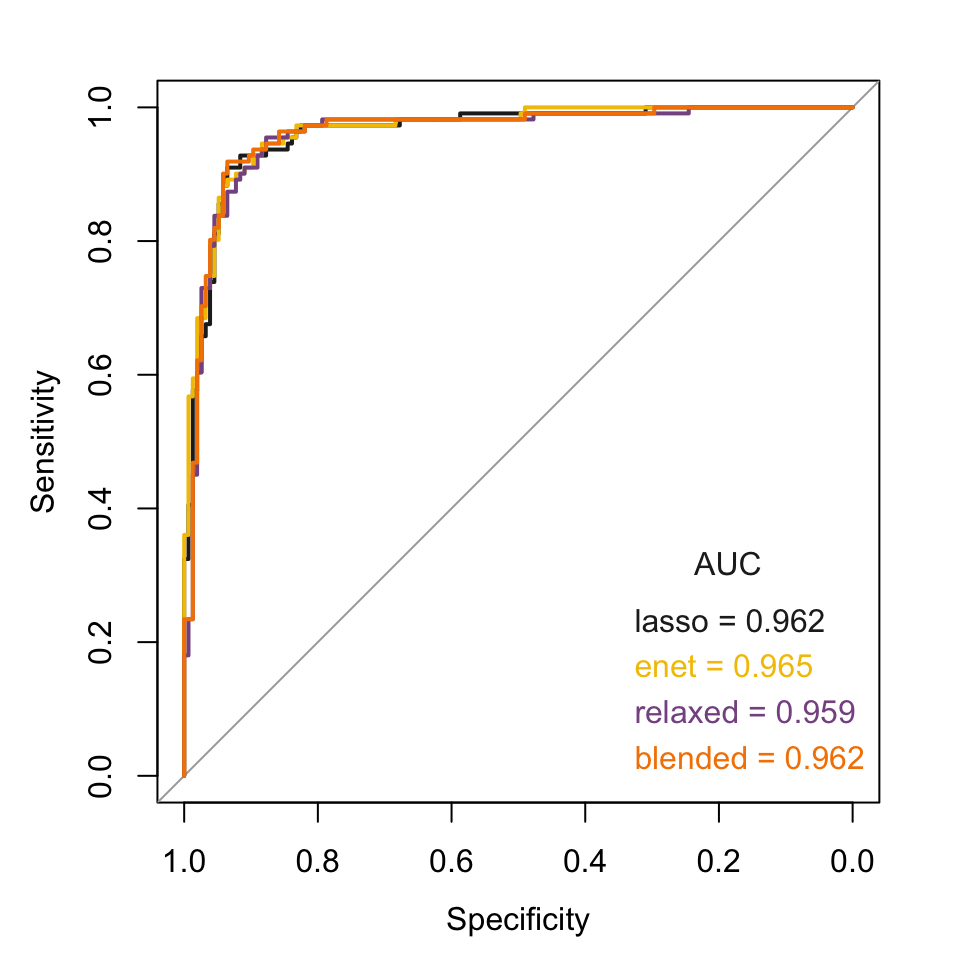
<p class="caption">(\#fig:hcc5hmC-glmnetFit-testROC2)Test data out-of-sample ROCs</p>
</div>

Look at densities of predicted probabilities.


```r
par(mfrow = c(2, 2), mar = c(3, 3, 2, 1), oma = c(2, 2, 2, 2))

# lasso
plot(density(test_lasso_predProb_vec[hcc5hmC_test_group_vec == "Control"]),
  xlim = c(0, 1), main = "", xlab = "", ylab = "", col = "green"
)
lines(density(test_lasso_predProb_vec[hcc5hmC_test_group_vec == "HCC"]),
  col = "red"
)
title("lasso")
legend("topright", legend = c("Control", "HCC"), text.col = c("green", "red"))

# enet
plot(density(test_enet_predProb_vec[hcc5hmC_test_group_vec == "Control"]),
  xlim = c(0, 1), main = "", xlab = "", ylab = "", col = "green"
)
lines(density(test_enet_predProb_vec[hcc5hmC_test_group_vec == "HCC"]),
  col = "red"
)
title("enet")

# relaxed
plot(density(test_relaxed_predProb_vec[hcc5hmC_test_group_vec == "Control"]),
  xlim = c(0, 1), main = "", xlab = "", ylab = "", col = "green"
)
lines(density(test_relaxed_predProb_vec[hcc5hmC_test_group_vec == "HCC"]),
  col = "red"
)
title("relaxed")

#sapply(split(test_relaxed_predProb_vec, hcc5hmC_test_group_vec), summary)


# blended
plot(density(test_blended_predProb_vec[hcc5hmC_test_group_vec == "Control"]),
  xlim = c(0, 1), main = "", xlab = "", ylab = "", col = "green"
)
lines(density(test_blended_predProb_vec[hcc5hmC_test_group_vec == "HCC"]),
  col = "red"
)
title("blended")

mtext(side = 1, outer = T, "test set predicted probability", cex = 1.25)
mtext(side = 2, outer = T, "density", cex = 1.25)
```

<div class="figure">

<p class="caption">(\#fig:hcc5hmC-glmnetFit-testOOFprobs)Test data out-of-fold predicted probabilities</p>
</div>


```r
# Define plotting function
bxpPredProb_f <- function(cv_fit, Gamma=NULL) {
  # Train - preval is out-of-fold linear predictor for training design points
  onese_ndx <- match(cv_fit$lambda.1se, cv_fit$lambda)
  if(is.null(Gamma)) 
   train_1se_preval_vec <- cv_fit$fit.preval[, onese_ndx] else
   train_1se_preval_vec <- cv_fit$fit.preval[[Gamma]][, onese_ndx] 

  train_1se_predProb_vec <- logistic_f(train_1se_preval_vec)

  # Test
  test_1se_predProb_vec <- predict(
    cv_fit,
    newx = hcc5hmC_test_lcpm_mtx,
    s = "lambda.1se",
    type = "resp"
  )

  tmp <- c(
    train = split(train_1se_predProb_vec, hcc5hmC_train_group_vec),
    test = split(test_1se_predProb_vec, hcc5hmC_test_group_vec)
  )
  names(tmp) <- paste0("\n", sub("\\.", "\n", names(tmp)))

  boxplot(tmp)
}

par(mfrow = c(2, 2), mar = c(5, 3, 2, 1), oma = c(2, 2, 2, 2))

bxpPredProb_f(hcc5hmC_cv_lasso)
title('lasso')

bxpPredProb_f(hcc5hmC_cv_enet)
title('enet')

bxpPredProb_f(hcc5hmC_cv_lassoR, Gamma='g:0')
title('relaxed')

bxpPredProb_f(hcc5hmC_cv_lassoR, Gamma='g:0.5')
title('blended')
```

<div class="figure">
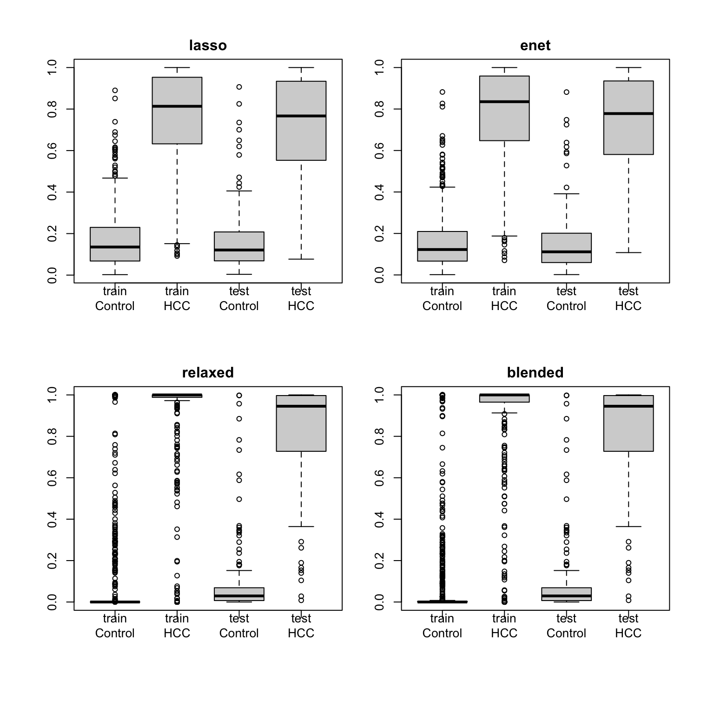
<p class="caption">(\#fig:hcc5hmC-glmnetFit-fitPrevalByGroup)Predicted Probabilities - Train and Test</p>
</div>

<!--
Another look - plot train and test set logistic curves with annotation.

The following shows that predicted classes come from fitted
probabilities - not out of sample probabilities.

Also shows that threshold is at 0.5 

SKIP
-->


  
<!-- SKIP ALL THIS 
We have seen above that assessments of model performance based on the out-of-fold 
predicted values are close to the test set assessments, and that
assessments based on prediction extracted from glmnet object are optimistic.
Here we look at confusion matrices to see how this affects the
classification results.

Here we use a threshold of 0.5 to dichotomize the predicted
probabilities into a class prediction, as is done in the
glmnet predictions.

-->


<!-- SKIPPED
The out-of-fold error rates are larger for the relaxed lasso and blended fit models.
On the test set, errors are slightly higher for the elastic net model.
-->

## Compare predictions at misclassified samples

It is useful to examine classification errors more carefully.
If models have different failure modes, one might get improved
performance by combining model  predictions.  Note that the models
considered here are not expected to compliment each other usefully
as they are too similar in nature.


```r
# NOTE: here we use computred oofClass rather than predClass 
# as predClass extracted from predict() are fitted values.

# train - oof
ndx_1se <- match(hcc5hmC_cv_lasso$lambda.1se,hcc5hmC_cv_lasso$lambda)
train_lasso_oofProb_vec <- logistic_f(hcc5hmC_cv_lasso$fit.preval[,ndx_1se])
train_lasso_oofClass_vec <- ifelse(
   train_lasso_oofProb_vec > 0.5, 'HCC', 'Control')

ndx_1se <- match(hcc5hmC_cv_enet$lambda.1se,hcc5hmC_cv_enet$lambda)
train_enet_oofProb_vec <- logistic_f(hcc5hmC_cv_enet$fit.preval[,ndx_1se])
train_enet_oofClass_vec <- ifelse(
   train_enet_oofProb_vec > 0.5, 'HCC', 'Control')

# RECALL: hcc5hmC_cv_lassoR$nzero[hcc5hmC_cv_lassoR$lambda==hcc5hmC_cv_lassoR$lambda.1se]
# train - oof
ndx_1se <- match(hcc5hmC_cv_lassoR$lambda.1se,hcc5hmC_cv_lassoR$lambda)
train_relaxed_oofProb_vec <- logistic_f(hcc5hmC_cv_lassoR$fit.preval[['g:0']][,ndx_1se])
train_relaxed_oofClass_vec <- ifelse(
   train_relaxed_oofProb_vec > 0.5, 'HCC', 'Control')


# RECALL $`r hcc5hmC_cv_lassoR$relaxed$nzero.1se`$ features (vertical
#  cv_blended_statlist <- hcc5hmC_cv_lassoR$relaxed$statlist[['g:0.5']]
#  cv_blended_1se_error <- cv_blended_statlist$cvm[cv_blended_statlist$lambda==
      #hcc5hmC_cv_lassoR$relaxed$lambda.1se]

# train - oof
cv_blended_statlist <- hcc5hmC_cv_lassoR$relaxed$statlist[['g:0.5']]
ndx_1se <- match(hcc5hmC_cv_lassoR$relaxed$lambda.1se, cv_blended_statlist$lambda)
train_blended_oofProb_vec <- logistic_f(hcc5hmC_cv_lassoR$fit.preval[['g:0.5']][,ndx_1se])
train_blended_oofClass_vec <- ifelse(
   train_blended_oofProb_vec > 0.5, 'HCC', 'Control')


misclass_id_vec <- unique(c(
 names(train_lasso_oofClass_vec)[train_lasso_oofClass_vec != hcc5hmC_train_group_vec],
 names(train_enet_oofClass_vec)[train_enet_oofClass_vec != hcc5hmC_train_group_vec],
 names(train_relaxed_oofClass_vec)[train_relaxed_oofClass_vec != hcc5hmC_train_group_vec],
 names(train_blended_oofClass_vec)[train_blended_oofClass_vec != hcc5hmC_train_group_vec]
 )
)

# Dont know why NAs creeo in here

missclass_oofProb_mtx <- cbind(
 train_lasso_oofProb_vec[misclass_id_vec],
 train_enet_oofProb_vec[misclass_id_vec],
 train_relaxed_oofProb_vec[misclass_id_vec],
 train_blended_oofProb_vec[misclass_id_vec]
)
colnames(missclass_oofProb_mtx) <- c('lasso','enet', 'lassoR', 'blended')


row_med_vec <- apply(missclass_oofProb_mtx, 1, median)
missclass_oofProb_mtx <- missclass_oofProb_mtx[
  order(hcc5hmC_train_group_vec[rownames(missclass_oofProb_mtx)], row_med_vec),]

plot(
 x=c(1,nrow(missclass_oofProb_mtx)), xlab='samples',
 y=range(missclass_oofProb_mtx), ylab='out-of-fold predicted probability',
 xaxt='n', type='n')

for(RR in 1:nrow(missclass_oofProb_mtx))
points(
 rep(RR, ncol(missclass_oofProb_mtx)), 
 missclass_oofProb_mtx[RR,],
 col=ifelse(hcc5hmC_train_group_vec[rownames(missclass_oofProb_mtx)[RR]] == 'Control',
  'green', 'red'),
 pch=1:ncol(missclass_oofProb_mtx))

legend('top', ncol=2, legend=colnames(missclass_oofProb_mtx), 
 pch=1:4, bty='n')

abline(h=0.5)
```

<div class="figure">

<p class="caption">(\#fig:hcc5hmC-glmnetFit-misclassTrain)out-of-fold predicted probabilities at miscassified samples</p>
</div>

As we've seen above, predictions from lassoR  and the blended mix model 
are basically dichotomous; 0 or 1.  Samples have been order by group, and
median P(HCC) within group.  For the Controls (green), predicted probabilities
less than 0.5 are considered correct here.  For the HCC (red) samples,
predicted probabilities greater than 0.5 are considered correct here.

Now look at the same plot on the test data set.


```r
test_lasso_predClass_vec <- predict(
 hcc5hmC_cv_lasso,
 newx=hcc5hmC_test_lcpm_mtx,
 s='lambda.1se',
 type='class'
)

test_enet_predClass_vec <- predict(
 hcc5hmC_cv_enet,
 newx=hcc5hmC_test_lcpm_mtx,
 s='lambda.1se',
 type='class'
)

test_relaxed_predClass_vec <- predict(
 hcc5hmC_cv_lassoR,
 g=0,
 newx=hcc5hmC_test_lcpm_mtx,
 s='lambda.1se',
 type='class'
)

test_blended_predClass_vec <- predict(
 hcc5hmC_cv_lassoR,
 g=0.5,
 newx=hcc5hmC_test_lcpm_mtx,
 s='lambda.1se',
 type='class'
)

misclass_id_vec <- unique(c(
 names(test_lasso_predClass_vec[,1])[test_lasso_predClass_vec != hcc5hmC_test_group_vec],
 names(test_enet_predClass_vec[,1])[test_enet_predClass_vec != hcc5hmC_test_group_vec],
 names(test_relaxed_predClass_vec[,1])[test_relaxed_predClass_vec != hcc5hmC_test_group_vec],
 names(test_blended_predClass_vec[,1])[test_blended_predClass_vec != hcc5hmC_test_group_vec]
 )
)


missclass_oofProb_mtx <- cbind(
 test_lasso_predProb_vec[misclass_id_vec,],
 test_enet_predProb_vec[misclass_id_vec,],
 test_relaxed_predProb_vec[misclass_id_vec,],
 test_blended_predProb_vec[misclass_id_vec,]
)
colnames(missclass_oofProb_mtx) <- c('lasso','enet', 'lassoR', 'blended')

row_med_vec <- apply(missclass_oofProb_mtx, 1, median)
missclass_oofProb_mtx <- missclass_oofProb_mtx[
  order(hcc5hmC_test_group_vec[rownames(missclass_oofProb_mtx)], row_med_vec),]

plot(
 x=c(1,nrow(missclass_oofProb_mtx)), xlab='samples',
 y=range(missclass_oofProb_mtx), ylab='out-of-fold predicted probability',
 xaxt='n', type='n')

for(RR in 1:nrow(missclass_oofProb_mtx))
points(
 rep(RR, ncol(missclass_oofProb_mtx)), 
 missclass_oofProb_mtx[RR,],
 col=ifelse(hcc5hmC_test_group_vec[rownames(missclass_oofProb_mtx)[RR]] == 'Control',
  'green', 'red'),
 pch=1:ncol(missclass_oofProb_mtx))

legend('top', ncol=2, legend=colnames(missclass_oofProb_mtx), 
 pch=1:4, bty='n')

abline(h=0.5)
```

<div class="figure">

<p class="caption">(\#fig:hcc5hmC-glmnetFit-misclassTest)Test data predicted probabilities at miscassified samples</p>
</div>

The relaxed lasso fit results in essentially dichotomized predicted probability
distribution - predicted probabilities are very close to 0 or 1.

We see that for design points in the training set, the predicted probabilities from the relaxed lasso
are  essentially dichotomized to be tightly distributed at the extremes of the
response range.  For design points in the test set, the predicted probabilities 
from the relaxed lasso are comparable to the lasso model predicted probabilities.
This seems to indicate over-fitting in the relaxed lasso fit.


## Compare coefficient profiles


```r
# lasso 
##########################
# train - cv predicted
lasso_coef <- coef(
 hcc5hmC_cv_lasso,
 s='lambda.1se'
)
lasso_coef_frm <- data.frame(
 gene=lasso_coef@Dimnames[[1]][c(1, lasso_coef@i[-1])],
 lasso=lasso_coef@x)


# enet
##########################
enet_coef <- coef(
 hcc5hmC_cv_enet,
 s='lambda.1se'
)
enet_coef_frm <- data.frame(
 gene=enet_coef@Dimnames[[1]][c(1, enet_coef@i[-1])],
 enet=enet_coef@x)

# THESE ARE NOT CORRECT - SKIP
# relaxed lasso (gamma=0)
##########################
SKIP <- function() {
lassoR_coef <- coef(
 hcc5hmC_cv_lassoR,
 s='lambda.1se',
 g=0
)
lassoR_coef_frm <- data.frame(
 gene=lassoR_coef@Dimnames[[1]][c(1, lassoR_coef@i[-1])],
 lassoR=lassoR_coef@x)
}

# blended mix (gamma=0.5)
###############################
blended_coef <- coef(
 hcc5hmC_cv_lassoR,
 s='lambda.1se',
 g=0.5
)
blended_coef_frm <- data.frame(
 gene=blended_coef@Dimnames[[1]][c(1, blended_coef@i[-1])],
 blended=blended_coef@x)


# put it all together
all_coef_frm <- 
 base::merge(
 x = lasso_coef_frm, 
 y = base::merge(
     x = enet_coef_frm,
     y = blended_coef_frm,
         by='gene', all=T),
 by='gene', all=T)

# SKIPPED
#base::merge(
         #x = lassoR_coef_frm,
         #y = blended_coef_frm,
         #by='gene', all=T),

# save gene name into rownames
rownames(all_coef_frm) <- all_coef_frm$gene
all_coef_frm  %<>% dplyr::select(-gene)

# set na to 0
all_coef_frm[is.na(all_coef_frm)] <- 0

# remove intercept
all_coef_frm <- all_coef_frm[!rownames(all_coef_frm)=='(Intercept)',]

# order rows by size
all_coef_frm <- all_coef_frm[order(rowMeans(abs(all_coef_frm)), decreasing=T), ]

par(mfrow=c(ncol(all_coef_frm),1), mar=c(0,5,0.5,1), oma=c(3,1,2,0))

for(CC in 1:ncol(all_coef_frm)) {
 plot(
  x=1:nrow(all_coef_frm), xlab='',
  y=all_coef_frm[, CC], ylab=colnames(all_coef_frm)[CC],
  type='h', xaxt='n')
}
```

<div class="figure">

<p class="caption">(\#fig:hcc5hmC-glmnetFit-compCoeffProf)Coefficient Profiles</p>
</div>

Note that there is little difference between the elastic net and the lasso
in the selected features, and when the coefficient is zero in one set, it 
is small in the other.  By contrast, the blended fit produces more shrinkage.


```r
knitr::kable(
with(all_coef_frm, table(lassoZero=lasso==0, enetZero=enet==0)),
 caption='Zero Ceofficient: rows are lasso, columns enet') %>%
  kableExtra::kable_styling(full_width = F)
```

<table class="table" style="width: auto !important; margin-left: auto; margin-right: auto;">
<caption>(\#tab:hcc5hmC-glmnetFit-zreros)Zero Ceofficient: rows are lasso, columns enet</caption>
 <thead>
  <tr>
   <th style="text-align:left;">   </th>
   <th style="text-align:right;"> FALSE </th>
  </tr>
 </thead>
<tbody>
  <tr>
   <td style="text-align:left;"> FALSE </td>
   <td style="text-align:right;"> 68 </td>
  </tr>
  <tr>
   <td style="text-align:left;"> TRUE </td>
   <td style="text-align:right;"> 92 </td>
  </tr>
</tbody>
</table>


<!--
Coefficients in the relaxed lasso fit are much larger than those in the
lasso fit, or zero.  As a consequence, the blended fit coefficients look 
like a shrunken version of the relaxed lasso fit coefficients.  
-->

Coefficients in the blended fit are larger than those in the
lasso fit, or zero.  


We can also examine these with a scatter plot matrix.


```r
pairs(all_coef_frm,
  lower.panel = NULL,
  panel = function(x, y) {
    points(x, y, pch = 16, col = "blue")
  }
)
```

<div class="figure">

<p class="caption">(\#fig:hcc5hmC-glmnetFit-pairsCoeffProf)Coefficients from fits</p>
</div>


## Examine feature selection

Recall from `glmnet` vignette:

```
It is known that the ridge penalty shrinks the coefficients of correlated predictors
towards each other while the lasso tends to pick one of them and discard the others.
The elastic-net penalty mixes these two; if predictors are correlated in groups,
an $\alpha$=0.5 tends to select the groups in or out together.
This is a higher level parameter, and users might pick a value upfront,
else experiment with a few different values. One use of $\alpha$ is for numerical stability;
for example, the *elastic net with $\alpha = 1 - \epsilon$ for some small $\epsilon$>0
performs much like the lasso, but removes any degeneracies and wild behavior caused
by extreme correlations*.
```

To see how this plays out in this dataset, we can look at feature expression
heat maps.  

Reader notes:  

```
Heat maps are rarely useful other than to display the obvious.
Here too heat maps fail to yield any insights, or confirmation
of the relationship between feature correlation and lasso vs enet
feature selection.
```


```r
 suppressPackageStartupMessages(require(gplots))

# train - cv predicted
lasso_coef <- coef(
 hcc5hmC_cv_lasso,
 s='lambda.1se'
)
lasso_coef_frm <- data.frame(
 gene=lasso_coef@Dimnames[[1]][c(1, lasso_coef@i[-1])],
 lasso=lasso_coef@x)

 
  Mycol <- colorpanel(1000, "blue", "red")
  heatmap.2(
    x=t(hcc5hmC_train_lcpm_mtx[,lasso_coef_frm$gene[-1]]),
    scale="row",
    labRow=lasso_coef_frm$gene,
    labCol=hcc5hmC_train_group_vec,
    col=Mycol, 
    trace="none", density.info="none", 
    #margin=c(8,6), lhei=c(2,10), 
    #lwid=c(0.1,4), #lhei=c(0.1,4)
    key=F,
    ColSideColors=ifelse(hcc5hmC_train_group_vec=='Control', 'green','red'),
    dendrogram="both",
    main=paste('lasso genes - N =', nrow(lasso_coef_frm)-1))
```

<div class="figure">

<p class="caption">(\#fig:hcc5hmC-glmnetFit-heatmapLasso)Lasso Model Genes</p>
</div>


```r
 suppressPackageStartupMessages(require(gplots))

# train - cv predicted
enet_coef <- coef(
 hcc5hmC_cv_enet,
 s='lambda.1se'
)
enet_coef_frm <- data.frame(
 gene=enet_coef@Dimnames[[1]][c(1, enet_coef@i[-1])],
 enet=enet_coef@x)

 
  Mycol <- colorpanel(1000, "blue", "red")
  heatmap.2(
    x=t(hcc5hmC_train_lcpm_mtx[,enet_coef_frm$gene[-1]]),
    scale="row",
    labRow=enet_coef_frm$gene,
    labCol=hcc5hmC_train_group_vec,
    col=Mycol, 
    trace="none", density.info="none", 
    #margin=c(8,6), lhei=c(2,10), 
    #lwid=c(0.1,4), #lhei=c(0.1,4)
    key=F,
    ColSideColors=ifelse(hcc5hmC_train_group_vec=='Control', 'green','red'),
    dendrogram="both",
    main=paste('enet genes - N =', nrow(enet_coef_frm)-1))
```

<div class="figure">
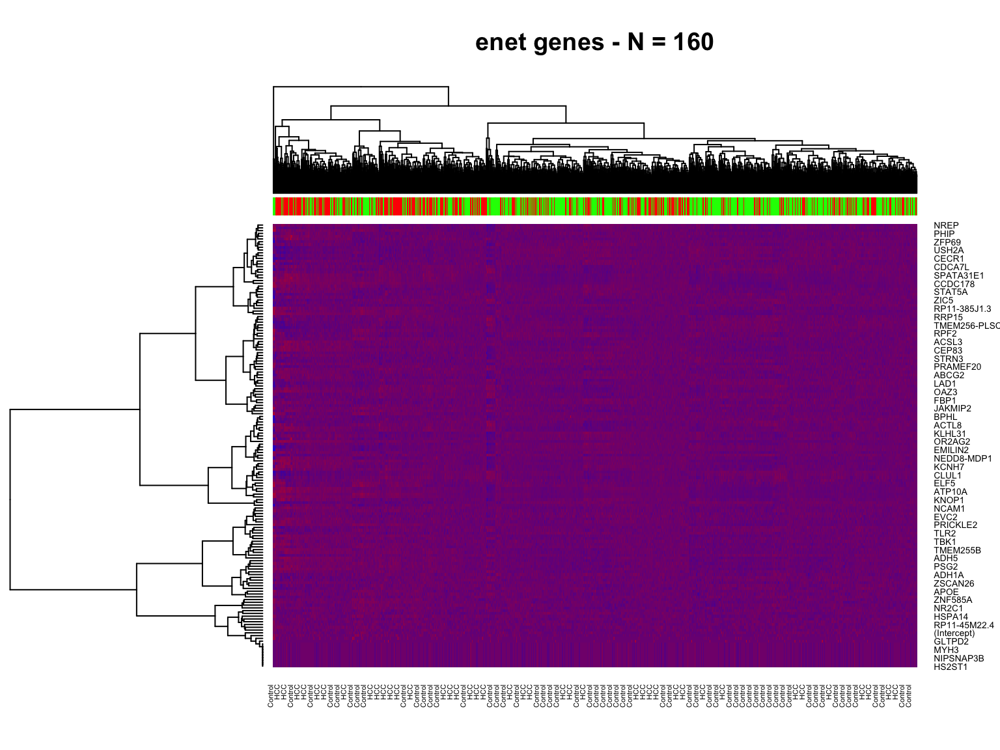
<p class="caption">(\#fig:hcc5hmC-glmnetFit-heatmapEnet)Enet Model Genes</p>
</div>


<!--chapter:end:04-glmnetFitsHCC5hmC.Rmd-->

# HCC 5hmC-Seq: Sample size investigation {#hcc-5hmcseq-model-suite}

We now examine the results of fitting a suite of lasso models to
investigate the effect of sample size on 
various aspects of model performance:  

* assessed accuracy: out-of-fold estimates of precision and variability vs train set estimates 

* selected feature profile stability - to what extent does the
feature set implicitly selected by the lasso vary across random
sampling and what is the effect of sample size.

It is hypothesized that below a certain threshold,
sample sizes are too small to provide reliable estimates
of performance or stable selected feature profiles.  

**Reader Note**
```
It's not clear how to display the effect of sample set composition
on model performance, or that it merits special attention as it
may be obvious to anyone who is paying attention that not all
sample points are created equal and that having a substantial
number of mislabeled or otherwise hard to classify samples
can throw off estimates of the separability of subgroups
when sample sizes are small.  

Keep this stuff on consistency for now.
```

In examining the relationship between sample size and
model performance, including variability and reliability
of performance indicators derived from fits, we should bear in
mind that in addition to sample size, sample composition might 
also play a factor.  If a training data set contains many outliers
or otherwise *hard to properly classify* samples, the performance
of models fitted to such a data set is expected to be negatively impacted.

In the simulations that we run below we will track sample *consistency*
to examine its impact on fitted model performance.  We use 
*consistency* to refer to a measure of how hard it is to
appropriately classify individual samples.
Predicted probabilities from fitted model can be transformed into sample
*consistency* scores: $Q_i = p_i^{y_i}(1-p_i)^{1-y_i}$, where $p_i$ is the
estimated probability of HCC for sample i and $y_i$ is 1 for HCC samples and
0 for Controls.  ie. we use the fitted sample contribution to the
likelihood function as a sample *consistency* score,
which is $P(HCC)$, the predicted probability of HCC for HCC samples
and $1 - P(HCC)$ for Controls.  To derive the sample *consistency* scores,
we will use the predicted response from a lasso model fitted to the entire data set.

Hard to classify samples will have low *consistency* scores.
In the results that we discuss below, when we look at variability across repeated 
random sampling of different sizes, we can use sample *consistency* scores to investigate 
how much of the variability is due to sample selection.
Note that *consistency* here is not used to say anything about the sample data quality.
Low *consistency* here only means that a sample is different from the 
core of the data set in a way that makes it hard to properly classify.
That could happen if the sample were mislabeled, in which case we could 
think of this sample as being poor quality of course.

The variability in sample set *consistency* that we get from simple random sampling,
as is done in the simulation below, is not expected to adequately reflect
sample set *consistency* variation encountered in practice when data for a particular
study are accumulated over extensive time horizons and across varied
physical settings.  In order to accrue study samples at an acceptable rate,
it is not uncommon for the study sponsor to work with several clinics, medical centers,
or other tissue or blood sample provider.
Or the sponsor may sub-contract the sample acquisition
task to a third party who may have suppliers distributed across the globe.  This
is great news for the rate of sample acquisition, but not such great news for 
the uniformity of consistency of samples.  In such a context, the variability
in sample set consistency as the data set grows over time would not
be adequately captured by simple random sampling variability;
the variability would be more akin to cluster sampling with potential confounding
batch effects.  The impact that these effects can have on the classification analysis
results cannot be understated, especially in the context of a new technology that
is exploiting biological processes that are still not fully understood.  All this
to make the point that the variability the we are studying here has to be regarded 
as a lower bound on the variability that is to be expected in practice, and that without
an external validation data set to verify results, one should be cautious
when interpreting empirical findings, especially in the absence of solid
biological underpinnings.  

**Reader Note** 
``` 
We still need to demonstrate the effect of sample set composition
on results.  With random sampling the effects are subtle and not
immediately obvious.  We may have to fabricate sample sets with 
low consistency scores - ie. made up of many hard to classify samples -
in order to show this impact.
```
## Full data set fit

We begin by fitting a model to the entire data set in order to:

* obtain a baseline classification performance against which to judge the performance
obtained from the fits to smaller sample sets,

* obtain sample consistency scores which can be used to explain variability
in the performance of model fitted to data sets of a fixed size, and

* produce a *full model* gene signature which can be used to evaluate
the stability of selected features in models fitted to data sets of different
sizes.


First assemble the data set.  This entails simply re-combining the
train and test data.


```r
# combine train and test 
hcc5hmC_all_lcpm_mtx <- rbind(hcc5hmC_train_lcpm_mtx, hcc5hmC_test_lcpm_mtx)

# we have to be careful with factors!
# We'll keep as a character and change to factor when needed
hcc5hmC_all_group_vec <- c(
 as.character(hcc5hmC_train_group_vec), 
 as.character(hcc5hmC_test_group_vec)
)
# I suspect adding names to vectors breaks one of the tidy commandments,
# but then again I am sure I have already offended the creed beyond salvation
names(hcc5hmC_all_group_vec) <- c(
 names(hcc5hmC_train_group_vec),
 names(hcc5hmC_test_group_vec)
)

knitr::kable(table(group = hcc5hmC_all_group_vec),
  caption = "samples by group") %>%
   kableExtra::kable_styling(full_width = F)
```

<table class="table" style="width: auto !important; margin-left: auto; margin-right: auto;">
<caption>(\#tab:hcc5hmC-glmnetSuite-get-all-data)samples by group</caption>
 <thead>
  <tr>
   <th style="text-align:left;"> group </th>
   <th style="text-align:right;"> Freq </th>
  </tr>
 </thead>
<tbody>
  <tr>
   <td style="text-align:left;"> Control </td>
   <td style="text-align:right;"> 778 </td>
  </tr>
  <tr>
   <td style="text-align:left;"> HCC </td>
   <td style="text-align:right;"> 555 </td>
  </tr>
</tbody>
</table>

Now fit the lasso model through cross-validation.
Note that the results of a cv fit are random due to the
random allocation of samples to folds.  We can reduce this
variability by properly averaging results over repeated cv fits.
Here we will obtain sample consistency scores by averaging results
over 30 cv runs.


```r
set.seed(1)

start_time <-  proc.time()

hcc5hmC_cv_lassoAll_lst <- lapply(1:30, function(REP) {
glmnet::cv.glmnet(
 x = hcc5hmC_all_lcpm_mtx,
 y = factor(hcc5hmC_all_group_vec,levels = c('Control', 'HCC')),
 alpha = 1,
 family = 'binomial',
 type.measure  =  "class",
 keep = T,
 nlambda = 100
)
}
)

message("lassoAll time: ", round((proc.time() - start_time)[3],2),"s")
```

<!-- lasso-fit-all takes a while - save results -->
<!-- DO THIS ONCE -->


Examine the fits.


```r
### CLEAR CACHE
plot(
 log(hcc5hmC_cv_lassoAll_lst[[1]]$lambda),
 hcc5hmC_cv_lassoAll_lst[[1]]$cvm,
 lwd=2,
 xlab='log(Lambda)', ylab='CV Misclassification Error', type='l', ylim=c(0, .5)
)

for(JJ in 2:length(hcc5hmC_cv_lassoAll_lst))
 lines(
  log(hcc5hmC_cv_lassoAll_lst[[JJ]]$lambda),
  hcc5hmC_cv_lassoAll_lst[[JJ]]$cvm,
  lwd=2
)
```

<div class="figure">

<p class="caption">(\#fig:hcc5hmC-glmnetSuite-plot-lassoAll)Repeated cv lasso models fitted to all samples</p>
</div>

These cv curves are remarkably consistent meaning that the determination of the size or sparsity
of the model fitted through cross validation to the full data set is fairly precise:

<!-- DONT CACHE THIS ??? -->


```r
library(magrittr)

par(mfrow=c(1,2), mar=c(3,4, 2, 1))

# nzero
nzero_1se_vec <- sapply(hcc5hmC_cv_lassoAll_lst,
 function(cv_fit) cv_fit$nzero[cv_fit$lambda == cv_fit$lambda.1se])

nzero_min_vec <- sapply(hcc5hmC_cv_lassoAll_lst,
 function(cv_fit) cv_fit$nzero[cv_fit$lambda == cv_fit$lambda.min])

boxplot(list(`1se`=nzero_1se_vec, min = nzero_min_vec), ylab="Selected Features")

# error
error_1se_vec <- sapply(hcc5hmC_cv_lassoAll_lst,
 function(cv_fit) cv_fit$cvm[cv_fit$lambda == cv_fit$lambda.1se])

error_min_vec <- sapply(hcc5hmC_cv_lassoAll_lst,
 function(cv_fit) cv_fit$cvm[cv_fit$lambda == cv_fit$lambda.min])

boxplot(
 list(`1se`=error_1se_vec, min = error_min_vec), 
 ylab=hcc5hmC_cv_lassoAll_lst[[1]]$name,
 ylim=c(0.06, .10)
)
```

<div class="figure">

<p class="caption">(\#fig:hcc5hmC-glmnetSuite-model-size-lassoAll)Feature selection and estimated error by repeated cv lasso models</p>
</div>

```r
# tabular format
tmp <- data.frame(rbind(
 `features_1se` = summary(nzero_1se_vec),
 features_min = summary(nzero_min_vec),
 `features:min-1se` = summary(nzero_min_vec - nzero_1se_vec),
 `cv_error_1se` = summary(100*error_1se_vec),
 cv_error_min = summary(100*error_min_vec),
 `cv_error:1se-min` = summary(100*(error_1se_vec-error_min_vec))
))

knitr::kable(tmp %>% dplyr::select(-Mean),
  caption = "Number of selected features",
  digits=1) %>%
   kableExtra::kable_styling(full_width = F)
```

<table class="table" style="width: auto !important; margin-left: auto; margin-right: auto;">
<caption>(\#tab:hcc5hmC-glmnetSuite-model-size-lassoAll)Number of selected features</caption>
 <thead>
  <tr>
   <th style="text-align:left;">   </th>
   <th style="text-align:right;"> Min. </th>
   <th style="text-align:right;"> X1st.Qu. </th>
   <th style="text-align:right;"> Median </th>
   <th style="text-align:right;"> X3rd.Qu. </th>
   <th style="text-align:right;"> Max. </th>
  </tr>
 </thead>
<tbody>
  <tr>
   <td style="text-align:left;"> features_1se </td>
   <td style="text-align:right;"> 54.0 </td>
   <td style="text-align:right;"> 102.0 </td>
   <td style="text-align:right;"> 108.0 </td>
   <td style="text-align:right;"> 132.5 </td>
   <td style="text-align:right;"> 194.0 </td>
  </tr>
  <tr>
   <td style="text-align:left;"> features_min </td>
   <td style="text-align:right;"> 118.0 </td>
   <td style="text-align:right;"> 175.2 </td>
   <td style="text-align:right;"> 200.0 </td>
   <td style="text-align:right;"> 261.0 </td>
   <td style="text-align:right;"> 365.0 </td>
  </tr>
  <tr>
   <td style="text-align:left;"> features:min-1se </td>
   <td style="text-align:right;"> 10.0 </td>
   <td style="text-align:right;"> 55.0 </td>
   <td style="text-align:right;"> 86.0 </td>
   <td style="text-align:right;"> 141.5 </td>
   <td style="text-align:right;"> 247.0 </td>
  </tr>
  <tr>
   <td style="text-align:left;"> cv_error_1se </td>
   <td style="text-align:right;"> 6.9 </td>
   <td style="text-align:right;"> 7.6 </td>
   <td style="text-align:right;"> 7.7 </td>
   <td style="text-align:right;"> 8.1 </td>
   <td style="text-align:right;"> 8.9 </td>
  </tr>
  <tr>
   <td style="text-align:left;"> cv_error_min </td>
   <td style="text-align:right;"> 6.7 </td>
   <td style="text-align:right;"> 7.1 </td>
   <td style="text-align:right;"> 7.1 </td>
   <td style="text-align:right;"> 7.3 </td>
   <td style="text-align:right;"> 8.0 </td>
  </tr>
  <tr>
   <td style="text-align:left;"> cv_error:1se-min </td>
   <td style="text-align:right;"> 0.2 </td>
   <td style="text-align:right;"> 0.5 </td>
   <td style="text-align:right;"> 0.6 </td>
   <td style="text-align:right;"> 0.7 </td>
   <td style="text-align:right;"> 1.0 </td>
  </tr>
</tbody>
</table>

The number of features selected by the minimum lambda models are larger
than the number selected by the "one standard error" rule models by a median
of 86.
The cv error rates obtained from the minimum lambda models are lower
then  "one standard error" rule models error rates by a median of
0.6%.  

The cv error rates observed in this set are comparable to the 
rates observed in the lasso models fitted to the training sample set
which consisted of 80% of the samples in this set.  In other words,
there is no obvious gain in performance in moving from 
a data set with 
622 vs 444 samples
to a data set with
778 vs 555 samples.
See Table \@ref(tab:printErrors).  

It's not clear at this point whether the minimum lambda model is truly better than
the  "one standard error" rule  model.  We would need and external validation
set to make this determination.  We can compare the two sets
of out-of-fold predicted values, averaged across cv replicates, to see if
there is a meaningful difference between the two.


```r
# predicted probs - 1se
lassoAll_predResp_1se_mtx <- sapply(hcc5hmC_cv_lassoAll_lst, function(cv_fit) { 
  ndx_1se <- match(cv_fit$lambda.1se,cv_fit$lambda)
  logistic_f(cv_fit$fit.preval[,ndx_1se])
 })
lassoAll_predResp_1se_vec <- rowMeans(lassoAll_predResp_1se_mtx)

# predicted probs - min
lassoAll_predResp_min_mtx <- sapply(hcc5hmC_cv_lassoAll_lst, function(cv_fit) { 
  ndx_min <- match(cv_fit$lambda.min,cv_fit$lambda)
  logistic_f(cv_fit$fit.preval[,ndx_min])
 })
lassoAll_predResp_min_vec <- rowMeans(lassoAll_predResp_min_mtx)

# plot
par(mfrow=c(1,2), mar=c(5,5,2,1))
tmp <- c(
 `1se` = split(lassoAll_predResp_1se_vec, hcc5hmC_all_group_vec),
 min = split(lassoAll_predResp_min_vec, hcc5hmC_all_group_vec)
)
names(tmp) <- sub('\\.', '\n', names(tmp))

boxplot(
 tmp,
 ylab='Predicted oof probability',
 border=c('green', 'red'),
 xaxt='n'
)
axis(side=1, at=1:length(tmp), tick=F, names(tmp))


# compare the two
plot(
 x = lassoAll_predResp_1se_vec, xlab='1se model oof Prob',
 y = lassoAll_predResp_min_vec, ylab='min lambda model oof Prob',
 col = ifelse(hcc5hmC_all_group_vec == 'HCC', 'red', 'green')
)
 
# Add referecne lines at 10% false positive
thres_1se <- quantile(lassoAll_predResp_1se_vec[hcc5hmC_all_group_vec == 'Control'], prob=.9)
thres_min <- quantile(lassoAll_predResp_min_vec[hcc5hmC_all_group_vec == 'Control'], prob=.9)
abline(v = thres_1se, h = thres_min, col='grey')
```

<div class="figure">

<p class="caption">(\#fig:hcc5hmC-glmnetSuite-get-sample-pred)Predicted probabilities - averaged over cv replicates</p>
</div>

<!-- THIS PARAGRAPH REFERRED TO THE FITTED PROBS; NOT THE OOF PRED PROBS
We see that the minimum lambda models provide a better fit to the data,
which is to be expected as the minimum lambda models have more estimated
parameters than the one standard error rule models.  
-->

We see that there isn't a big difference in out-of-fold predicted
probabilities between the one-standard-error rule and the minimum lambda models.
One way to quantify
the difference in classification errors is to classify samples
according to each vector of predicted probabilities, setting
the thresholds to achieve a fixed false positive rate, 10% say.
These thresholds are indicated by the grey lines in the scatter plot
on the right side of Figure \@ref(fig:get-sample-pred).  

<!-- APPLIED TO THE FITTED VALUES
We note
that although predicted probability distributions are quite different
for the two models, the class predictions at a 10% false discovery threshold
are largely in agreement.
-->


```r
lassoAll_predClass_1se_vec <- ifelse(
 lassoAll_predResp_1se_vec > thres_1se, 'HCC', 'Control')

lassoAll_predClass_min_vec <- ifelse(
 lassoAll_predResp_min_vec > thres_min, 'HCC', 'Control')

tmp <- cbind(
 table(truth=hcc5hmC_all_group_vec, `1se-pred`=lassoAll_predClass_1se_vec),
 table(truth=hcc5hmC_all_group_vec, `min-pred`=lassoAll_predClass_min_vec)
) 
# Hack for printing
colnames(tmp) <- c('1se-Control', '1se-HCC', 'min-Control', 'min-HCC')

knitr::kable(tmp,
  caption = "Classifications: rows are truth",
  digits=1) %>%
   kableExtra::kable_styling(full_width = F)
```

<table class="table" style="width: auto !important; margin-left: auto; margin-right: auto;">
<caption>(\#tab:hcc5hmC-glmnetSuite-get-sample-class)Classifications: rows are truth</caption>
 <thead>
  <tr>
   <th style="text-align:left;">   </th>
   <th style="text-align:right;"> 1se-Control </th>
   <th style="text-align:right;"> 1se-HCC </th>
   <th style="text-align:right;"> min-Control </th>
   <th style="text-align:right;"> min-HCC </th>
  </tr>
 </thead>
<tbody>
  <tr>
   <td style="text-align:left;"> Control </td>
   <td style="text-align:right;"> 700 </td>
   <td style="text-align:right;"> 78 </td>
   <td style="text-align:right;"> 700 </td>
   <td style="text-align:right;"> 78 </td>
  </tr>
  <tr>
   <td style="text-align:left;"> HCC </td>
   <td style="text-align:right;"> 39 </td>
   <td style="text-align:right;"> 516 </td>
   <td style="text-align:right;"> 32 </td>
   <td style="text-align:right;"> 523 </td>
  </tr>
</tbody>
</table>

When we fix the false positive rate at 10% (ie. the control samples error rates are fixed), 
the `1se` model makes 39 false negative calls whereas the minimum lambda model makes 32.  A difference
of 1.3%


<!-- APPLIED TO THE FITTED PROBABILITIES
We see that the min lambda model, makes no false negative calls at a 90% sensitivity
setting, and the sensitivity could be increased substantially at no false negative
cost.  This is definitely over-fitting the data set.  For the purpose
of computing sample consistency scores - what do these differences mean? 
-->

### Get sample consistency scores {-}

To compute consistency scores, we will use the out-of-fold predicted probabilities.


```r
# get qual scores

y <- as.numeric(hcc5hmC_all_group_vec == 'HCC')
# 1se
p <- lassoAll_predResp_1se_vec
hcc5hmC_sample_1se_qual_vec <- p^y*(1-p)^(1-y)

# min
p <- lassoAll_predResp_min_vec
hcc5hmC_sample_min_qual_vec <- p^y*(1-p)^(1-y)
```


We can examine consistency scores as a function of classification bin.


```r
y <- as.numeric(hcc5hmC_all_group_vec == 'HCC')

# 1se
lassoAll_1se_conf_vec <- paste(
 y, 
 as.numeric(lassoAll_predClass_1se_vec=='HCC'),
 sep = ':'
)

# min
lassoAll_min_conf_vec <- paste(
 y, 
 as.numeric(lassoAll_predClass_min_vec=='HCC'),
 sep = ':'
)


tmp <- c(
 split(hcc5hmC_sample_1se_qual_vec, lassoAll_1se_conf_vec), 
 split(hcc5hmC_sample_min_qual_vec, lassoAll_min_conf_vec)
)

par(mfrow=c(1,2), mar=c(4,3,3,2), oma=c(2,2,2,0))
gplots::boxplot2(split(hcc5hmC_sample_1se_qual_vec, lassoAll_1se_conf_vec), 
  outline=F, ylab = '', 
  border=c('green', 'green', 'red', 'red'),
  ylim=c(0,1))
title('1se Model')

gplots::boxplot2(split(hcc5hmC_sample_min_qual_vec, lassoAll_min_conf_vec), 
  outline=F, ylab = '',
  border=c('green', 'green', 'red', 'red'),
  ylim=c(0,1))
title('min lambda Model')


mtext(side=1, outer=T, cex=1.5, 'Classification - Truth:Predicted')
mtext(side=2, outer=T, cex=1.5, 'Consistency Score')
mtext(side=3, outer=T, cex=1.5, 'Sample Consistency vs Classification Outcome')
```

<div class="figure">

<p class="caption">(\#fig:hcc5hmC-glmnetSuite-plot-qual-conf)quality scores by classification - Control=0, HCC=1</p>
</div>

This figure shows that for false positive cases (0:1 or classifying a
control as an affected case), the algorithm is *less certain* of its predicted
outcome than for the false negative cases (1:0 or classifying an affected case as a control).
ie. the misclassified HCC samples are quite similar to Controls, whereas there
is more ambiguity in the misclassified Control samples.

 
We will use the minimum lambda model to provide
the fitted probabilities used to compute quality scores,
but we could have used either one.


```r
sample_qual_vec <- hcc5hmC_sample_min_qual_vec
```


## Selected feature list stability 

Before moving on to the simulation, let's examine gene selection stability on the
full data set.  We have two sets of selected features - one for the 
one standard deviation rule model, and one for the minimum lambda model.
We saw in Table \@ref(tab:model-size-lassoAll) that the number of features
selected by the minimum lambda models had an IQR of
175.25-261,
while the one standard error rule models had an IQR of
102-132.5.

Let's examine the stability of the gene lists across cv replicates.


```r
### CLEAR CACHE


# 1se
lassoAll_coef_1se_lst <- lapply(hcc5hmC_cv_lassoAll_lst, function(cv_fit){
 cv_fit_coef <- coef(
 cv_fit,
 s = "lambda.1se"
 )
 cv_fit_coef@Dimnames[[1]][cv_fit_coef@i[-1]]
 })

# put into matrix
lassoAll_coef_1se_all <- Reduce(union, lassoAll_coef_1se_lst)
lassoAll_coef_1se_mtx <- sapply(lassoAll_coef_1se_lst, 
  function(LL) is.element(lassoAll_coef_1se_all, LL)
)
rownames(lassoAll_coef_1se_mtx) <- lassoAll_coef_1se_all

genes_by_rep_1se_tbl <- table(rowSums(lassoAll_coef_1se_mtx))
barplot(
 genes_by_rep_1se_tbl,
 xlab='Number of Replicates',
 ylab='Number of features'

)
```

<div class="figure">

<p class="caption">(\#fig:hcc5hmC-glmnetSuite-feature-list-1se)Feature list stability for one standard error rule models</p>
</div>

We see that 44 features are included in every
cv replicate.  These make up between 
33%
and
43%
(Q1 and Q3) of the cv replicate one standard error rule models feature lists.


```r
### CLEAR CACHE


# min
lassoAll_coef_min_lst <- lapply(hcc5hmC_cv_lassoAll_lst, function(cv_fit){
 cv_fit_coef <- coef(
 cv_fit,
 s = "lambda.min"
 )
 cv_fit_coef@Dimnames[[1]][cv_fit_coef@i[-1]]
 })

# put into matrix
lassoAll_coef_min_all <- Reduce(union, lassoAll_coef_min_lst)
lassoAll_coef_min_mtx <- sapply(lassoAll_coef_min_lst, 
  function(LL) is.element(lassoAll_coef_min_all, LL)
)
rownames(lassoAll_coef_min_mtx) <- lassoAll_coef_min_all

genes_by_rep_min_tbl <- table(rowSums(lassoAll_coef_min_mtx))
barplot(
 genes_by_rep_min_tbl,
 xlab='Number of Replicates',
 ylab='Number of features'

)
```

<div class="figure">

<p class="caption">(\#fig:hcc5hmC-glmnetSuite-feature-list-min)Feature list stability for minimum lambda models</p>
</div>

We see that 106 features are included in every
cv replicate.  These make up between 
41%
and
60%
(Q1 and Q3) of the cv replicate min feature lists.
We will consider the genes that are selected in all cv replicates as a 
gene signature produced by each model.


```r
lasso_gene_sign_1se_vec <- rownames(lassoAll_coef_1se_mtx)[rowSums(lassoAll_coef_1se_mtx)==30]
lasso_gene_sign_min_vec <- rownames(lassoAll_coef_min_mtx)[rowSums(lassoAll_coef_min_mtx)==30]
```

44 out of
44 of the genes in the 1se model gene signature
are contained in the min lambda model gene signature.

## Simulation Design

We are now ready to run the simulations.


```r
 SIM <- 30
 SIZE <- c(25, 50, 100, 200, 300)
 CV_REP <- 30
```

Simluation parameters:  

* Number of simulations : SIM = 30

* Sample sizes: SIZE = 25, 50, 100, 200, 300  

* Number of CV Replicates:  CV_REP = 30


We will repeat the simulation process SIM = 30 times.
For each simulation iteration, we will select 300 Control and 
300 HCC samples at random.  Models will be fitted and analyzed
to balanced subsets of SIZE = 25, 50, 100, 200, 300, in a `Matryoshka doll` manner to
emulate a typical sample accrual process.  Note that in this accrual process
there is no time effect - the accrual process is completely randomized.  In practice,
there could be significant time effects.  For example, the first 25 HCC samples could come
from Center A, while the next 25 could come from Center B.  And 
affected and control samples could be acquired from different clinics
or in different time intervals.  In other words,
there is no batch effect or shared variability in our simulation,
while these are almost always present in real data, including 
batch effects that are associated with class labels - controls being in
different batches than affected samples is an all too common occurrence,
for example.  One should be especially watchful of potential batch effects
when dealing with blood samples as blood is notoriously finicky in
character [@Huang:2017aa; @Permenter:2015aa;].
Presented with results that look impressively good based on a small data set,
one should definitely be skeptical of the promise of future equally good results.

For a given simulation and a given sample size, we will obtain
CV_REP = 30 cross-validated lasso fits.  From these fits,
we can obtain 30 out-of-fold assessments of classification accuracy 
to get a sense if its variability. From each cv replicate, we also obtain
an estimated model size and a set of selected features.  We will want
to examine how these stabilize as the sample size increases.

Note that we limit the simulations to a maximum of sample size of 300 in 
order to to have simulations with low overlap.  With 300
randomly selected HCC samples, the expected overlap between two randomly
selected sets of HCC samples is 29.2%.
For Controls the expected overlap is 14.9%. 

**Reader Note**
```
We are currently not following individual performance paths
as a study set grows over time.  We currently simply summarize
results across simulations.  Exmaining individual paths would
show how chaotic the assessments of performance can be when
sample sizes are small.

To Do.
```

## Setup simulation 

To setup the simulation, we only need two master tables: one for the selection of Controls
and one for the selection of HCC samples.


```r
hcc5hmC_all_control_vec <- names(hcc5hmC_all_group_vec[hcc5hmC_all_group_vec=='Control']) 
hcc5hmC_all_affected_vec <- names(hcc5hmC_all_group_vec[hcc5hmC_all_group_vec=='HCC'])  
```

We have 778 control sample IDs stored in `hcc5hmC_all_control_vec`
and 555 affected sample IDs stored in `hcc5hmC_all_affected_vec`.
To create a suite of random samples from these, we only need to randomly select indices from
each vector.

  

```r
set.seed(12379)

hcc5hmC_sim_control_mtx <- sapply(
 1:SIM, 
 function(dummy) 
   sample(1:length(hcc5hmC_all_control_vec), size =  max(SIZE))
)


hcc5hmC_sim_affected_mtx <- sapply(
 1:SIM, 
 function(dummy) 
   sample(1:length(hcc5hmC_all_affected_vec), size =  max(SIZE))
)
```

Each simulation is specified by a given column of the simulation design matrices:
`hcc5hmC_sim_control_mtx` and `hcc5hmC_sim_affected_mtx`, each with dimensions 300, 30.
Within each simulation, we can run the analyses of size 25, 50, 100, 200, 300 by simply selecting
samples specified in the appropriate rows of each design matrix.

We can examine how much variability we have in the quality scores of the selected samples.
Here we show results for the small sample sizes where variability will be the greatest.


```r
### CLEAR CACHE

all_control_qual_vec <- sample_qual_vec[hcc5hmC_all_control_vec]
sim_control_qual_mtx <- sapply(
  1:ncol(hcc5hmC_sim_control_mtx), 
  function(CC) all_control_qual_vec[hcc5hmC_sim_control_mtx[,CC]]
 )

all_affected_qual_vec <- sample_qual_vec[hcc5hmC_all_affected_vec]
sim_affected_qual_mtx <- sapply(
  1:ncol(hcc5hmC_sim_affected_mtx),  
  function(CC) all_affected_qual_vec[hcc5hmC_sim_affected_mtx[,CC]]
 )

# ONLY LOOK AT SAMPLE SIZE == 50
NN <- 50

# PLOT
par(mfrow=c(2,1), mar = c(2,5,2,1))
# control
boxplot(
  sim_control_qual_mtx[1:NN,],
  outline = T, 
  ylab = 'Consistency Score',
  xaxt = 'n'
)
title("Control sample consistency across simulations")

# affected
boxplot(
  sim_affected_qual_mtx[1:NN,],
  outline = T, 
  ylab = 'Consistency Score'
)
title("Affected sample consistency across simulations")
```

<div class="figure">
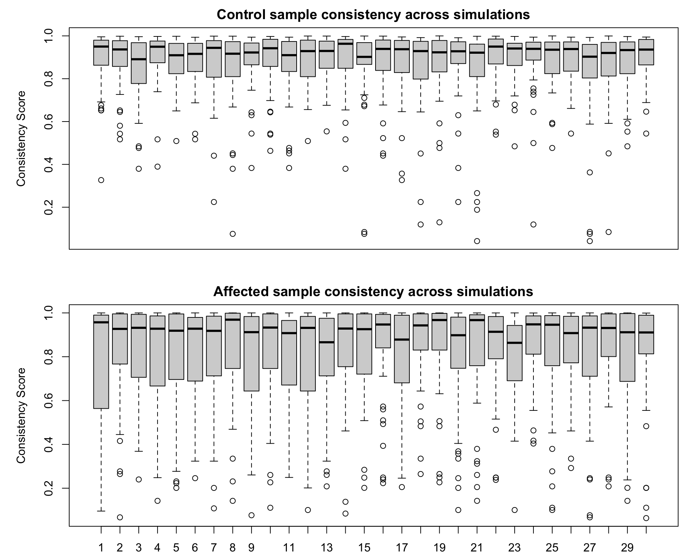
<p class="caption">(\#fig:hcc5hmC-glmnetSuite-look-sim-qual-0-50ONLY)sample consistency by simulation run for size = 50 </p>
</div>

In this figure, we are summarizing the quality measures of 50 samples per group across
30 simulations, or random selections of control and affected samples.
We see significant variability in sample consistency, especially in the affected cases.
This may lead an unwary observer to be overly optimistic, or overly pessimistic,
in the early accrual stages of a study.


## Run simulations


As these take a while to run, 
we will save the results of each simulation to a different
object and store to disk.  These can be easily read from disk
when needed for analysis.


The simulation results are saved to the file system and
only needs to be run once.  The simulation takes $\approx$ 8 to 10 minutes
per iteration, or 4 to 5 hours of run time on a laptop.
(Platform: x86_64-apple-darwin17.0 (64-bit)
Running under: macOS Mojave 10.14.6)

<!-- RUN ONCE - THEN GET FROM MEMORY -->

```r
start_time <- proc.time()

# Get stage from SIZE
stage_vec <- cut(1:nrow(sim_control_qual_mtx), c(0, SIZE), include.lowest = T)

for (SIMno in 1:ncol(sim_control_qual_mtx)) {

  #cat("Running simulation ", SIMno, "\n")

  sim_cv_lst <- lapply(1:length(levels(stage_vec)), function(STGno) {
    Stage_rows_vec <- which(stage_vec %in% levels(stage_vec)[1:STGno])
    #cat("Stage ", STGno, "- analyzing", length(Stage_rows_vec), "paired samples.\n")

    sim_stage_samples_vec <- c(
      hcc5hmC_all_control_vec[hcc5hmC_sim_control_mtx[Stage_rows_vec, SIMno]],
      hcc5hmC_all_affected_vec[hcc5hmC_sim_affected_mtx[Stage_rows_vec, SIMno]]
    )
    sim_stage_lcpm_mtx <- hcc5hmC_all_lcpm_mtx[sim_stage_samples_vec, ]
    sim_stage_group_vec <- hcc5hmC_all_group_vec[sim_stage_samples_vec]
    #print(table(sim_stage_group_vec))

    sim_stage_cv_lst <- lapply(1:CV_REP, function(CV) {
      cv_fit <- glmnet::cv.glmnet(
        x = sim_stage_lcpm_mtx,
        y = sim_stage_group_vec,
        alpha = 1,
        family = "binomial",
        type.measure = "class",
        keep = T,
        nlambda = 30
      )

      # Extract 1se metrics from cv_fit
      #######################
      ndx_1se <- which(cv_fit$lambda == cv_fit$lambda.1se)

      nzero_1se <- cv_fit$nzero[ndx_1se]
      cvm_1se <- cv_fit$cvm[ndx_1se]

      # test error
      sim_stage_test_samples_vec <- setdiff(rownames(hcc5hmC_all_lcpm_mtx), sim_stage_samples_vec)
      sim_stage_hcc5hmC_test_lcpm_mtx <- hcc5hmC_all_lcpm_mtx[sim_stage_test_samples_vec,]
      sim_stage_hcc5hmC_test_group_vec <- hcc5hmC_all_group_vec[sim_stage_test_samples_vec]

      test_pred_1se_vec <- predict(
       cv_fit,
       newx=sim_stage_hcc5hmC_test_lcpm_mtx,
       s="lambda.1se",
       type="class"
      )
      test_1se_error <- mean(test_pred_1se_vec != sim_stage_hcc5hmC_test_group_vec)

      # genes
      coef_1se <- coef(
        cv_fit,
        s = "lambda.1se"
      )
      genes_1se <- coef_1se@Dimnames[[1]][coef_1se@i[-1]]

      # Extract min metrics from cv_fit
      #######################
      ndx_min <- which(cv_fit$lambda == cv_fit$lambda.min)

      nzero_min <- cv_fit$nzero[ndx_min]
      cvm_min <- cv_fit$cvm[ndx_min]

      # test error
      sim_stage_test_samples_vec <- setdiff(rownames(hcc5hmC_all_lcpm_mtx), sim_stage_samples_vec)
      sim_stage_hcc5hmC_test_lcpm_mtx <- hcc5hmC_all_lcpm_mtx[sim_stage_test_samples_vec,]
      sim_stage_hcc5hmC_test_group_vec <- hcc5hmC_all_group_vec[sim_stage_test_samples_vec]

      test_pred_min_vec <- predict(
       cv_fit,
       newx=sim_stage_hcc5hmC_test_lcpm_mtx,
       s="lambda.min",
       type="class"
      )
      test_min_error <- mean(test_pred_min_vec != sim_stage_hcc5hmC_test_group_vec)

      # genes
      coef_min <- coef(
        cv_fit,
        s = "lambda.min"
      )
      genes_min <- coef_min@Dimnames[[1]][coef_min@i[-1]]

      # return cv_fit summary metrics
      list(
       p_1se = nzero_1se, 
       p_min = nzero_min, 
       cv_1se = cvm_1se, 
       cv_min = cvm_min, 
       test_1se=test_1se_error, 
       test_min=test_min_error, 
       genes_1se = genes_1se,
       genes_min = genes_min)
    })
    sim_stage_cv_lst
  })

  # save  sim_cv_lst
  fName <- paste0("hcc5hmC_sim_", SIMno, "_cv_lst")
  assign(fName, sim_cv_lst)
  save(list = fName, file=file.path("RData", fName))

}
```

<!-- DEBUG - rename after the fact -->


## Simulation results

Recall the we have 30 simulations, or randomly selected sets of HCC and Control samples,
analyzed in increasing sizes of 25, 50, 100, 200, 300, with
30 repeated cross-validated lasso fits:


* Sample sizes: SIZE = 25, 50, 100, 200, 300

* Number of CV Replicates:  CV_REP = 30


First we extract simulation results and store into one big table
(only showing the top of table here):


```r
### CLEAR CACHE
sim_files_vec <- list.files('RData', '^hcc5hmC_sim_')


# define extraction methods

# Each sumulation is a list of cv results 
## nested in a list of replicates
##############################################

# cvList2frm_f makes a frame out of the inner list
cvList2frm_f <- function(cv_lst) {
 frm1 <- as.data.frame(t(sapply(cv_lst, function(x) x)))
 frm2 <- data.frame(
  unlist(frm1[[1]]), unlist(frm1[[2]]),
  unlist(frm1[[3]]), unlist(frm1[[4]]),
  unlist(frm1[[5]]), unlist(frm1[[6]]),
  frm1[7], frm1[8])
  names(frm2) <- names(frm1)
  data.frame(Rep=1:nrow(frm2), frm2)}

# cv_lst_to_frm loop over replicates, concatenating the inner list frames
cv_lst_to_frm <- function(sim_cv_lst) {
 do.call('rbind', lapply(1:length(sim_cv_lst),
  function(JJ) {
    siz_frm <- cvList2frm_f(sim_cv_lst[[JJ]])
    data.frame(Size=SIZE[JJ], siz_frm)
  }))
}

# we loop across simulations to combine all results into one big table
hcc5hmC_lasso_sim_results_frm <- do.call('rbind', lapply(1:length(sim_files_vec),
 function(SIM_NO) {
  load(file=file.path('RData', sim_files_vec[SIM_NO]))
  assign('sim_cv_lst', get(sim_files_vec[SIM_NO]))
  rm(list=sim_files_vec[SIM_NO])
  
  data.frame(SimNo=paste0('Sim_',formatC(SIM_NO,width = 2,flag = 0)), cv_lst_to_frm(sim_cv_lst))
} 
)) 
```

<!-- 
Have a table of simulation results - `hcc5hmC_lasso_sim_results_frm`:
-->


```r
### CLEAR CACHE
 
knitr::kable(head(with(hcc5hmC_lasso_sim_results_frm, table(SimNo, Size))),
  caption = paste("Simulation Results - N Sim =", SIM)) %>%
   kableExtra::kable_styling(full_width = F)
```

<table class="table" style="width: auto !important; margin-left: auto; margin-right: auto;">
<caption>(\#tab:hcc5hmC-glmnetSuite-sum-table)Simulation Results - N Sim = 30</caption>
 <thead>
  <tr>
   <th style="text-align:left;">   </th>
   <th style="text-align:right;"> 25 </th>
   <th style="text-align:right;"> 50 </th>
   <th style="text-align:right;"> 100 </th>
   <th style="text-align:right;"> 200 </th>
   <th style="text-align:right;"> 300 </th>
  </tr>
 </thead>
<tbody>
  <tr>
   <td style="text-align:left;"> Sim_01 </td>
   <td style="text-align:right;"> 30 </td>
   <td style="text-align:right;"> 30 </td>
   <td style="text-align:right;"> 30 </td>
   <td style="text-align:right;"> 30 </td>
   <td style="text-align:right;"> 30 </td>
  </tr>
  <tr>
   <td style="text-align:left;"> Sim_02 </td>
   <td style="text-align:right;"> 30 </td>
   <td style="text-align:right;"> 30 </td>
   <td style="text-align:right;"> 30 </td>
   <td style="text-align:right;"> 30 </td>
   <td style="text-align:right;"> 30 </td>
  </tr>
  <tr>
   <td style="text-align:left;"> Sim_03 </td>
   <td style="text-align:right;"> 30 </td>
   <td style="text-align:right;"> 30 </td>
   <td style="text-align:right;"> 30 </td>
   <td style="text-align:right;"> 30 </td>
   <td style="text-align:right;"> 30 </td>
  </tr>
  <tr>
   <td style="text-align:left;"> Sim_04 </td>
   <td style="text-align:right;"> 30 </td>
   <td style="text-align:right;"> 30 </td>
   <td style="text-align:right;"> 30 </td>
   <td style="text-align:right;"> 30 </td>
   <td style="text-align:right;"> 30 </td>
  </tr>
  <tr>
   <td style="text-align:left;"> Sim_05 </td>
   <td style="text-align:right;"> 30 </td>
   <td style="text-align:right;"> 30 </td>
   <td style="text-align:right;"> 30 </td>
   <td style="text-align:right;"> 30 </td>
   <td style="text-align:right;"> 30 </td>
  </tr>
  <tr>
   <td style="text-align:left;"> Sim_06 </td>
   <td style="text-align:right;"> 30 </td>
   <td style="text-align:right;"> 30 </td>
   <td style="text-align:right;"> 30 </td>
   <td style="text-align:right;"> 30 </td>
   <td style="text-align:right;"> 30 </td>
  </tr>
</tbody>
</table>

```r
knitr::kable(head(hcc5hmC_lasso_sim_results_frm) %>% dplyr::select(-c(genes_1se, genes_min)),
    caption = paste("Simulation Results - not showing genes column"),
    digits=2) %>%
   kableExtra::kable_styling(full_width = F)
```

<table class="table" style="width: auto !important; margin-left: auto; margin-right: auto;">
<caption>(\#tab:hcc5hmC-glmnetSuite-sum-table)Simulation Results - not showing genes column</caption>
 <thead>
  <tr>
   <th style="text-align:left;"> SimNo </th>
   <th style="text-align:right;"> Size </th>
   <th style="text-align:right;"> Rep </th>
   <th style="text-align:right;"> p_1se </th>
   <th style="text-align:right;"> p_min </th>
   <th style="text-align:right;"> cv_1se </th>
   <th style="text-align:right;"> cv_min </th>
   <th style="text-align:right;"> test_1se </th>
   <th style="text-align:right;"> test_min </th>
  </tr>
 </thead>
<tbody>
  <tr>
   <td style="text-align:left;"> Sim_01 </td>
   <td style="text-align:right;"> 25 </td>
   <td style="text-align:right;"> 1 </td>
   <td style="text-align:right;"> 20 </td>
   <td style="text-align:right;"> 40 </td>
   <td style="text-align:right;"> 0.32 </td>
   <td style="text-align:right;"> 0.26 </td>
   <td style="text-align:right;"> 0.30 </td>
   <td style="text-align:right;"> 0.31 </td>
  </tr>
  <tr>
   <td style="text-align:left;"> Sim_01 </td>
   <td style="text-align:right;"> 25 </td>
   <td style="text-align:right;"> 2 </td>
   <td style="text-align:right;"> 26 </td>
   <td style="text-align:right;"> 26 </td>
   <td style="text-align:right;"> 0.22 </td>
   <td style="text-align:right;"> 0.22 </td>
   <td style="text-align:right;"> 0.29 </td>
   <td style="text-align:right;"> 0.29 </td>
  </tr>
  <tr>
   <td style="text-align:left;"> Sim_01 </td>
   <td style="text-align:right;"> 25 </td>
   <td style="text-align:right;"> 3 </td>
   <td style="text-align:right;"> 6 </td>
   <td style="text-align:right;"> 32 </td>
   <td style="text-align:right;"> 0.34 </td>
   <td style="text-align:right;"> 0.30 </td>
   <td style="text-align:right;"> 0.35 </td>
   <td style="text-align:right;"> 0.31 </td>
  </tr>
  <tr>
   <td style="text-align:left;"> Sim_01 </td>
   <td style="text-align:right;"> 25 </td>
   <td style="text-align:right;"> 4 </td>
   <td style="text-align:right;"> 10 </td>
   <td style="text-align:right;"> 24 </td>
   <td style="text-align:right;"> 0.36 </td>
   <td style="text-align:right;"> 0.30 </td>
   <td style="text-align:right;"> 0.32 </td>
   <td style="text-align:right;"> 0.29 </td>
  </tr>
  <tr>
   <td style="text-align:left;"> Sim_01 </td>
   <td style="text-align:right;"> 25 </td>
   <td style="text-align:right;"> 5 </td>
   <td style="text-align:right;"> 27 </td>
   <td style="text-align:right;"> 32 </td>
   <td style="text-align:right;"> 0.26 </td>
   <td style="text-align:right;"> 0.22 </td>
   <td style="text-align:right;"> 0.30 </td>
   <td style="text-align:right;"> 0.31 </td>
  </tr>
  <tr>
   <td style="text-align:left;"> Sim_01 </td>
   <td style="text-align:right;"> 25 </td>
   <td style="text-align:right;"> 6 </td>
   <td style="text-align:right;"> 20 </td>
   <td style="text-align:right;"> 27 </td>
   <td style="text-align:right;"> 0.36 </td>
   <td style="text-align:right;"> 0.32 </td>
   <td style="text-align:right;"> 0.30 </td>
   <td style="text-align:right;"> 0.30 </td>
  </tr>
</tbody>
</table>


### Simulation Results - look at one simulation

#### Model Accuracy Assessment

First examine results for one simulation run.  In the figures that follow,
each boxplot summarized 30 repeated cross validation runs performed on a 
fixed random selection of Control and Affected samples.  Recall that as
we move from 25 to 50, etc., the sample sets are growing to emulate an
accrual of samples over time.


```r
### CLEAR CACHE

# get full model cv error ref
error_1se_vec <- sapply(hcc5hmC_cv_lassoAll_lst,
 function(cv_fit) cv_fit$cvm[cv_fit$lambda == cv_fit$lambda.1se])
error_1se_q2 <- quantile(error_1se_vec, prob=1/2)        

error_min_vec <- sapply(hcc5hmC_cv_lassoAll_lst,
 function(cv_fit) cv_fit$cvm[cv_fit$lambda == cv_fit$lambda.min])
error_min_q2 <- quantile(error_min_vec, prob=1/2)        

# Utility objects
SIZE0 <- stringr::str_pad(SIZE, width=3, pad='0')
stage_vec <- cut(1:nrow(sim_control_qual_mtx), c(0,SIZE), include.lowest = T)


#SIM <- "Sim_01"

for(SIM in unique(hcc5hmC_lasso_sim_results_frm$SimNo)[1]){

SimNum <- as.numeric(sub('Sim_','',SIM))

simNo_results_frm <- hcc5hmC_lasso_sim_results_frm %>% dplyr::filter(SimNo==SIM)


# errors
par(mfrow=c(1,2), mar=c(4, 2, 2, 1), oma=c(0,2,2,0))
###################
# 1se
####################
cv_1se_lst <- with(simNo_results_frm,
 split(cv_1se, Size))
names(cv_1se_lst) <- paste0(stringr::str_pad(names(cv_1se_lst), width=3, pad='0'),'_cv')

test_1se_lst <- with(simNo_results_frm,
 split(test_1se, Size))
names(test_1se_lst) <- paste0(stringr::str_pad(names(test_1se_lst), width=3, pad='0'),'_cv')

error_1se_lst <- c(cv_1se_lst, test_1se_lst)
error_1se_lst <- error_1se_lst[order(names(error_1se_lst))]

boxplot(error_1se_lst, 
  border=c('blue','green'), 
  ylim=c(0, 0.5),
  xaxt='n'
)
mtext(side=2, outer=T,  'Misclassification Error')

LL <- -1
axis(side=1, tick=F, line = LL,
  at = match(paste0(SIZE0,'_cv'),names(error_1se_lst)), 
  SIZE0
 )
abline(v= match(paste0(SIZE0,'_cv'),names(error_1se_lst))[-1] - 0.5, col='grey')
abline(h= error_1se_q2, col = 'red')
legend('topright', 
   #title='1se errors', title.col = 'black',
   text.col = c('blue','green'),
   legend = c('cv error', 'test set'),
   bty='n'
 )
title(paste('one se lambda models'))

SKIP  <- function() {
# Add qual annotation
control_qual_vec <- sapply(split(sim_control_qual_mtx[,SimNum], stage_vec), median)
affected_qual_vec <- sapply(split(sim_affected_qual_mtx[,SimNum], stage_vec), median)
LL <- LL + 1
axis(side=1, tick=F, line = LL,
  at = match(paste0(SIZE0,'_cv'),names(error_1se_lst)),
  round(control_qual_vec, 2)
 )
LL <- LL + 1
axis(side=1, tick=F, line = LL,
  at = match(paste0(SIZE0,'_cv'),names(error_1se_lst)),
  round(affected_qual_vec, 2)
 )
}#SKIP

# min
####################
cv_min_lst <- with(simNo_results_frm,
 split(cv_min, Size))
names(cv_min_lst) <- paste0(stringr::str_pad(names(cv_min_lst), width=3, pad='0'),'_cv')

test_min_lst <- with(simNo_results_frm,
 split(test_min, Size))
names(test_min_lst) <- paste0(stringr::str_pad(names(test_min_lst), width=3, pad='0'),'_cv')

error_min_lst <- c(cv_min_lst, test_min_lst)
error_min_lst <- error_min_lst[order(names(error_min_lst))]

boxplot(error_min_lst, 
  border=c('blue','green'), 
  ylim=c(0, 0.5),
  xaxt='n'
)
mtext(side=2, outer=T,  'Misclassification Error')
LL <- -1
axis(side=1, tick=F, line = LL,
  at = match(paste0(SIZE0,'_cv'),names(error_min_lst)), 
  SIZE0
 )
abline(v= match(paste0(SIZE0,'_cv'),names(error_min_lst))[-1] - 0.5, col='grey')
abline(h= error_min_q2, col = 'red')
legend('topright', 
   #title='min errors', title.col = 'black',
   text.col = c('blue','green'),
   legend = c('cv error', 'test set'),
   bty='n'
 )
title(paste('min lambda models'))

SKIP  <- function() {
# Add qual annotation
control_qual_vec <- sapply(split(sim_control_qual_mtx[,SimNum], stage_vec), median)
affected_qual_vec <- sapply(split(sim_affected_qual_mtx[,SimNum], stage_vec), median)
LL <- LL + 1
axis(side=1, tick=F, line = LL,
  at = match(paste0(SIZE0,'_cv'),names(error_min_lst)),
  round(control_qual_vec, 2)
 )
LL <- LL + 1
axis(side=1, tick=F, line = LL,
  at = match(paste0(SIZE0,'_cv'),names(error_min_lst)),
  round(affected_qual_vec, 2)
 )
}#SKIP
mtext(side=3, outer=T, cex=1.25, paste('Sim =',  SIM))

} # for(SIM
```

<div class="figure">

<p class="caption">(\#fig:hcc5hmC-glmnetSuite-lasso-simRes-errors-bySim)lasso Model Errors by Sample Size</p>
</div>

In this one simulation, we see:

* Model accuracy increases with sample size, with minimal improvement going from N=200 to N=300.  

* CV error rates tend to be pessimistic, especially for the small sample sizes.  This is odd
and may be related to sample consistency.  

* There isn't much to chose from between the one standard error and the minimum lambda models.  The
latter may show lower propensity to produce optimistic cv error rates.  

#### Feature Selection 


```r
### CLEAR CACHE

# get full model nzero ref
nzero_1se_vec <- sapply(hcc5hmC_cv_lassoAll_lst,
 function(cv_fit) cv_fit$nzero[cv_fit$lambda == cv_fit$lambda.1se])
nzero_1se_q2 <- quantile(nzero_1se_vec, prob=c(2)/4)

nzero_min_vec <- sapply(hcc5hmC_cv_lassoAll_lst,
 function(cv_fit) cv_fit$nzero[cv_fit$lambda == cv_fit$lambda.min])
nzero_min_q2 <- quantile(nzero_min_vec, prob=c(2)/4)

# Utility objects
SIZE0 <- stringr::str_pad(SIZE, width=3, pad='0')
stage_vec <- cut(1:nrow(sim_control_qual_mtx), c(0,SIZE), include.lowest = T)


#SIM <- "Sim_01"

for(SIM in unique(hcc5hmC_lasso_sim_results_frm$SimNo)[1]){

SimNum <- as.numeric(sub('Sim_','',SIM))

simNo_results_frm <- hcc5hmC_lasso_sim_results_frm %>% dplyr::filter(SimNo==SIM)


par(mfrow=c(1,2), mar=c(4, 2, 2, 1), oma=c(0,0,2,0))
###################
# 1se
####################
# selected feature counts
p_1se_lst <- with(simNo_results_frm,
 split(p_1se, Size))
names(p_1se_lst) <- paste0(stringr::str_pad(names(p_1se_lst), width=3, pad='0'),'_p')

# get selected features that are part of lasso_gene_sign_1se_vec
# - the signature selected genes
sign_genes_1se_lst <- lapply(1:nrow(simNo_results_frm), function(RR)
    intersect(unlist(simNo_results_frm[RR, 'genes_1se']), lasso_gene_sign_1se_vec))

sign_p_1se_lst <- split(sapply(sign_genes_1se_lst, length), simNo_results_frm$Size)
names(sign_p_1se_lst) <- paste0(stringr::str_pad(names(sign_p_1se_lst), width=3, pad='0'),'_signP')


p_singP_1se_lst <- c(p_1se_lst, sign_p_1se_lst)
p_singP_1se_lst <- p_singP_1se_lst[order(names(p_singP_1se_lst))]

boxplot(p_singP_1se_lst,
  border=c('blue','green'),
  ylim=c(0, 200),
  xaxt='n'
)
mtext(side=2, outer=T,  'number of selected features')

LL <- -1
axis(side=1, tick=F, line = LL,
  at = match(paste0(SIZE0,'_p'),names(p_singP_1se_lst)),
  SIZE0
 )
abline(v= match(paste0(SIZE0,'_p'),names(p_singP_1se_lst))[-1] - 0.5, col='grey')
#abline(h= nzero_1se_q2, col = 'red')
legend('topleft',
   #title='1se errors', title.col = 'black',
   text.col = c('blue', 'green'),
   legend= c('selected genes','signature genes'),
   bty='n'
 )
title(paste('one se lambda models'))


SKIP  <- function() {
# Add qual annotation
control_qual_vec <- sapply(split(sim_control_qual_mtx[,SimNum], stage_vec), median)
affected_qual_vec <- sapply(split(sim_affected_qual_mtx[,SimNum], stage_vec), median)
LL <- LL + 1
axis(side=1, tick=F, line = LL,
  at =  match(paste0(SIZE0,'_p'),names(p_singP_1se_lst)),
  round(control_qual_vec, 2)
 )
LL <- LL + 1
axis(side=1, tick=F, line = LL,
  at =  match(paste0(SIZE0,'_p'),names(p_singP_1se_lst)),
  round(affected_qual_vec, 2)
 )
}#SKIP

###################
# min
####################
# selected feature counts
p_min_lst <- with(simNo_results_frm,
 split(p_min, Size))
names(p_min_lst) <- paste0(stringr::str_pad(names(p_min_lst), width=3, pad='0'),'_p')

# get selected features that are part of lasso_gene_sign_min_vec
# - the signature selected genes
sign_genes_min_lst <- lapply(1:nrow(simNo_results_frm), function(RR)
    intersect(unlist(simNo_results_frm[RR, 'genes_min']), lasso_gene_sign_min_vec))

sign_p_min_lst <- split(sapply(sign_genes_min_lst, length), simNo_results_frm$Size)
names(sign_p_min_lst) <- paste0(stringr::str_pad(names(sign_p_min_lst), width=3, pad='0'),'_signP')


p_singP_min_lst <- c(p_min_lst, sign_p_min_lst)
p_singP_min_lst <- p_singP_min_lst[order(names(p_singP_min_lst))]

boxplot(p_singP_min_lst,
  border=c('blue','green'),
  ylim=c(0, 200),
  xaxt='n'
)
LL <- -1
axis(side=1, tick=F, line = LL,
  at = match(paste0(SIZE0,'_p'),names(p_singP_min_lst)),
  SIZE0
 )
abline(v= match(paste0(SIZE0,'_p'),names(p_singP_min_lst))[-1] - 0.5, col='grey')
#abline(h= nzero_min_q2, col = 'red')
legend('topleft',
   #title='min errors', title.col = 'black',
   text.col = c('blue', 'green'),
   legend= c('selected genes','signature genes'),
   bty='n'
 )
title(paste('min lambda models'))

SKIP  <- function() {
# Add qual annotation
control_qual_vec <- sapply(split(sim_control_qual_mtx[,SimNum], stage_vec), median)
affected_qual_vec <- sapply(split(sim_affected_qual_mtx[,SimNum], stage_vec), median)
LL <- LL + 1
axis(side=1, tick=F, line = LL,
  at =  match(paste0(SIZE0,'_p'),names(p_singP_min_lst)),
  round(control_qual_vec, 2)
 )
LL <- LL + 1
axis(side=1, tick=F, line = LL,
  at =  match(paste0(SIZE0,'_p'),names(p_singP_min_lst)),
  round(affected_qual_vec, 2)
 )
}#SKIP

mtext(side=3, outer=T, cex=1.25, paste('Sim =',  SIM))

} # for(SIM
```

<div class="figure">
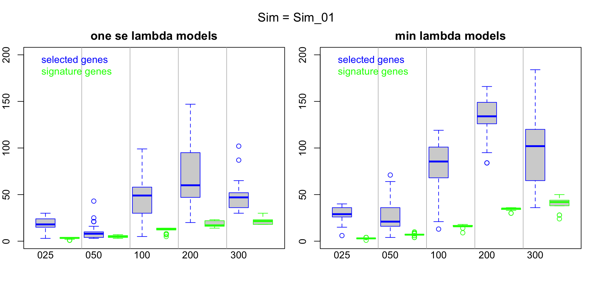
<p class="caption">(\#fig:hcc5hmC-glmnetSuite-lasso-simRes-features-bySim)lasso Models Selected Features by Sample Size</p>
</div>

In this one simulation, we see:

* The selected number of features in the smaller sample size analyses
are low, with few features belonging to the core signature identified in the
full data set.  

* As the sample size increases the number of features selected in the minimum 
lambda model remains variable, but the number of core signature features
selected in the samples of sizes 200 and 300 is stable and between 40 and 50.  


### Summarize results across simulation runs.

#### Model Accuracy Assessment

Now look across all simulations.  In the figures that follow, each boxplot
summarizes the results of 30 simulations.  For a give sample size and a 
given simulation, each data point is the median across 30 repeated cv runs.


```r
### CLEAR CACHE

# get full model cv error ref
error_1se_vec <- sapply(hcc5hmC_cv_lassoAll_lst,
 function(cv_fit) cv_fit$cvm[cv_fit$lambda == cv_fit$lambda.1se])
error_1se_q2 <- quantile(error_1se_vec, prob=1/2)        

error_min_vec <- sapply(hcc5hmC_cv_lassoAll_lst,
 function(cv_fit) cv_fit$cvm[cv_fit$lambda == cv_fit$lambda.min])
error_min_q2 <- quantile(error_min_vec, prob=1/2)        

# Utility objects
SIZE0 <- stringr::str_pad(SIZE, width=3, pad='0')
stage_vec <- cut(1:nrow(sim_control_qual_mtx), c(0,SIZE), include.lowest = T)

par(mfrow=c(1,2), mar=c(4, 2, 2, 1), oma=c(0,2,2,0))
# 1se
#########################################
## cv
cv_1se_Bysize_lst <- lapply(unique(hcc5hmC_lasso_sim_results_frm$Size),
function(SizeVal) {
 sizeVal_results_frm <- hcc5hmC_lasso_sim_results_frm %>% dplyr::filter(Size==SizeVal)
 sizeVal_cv_1se_lst <- with(sizeVal_results_frm, split(cv_1se, SimNo))
 sapply(sizeVal_cv_1se_lst, median)
})
names(cv_1se_Bysize_lst) <- paste0(
 stringr::str_pad(unique(hcc5hmC_lasso_sim_results_frm$Size), width=3, pad='0'), '_cv')

## test
test_1se_Bysize_lst <- lapply(unique(hcc5hmC_lasso_sim_results_frm$Size),
function(SizeVal) {
 sizeVal_results_frm <- hcc5hmC_lasso_sim_results_frm %>% dplyr::filter(Size==SizeVal)
 sizeVal_test_1se_lst <- with(sizeVal_results_frm, split(test_1se, SimNo))
 sapply(sizeVal_test_1se_lst, median)
})
names(test_1se_Bysize_lst) <- paste0(
 stringr::str_pad(unique(hcc5hmC_lasso_sim_results_frm$Size), width=3, pad='0'), '_test')


error_1se_Bysize_lst <- c(cv_1se_Bysize_lst, test_1se_Bysize_lst)
error_1se_Bysize_lst <- error_1se_Bysize_lst[order(names(error_1se_Bysize_lst))]

boxplot(error_1se_Bysize_lst,
  col=0,
  border=c('blue','green'),
  ylim=c(0, .5),
  outline=F,
  xaxt='n'
)
mtext(side=2, outer=T,  'Misclassification Error')

for(JJ in 1:length(error_1se_Bysize_lst))
points(
   x=jitter(rep(JJ, length(error_1se_Bysize_lst[[JJ]])), amount=0.25), 
   y=error_1se_Bysize_lst[[JJ]], cex=0.5,
   col=ifelse(grepl('cv', names(error_1se_Bysize_lst)[JJ]),'blue', 'green')
)
LL <- -1
axis(side=1, tick=F, line = LL,
  at = match(paste0(SIZE0,'_cv'),names(error_1se_Bysize_lst)),
  SIZE0
 )
abline(v= match(paste0(SIZE0,'_cv'),names(error_1se_Bysize_lst))[-1] - 0.5, col='grey')
abline(h= error_min_q2, col = 'red')
legend('topright',
   #title='min errors', title.col = 'black',
   text.col = c('blue','green'),
   legend = c('cv error', 'test set'),
   bty='n'
 )
title(paste('one se lambda models'))


# min
#########################################
## cv
cv_min_Bysize_lst <- lapply(unique(hcc5hmC_lasso_sim_results_frm$Size),
function(SizeVal) {
 sizeVal_results_frm <- hcc5hmC_lasso_sim_results_frm %>% dplyr::filter(Size==SizeVal)
 sizeVal_cv_min_lst <- with(sizeVal_results_frm, split(cv_min, SimNo))
 sapply(sizeVal_cv_min_lst, median)
})
names(cv_min_Bysize_lst) <- paste0(
 stringr::str_pad(unique(hcc5hmC_lasso_sim_results_frm$Size), width=3, pad='0'), '_cv')

## test
test_min_Bysize_lst <- lapply(unique(hcc5hmC_lasso_sim_results_frm$Size),
function(SizeVal) {
 sizeVal_results_frm <- hcc5hmC_lasso_sim_results_frm %>% dplyr::filter(Size==SizeVal)
 sizeVal_test_min_lst <- with(sizeVal_results_frm, split(test_min, SimNo))
 sapply(sizeVal_test_min_lst, median)
})
names(test_min_Bysize_lst) <- paste0(
 stringr::str_pad(unique(hcc5hmC_lasso_sim_results_frm$Size), width=3, pad='0'), '_test')


error_min_Bysize_lst <- c(cv_min_Bysize_lst, test_min_Bysize_lst)
error_min_Bysize_lst <- error_min_Bysize_lst[order(names(error_min_Bysize_lst))]

boxplot(error_min_Bysize_lst,
  col=0,
  border=c('blue','green'),
  ylim=c(0, .5),
  outline=F,
  xaxt='n'
)
for(JJ in 1:length(error_min_Bysize_lst))
points(
   x=jitter(rep(JJ, length(error_min_Bysize_lst[[JJ]])), amount=0.25), 
   y=error_min_Bysize_lst[[JJ]], cex=0.5,
   col=ifelse(grepl('cv', names(error_min_Bysize_lst)[JJ]),'blue', 'green')
)
LL <- -1
axis(side=1, tick=F, line = LL,
  at = match(paste0(SIZE0,'_cv'),names(error_min_Bysize_lst)),
  SIZE0
 )
abline(v= match(paste0(SIZE0,'_cv'),names(error_min_Bysize_lst))[-1] - 0.5, col='grey')
abline(h= error_min_q2, col = 'red')
legend('topright',
   #title='min errors', title.col = 'black',
   text.col = c('blue','green'),
   legend = c('cv error', 'test set'),
   bty='n'
 )
title(paste('min lambda models'))


mtext(side=3, outer=T, cex=1.25, paste('lasso fit error rates summarized across simulations'))
```

<div class="figure">

<p class="caption">(\#fig:hcc5hmC-glmnetSuite-lasso-simRes-errors-overSim)lasso Model Errors by Sample Size</p>
</div>

<br/>


* For the smaller samples sizes, cv error rates for the minimum lambda models tend to be
optimistic.  

* **For lower sample sizes, assess performance is quite variable**. This
is key:  with N=25 cases and controls, the estimated classification error
rate produced by a given cohort can range from below 0.2 to higher than 0.5,
or basically no indication of discrimination value in the analyzed features.

<br/>

To appreciate how much variability can be encountered as samples are accrued over time
we need to look at a typical path the assessed model accuracy estimates might take.


```r
### CLEAR CACHE

error_1se_Bysize_mtx <- do.call('cbind', lapply(error_1se_Bysize_lst, function(LL) LL))

cv_error_1se_Bysize_mtx <- error_1se_Bysize_mtx[,grep('_cv', colnames(error_1se_Bysize_mtx))]

plot(x=c(1, ncol(cv_error_1se_Bysize_mtx)), y=c(0,0.6), 
  xlab='sample size', ylab='Misclassification Error', 
  type='n', xaxt='n')
axis(side=1, at=1:ncol(cv_error_1se_Bysize_mtx), 
 labels=sub('_cv','',colnames(cv_error_1se_Bysize_mtx)))
for(JJ in 1:15)
lines(x=1:ncol(cv_error_1se_Bysize_mtx), y=cv_error_1se_Bysize_mtx[JJ,],
 type='b', pch=JJ, col=JJ)
title('Example Misclassification Error Paths')
```

<div class="figure">

<p class="caption">(\#fig:hcc5hmC-glmnetSuite-lasso-simRes-errorsPath-overSim)lasso Model Error Paths</p>
</div>


We see how erratic the assessed model accuracy can be when sample sizes are small,
and that it would be hard to guess the ultimate level of accuracy the
is achievable, or the number of samples required to get a reasonable 
estimate of the achievable level of accuracy.


<br/>


<br/>


#### Feature Selection 


```r
### CLEAR CACHE

# Utility objects
SIZE0 <- stringr::str_pad(SIZE, width=3, pad='0')
stage_vec <- cut(1:nrow(sim_control_qual_mtx), c(0,SIZE), include.lowest = T)

par(mfrow=c(1,2), mar=c(4, 2, 2, 1), oma=c(0,2,2,0))
# 1se
#########################################
# selected features
p_1se_Bysize_lst <- lapply(unique(hcc5hmC_lasso_sim_results_frm$Size),
function(SizeVal) {
 sizeVal_results_frm <- hcc5hmC_lasso_sim_results_frm %>% dplyr::filter(Size==SizeVal)
 sizeVal_p_1se_lst <- with(sizeVal_results_frm, split(p_1se, SimNo))
 sapply(sizeVal_p_1se_lst, median)
})
names(p_1se_Bysize_lst) <- paste0(
 stringr::str_pad(unique(hcc5hmC_lasso_sim_results_frm$Size), width=3, pad='0'), '_p')

# selected signatue features
sign_p_1se_Bysize_lst <- lapply(unique(hcc5hmC_lasso_sim_results_frm$Size),
function(SizeVal) {
 sizeVal_results_frm <- hcc5hmC_lasso_sim_results_frm %>% dplyr::filter(Size==SizeVal)
 
  
 sizeVal_sign_genes_1se_lst <- lapply(1:nrow(sizeVal_results_frm), function(RR)
    intersect(unlist(sizeVal_results_frm[RR, 'genes_1se']), lasso_gene_sign_1se_vec))

 sizeVal_sign_p_1se_lst <- split(sapply(sizeVal_sign_genes_1se_lst, length),
    sizeVal_results_frm$SimNo)
 
 sapply(sizeVal_sign_p_1se_lst, median)
})
names(sign_p_1se_Bysize_lst) <- paste0(
 stringr::str_pad(unique(hcc5hmC_lasso_sim_results_frm$Size), width=3, pad='0'), '_signP')


p_singP_1se_Bysize_lst <- c(p_1se_Bysize_lst, sign_p_1se_Bysize_lst)
p_singP_1se_Bysize_lst <- p_singP_1se_Bysize_lst[order(names(p_singP_1se_Bysize_lst))]

boxplot(p_singP_1se_Bysize_lst,
  col=0,
  border=c('blue','green'),
  ylim=c(0, 200),
  xaxt='n'
)
mtext(side=2, outer=T,  'number of selected features')

for(JJ in 1:length(p_singP_1se_Bysize_lst))
points(
   x=jitter(rep(JJ, length(p_singP_1se_Bysize_lst[[JJ]])), amount=0.25),
   y=p_singP_1se_Bysize_lst[[JJ]], cex=0.5,
   col=ifelse(grepl('_p', names(p_singP_1se_Bysize_lst)[JJ]),'blue', 'green')
)

LL <- -1
axis(side=1, tick=F, line = LL,
  at = match(paste0(SIZE0,'_p'),names(p_singP_1se_Bysize_lst)),
  SIZE0
 )
abline(v= match(paste0(SIZE0,'_p'),names(p_singP_1se_Bysize_lst))[-1] - 0.5, col='grey')
#abline(h= nzero_1se_q2, col = 'red')
legend('topleft',
   #title='1se errors', title.col = 'black',
   text.col = c('blue', 'green'),
   legend= c('selected genes','signature genes'),
   bty='n'
 )
title(paste('one se lamdba models'))


# min
#########################################
# selected features
p_min_Bysize_lst <- lapply(unique(hcc5hmC_lasso_sim_results_frm$Size),
function(SizeVal) {
 sizeVal_results_frm <- hcc5hmC_lasso_sim_results_frm %>% dplyr::filter(Size==SizeVal)
 sizeVal_p_min_lst <- with(sizeVal_results_frm, split(p_min, SimNo))
 sapply(sizeVal_p_min_lst, median)
})
names(p_min_Bysize_lst) <- paste0(
 stringr::str_pad(unique(hcc5hmC_lasso_sim_results_frm$Size), width=3, pad='0'), '_p')

# selected signatue features
sign_p_min_Bysize_lst <- lapply(unique(hcc5hmC_lasso_sim_results_frm$Size),
function(SizeVal) {
 sizeVal_results_frm <- hcc5hmC_lasso_sim_results_frm %>% dplyr::filter(Size==SizeVal)
 
  
 sizeVal_sign_genes_min_lst <- lapply(1:nrow(sizeVal_results_frm), function(RR)
    intersect(unlist(sizeVal_results_frm[RR, 'genes_min']), lasso_gene_sign_min_vec))

 sizeVal_sign_p_min_lst <- split(sapply(sizeVal_sign_genes_min_lst, length),
    sizeVal_results_frm$SimNo)
 
 sapply(sizeVal_sign_p_min_lst, median)
})
names(sign_p_min_Bysize_lst) <- paste0(
 stringr::str_pad(unique(hcc5hmC_lasso_sim_results_frm$Size), width=3, pad='0'), '_signP')


p_singP_min_Bysize_lst <- c(p_min_Bysize_lst, sign_p_min_Bysize_lst)
p_singP_min_Bysize_lst <- p_singP_min_Bysize_lst[order(names(p_singP_min_Bysize_lst))]

boxplot(p_singP_min_Bysize_lst,
  col=0,
  border=c('blue','green'),
  ylim=c(0, 200),
  xaxt='n'
)
for(JJ in 1:length(p_singP_min_Bysize_lst))
points(
   x=jitter(rep(JJ, length(p_singP_min_Bysize_lst[[JJ]])), amount=0.25),
   y=p_singP_min_Bysize_lst[[JJ]], cex=0.5,
   col=ifelse(grepl('_p', names(p_singP_min_Bysize_lst)[JJ]),'blue', 'green')
)

LL <- -1
axis(side=1, tick=F, line = LL,
  at = match(paste0(SIZE0,'_p'),names(p_singP_min_Bysize_lst)),
  SIZE0
 )
abline(v= match(paste0(SIZE0,'_p'),names(p_singP_min_Bysize_lst))[-1] - 0.5, col='grey')
#abline(h= nzero_min_q2, col = 'red')
legend('topleft',
   #title='min errors', title.col = 'black',
   text.col = c('blue', 'green'),
   legend= c('selected genes','signature genes'),
   bty='n'
 )
title(paste('min lambda models'))

mtext(side=3, outer=T, cex=1.25, paste('lasso fit feature selection summarized across simulations'))
```

<div class="figure">

<p class="caption">(\#fig:hcc5hmC-glmnetSuite-lasso-simRes-features-OverSim)lasso Models Selected Features by Sample Size</p>
</div>


* The number of selected features increase with sample size.  

*  The number of selected features is quite variable, even for larger sample sizes.

* The number of core signature features among selected features is stable for larger sample
sizes and represents 30 to 40% of the selected features (for N=200 and 300 respectively).

## Effect of sample consistency

To see the effect of sample consistency on classification results, we will
focus on the performance of the small sample fits (N=25) where variability is the
greatest, and the context where investigators should be most aware of the
effect of sample selection over and beyond sample size concerns.

In the plot below, 

* control_Q and affected_Q are summary measures of
sample set consistencies for the control and affected groups in the  different
cv runs.   

* 1se_cv and 1se_test are the cross-validation and test set error rates, respectively.


```r
control_samp25_qual_vec <- apply(sim_control_qual_mtx[1:25, ], 2, median)
affected_samp25_qual_vec <- apply(sim_affected_qual_mtx[1:25, ], 2, median)

samp25_qual_error_mtx <- cbind(
   `1se_cv` = error_1se_Bysize_lst[['025_cv']],
   `1se_test` = error_1se_Bysize_lst[['025_test']],
   `control_Q` = control_samp25_qual_vec,
   `affected_Q` = affected_samp25_qual_vec)
 

# Correlation panel
panel.cor <- function(x, y){
    usr <- par("usr"); on.exit(par(usr))
    par(usr = c(0, 1, 0, 1))
    r <- round(cor(x, y), digits=2)
    txt <- paste0("R = ", r)
    cex.cor <- 0.8/strwidth(txt)
    text(0.5, 0.5, txt, cex = 1.5) ###cex.cor * r)
}

pairs(samp25_qual_error_mtx,
 lower.panel = panel.cor)
```

<div class="figure">

<p class="caption">(\#fig:hcc5hmC-glmnetSuite-small-sample-qual)sample consistency vs classifier performance</p>
</div>

We see that although the sample consistency effect is not strong, the consistency of the
affected sample cohorts does have a measurable impact on the 1se cv and test set error
rates (cor = -0.32 and -0.27, respectively).  

This plot is somewhat under-whelming.

<!--chapter:end:05-glmnetSuiteHCC5hmC.Rmd-->

# BrCa RNA-Seq: Preprocessing {#brca-rnaseq-preproc}

In this section we examine some RNA-Seq data from a breast cancer study
to provide a different SNR context from the HCC 5hmC data in which
to examine the relationship between sample size and model performance.
For this exercise, we will look at discriminating between breast
cancer samples of subtype LumA and all other subtypes among ER+/HER2-
breast cancer samples.  This may
be a somewhat artificial and uninteresting classification problem,
but it does provide a binary classification problem with many examples
in the two subgroups allowing is to run simulations analogous to
those that were run on the HCC 5hmC data.

<!--
Reader note:  

* The most interesting part of this section is Subsection \@ref(snr-regime)
which tells us where on the SNR spectrum the 5hmC data lies.
In view of the work by  Hastie et al. (2017) [@Hastie:2017aa]
summarized in Subsection \@ref(lasso-vs-best-sub), we would expect to
lasso model, and the relaxed version, to do very well with this
classifiaction problem.
-->

<!--

 FN <- 'tmp'
 # Shotcuts for knitting and redering while in R session (Invoke interactive R from R/Scripts folder)
 kk <- function(n='') knitr::knit2html(paste("t", n, sep=''), envir=globalenv(),
       output=paste(FN,".html", sep=''))

 rr <- function(n='') rmarkdown::render(paste("t", n, sep=''), envir=globalenv(),
       output_file=paste(FN,".html", sep='')) ##, output_dir='Scripts')

 bb <- function(n='') browseURL(paste(FN,".html", sep=''))

 # The usual shotcuts
 zz <- function(n='') source(paste("t", n, sep=''))

-->


## Load the data

<!-- THIS ENSURES NO EVALUATION TAKES PLACE BY DEFAULT -->
<!-- TO TURN ON, SET eval=T                            -->


<!-- Add base libraries -->


The data that are available from NCBI GEO
[Series GSE96058](https://www.ncbi.nlm.nih.gov/geo/query/acc.cgi?acc=GSE96058)
can be conveniently accessed through an R data package.
Attaching the GSE96058 package makes the count data tables 
available as well as a gene annotation table and a sample description table.
See [GSE96058 R Data Package page](https://12379monty.github.io/GSE96058/).

The data in GSE96058 have been separated into various data frames and
matrices.  The separation of the gene expression data into separate matrices
was designed to get around github's file size restrictions.  See
[GSE96058 Package Page](https://github.com/12379Monty/GSE96058)
for details.


<!--
**Programming Note**:  

* When the GSE96058 package is attached with the `library(GSE96058)`
function call, any previously loaded object with the same
name will mask the corresponding objects lazy-loaded by GSE96058.
To get around this problem, R data packages should have
unique object names.

-->


```r
### CLEAR CACHE
if (!("GSE96058" %in% rownames(installed.packages()))) {
  if (!requireNamespace("devtools", quietly = TRUE)) {
    install.packages("devtools")
  }
  devtools::install_github("12379Monty/GSE96058")
}

library(GSE96058)

# Strip GSE_ID prefix form object names
### MOD: (2020.09.21) keep 'brcaRna_' as prefix to object names.
###     Otherwise we run into problems when different datasets are
###     analyzed

for(OBJ in data(package='GSE96058')$results[, 'Item'])
assign(sub('GSE96058_','brcaRna_',OBJ), get(OBJ))

detach(package:GSE96058, unload = T )
```

For this analysis, we will consider ER+/HER2- samples only and
examine `pam50_subtype = 'LumA' vs 'Other'` as outcome.
This choice is predicated on the desire to have a fairly
balanced binary outcome to work with when we examine the effect
of sample size on classification performance.
The outcome in this dataset will be aliased as `group`.


```r
ER_HER2_tbl <- with(brcaRna_sampDesc %>% 
 dplyr::filter(!grepl('repl$', title) & !isRepl & er_Status!='NA'   & her2_Status!='NA'),
 table(ER_HER2=paste(er_Status, her2_Status, sep='_'),
  exclude=NULL)
 )

 knitr::kable(ER_HER2_tbl,
  caption="ER, PR and HER2 Status")  %>%
  kableExtra::kable_styling(full_width = F)
```

<table class="table" style="width: auto !important; margin-left: auto; margin-right: auto;">
<caption>(\#tab:brcaRna-preproc-subsetSamples)ER, PR and HER2 Status</caption>
 <thead>
  <tr>
   <th style="text-align:left;"> ER_HER2 </th>
   <th style="text-align:right;"> Freq </th>
  </tr>
 </thead>
<tbody>
  <tr>
   <td style="text-align:left;"> 0_0 </td>
   <td style="text-align:right;"> 165 </td>
  </tr>
  <tr>
   <td style="text-align:left;"> 0_1 </td>
   <td style="text-align:right;"> 63 </td>
  </tr>
  <tr>
   <td style="text-align:left;"> 1_0 </td>
   <td style="text-align:right;"> 2425 </td>
  </tr>
  <tr>
   <td style="text-align:left;"> 1_1 </td>
   <td style="text-align:right;"> 310 </td>
  </tr>
</tbody>
</table>

```r
# Subset analysis samples
brcaRna_sampDesc <-
  brcaRna_sampDesc %>%
  dplyr::filter(!grepl('repl$', title) & er_Status == '1' & her2_Status == '0') %>%
  dplyr::mutate(group = pam50_subtype) %>%
  dplyr::rename(sampID = title) %>%
  dplyr::arrange(group, sampID)

#with(brcaRna_sampDesc, table(group, exclude=NULL))

# Recode group
brcaRna_sampDesc$group <- with(
  brcaRna_sampDesc,
  ifelse(group == "LumA", "LumA", "Other")  ## Luma > Other
)

# Re-order and name rows
o.v <- with(brcaRna_sampDesc, order(group, sampID))
brcaRna_sampDesc  <- brcaRna_sampDesc[o.v, ]

rownames(brcaRna_sampDesc) <- brcaRna_sampDesc$sampID

# set brcaRna_groupCol for later
brcaRna_groupCol <- c("#F3C300", "#875692")
names(brcaRna_groupCol) <- unique(brcaRna_sampDesc$group)

with(brcaRna_sampDesc, 
 knitr::kable(table(group, exclude = NULL),
  caption="Samples used in this analysis") %>%
  kableExtra::kable_styling(full_width = F)
)
```

<table class="table" style="width: auto !important; margin-left: auto; margin-right: auto;">
<caption>(\#tab:brcaRna-preproc-subsetSamples)Samples used in this analysis</caption>
 <thead>
  <tr>
   <th style="text-align:left;"> group </th>
   <th style="text-align:right;"> Freq </th>
  </tr>
 </thead>
<tbody>
  <tr>
   <td style="text-align:left;"> LumA </td>
   <td style="text-align:right;"> 1492 </td>
  </tr>
  <tr>
   <td style="text-align:left;"> Other </td>
   <td style="text-align:right;"> 933 </td>
  </tr>
</tbody>
</table>


The features in this dataset are gene expression indicators:

```

Gene expression data in FPKM were generated using cufflinks 2.2.1 
(default parameters except –GTF, –frag-bias-correct GRCh38.fa, –multi-read-correct, 
–library-type fr-firststrand, –total-hits-norm, –max-bundle-frags 10000000). 
The resulting data was was post-processed by collapsing on 30,865 unique gene symbols 
(sum of FPKM values of each matching transcript), adding to each expression measurement 
0.1 FPKM, and performing a log2 transformation.

```

^[See [NCBI GEO GSE96058](https://www.ncbi.nlm.nih.gov/geo/query/acc.cgi?acc=GSE96058)].


We now proceed to run a *minimal set of QC sanity checks* to make sure that
there are no apparent systematic effects in the data.


Assemble feature matrix for `brcaRna_sampDesc` samples.


```r
# Start for geneExpression_repl1 data
repl1_ndx <- which(is.element(colnames(brcaRna_geneExpression_repl1), brcaRna_sampDesc$sampID))
brcaRna_geneExpression <- brcaRna_geneExpression_repl1[, repl1_ndx]

# add samples from brcaRna_geneExpression_subJJ
for(JJ in 1:5) {
  sub_ndx <- which(is.element(
   colnames(get(paste0('brcaRna_geneExpression_sub',JJ))),  brcaRna_sampDesc$sampID))
  brcaRna_geneExpression <- cbind(brcaRna_geneExpression,
   get(paste0('brcaRna_geneExpression_sub',JJ))[, sub_ndx])
}

# align brcaRna_geneExpression columns to brcaRna_sampDesc samples order
geneExpr_ndx <- match(brcaRna_sampDesc$sampID, colnames(brcaRna_geneExpression))
if(any(is.na(geneExpr_ndx)))
stop("brcaRna_sampDesc/brcaRna_geneExpression: sample mismatch") else
brcaRna_geneExpression <- brcaRna_geneExpression[, rownames(brcaRna_sampDesc)]
```

We first look at coverage - make sure there isn't too much disparity of coverage 
across samples. To detect shared variability, samples can be annotated and ordered
according to sample features that may be linked to sample batch processing.  Here we 
the samples have been ordered by group and sample id (an alias of geoAcc).


```r
par(mar = c(1, 3, 2, 3))
boxplot(brcaRna_geneExpression,
  ylim = c(-4, 4), ylab='log2 Count',
  staplewex = 0,       # remove horizontal whisker lines
  staplecol = "white", # just to be totally sure :)
  outline = F,         # remove outlying points
  whisklty = 0,        # remove vertical whisker lines
  las = 2, horizontal = F, xaxt = "n",
  border = brcaRna_groupCol[brcaRna_sampDesc$group]
)
legend("top", legend = names(brcaRna_groupCol), text.col = brcaRna_groupCol, 
  ncol = 2, bty = "n")
# Add reference lines
SampleMedian <- apply(brcaRna_geneExpression, 2, median)
abline(h = median(SampleMedian), col = "grey")
axis(side = 4, at = round(median(SampleMedian), 2), 
  las = 2, col = "grey", line = 0, tick = F)
```

<div class="figure">

<p class="caption">(\#fig:brcaRna-preproc-geneExprBxp)Sample log2 count boxplots</p>
</div>

<!-- DNA - we're not looking at COVERAGE!!!! 
Coverage/brcaRna_geneExpression level looks fairly comparable across samples.  It is sometimes helpful to
keep track of the actual coverage which can be adequetely tracked by distribution
quantiles.
-->


<!-- SKIP
From this table, we see that 25% of the samples have total coverage exceeding
$TICKr round(brcaRna_geneExpression_quant2["75%", "totCovM"],1)TICK$M reads, 25% of samples
have a 15 percentile of coverage lower than
$TICKr brcaRna_geneExpression_quant2["25%", "15%"]TICK$, etc.  
-->

<!-- SKIP
We next look at relative log representation (RLR) (in the context of measuring the density of 
5hmC marks in genes, we refer to `representation` as opposed to `expression`; the
two can be used interchangibly) -
make sure the shapes of the distributions are not widely different.
-->


<!-- SKIPPED
We note that the HCC samples have slightly more variable coverage distribution.
A few samples are quite different.
-->

## Differential representation analysis {#breast-rnaseq-dra}


In the remainder of this section, we will process the data and
perform differential expression analysis.  If we had counts,
the analysis pipeline outlined in Law et al. (2018) [@Law:2018aa]
would be appropriate.   The main analysis steps of the pipeline are: 

* remove lowly expressed genes
* normalize gene expression distributions
* remove heteroscedascity
* fit linear models and examine DE results


We will adapt this pipeline to the FPKM data that we have to work with - basically 
skip the 2nd and 3rd steps in the above pipeline.

### Remove lowly expressed genes {-}

To determine a sensible threshold we can begin by examining the shapes of the distributions.


```r
par(mar = c(4, 3, 2, 1))
plot(density(brcaRna_geneExpression[, 1]), 
  col = brcaRna_groupCol[brcaRna_sampDesc$group[1]], lwd = 2, 
  ylim = c(0, .30), xlim=c(-5, 10),
  las = 2, main = "", xlab = "gene expression"
)
abline(v = 0, col = 3)
# After verifying no outliers, can plot a random subset 
for (JJ in sample(2:ncol(brcaRna_geneExpression), size = 100)) {
  den <- density(brcaRna_geneExpression[, JJ])
  lines(den$x, den$y, col = brcaRna_groupCol[brcaRna_sampDesc$group[JJ]], lwd = 2)
} # for(JJ
legend("topright", legend = names(brcaRna_groupCol), 
  text.col = brcaRna_groupCol, bty = "n")
```

<div class="figure">

<p class="caption">(\#fig:brcaRna-preproc-densityGeneExpr)Sample gene expression densities</p>
</div>

 

In this analysis we will be using a nominal gene expression value of 
0, genes are deeemed to be `represented` if their expression is 
above this threshold, and not represented otherwise. 
For this analysis we will require that genes be `represented` in at least 
25 samples across the entire dataset to be retained for downstream analysis.


<!-- or at least 
TICKr round(EXPR_THR*LibSizeSum['Max.'])TICK counts in the sample with the 
greatest sequencing depth (library size TICKr round(LibSizeSum['Max.'],1)TICK million).
-->

Remove weakly represented genes and replot densities.


Removing 37.1%  of genes...


```r
### CLEAR CACHE

par(mar = c(4, 3, 2, 1))
plot(density(brcaRna_geneExpression_F[, 1]),
  col = brcaRna_groupCol[brcaRna_sampDesc$group[1]],
  lwd = 2, las = 2, main = "", xlab = "gene expression",
  ylim = c(0, .30), xlim=c(-5, 10)
)
#abline(v = 0, col = 3)
# After verifying no outliers, can plot a random subset 
for (JJ in sample(2:ncol(brcaRna_geneExpression_F), size = 100)) {
  den <- density(brcaRna_geneExpression_F[, JJ])
  lines(den$x, den$y, col = brcaRna_groupCol[brcaRna_sampDesc$group[JJ]], lwd = 2)
} # for(JJ
legend("topright", legend = names(brcaRna_groupCol), 
  text.col = brcaRna_groupCol, bty = "n")
```

<div class="figure">

<p class="caption">(\#fig:brcaRna-preproc-densityGeneExpr2)Sample gene expression densities after removing weak genes</p>
</div>

<!--
Note that the $log_2(CMP)$ distribution is not quite symmetric.
-->

As another sanity check, we will look at a 
multidimensional scaling plot of distances between gene expression
profiles.  We use `plotMDS` in limma package [@Ritchie:2015aa]),
which plots samples on a two-dimensional scatterplot so that distances on
the plot approximate the typical log2 fold changes between the
samples.   

<!-- SKIP - data are $\approx$ normalized 
Before producing the MDS plot we will normalize the distributions.
We will store the data into s `DGEList` object as this is convenient
when running many of the analyses implemented in the edgeR and limma packages.
Call the set 'AF', for set 'A', 'Filtered'.
-->


<!-- SKIP
Verify that the counts are properly normalized.
-->


```r
### CLEAR CACHE

par(mfcol = c(1, 2), mar = c(4, 4, 2, 1), xpd = NA, oma = c(0, 0, 2, 0))

# wo loss of generality, sample 500 samples
# simply a matter of convenience to save time
# remove from final version
set.seed(1)
samp_ndx <- sample(1:ncol(brcaRna_geneExpression_F), size = 500)
MDS.out <- limma::plotMDS(brcaRna_geneExpression_F[, samp_ndx],
  col = brcaRna_groupCol[brcaRna_sampDesc$group[samp_ndx]], pch = 1
)
legend("topleft",
  legend = names(brcaRna_groupCol),
  text.col = brcaRna_groupCol, bty = "n"
)

MDS.out <- limma::plotMDS(brcaRna_geneExpression_F[, samp_ndx],
  col = brcaRna_groupCol[brcaRna_sampDesc$group[samp_ndx]], pch = 1,
  dim.plot = 3:4
)
```

<div class="figure">

<p class="caption">(\#fig:brcaRna-preproc-plotMDS)MDS plots of gene expression values</p>
</div>

The MDS plot, which is analogous to a PCA plot adapted to gene exression data,
does not indicate strong clustering of samples.  

<!-- SKIP
`glMDSPlot` from package `Glimma` provides an interactive MDS 
plot that can extremely usful for exploration
-->


<!-- SKIP
Link to glMDSPlot: 
[Here]($TICKr file.path(figures_DIR, paste0("GlMDSplot.html"))TICK  

No obvious factor links the samples in the 3 clusters observed on the
4th MDS dimensions. The percent of variance exaplained by this dimension or 
$\approx$ 4%.   The glMDSPlot indicates further segregation along
the 6th dimension.  The percent of variance exaplained by this dimension or 
$\approx$ 2%.  Tracking down this source of variability may be quite challenging,
especially without having the complete information about the sample attributes 
and provenance.  

Unwanted variability is a well-documented problem in the analysis of RNA-Seq data
(see Peixoto et al. (2015) [@Peixoto:2015aa]), and many procedures have been proposed
to reduce the effect of unwanted variation on RNA-Seq analsys results 
([@Gandolfo:2018aa;@Peixoto:2015aa;@Risso:2014aa]).  There are undoubtedly
some similar sources of systematic variation in the 5hmC data, but it is
beyond the scope of this work to investigate these in this particular dataset.
Given that the clustering of samples occurs in MDS dimensions that explain
a small fraction of variability, and that these is no assocation with the
factor of interest, LumA vs Other, these sources of variability should not
interfere too much with our classification analysis.  It would nonetheless be interesting
to assess whether downstream results can be improved by removing this variability.

-->

### Creating a design matrix and contrasts  {-}

Before proceeding with the statistical modeling used for the 
differential expression analysis, we need to set up a
model design matrix.


```r
### CLEAR CACHE

Design_mtx <- model.matrix( ~  -1 + group, data=brcaRna_sampDesc)
colnames(Design_mtx) <- sub('group', '', colnames(Design_mtx))

cat("colSums(Design_mtx):\n")
```

```
## colSums(Design_mtx):
```

```r
colSums(Design_mtx)
```

```
##  LumA Other 
##  1492   933
```

```r
Contrasts_mtx <- limma::makeContrasts(
  LumAvsOther = LumA  - Other,
  levels=colnames(Design_mtx))

cat("Contrasts:\n")
```

```
## Contrasts:
```

```r
Contrasts_mtx
```

```
##        Contrasts
## Levels  LumAvsOther
##   LumA            1
##   Other          -1
```


<!-- DOES NOT APPLY - NEED COUNTS!!!!
### Removing heteroscedasticity from the count data {-}


As for RNA-Seq data, for 5hmC count data the variance is not independent of the mean.
In `limma`, the R package we are using for our analyses, 
linear modeling is carried out on the gene expression values which are assumed to be 
normally distributed and the mean-variance relationship is accommodated using precision 
weights calculated by the voom function.  We apply this transformation next.

-->


<!--

Note that the voom-plot provides a visual check on the level of filtering performed upstream.
If filtering of lowly-expressed genes is insufficient, a drop in variance levels can be 
observed at the low end of the expression scale due to very small counts. 

-->


<!--
Means (x-axis) and variances (y-axis) of each gene are plotted to show the dependence between the two before voom is applied to the data ( A) and how the trend is removed after voom precision weights are applied to the data ( B). The plot on the left is created within the voom function which extracts residual variances from fitting linear models to gene expression transformed data. Variances are then re-scaled to quarter-root variances (or square-root of standard deviations) and plotted against the mean expression of each gene. The means are log 2-transformed mean-counts with an offset of 2. The plot on the right is created using plotSA which plots log 2 residual standard deviations against mean gene expression values. The average log 2 residual standard deviation is marked by a horizontal blue line. In both plots, each black dot represents a gene and a red curve is fitted to these points.
-->

<!--

To get a sense of how this compares with RNA-Seq dsta, we can take a look at Figure 4 in Law et al. [@Law:2018aa]:

TICKr knitr::include_graphics(
  "Static/images/Law-fig4.gif",  dpi=100)TICK

We observe that the variability in the 5hmC data is quite a bit lower.  Statistical summaries would give
a better idea.  

-->


### Fit linear models and examine the results {-}

Having properly filtered and  normalized the data,
the linear models can be fitted to each gene and the results
examined to assess differential expression between the two groups
of interest, in our case LumA vs Other.

Table \@ref(tab:lmFit) displays the counts of genes in each DE category:


```r
 brcaRna_geneExpression_F_fit <- limma::lmFit(brcaRna_geneExpression_F, Design_mtx)
 colnames(brcaRna_geneExpression_F_fit$coefficients) <- sub("\\(Intercept\\)", "Intercept",
 colnames(brcaRna_geneExpression_F_fit$coefficients) )

 brcaRna_geneExpression_F_fit <- limma::contrasts.fit(
    brcaRna_geneExpression_F_fit, contrasts=Contrasts_mtx)

 brcaRna_geneExpression_F_efit <- limma::eBayes(brcaRna_geneExpression_F_fit)

 brcaRna_geneExpression_F_efit_dt <-
 limma::decideTests(brcaRna_geneExpression_F_efit,adjust.method = "BH", p.value = 0.05)
 
 knitr::kable(t(summary(brcaRna_geneExpression_F_efit_dt)),
  caption="DE Results at FDR = 0.05") %>% 
  kableExtra::kable_styling(full_width = F)
```

<table class="table" style="width: auto !important; margin-left: auto; margin-right: auto;">
<caption>(\#tab:brcaRna-preproc-lmFit)DE Results at FDR = 0.05</caption>
 <thead>
  <tr>
   <th style="text-align:left;">   </th>
   <th style="text-align:right;"> Down </th>
   <th style="text-align:right;"> NotSig </th>
   <th style="text-align:right;"> Up </th>
  </tr>
 </thead>
<tbody>
  <tr>
   <td style="text-align:left;"> LumAvsOther </td>
   <td style="text-align:right;"> 6301 </td>
   <td style="text-align:right;"> 4498 </td>
   <td style="text-align:right;"> 8607 </td>
  </tr>
</tbody>
</table>

### Graphical representations of DE results: MD Plots {-}

To summarise results for all genes visually, mean-difference plots
(aka MA plot), which display log-FCs from the linear model fit against 
the average gene expression values can be generated using the plotMD function,
with the differentially expressed genes highlighted.

We may also be interested in whether certain gene features are 
related to gene identification.  Gene GC content, for example, might be
of interest.  We don't have GC content here - skip this for now.


```r
###  CLEAR CACHE

par(mfrow=c(1,2), mar=c(4.5,4.5,2,1),oma=c(1,1,2,0))

# log-fold-change vs ave-expr
limma::plotMD(brcaRna_geneExpression_F_efit,
 ylim = c(-0.5, 0.5),
 column='LumAvsOther',
 status=brcaRna_geneExpression_F_efit_dt[,'LumAvsOther'],
 hl.pch = 16, hl.col = c("lightblue", "pink"), hl.cex = .5,
 bg.pch = 16, bg.col = "grey", bg.cex = 0.5,
 main = '',
 xlab = paste0(
    "Average log-expression: IQR=",
    paste(round(quantile(brcaRna_geneExpression_F_efit$Amean, prob = c(1, 3) / 4), 2),
      collapse = ", "
    )
  ),
  ylab = paste0(
    "log-fold-change: IQR=",
    paste(round(quantile(brcaRna_geneExpression_F_efit$coefficients[, 'LumAvsOther'], prob = c(1, 3) / 4), 2),
      collapse = ", "
    )
  ),
  legend = F, cex.lab=1.5
)
abline(h = 0, col = "black")
rug(quantile(brcaRna_geneExpression_F_efit$coefficients[, 'LumAvsOther'], prob = c(1, 2, 3) / 4),
  col = "purple",
  ticksize = .03, side = 2, lwd = 2
)
rug(quantile(brcaRna_geneExpression_F_efit$Amean, prob = c(1, 2, 3) / 4),
  col = "purple",
  ticksize = .03, side = 1, lwd = 2
)

# log-fold-change vs identification

boxplot(split(
 brcaRna_geneExpression_F_efit$coefficients[, 'LumAvsOther'],
 brcaRna_geneExpression_F_efit_dt[,'LumAvsOther']),
 outline=F,
 border=c("pink", "grey", "lightblue"), xaxt='n',
 ylab='log-fold-change', ylim=c(-.4, .4),
 cex.lab=1.5
)
axis(side=1, at=1:3, c('down', 'notDE', 'up'), cex.axis=1.5)
```

<div class="figure">
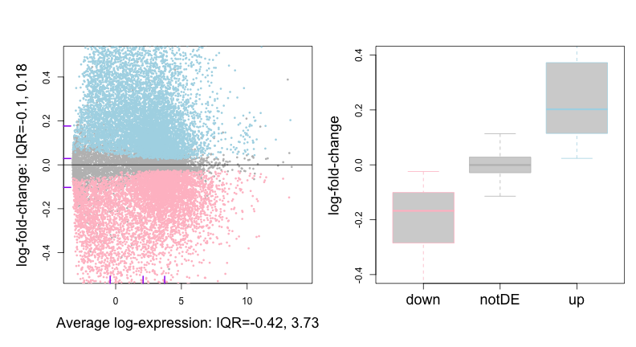
<p class="caption">(\#fig:brcaRna-preproc-mdPlotEfit)LumA vs Other - Genes Identified at FDR = 0,05</p>
</div>

```r
#SKIP - DONT HAVE ACGT 
SKIP <- function() {
# gc vs identification
genes_ndx <- match(rownames(brcaRna_geneExpression_F_efit), brcaRna_genes_annotF$geneSymbol)
if(sum(is.na(genes_ndx))) stop("brcaRna_geneExpression_F_efit/brcaRna_genes_annotF: genes mismatch")
GC_vec <- with(brcaRna_genes_annotF[genes_ndx,],(G+C)/(A+C+G+T))


boxplot(split(
 GC_vec,
 brcaRna_geneExpression_F_efit_dt[,'LumAvsOther']),
 outline=F,
 border=c("pink", "grey", "lightblue"), xaxt='n',
 ylab='gene-gc', cex.lab=1.5
)
axis(side=1, at=1:3, c('down', 'notDE', 'up'), cex.axis=1.5)

 #mtext(side=3, outer=T, cex=1.25, "Genes identified at adjusted p-value=0.05")
}#SKIP
```


```r
###  CLEAR CACHE

brcaRna_geneExpression_F_logFC_sum <- sapply(
 split(
 brcaRna_geneExpression_F_efit$coefficients[, 'LumAvsOther'],
 brcaRna_geneExpression_F_efit_dt[,'LumAvsOther']),
 quantile, prob = (1:3) / 4)

colnames(brcaRna_geneExpression_F_logFC_sum) <- as.character(factor(
 colnames(brcaRna_geneExpression_F_logFC_sum), 
 levels=c("-1", "0", "1"),
 labels=c('down', 'notDE', 'up')
))


knitr::kable(brcaRna_geneExpression_F_logFC_sum,
  digits = 2,
  caption = "log FC quartiles by gene identification") %>%
  kableExtra::kable_styling(full_width = F)
```

<table class="table" style="width: auto !important; margin-left: auto; margin-right: auto;">
<caption>(\#tab:brcaRna-preproc-quantlogFC)log FC quartiles by gene identification</caption>
 <thead>
  <tr>
   <th style="text-align:left;">   </th>
   <th style="text-align:right;"> down </th>
   <th style="text-align:right;"> notDE </th>
   <th style="text-align:right;"> up </th>
  </tr>
 </thead>
<tbody>
  <tr>
   <td style="text-align:left;"> 25% </td>
   <td style="text-align:right;"> -0.28 </td>
   <td style="text-align:right;"> -0.03 </td>
   <td style="text-align:right;"> 0.11 </td>
  </tr>
  <tr>
   <td style="text-align:left;"> 50% </td>
   <td style="text-align:right;"> -0.17 </td>
   <td style="text-align:right;"> 0.00 </td>
   <td style="text-align:right;"> 0.20 </td>
  </tr>
  <tr>
   <td style="text-align:left;"> 75% </td>
   <td style="text-align:right;"> -0.10 </td>
   <td style="text-align:right;"> 0.03 </td>
   <td style="text-align:right;"> 0.37 </td>
  </tr>
</tbody>
</table>


Many genes are identified, and the effect sizes are substantial
in comparison to the 5hmc data - compare tables
\@ref(tab:preprocBrCa-quantlogFC) and 
\@ref(tab:quantlogFC).
This will result in a higher signal-to-noise ratio context.   See 
Section \@ref(breast-rnaseq-snr-regime).

<!-- 5hmc comments
The log-fold-change distribution for up-represented genes is long-tailed,
with many high log fold-change values.
By contrast, log-fold-change distribution for down-represented genes
closer to symmetric and has few genes with low log fold-change values.
We will see how this affects the results of identifying genes with
an effect size requirement.

The GC content of down regulated genes tends to be slightly lower than the
rest of the genes.  A statistical test would find that the difference
between the mean of the down regulated gene population is singificantly different
than the mean of the other gene population even though the difference is
quite small
(TICKr round( 
mean(GC_vec[brcaRna_geneExpression_F_efit_dt[,'LumAvsOther']=='-1']) -
mean(GC_vec[brcaRna_geneExpression_F_efit_dt[,'LumAvsOther']!='-1']),
3)TICK

These asymmetries are minor, but it would still be good to establish that
they relfect biology rather than processing artifacts.  
-->

### DE genes at 10% fold change {-}

For a stricter definition on significance, one may require log-fold-changes 
(log-FCs) to be above a minimum value. The treat method 
(McCarthy and Smyth 2009 [@McCarthy:2009aa]) can be used to calculate p-values 
from empirical Bayes moderated t-statistics with a minimum log-FC requirement. 
The number of differentially expressed genes are greatly reduced if we 
impose a minimal fold-change requirement of 10%.


```r
###  CLEAR CACHE

brcaRna_geneExpression_F_tfit <- limma::treat(brcaRna_geneExpression_F_fit, lfc=log2(1.10))
brcaRna_geneExpression_F_tfit_dt <- limma::decideTests(brcaRna_geneExpression_F_tfit)

cat("10% FC Gene Identification Summary - voom, adjust.method = BH, p.value = 0.05:\n")
```

```
## 10% FC Gene Identification Summary - voom, adjust.method = BH, p.value = 0.05:
```

```r
summary(brcaRna_geneExpression_F_tfit_dt)
```

```
##        LumAvsOther
## Down          2569
## NotSig       12519
## Up            4318
```

```r
# log-fold-change vs ave-expr
limma::plotMD(brcaRna_geneExpression_F_efit,
 ylim = c(-0.6, 0.6),
 column='LumAvsOther',
 status=brcaRna_geneExpression_F_tfit_dt[,'LumAvsOther'],
 hl.pch = 16, hl.col = c("blue", "red"), hl.cex = .7,
 bg.pch = 16, bg.col = "grey", bg.cex = 0.5,
 main = '',
 xlab = paste0(
    "Average log-expression: IQR=",
    paste(round(quantile(brcaRna_geneExpression_F_efit$Amean, prob = c(1, 3) / 4), 2),
      collapse = ", "
    )
  ),
  ylab = paste0(
    "log-fold-change: IQR=",
    paste(round(quantile(brcaRna_geneExpression_F_efit$coefficients[, 'LumAvsOther'], prob = c(1, 3) / 4), 2),
      collapse = ", "
    )
  ),
  legend = F
)
abline(h = 0, col = "black")
rug(quantile(brcaRna_geneExpression_F_efit$coefficients[, 'LumAvsOther'], prob = c(1, 2, 3) / 4),
  col = "purple",
  ticksize = .03, side = 2, lwd = 2
)
rug(quantile(brcaRna_geneExpression_F_efit$Amean, prob = c(1, 2, 3) / 4),
  col = "purple",
  ticksize = .03, side = 1, lwd = 2
)
```

<div class="figure">

<p class="caption">(\#fig:brcaRna-preproc-mdPlotTfit)LumA vs Other - Identified Genes at FDR = 0,05 and logFC > 10%</p>
</div>

<!-- 5hmc comment - does not apply to this RNA-Seq dataset
As noted above, the log-fold-change distribution for the up-represented genes
is long-tailes in  comparison to log-fold-change distribution for the down-represented genes.
As a result fewer down-represented than up-regulated genes are identified when a 
minimum log-FC requirement is imposed.
-->

## Signal-to-noise ratio regime {#breast-rnaseq-snr-regime}

In Hastie et al. (2017) [@Hastie:2017aa]) results from `lasso` fits are
compared with `best subset` and `forward selection` fits and it is argued
that while `best subset` is optimal for high signal-to-noise regimes, 
the lasso gains some competitive advantage when the prevailing signal-to-noise
ratio of the dataset is lowered.  

<!-- DNA ???
We can extract sigma and signal from the fit objects to get SNR values for each gene
to see in what SNR regime the 5hmC gene body data are.

-->
 


<!-- DEBUG BCV from Section \@ref(analysis-of-coverage-variability) vs CV
pairs(cbind(BCV_mtx, CV)) 
boxplot(cbind(BCV_mtx, CV), outline=F) 
-->


```r
###  CLEAR CACHE

Effect <- abs(brcaRna_geneExpression_F_efit$coefficients[,'LumAvsOther'])
Noise <- brcaRna_geneExpression_F_efit$sigma
SNR <- Effect/Noise

plot(spatstat::CDF(density(SNR)),
  col = 1, lwd = 2, ylab = "Prob(SNR<x)",
  xlim = c(0, 1.5)
)

SNR_quant <- quantile(SNR, prob=c((1:3)/4,.9))
rug(SNR_quant,
    lwd = 2, ticksize = 0.05, col = 1
  )
```

<div class="figure">

<p class="caption">(\#fig:brcaRna-preproc-plotSNR)Cumulative Distribution of SNR - rug = 25, 50, 75 and 90th percentile</p>
</div>

```r
knitr::kable(t(SNR_quant),
  digits = 3,
  caption = paste(
    "SNR Quantiles") 
) %>% kableExtra::kable_styling(full_width = F)
```

<table class="table" style="width: auto !important; margin-left: auto; margin-right: auto;">
<caption>(\#tab:brcaRna-preproc-plotSNR)SNR Quantiles</caption>
 <thead>
  <tr>
   <th style="text-align:right;"> 25% </th>
   <th style="text-align:right;"> 50% </th>
   <th style="text-align:right;"> 75% </th>
   <th style="text-align:right;"> 90% </th>
  </tr>
 </thead>
<tbody>
  <tr>
   <td style="text-align:right;"> 0.094 </td>
   <td style="text-align:right;"> 0.217 </td>
   <td style="text-align:right;"> 0.384 </td>
   <td style="text-align:right;"> 0.56 </td>
  </tr>
</tbody>
</table>

<!--
These SNR values are in the range where the lasso and relaxed lasso gain some advantage over
best subset and forward selection fits (see  Hastie et al. (2017) [@Hastie:2017aa]).
-->

<!--chapter:end:06-preprocBrCaRNASeq.Rmd-->

# BrCa RNA-Seq: Exploring Sparsity {#brca-rnaseseq-explore-sparsity}

In this section we explore various models fitted to 
the Breast Cancer RNA-Seq data set explored in Section \@ref(brca-rnaseq-preproc).
We focus our analyses on lasso fits which tend to favor sparse models.


## Cross-validation analysis setup 

We use the same CV set-up as was used with the HCC 5hmC-Seq data set
(Section \@ref(hcc-5hmcseq-explore-sparsity)).


```r
K_FOLD <- 10
trainP <- 0.8
```

<!-- NOT CURRENTLY USED 
EPS <- 0.05    # Have no idea what "small" epsilon means
-->


First we divide the analysis dataset into `train` and `test` in a $4$:1 ratio.  


```r
### CLEAR CACHE

set.seed(1)
brcaRna_train_sampID_vec <- with(brcaRna_sampDesc,
brcaRna_sampDesc$sampID[caret::createDataPartition(y=group, p=trainP, list=F)]
)

brcaRna_test_sampID_vec <- with(brcaRna_sampDesc,
setdiff(sampID, brcaRna_train_sampID_vec)
)

brcaRna_train_group_vec <- factor(brcaRna_sampDesc[brcaRna_train_sampID_vec, 'group'],
levels=c('Other', 'LumA'))
names(brcaRna_train_group_vec) <- brcaRna_sampDesc[brcaRna_train_sampID_vec, 'sampID']

brcaRna_test_group_vec <- factor(brcaRna_sampDesc[brcaRna_test_sampID_vec, 'group'],
levels=c('Other', 'LumA'))
names(brcaRna_test_group_vec) <- brcaRna_sampDesc[brcaRna_test_sampID_vec, 'sampID']

knitr::kable(table(brcaRna_train_group_vec),
  caption="Train set") %>%
   kableExtra::kable_styling(full_width = F)
```

<table class="table" style="width: auto !important; margin-left: auto; margin-right: auto;">
<caption>(\#tab:brcaRna-glmnetFit-getTrainVal)Train set</caption>
 <thead>
  <tr>
   <th style="text-align:left;"> brcaRna_train_group_vec </th>
   <th style="text-align:right;"> Freq </th>
  </tr>
 </thead>
<tbody>
  <tr>
   <td style="text-align:left;"> Other </td>
   <td style="text-align:right;"> 747 </td>
  </tr>
  <tr>
   <td style="text-align:left;"> LumA </td>
   <td style="text-align:right;"> 1194 </td>
  </tr>
</tbody>
</table>

```r
knitr::kable(table(brcaRna_test_group_vec),
  caption="Test set") %>%
   kableExtra::kable_styling(full_width = F)
```

<table class="table" style="width: auto !important; margin-left: auto; margin-right: auto;">
<caption>(\#tab:brcaRna-glmnetFit-getTrainVal)Test set</caption>
 <thead>
  <tr>
   <th style="text-align:left;"> brcaRna_test_group_vec </th>
   <th style="text-align:right;"> Freq </th>
  </tr>
 </thead>
<tbody>
  <tr>
   <td style="text-align:left;"> Other </td>
   <td style="text-align:right;"> 186 </td>
  </tr>
  <tr>
   <td style="text-align:left;"> LumA </td>
   <td style="text-align:right;"> 298 </td>
  </tr>
</tbody>
</table>

```r
brcaRna_train_geneExpr_mtx <- t(brcaRna_geneExpression_F[,brcaRna_train_sampID_vec])
brcaRna_test_geneExpr_mtx <- t(brcaRna_geneExpression_F[,brcaRna_test_sampID_vec])
```


We explore some glmnet fits and the "bet on sparsity".
We consider three models, specified by the value of the
**alpha** parameter in the elastic net parametrization:  
    - lasso: $\alpha = 1.0$ - sparse models  
    - ridge $\alpha = 0$ - shrunken coefficients models  
    - elastic net:  $\alpha = 0.5$  - semi sparse model  
<!-- - lassoC: $\alpha = 1-\epsilon =$ $TICKr 1- EPSTICK - lasso for correlated predictors  -->

In this analysis, we will only evaluate models in terms of 
model sparsity, stability and performance.  We leave the question
of significance testing of hypotheses about model parameters
completely out.  See Lockhart et al. (2014) [@Lockhart:2014aa]
and Wassermam (2014) [@Wasserman:2014aa] for a discussion of this topic.

In this section we look at the relative performance and sparsity of the models
considered.  The effect of the size of the sample set on the level and 
stability of performance will be investigated in the next section.


***

First we create folds for $10$-fold cross-validation of models fitted to
training data.  We'll use caret::createFolds to assign samples
to folds while keeping the outcome ratios constant across folds.


```r
# This is too variable, both in terms of fold size And composition
#foldid_vec <- sample(1:10, size=length(brcaRna_train_group_vec), replace=T)
### CLEAR CACHE

set.seed(1)
brcaRna_train_foldid_vec <- caret::createFolds(
 factor(brcaRna_train_group_vec), 
 k=K_FOLD,
 list=F)

# brcaRna_train_foldid_vec contains the left-out IDs 
# the rest are kept
fold_out_tbl <- sapply(split(brcaRna_train_group_vec, brcaRna_train_foldid_vec),
  table)
rownames(fold_out_tbl) <- paste(rownames(fold_out_tbl), '- Out') 

fold_in_tbl <- do.call('cbind', lapply(sort(unique(brcaRna_train_foldid_vec)),
  function(FOLD) table(brcaRna_train_group_vec[brcaRna_train_foldid_vec != FOLD])))
rownames(fold_in_tbl) <- paste(rownames(fold_in_tbl), '- In') 
colnames(fold_in_tbl) <- as.character(sort(unique(brcaRna_train_foldid_vec)))


knitr::kable(rbind(fold_in_tbl, fold_out_tbl[,colnames(fold_in_tbl)]),
  caption="training samples fold composition") %>%
   kableExtra::kable_styling(full_width = F)
```

<table class="table" style="width: auto !important; margin-left: auto; margin-right: auto;">
<caption>(\#tab:brcaRna-glmnetFit-getTrainFolds)training samples fold composition</caption>
 <thead>
  <tr>
   <th style="text-align:left;">   </th>
   <th style="text-align:right;"> 1 </th>
   <th style="text-align:right;"> 2 </th>
   <th style="text-align:right;"> 3 </th>
   <th style="text-align:right;"> 4 </th>
   <th style="text-align:right;"> 5 </th>
   <th style="text-align:right;"> 6 </th>
   <th style="text-align:right;"> 7 </th>
   <th style="text-align:right;"> 8 </th>
   <th style="text-align:right;"> 9 </th>
   <th style="text-align:right;"> 10 </th>
  </tr>
 </thead>
<tbody>
  <tr>
   <td style="text-align:left;"> Other - In </td>
   <td style="text-align:right;"> 673 </td>
   <td style="text-align:right;"> 673 </td>
   <td style="text-align:right;"> 672 </td>
   <td style="text-align:right;"> 672 </td>
   <td style="text-align:right;"> 672 </td>
   <td style="text-align:right;"> 672 </td>
   <td style="text-align:right;"> 672 </td>
   <td style="text-align:right;"> 672 </td>
   <td style="text-align:right;"> 673 </td>
   <td style="text-align:right;"> 672 </td>
  </tr>
  <tr>
   <td style="text-align:left;"> LumA - In </td>
   <td style="text-align:right;"> 1074 </td>
   <td style="text-align:right;"> 1075 </td>
   <td style="text-align:right;"> 1075 </td>
   <td style="text-align:right;"> 1074 </td>
   <td style="text-align:right;"> 1075 </td>
   <td style="text-align:right;"> 1075 </td>
   <td style="text-align:right;"> 1074 </td>
   <td style="text-align:right;"> 1075 </td>
   <td style="text-align:right;"> 1074 </td>
   <td style="text-align:right;"> 1075 </td>
  </tr>
  <tr>
   <td style="text-align:left;"> Other - Out </td>
   <td style="text-align:right;"> 74 </td>
   <td style="text-align:right;"> 74 </td>
   <td style="text-align:right;"> 75 </td>
   <td style="text-align:right;"> 75 </td>
   <td style="text-align:right;"> 75 </td>
   <td style="text-align:right;"> 75 </td>
   <td style="text-align:right;"> 75 </td>
   <td style="text-align:right;"> 75 </td>
   <td style="text-align:right;"> 74 </td>
   <td style="text-align:right;"> 75 </td>
  </tr>
  <tr>
   <td style="text-align:left;"> LumA - Out </td>
   <td style="text-align:right;"> 120 </td>
   <td style="text-align:right;"> 119 </td>
   <td style="text-align:right;"> 119 </td>
   <td style="text-align:right;"> 120 </td>
   <td style="text-align:right;"> 119 </td>
   <td style="text-align:right;"> 119 </td>
   <td style="text-align:right;"> 120 </td>
   <td style="text-align:right;"> 119 </td>
   <td style="text-align:right;"> 120 </td>
   <td style="text-align:right;"> 119 </td>
  </tr>
</tbody>
</table>

Note that the folds identify samples that are left-out of the training
data for each fold fit.


## Fit and compare models 


```r
### CLEAR CACHE

start_time <-  proc.time()

brcaRna_cv_lasso <- glmnet::cv.glmnet(
 x=brcaRna_train_geneExpr_mtx,
 y=brcaRna_train_group_vec,
 foldid=brcaRna_train_foldid_vec,
 alpha=1,
 family='binomial', 
 type.measure = "class",
 keep=T,
 nlambda=30
)

message("lasso time: ", round((proc.time() - start_time)[3],2),"s")
```

```
## lasso time: 31.48s
```


```r
### CLEAR CACHE

start_time <-  proc.time()

brcaRna_cv_ridge <- glmnet::cv.glmnet(
 x=brcaRna_train_geneExpr_mtx,
 y=brcaRna_train_group_vec,
 foldid=brcaRna_train_foldid_vec,
 alpha=0,
 family='binomial', 
 type.measure = "class",
 keep=T,
 nlambda=30
)

message("ridge time: ", round((proc.time() - start_time)[3],2),"s")
```

```
## ridge time: 258.93s
```


```r
### CLEAR CACHE

start_time <-  proc.time()

brcaRna_cv_enet <- glmnet::cv.glmnet(
 x=brcaRna_train_geneExpr_mtx,
 y=brcaRna_train_group_vec,
 foldid=brcaRna_train_foldid_vec,
 alpha=0.5,
 family='binomial',
 type.measure = "class",
 keep=T,
 nlambda=30
)

message("enet time: ", round((proc.time() - start_time)[3],2),"s")
```

```
## enet time: 32.59s
```


<!--
The ridge regression model takes over 10 times longer to compute.
-->

<!-- do not show
Define plotting function.
Maybe show in appendix??
-->


```r
### CLEAR CACHE

plot_cv_f <- function(cv_fit, Nzero=T, ...) {
 
 suppressPackageStartupMessages(require(glmnet))

 # No nonger used
 #lambda.1se_p <- cv_fit$nzero[cv_fit$lambda == cv_fit$lambda.1se]
 #lambda.min_p <- cv_fit$nzero[cv_fit$lambda == cv_fit$lambda.min]
 
 # Get oof error - cv errors produced by extraction method ARE oof!!!
 ndx_1se <- match(cv_fit$lambda.1se,cv_fit$lambda)
 train_oofPred_1se_vec <- ifelse(
  logistic_f(cv_fit$fit.preval[,ndx_1se]) > 0.5, 'LumA', '_Other')
 train_oofPred_1se_error <- mean(train_oofPred_1se_vec != brcaRna_train_group_vec)

 ndx_min <- match(cv_fit$lambda.min,cv_fit$lambda)
 train_oofPred_min_vec <- ifelse(
  logistic_f(cv_fit$fit.preval[,ndx_min]) > 0.5, 'LumA', '_Other')
 train_oofPred_min_error <- mean(train_oofPred_min_vec != brcaRna_train_group_vec)

 # Get test set error
 test_pred_1se_vec <- predict(
  cv_fit, 
  newx=brcaRna_test_geneExpr_mtx, 
  s="lambda.1se",
  type="class"
 )
 test_pred_1se_error <- mean(test_pred_1se_vec != brcaRna_test_group_vec)
 
 test_pred_min_vec <- predict(
  cv_fit, 
  newx=brcaRna_test_geneExpr_mtx, 
  s="lambda.min",
  type="class"
 )
 test_pred_min_error <- mean(test_pred_min_vec != brcaRna_test_group_vec)
 
  
 plot(
  log(cv_fit$lambda),
  cv_fit$cvm,
  pch=16,col="red",
  xlab='',ylab='',
  ...
 )
 abline(v=log(c(cv_fit$lambda.1se, cv_fit$lambda.min)))
 if(Nzero)
 axis(side=3, tick=F, at=log(cv_fit$lambda), 
  labels=cv_fit$nzero, line = -1
 )
 LL <- 2
 #mtext(side=1, outer=F, line = LL, "log(Lambda)")
 #LL <- LL+1
 mtext(side=1, outer=F, line = LL, paste(
  #ifelse(Nzero, paste("1se p =", lambda.1se_p),''),
  "1se: train =", round(100*cv_fit$cvm[cv_fit$lambda == cv_fit$lambda.1se], 1),
  ##"oof =", round(100*train_oofPred_1se_error, 1), ### REDUNDANT
  "test =", round(100*test_pred_1se_error, 1)
 ))
 LL <- LL+1
 mtext(side=1, outer=F, line = LL, paste(
  #ifelse(Nzero, paste("min p =", lambda.min_p),''),
  "min: train =", round(100*cv_fit$cvm[cv_fit$lambda == cv_fit$lambda.min], 1),
  ##"oof =", round(100*train_oofPred_min_error, 1),  ### REDUNDANT
  "test =", round(100*test_pred_min_error, 1)
 ))
 
 tmp <-
 cbind(
  error_1se = c(
   p = cv_fit$nzero[cv_fit$lambda == cv_fit$lambda.1se],
   train  = 100*cv_fit$cvm[cv_fit$lambda == cv_fit$lambda.1se],
   #train_oof = 100*train_oofPred_1se_error,  ### REDUNANT
   test = 100*test_pred_1se_error),
  error_min = c(
   p = cv_fit$nzero[cv_fit$lambda == cv_fit$lambda.min],
   train  = 100*cv_fit$cvm[cv_fit$lambda == cv_fit$lambda.min],
   #train_oof = 100*train_oofPred_min_error, ### REDUNDSANT
   test = 100*test_pred_min_error)
  )
  # Need to fix names  
  rownames(tmp) <- c('p', 'train', 'test')
  tmp 
}
```

Examine model performance.


```r
### CLEAR CACHE

 par(mfrow=c(1,3), mar=c(5, 2, 3, 1), oma=c(3,2,0,0)) 

 lasso_errors_mtx <- plot_cv_f(brcaRna_cv_lasso, ylim=c(0,.5))
 title('lasso')

 rifge_errors_mtx <- plot_cv_f(brcaRna_cv_ridge, Nzero=F, ylim=c(0,.5))
 title('ridge')

 enet_errors_mtx <-  plot_cv_f(brcaRna_cv_enet, ylim=c(0,.5))
 title('enet')

 mtext(side=1, outer=T, cex=1.25, 'log(Lambda)')
 mtext(side=2, outer=T, cex=1.25, brcaRna_cv_lasso$name)
```

<div class="figure">

<p class="caption">(\#fig:brcaRna-glmnetFit-lookFits)compare fits</p>
</div>


```r
### CLEAR CACHE


errors_frm <- data.frame(
  lasso = lasso_errors_mtx, ridge = rifge_errors_mtx, enet = enet_errors_mtx
)
colnames(errors_frm) <- sub('\\.error','', colnames(errors_frm))

knitr::kable(t(errors_frm),
 caption = 'Misclassifiaction error rates',
 digits=1) %>% 
  kableExtra::kable_styling(full_width = F)
```

<table class="table" style="width: auto !important; margin-left: auto; margin-right: auto;">
<caption>(\#tab:brcaRna-glmnetFit-printErrors)Misclassifiaction error rates</caption>
 <thead>
  <tr>
   <th style="text-align:left;">   </th>
   <th style="text-align:right;"> p </th>
   <th style="text-align:right;"> train </th>
   <th style="text-align:right;"> test </th>
  </tr>
 </thead>
<tbody>
  <tr>
   <td style="text-align:left;"> lasso_1se </td>
   <td style="text-align:right;"> 168 </td>
   <td style="text-align:right;"> 11.9 </td>
   <td style="text-align:right;"> 9.9 </td>
  </tr>
  <tr>
   <td style="text-align:left;"> lasso_min </td>
   <td style="text-align:right;"> 408 </td>
   <td style="text-align:right;"> 11.4 </td>
   <td style="text-align:right;"> 12.8 </td>
  </tr>
  <tr>
   <td style="text-align:left;"> ridge_1se </td>
   <td style="text-align:right;"> 19406 </td>
   <td style="text-align:right;"> 13.0 </td>
   <td style="text-align:right;"> 13.0 </td>
  </tr>
  <tr>
   <td style="text-align:left;"> ridge_min </td>
   <td style="text-align:right;"> 19406 </td>
   <td style="text-align:right;"> 12.6 </td>
   <td style="text-align:right;"> 12.4 </td>
  </tr>
  <tr>
   <td style="text-align:left;"> enet_1se </td>
   <td style="text-align:right;"> 315 </td>
   <td style="text-align:right;"> 11.6 </td>
   <td style="text-align:right;"> 11.2 </td>
  </tr>
  <tr>
   <td style="text-align:left;"> enet_min </td>
   <td style="text-align:right;"> 671 </td>
   <td style="text-align:right;"> 11.1 </td>
   <td style="text-align:right;"> 13.4 </td>
  </tr>
</tbody>
</table>

<br/>

* lasso and enet, 1se and min lambda, have comparable performance
on the training data.    

* The lasso 1se model gains performance in the test data, but
lasso min lambda and enet models stay at the same level or drop
in performance on the test set.  

* lasso 1se is most parsimonious by a factor of 2.


## The relaxed lasso and blended mix models

Next we look at the so-called `relaxed lasso` model, and 
the `blended mix` which is an optimized shrinkage
between the relaxed lasso and the regular lasso.
See \@ref(eq:blended) in Section \@ref(modeling-background).  


<!--
The relaxed fit takes quite a bit longer.  
-->


```r
### CLEAR CACHE

library(glmnet)

brcaRna_cv_lassoR_sum <- print(brcaRna_cv_lassoR)
```

```
## 
## Call:  glmnet::cv.glmnet(x = brcaRna_train_geneExpr_mtx, y = brcaRna_train_group_vec,      type.measure = "class", foldid = brcaRna_train_foldid_vec,      keep = T, relax = T, alpha = 1, family = "binomial", nlambda = 30) 
## 
## Measure: Misclassification Error 
## 
##     Gamma   Lambda Measure       SE Nonzero
## min  1.00 0.005227  0.1139 0.006167     408
## 1se  0.75 0.021823  0.1180 0.008812      91
```

```r
plot(brcaRna_cv_lassoR)
```

<div class="figure">
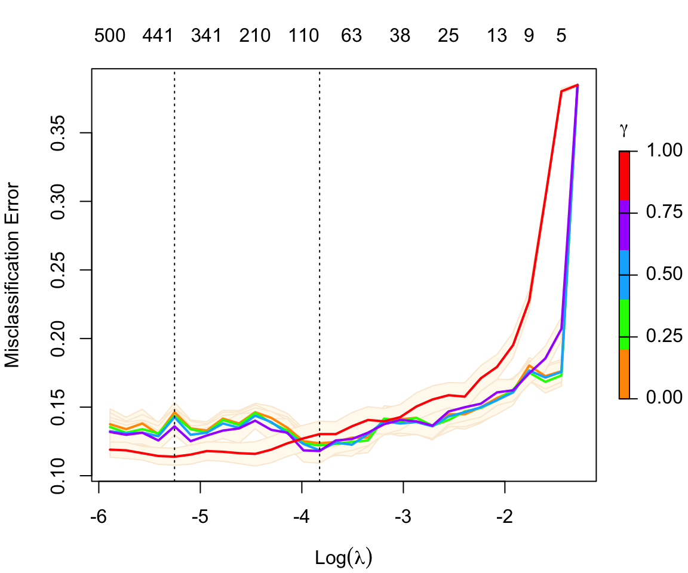
<p class="caption">(\#fig:brcaRna-glmnetFit-lookLassoR)Relaxed lasso fit</p>
</div>


```r
### CLEAR CACHE
# only report  1se
ndx_1se <- match(brcaRna_cv_lassoR$lambda.1se, brcaRna_cv_lassoR$lambda)
ndx_min <- match(brcaRna_cv_lassoR$lambda.min, brcaRna_cv_lassoR$lambda)

# only show 1se anyway
# if(ndx_1se != ndx_min) stop("lambda.1se != lambda.min")


# train oof data - NOT CLEAR WHY THESE DIFFER FROM CV ERRORS EXTRACTED FROM MODEL
# Get relaxed lasso (gamma=0) oof error
train_oofPred_relaxed_1se_vec <- ifelse(
  logistic_f(brcaRna_cv_lassoR$fit.preval[["g:0"]][, ndx_1se]) > 0.5, "LumA", "Other"
)
train_oofPred_relaxed_1se_error <- mean(train_oofPred_relaxed_1se_vec != brcaRna_train_group_vec)

# blended mix (gamma=0.5)
train_oofPred_blended_1se_vec <- ifelse(
  logistic_f(brcaRna_cv_lassoR$fit.preval[["g:0.5"]][, ndx_1se]) > 0.5, "LumA", "Other"
)
train_oofPred_blended_1se_error <- mean(train_oofPred_blended_1se_vec != brcaRna_train_group_vec)


# Test set error - relaxed
test_pred_relaxed_1se_vec <- predict(
  brcaRna_cv_lassoR,
  newx = brcaRna_test_geneExpr_mtx,
  s = "lambda.1se",
  type = "class",
  gamma = 0
)
test_pred_relaxed_1se_error <- mean(test_pred_relaxed_1se_vec != brcaRna_test_group_vec)

# Test set error - blended
test_pred_blended_1se_vec <- predict(
  brcaRna_cv_lassoR,
  newx = brcaRna_test_geneExpr_mtx,
  s = "lambda.1se",
  type = "class",
  gamma = 0.5
)
test_pred_blended_1se_error <- mean(test_pred_blended_1se_vec != brcaRna_test_group_vec)


brcaRna_cv_lassoR_1se_error <- brcaRna_cv_lassoR$cvm[brcaRna_cv_lassoR$lambda==brcaRna_cv_lassoR$lambda.min]

cv_blended_statlist <- brcaRna_cv_lassoR$relaxed$statlist[['g:0.5']]
cv_blended_1se_error <- cv_blended_statlist$cvm[cv_blended_statlist$lambda==
   brcaRna_cv_lassoR$relaxed$lambda.1se]
 


knitr::kable(t(data.frame(
  train_relaxed  = brcaRna_cv_lassoR_1se_error,
  train_blended  = cv_blended_1se_error,
  #train_relaxed_oof = train_oofPred_relaxed_1se_error,
  #train_blended_oof = train_oofPred_blended_1se_error,
  test_relaxed  = test_pred_relaxed_1se_error,
  test_blended  = test_pred_blended_1se_error
)) * 100,
digits = 1,
caption = "Relaxed lasso and blended mix error rates"
) %>%
  kableExtra::kable_styling(full_width = F)
```

<table class="table" style="width: auto !important; margin-left: auto; margin-right: auto;">
<caption>(\#tab:brcaRna-glmnetFit-lookLassoR2)Relaxed lasso and blended mix error rates</caption>
<tbody>
  <tr>
   <td style="text-align:left;"> train_relaxed </td>
   <td style="text-align:right;"> 11.4 </td>
  </tr>
  <tr>
   <td style="text-align:left;"> train_blended </td>
   <td style="text-align:right;"> 11.8 </td>
  </tr>
  <tr>
   <td style="text-align:left;"> test_relaxed </td>
   <td style="text-align:right;"> 11.4 </td>
  </tr>
  <tr>
   <td style="text-align:left;"> test_blended </td>
   <td style="text-align:right;"> 10.3 </td>
  </tr>
</tbody>
</table>

<br/>

The relaxed lasso and blended mix error rates are comparable to the
regular lasso fit error rate.  We see here too that the reported cv 
error rates are comparable to test set error rates.

<!-- , while out-of-fold error rates
continue to be good indicators of unseen data error rates, as captured
by the test set.  
-->

The *1se* lambda rule applied to the relaxed lasso fit selected a model with 
$168$ features,
while for the blended mix model 
(See \@ref(eq:blended) in Section \@ref(modeling-background))
the *1se* lambda rule selected
$91$ features (vertical 
dotted reference line in Figure \@ref(fig:lookLassoR)).
This feature is pointed out in the 
[glmnet 3.0 vignette](https://cran.r-project.org/web/packages/glmnet/vignettes/relax.pdf):
*The debiasing will potentially improve prediction performance,
and CV will typically select a model with a smaller number of variables.*


## Examination of sensitivity vs specificity

In the results above we reported error rates without inspecting the 
sensitivity versus specificity trade-off.  ROC curves can be examined
to get a sense of the trade-off.

### Training data out-of-fold ROC curves


```r
### CLEAR CACHE
### CLEAR CACHE

# train
# lasso
ndx_1se <- match(brcaRna_cv_lasso$lambda.1se,brcaRna_cv_lasso$lambda)
train_lasso_oofProb_vec <- logistic_f(brcaRna_cv_lasso$fit.preval[,ndx_1se])
train_lasso_roc <- pROC::roc(
 response = as.numeric(brcaRna_train_group_vec=='LumA'),
 predictor = train_lasso_oofProb_vec)
```

```
## Setting levels: control = 0, case = 1
```

```
## Setting direction: controls < cases
```

```r
# enet
ndx_1se <- match(brcaRna_cv_enet$lambda.1se,brcaRna_cv_enet$lambda)
train_enet_oofProb_vec <- logistic_f(brcaRna_cv_enet$fit.preval[,ndx_1se])
train_enet_roc <- pROC::roc(
 response = as.numeric(brcaRna_train_group_vec=='LumA'),
 predictor = train_enet_oofProb_vec)
```

```
## Setting levels: control = 0, case = 1
## Setting direction: controls < cases
```

```r
# lasso - relaxed
ndx_1se <- match(brcaRna_cv_lassoR$lambda.1se,brcaRna_cv_lassoR$lambda)
train_relaxed_oofProb_vec <- logistic_f(brcaRna_cv_lassoR$fit.preval[['g:0']][,ndx_1se])
train_relaxed_roc <- pROC::roc(
 response = as.numeric(brcaRna_train_group_vec=='LumA'),
 predictor = train_relaxed_oofProb_vec)
```

```
## Setting levels: control = 0, case = 1
## Setting direction: controls < cases
```

```r
# blended mix (gamma=0.5)
ndx_1se <- match(brcaRna_cv_lassoR$lambda.1se,brcaRna_cv_lassoR$lambda)
train_blended_oofProb_vec <- logistic_f(brcaRna_cv_lassoR$fit.preval[['g:0.5']][,ndx_1se])
train_blended_roc <- pROC::roc(
 response = as.numeric(brcaRna_train_group_vec=='LumA'),
 predictor = train_blended_oofProb_vec)
```

```
## Setting levels: control = 0, case = 1
## Setting direction: controls < cases
```

```r
plot(train_lasso_roc, col = col_vec[1])
lines(train_enet_roc, col = col_vec[2])
lines(train_relaxed_roc, col = col_vec[3])
lines(train_blended_roc, col = col_vec[4])

legend('bottomright', title='AUC',
 legend=c(
  paste('lasso =', round(train_lasso_roc[['auc']],3)),
  paste('enet =', round(train_enet_roc[['auc']],3)),
  paste('relaxed =', round(train_relaxed_roc[['auc']],3)),
  paste('blended =', round(train_blended_roc[['auc']],3))
 ),
 text.col = col_vec[1:4],
 bty='n'
)
```

<div class="figure">

<p class="caption">(\#fig:brcaRna-glmnetFit-trainROC)Train data out-of-sample ROCs</p>
</div>

Compare thresholds for 90% Specificity:


```r
### CLEAR CACHE

 lasso_ndx <- with(as.data.frame(pROC::coords(train_lasso_roc, transpose=F)), 
   min(which(specificity >= 0.9)))

 enet_ndx <- with(as.data.frame(pROC::coords(train_enet_roc, transpose=F)), 
   min(which(specificity >= 0.9)))

 lassoR_ndx <- with(as.data.frame(pROC::coords(train_relaxed_roc, transpose=F)), 
   min(which(specificity >= 0.9)))

 blended_ndx <- with(as.data.frame(pROC::coords(train_blended_roc, transpose=F)), 
   min(which(specificity >= 0.9)))

  spec90_frm <- data.frame(rbind(
  lasso=as.data.frame(pROC::coords(train_lasso_roc, transpose=F))[lasso_ndx,],
  enet=as.data.frame(pROC::coords(train_enet_roc, transpose=F))[enet_ndx,],
  relaxed=as.data.frame(pROC::coords(train_relaxed_roc, transpose=F))[lassoR_ndx,],
  blended=as.data.frame(pROC::coords(train_blended_roc, transpose=F))[blended_ndx,]
 ))


knitr::kable(spec90_frm,
  digits=3,
  caption="Specificity = .90 Coordinates"
) %>%
  kableExtra::kable_styling(full_width = F)
```

<table class="table" style="width: auto !important; margin-left: auto; margin-right: auto;">
<caption>(\#tab:brcaRna-glmnetFit-thresh90)Specificity = .90 Coordinates</caption>
 <thead>
  <tr>
   <th style="text-align:left;">   </th>
   <th style="text-align:right;"> threshold </th>
   <th style="text-align:right;"> specificity </th>
   <th style="text-align:right;"> sensitivity </th>
  </tr>
 </thead>
<tbody>
  <tr>
   <td style="text-align:left;"> lasso </td>
   <td style="text-align:right;"> 0.672 </td>
   <td style="text-align:right;"> 0.901 </td>
   <td style="text-align:right;"> 0.850 </td>
  </tr>
  <tr>
   <td style="text-align:left;"> enet </td>
   <td style="text-align:right;"> 0.661 </td>
   <td style="text-align:right;"> 0.901 </td>
   <td style="text-align:right;"> 0.876 </td>
  </tr>
  <tr>
   <td style="text-align:left;"> relaxed </td>
   <td style="text-align:right;"> 1.000 </td>
   <td style="text-align:right;"> 0.901 </td>
   <td style="text-align:right;"> 0.625 </td>
  </tr>
  <tr>
   <td style="text-align:left;"> blended </td>
   <td style="text-align:right;"> 0.999 </td>
   <td style="text-align:right;"> 0.901 </td>
   <td style="text-align:right;"> 0.659 </td>
  </tr>
</tbody>
</table>

This is strange.


```r
### CLEAR CACHE

par(mfrow = c(2, 2), mar = c(3, 3, 2, 1), oma = c(2, 2, 2, 2))

# lasso
plot(density(train_lasso_oofProb_vec[brcaRna_train_group_vec == "Other"]),
  xlim = c(0, 1), main = "", xlab = "", ylab = "", col = "green"
)
lines(density(train_lasso_oofProb_vec[brcaRna_train_group_vec == "LumA"]),
  col = "red"
)
title("lasso")
legend("topright", legend = c("Other", "LumA"), text.col = c("green", "red"))

# enet
plot(density(train_enet_oofProb_vec[brcaRna_train_group_vec == "Other"]),
  xlim = c(0, 1), main = "", xlab = "", ylab = "", col = "green"
)
lines(density(train_enet_oofProb_vec[brcaRna_train_group_vec == "LumA"]),
  col = "red"
)
title("enet")

# lassoR
plot(density(train_relaxed_oofProb_vec[brcaRna_train_group_vec == "Other"]),
  xlim = c(0, 1), main = "", xlab = "", ylab = "", col = "green"
)
lines(density(train_relaxed_oofProb_vec[brcaRna_train_group_vec == "LumA"]),
  col = "red"
)
title("lassoR")

# blended
plot(density(train_blended_oofProb_vec[brcaRna_train_group_vec == "Other"]),
  xlim = c(0, 1), main = "", xlab = "", ylab = "", col = "green"
)
lines(density(train_blended_oofProb_vec[brcaRna_train_group_vec == "LumA"]),
  col = "red"
)
title("blended")

mtext(side = 1, outer = T, "out-of-fold predicted probability", cex = 1.25)
mtext(side = 2, outer = T, "density", cex = 1.25)
```

<div class="figure">

<p class="caption">(\#fig:brcaRna-glmnetFit-trainOOFprops)Train data out-of-fold predicted probabilities</p>
</div>

The relaxed lasso fit results in essentially dichotomized predicted probability
distribution - predicted probabilities are very close to 0 or 1.

 
Look at test data ROC curves.


```r
### CLEAR CACHE
### CLEAR CACHE
# plot all
plot(test_lasso_roc, col = col_vec[1])
lines(test_enet_roc, col = col_vec[2])
lines(test_relaxed_roc, col = col_vec[3])
lines(test_blended_roc, col = col_vec[4])

legend("bottomright",
  title = "AUC",
  legend = c(
    paste("lasso =", round(test_lasso_roc[["auc"]], 3)),
    paste("enet =", round(test_enet_roc[["auc"]], 3)),
    paste("relaxed =", round(test_relaxed_roc[["auc"]], 3)),
    paste("blended =", round(test_blended_roc[["auc"]], 3))
  ),
  text.col = col_vec[1:4],
  bty='n'
)
```

<div class="figure">

<p class="caption">(\#fig:brcaRna-glmnetFit-testROC2)Test data out-of-sample ROCs</p>
</div>

Look at densities of predicted probabilities.


```r
### CLEAR CACHE

par(mfrow = c(2, 2), mar = c(3, 3, 2, 1), oma = c(2, 2, 2, 2))

# lasso
plot(density(test_lasso_predProb_vec[brcaRna_test_group_vec == "Other"]),
  xlim = c(0, 1), main = "", xlab = "", ylab = "", col = "green"
)
lines(density(test_lasso_predProb_vec[brcaRna_test_group_vec == "LumA"]),
  col = "red"
)
title("lasso")
legend("topright", legend = c("Other", "LumA"), text.col = c("green", "red"))

# enet
plot(density(test_enet_predProb_vec[brcaRna_test_group_vec == "Other"]),
  xlim = c(0, 1), main = "", xlab = "", ylab = "", col = "green"
)
lines(density(test_enet_predProb_vec[brcaRna_test_group_vec == "LumA"]),
  col = "red"
)
title("enet")

# relaxed
plot(density(test_relaxed_predProb_vec[brcaRna_test_group_vec == "Other"]),
  xlim = c(0, 1), main = "", xlab = "", ylab = "", col = "green"
)
lines(density(test_relaxed_predProb_vec[brcaRna_test_group_vec == "LumA"]),
  col = "red"
)
title("relaxed")

#sapply(split(test_relaxed_predProb_vec, brcaRna_test_group_vec), summary)


# blended
plot(density(test_blended_predProb_vec[brcaRna_test_group_vec == "Other"]),
  xlim = c(0, 1), main = "", xlab = "", ylab = "", col = "green"
)
lines(density(test_blended_predProb_vec[brcaRna_test_group_vec == "LumA"]),
  col = "red"
)
title("blended")

mtext(side = 1, outer = T, "test set predicted probability", cex = 1.25)
mtext(side = 2, outer = T, "density", cex = 1.25)
```

<div class="figure">
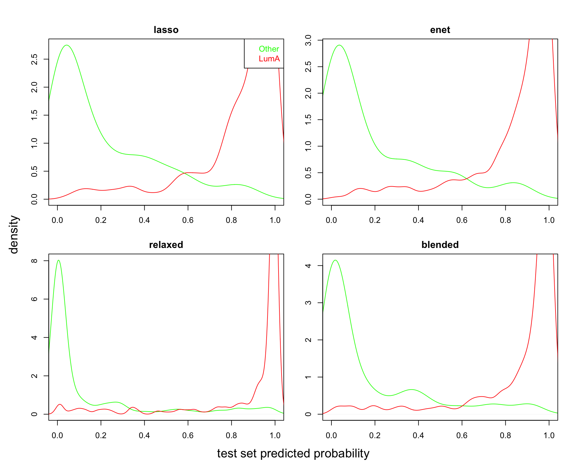
<p class="caption">(\#fig:brcaRna-glmnetFit-testOOFprobs)Test data out-of-fold predicted probabilities</p>
</div>


```r
### CLEAR CACHE

# Define plotting function
bxpPredProb_f <- function(cv_fit, Gamma=NULL) {
  # Train - preval is out-of-fold linear predictor for training design points
  onese_ndx <- match(cv_fit$lambda.1se, cv_fit$lambda)
  if(is.null(Gamma)) 
   train_1se_preval_vec <- cv_fit$fit.preval[, onese_ndx] else
   train_1se_preval_vec <- cv_fit$fit.preval[[Gamma]][, onese_ndx] 

  train_1se_predProb_vec <- logistic_f(train_1se_preval_vec)

  # Test
  test_1se_predProb_vec <- predict(
    cv_fit,
    newx = brcaRna_test_geneExpr_mtx,
    s = "lambda.1se",
    type = "resp"
  )

  tmp <- c(
    train = split(train_1se_predProb_vec, brcaRna_train_group_vec),
    test = split(test_1se_predProb_vec, brcaRna_test_group_vec)
  )
  names(tmp) <- paste0("\n", sub("\\.", "\n", names(tmp)))

  boxplot(tmp)
}

par(mfrow = c(2, 2), mar = c(5, 3, 2, 1), oma = c(2, 2, 2, 2))

bxpPredProb_f(brcaRna_cv_lasso)
title('lasso')

bxpPredProb_f(brcaRna_cv_enet)
title('enet')

bxpPredProb_f(brcaRna_cv_lassoR, Gamma='g:0')
title('relaxed')

bxpPredProb_f(brcaRna_cv_lassoR, Gamma='g:0.5')
title('blended')
```

<div class="figure">

<p class="caption">(\#fig:brcaRna-glmnetFit-fitPrevalByGroup)Predicted Probabilities - Train and Test</p>
</div>

<!--
Another look - plot train and test set logistic curves with annotation.

The following shows that predicted classes come from fitted
probabilities - not out of sample probabilities.

Also shows that threshold is at 0.5 

SKIP
-->


  
<!-- SKIP ALL THIS 
We have seen above that assessments of model performance based on the out-of-fold 
predicted values are close to the test set assessments, and that
assessments based on prediction extracted from glmnet object are optimistic.
Here we look at confusion matrices to see how this affects the
classification results.

Here we use a threshold of 0.5 to dichotomize the predicted
probabilities into a class prediction, as is done in the
glmnet predictions.

-->


<!-- SKIPPED
The out-of-fold error rates are larger for the relaxed lasso and blended fit models.
On the test set, errors are slightly higher for the elastic net model.
-->

## Compare predictions at misclassified samples

It is useful to examine classification errors more carefully.
If models have different failure modes, one might get improved
performance by combining model  predictions.  Note that the models
considered here are not expected to compliment each other usefully
as they are too similar in nature.


```r
### CLEAR CACHE

# NOTE: here we use computred oofClass rather than predClass 
# as predClass extracted from predict() are fitted values.

# train - oof
ndx_1se <- match(brcaRna_cv_lasso$lambda.1se,brcaRna_cv_lasso$lambda)
train_lasso_oofProb_vec <- logistic_f(brcaRna_cv_lasso$fit.preval[,ndx_1se])
train_lasso_oofClass_vec <- ifelse(
   train_lasso_oofProb_vec > 0.5, 'LumA', '_Other')

ndx_1se <- match(brcaRna_cv_enet$lambda.1se,brcaRna_cv_enet$lambda)
train_enet_oofProb_vec <- logistic_f(brcaRna_cv_enet$fit.preval[,ndx_1se])
train_enet_oofClass_vec <- ifelse(
   train_enet_oofProb_vec > 0.5, 'LumA', '_Other')

# RECALL: brcaRna_cv_lassoR$nzero[brcaRna_cv_lassoR$lambda==brcaRna_cv_lassoR$lambda.1se]
# train - oof
ndx_1se <- match(brcaRna_cv_lassoR$lambda.1se,brcaRna_cv_lassoR$lambda)
train_relaxed_oofProb_vec <- logistic_f(brcaRna_cv_lassoR$fit.preval[['g:0']][,ndx_1se])
train_relaxed_oofClass_vec <- ifelse(
   train_relaxed_oofProb_vec > 0.5, 'LumA', '_Other')

# RECALL $`r brcaRna_cv_lassoR$relaxed$nzero.1se`$ features (vertical
#  cv_blended_statlist <- brcaRna_cv_lassoR$relaxed$statlist[['g:0.5']]
#  cv_blended_1se_error <- cv_blended_statlist$cvm[cv_blended_statlist$lambda==
      #brcaRna_cv_lassoR$relaxed$lambda.1se]

# train - oof
cv_blended_statlist <- brcaRna_cv_lassoR$relaxed$statlist[['g:0.5']]
ndx_1se <- match(brcaRna_cv_lassoR$relaxed$lambda.1se, cv_blended_statlist$lambda)
train_blended_oofProb_vec <- logistic_f(brcaRna_cv_lassoR$fit.preval[['g:0.5']][,ndx_1se])
train_blended_oofClass_vec <- ifelse(
   train_blended_oofProb_vec > 0.5, 'LumA', '_Other')


misclass_id_vec <- unique(c(
 names(train_lasso_oofClass_vec)[train_lasso_oofClass_vec != brcaRna_train_group_vec],
 names(train_enet_oofClass_vec)[train_enet_oofClass_vec != brcaRna_train_group_vec],
 names(train_relaxed_oofClass_vec)[train_relaxed_oofClass_vec != brcaRna_train_group_vec],
 names(train_blended_oofClass_vec)[train_blended_oofClass_vec != brcaRna_train_group_vec]
 )
)


missclass_oofProb_mtx <- cbind(
 train_lasso_oofProb_vec[misclass_id_vec],
 train_enet_oofProb_vec[misclass_id_vec],
 train_relaxed_oofProb_vec[misclass_id_vec],
 train_blended_oofProb_vec[misclass_id_vec]
)
colnames(missclass_oofProb_mtx) <- c('lasso','enet', 'lassoR', 'blended')

row_med_vec <- apply(missclass_oofProb_mtx, 1, median)
missclass_oofProb_mtx <- missclass_oofProb_mtx[
  order(brcaRna_train_group_vec[rownames(missclass_oofProb_mtx)], row_med_vec),]

plot(
 x=c(1,nrow(missclass_oofProb_mtx)), xlab='samples',
 y=range(missclass_oofProb_mtx), ylab='out-of-fold predicted probability',
 xaxt='n', type='n')

for(RR in 1:nrow(missclass_oofProb_mtx))
points(
 rep(RR, ncol(missclass_oofProb_mtx)), 
 missclass_oofProb_mtx[RR,],
 col=ifelse(brcaRna_train_group_vec[rownames(missclass_oofProb_mtx)[RR]] == 'Other',
  'green', 'red'),
 pch=1:ncol(missclass_oofProb_mtx))

legend('top', ncol=2, legend=colnames(missclass_oofProb_mtx), 
 pch=1:4, bty='n')

abline(h=0.5)
```

<div class="figure">

<p class="caption">(\#fig:brcaRna-glmnetFit-misclassTrain)out-of-fold predicted probabilities at miscassified samples</p>
</div>

As we've seen above, predictions from lassoR  and the blended mix model 
are basically dichotomous; 0 or 1.  Samples have been order by group, and
median P(LumA) within group.  For the Other (green), predicted probabilities
less than 0.5 are considered correct here.  For the LumA (red) samples,
predicted probabilities greater than 0.5 are considered correct here.

Now look at the same plot on the test data set.


```r
### CLEAR CACHE

test_lasso_predClass_vec <- predict(
 brcaRna_cv_lasso,
 newx=brcaRna_test_geneExpr_mtx,
 s='lambda.1se',
 type='class'
)

test_enet_predClass_vec <- predict(
 brcaRna_cv_enet,
 newx=brcaRna_test_geneExpr_mtx,
 s='lambda.1se',
 type='class'
)

test_relaxed_predClass_vec <- predict(
 brcaRna_cv_lassoR,
 g=0,
 newx=brcaRna_test_geneExpr_mtx,
 s='lambda.1se',
 type='class'
)

test_blended_predClass_vec <- predict(
 brcaRna_cv_lassoR,
 g=0.5,
 newx=brcaRna_test_geneExpr_mtx,
 s='lambda.1se',
 type='class'
)

misclass_id_vec <- unique(c(
 names(test_lasso_predClass_vec[,1])[test_lasso_predClass_vec != brcaRna_test_group_vec],
 names(test_enet_predClass_vec[,1])[test_enet_predClass_vec != brcaRna_test_group_vec],
 names(test_relaxed_predClass_vec[,1])[test_relaxed_predClass_vec != brcaRna_test_group_vec],
 names(test_blended_predClass_vec[,1])[test_blended_predClass_vec != brcaRna_test_group_vec]
 )
)


missclass_oofProb_mtx <- cbind(
 test_lasso_predProb_vec[misclass_id_vec,],
 test_enet_predProb_vec[misclass_id_vec,],
 test_relaxed_predProb_vec[misclass_id_vec,],
 test_blended_predProb_vec[misclass_id_vec,]
)
colnames(missclass_oofProb_mtx) <- c('lasso','enet', 'lassoR', 'blended')

row_med_vec <- apply(missclass_oofProb_mtx, 1, median)
missclass_oofProb_mtx <- missclass_oofProb_mtx[
  order(brcaRna_test_group_vec[rownames(missclass_oofProb_mtx)], row_med_vec),]

plot(
 x=c(1,nrow(missclass_oofProb_mtx)), xlab='samples',
 y=range(missclass_oofProb_mtx), ylab='out-of-fold predicted probability',
 xaxt='n', type='n')

for(RR in 1:nrow(missclass_oofProb_mtx))
points(
 rep(RR, ncol(missclass_oofProb_mtx)), 
 missclass_oofProb_mtx[RR,],
 col=ifelse(brcaRna_test_group_vec[rownames(missclass_oofProb_mtx)[RR]] == 'Other',
  'green', 'red'),
 pch=1:ncol(missclass_oofProb_mtx))

legend('top', ncol=2, legend=colnames(missclass_oofProb_mtx), 
 pch=1:4, bty='n')

abline(h=0.5)
```

<div class="figure">

<p class="caption">(\#fig:brcaRna-glmnetFit-misclassTest)Test data predicted probabilities at miscassified samples</p>
</div>

The relaxed lasso fit results in essentially dichotomized predicted probability
distribution - predicted probabilities are very close to 0 or 1.

We see that for design points in the training set, the predicted probabilies from the relaxed lasso
are  essentially dichotomized to be tightly distributed at the extremes of the
response range.  For design points in the test set, the predicted probabilies from the relaxed lasso
are comparable to the lasso model predicted porbabilities.  This seems to indicate over-fitting
in the relaxed lasso fit.


## Compare coefficient profiles


```r
### CLEAR CACHE

# lasso 
##########################
# train - cv predicted
lasso_coef <- coef(
 brcaRna_cv_lasso,
 s='lambda.1se'
)
lasso_coef_frm <- data.frame(
 gene=lasso_coef@Dimnames[[1]][c(1, lasso_coef@i[-1])],
 lasso=lasso_coef@x)


# enet
##########################
enet_coef <- coef(
 brcaRna_cv_enet,
 s='lambda.1se'
)
enet_coef_frm <- data.frame(
 gene=enet_coef@Dimnames[[1]][c(1, enet_coef@i[-1])],
 enet=enet_coef@x)

# THESE ARE NOT CORRECT - SKIP
# relaxed lasso (gamma=0)
##########################
SKIP <- function() {
lassoR_coef <- coef(
 brcaRna_cv_lassoR,
 s='lambda.1se',
 g=0
)
lassoR_coef_frm <- data.frame(
 gene=lassoR_coef@Dimnames[[1]][c(1, lassoR_coef@i[-1])],
 lassoR=lassoR_coef@x)
}

# blended mix (gamma=0.5)
###############################
blended_coef <- coef(
 brcaRna_cv_lassoR,
 s='lambda.1se',
 g=0.5
)
blended_coef_frm <- data.frame(
 gene=blended_coef@Dimnames[[1]][c(1, blended_coef@i[-1])],
 blended=blended_coef@x)


# put it all together
all_coef_frm <- 
 base::merge(
 x = lasso_coef_frm, 
 y = base::merge(
     x = enet_coef_frm,
     y = blended_coef_frm,
         by='gene', all=T),
 by='gene', all=T)

# SKIPPED
#base::merge(
         #x = lassoR_coef_frm,
         #y = blended_coef_frm,
         #by='gene', all=T),

# save gene name into rownames
rownames(all_coef_frm) <- all_coef_frm$gene
all_coef_frm  %<>% dplyr::select(-gene)

# set na to 0
all_coef_frm[is.na(all_coef_frm)] <- 0

# remove intercept
all_coef_frm <- all_coef_frm[!rownames(all_coef_frm)=='(Intercept)',]

# order rows by size
all_coef_frm <- all_coef_frm[order(rowMeans(abs(all_coef_frm)), decreasing=T), ]

par(mfrow=c(ncol(all_coef_frm),1), mar=c(0,5,0.5,1), oma=c(3,1,2,0))

for(CC in 1:ncol(all_coef_frm)) {
 plot(
  x=1:nrow(all_coef_frm), xlab='', 
  y=all_coef_frm[, CC], ylab=colnames(all_coef_frm)[CC],
  type='h', xaxt='n')
}
```

<div class="figure">
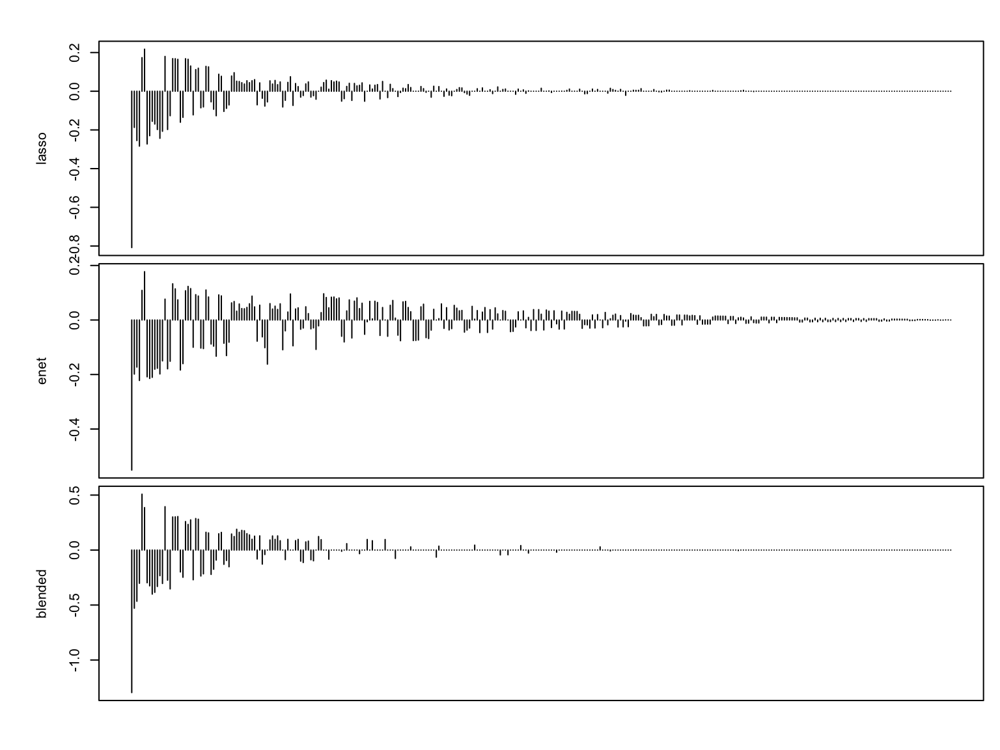
<p class="caption">(\#fig:brcaRna-glmnetFit-compCoeffProf)Coefficient Profiles</p>
</div>

Note that there is little difference between the elastic net and the lasso
in the selected features, and when the coefficient is zero in one set, it 
is smaell in the other.  By contrast, the blended fit produces more shrinkage.


```r
### CLEAR CACHE

knitr::kable(
with(all_coef_frm, table(lassoZero=lasso==0, enetZero=enet==0)),
 caption='Zero Ceofficient: rows are lasso, columns enet') %>%
  kableExtra::kable_styling(full_width = F)
```

<table class="table" style="width: auto !important; margin-left: auto; margin-right: auto;">
<caption>(\#tab:brcaRna-glmnetFit-zreros)Zero Ceofficient: rows are lasso, columns enet</caption>
 <thead>
  <tr>
   <th style="text-align:left;">   </th>
   <th style="text-align:right;"> FALSE </th>
   <th style="text-align:right;"> TRUE </th>
  </tr>
 </thead>
<tbody>
  <tr>
   <td style="text-align:left;"> FALSE </td>
   <td style="text-align:right;"> 168 </td>
   <td style="text-align:right;"> 0 </td>
  </tr>
  <tr>
   <td style="text-align:left;"> TRUE </td>
   <td style="text-align:right;"> 147 </td>
   <td style="text-align:right;"> 6 </td>
  </tr>
</tbody>
</table>


<!--
Coefficients in the relaxed lasso fit are much larger than those in the
lasso fit, or zero.  As a consequence, the blended fit coefficients look 
like a shrunken version of the relaxed lasso fit coefficients.  
-->

Coefficients in the blended fit are larger than those in the
lasso fit, or zero.  


We can also examine these with a scatter plot matrix.


```r
### CLEAR CACHE


pairs(all_coef_frm,
  lower.panel = NULL,
  panel = function(x, y) {
    points(x, y, pch = 16, col = "blue")
  }
)
```

<div class="figure">

<p class="caption">(\#fig:brcaRna-glmnetFit-pairsCoeffProf)Coefficients from fits</p>
</div>


## Examine feature selection

Recall from `glmnet` vignette:

```
It is known that the ridge penalty shrinks the coefficients of correlated predictors
towards each other while the lasso tends to pick one of them and discard the others.
The elastic-net penalty mixes these two; if predictors are correlated in groups,
an $\alpha$=0.5 tends to select the groups in or out together.
This is a higher level parameter, and users might pick a value upfront,
else experiment with a few different values. One use of $\alpha$ is for numerical stability;
for example, the *elastic net with $\alpha = 1 - \epsilon$ for some small $\epsilon$>0
performs much like the lasso, but removes any degeneracies and wild behavior caused
by extreme correlations*.
```

To see how this plays out in this dataset, we can look at feature expression
heat maps.  

Reader notes:  

```
Heat maps are rarely useful other than to display the obvious.
Here too heat maps fail to yield any insights, or confirmation
of the relationship between feature correlation and lasso vs enet
feature selection.
```


```r
### CLEAR CACHE
 suppressPackageStartupMessages(require(gplots))

# train - cv predicted
lasso_coef <- coef(
 brcaRna_cv_lasso,
 s='lambda.1se'
)
lasso_coef_frm <- data.frame(
 gene=lasso_coef@Dimnames[[1]][c(1, lasso_coef@i[-1])],
 lasso=lasso_coef@x)

 
  Mycol <- colorpanel(1000, "blue", "red")
  heatmap.2(
    x=t(brcaRna_train_geneExpr_mtx[,lasso_coef_frm$gene[-1]]),
    scale="row",
    labRow=lasso_coef_frm$gene,
    labCol=brcaRna_train_group_vec,
    col=Mycol, 
    trace="none", density.info="none", 
    #margin=c(8,6), lhei=c(2,10), 
    #lwid=c(0.1,4), #lhei=c(0.1,4)
    key=F,
    ColSideColors=ifelse(brcaRna_train_group_vec=='_Other', 'green','red'),
    dendrogram="both",
    main=paste('lasso genes - N =', nrow(lasso_coef_frm)-1))
```

<div class="figure">

<p class="caption">(\#fig:brcaRna-glmnetFit-heatmapLasso)Lasso Model Genes</p>
</div>


```r
### CLEAR CACHE
 suppressPackageStartupMessages(require(gplots))

# train - cv predicted
enet_coef <- coef(
 brcaRna_cv_enet,
 s='lambda.1se'
)
enet_coef_frm <- data.frame(
 gene=enet_coef@Dimnames[[1]][c(1, enet_coef@i[-1])],
 enet=enet_coef@x)

 
  Mycol <- colorpanel(1000, "blue", "red")
  heatmap.2(
    x=t(brcaRna_train_geneExpr_mtx[,enet_coef_frm$gene[-1]]),
    scale="row",
    labRow=enet_coef_frm$gene,
    labCol=brcaRna_train_group_vec,
    col=Mycol, 
    trace="none", density.info="none", 
    #margin=c(8,6), lhei=c(2,10), 
    #lwid=c(0.1,4), #lhei=c(0.1,4)
    key=F,
    ColSideColors=ifelse(brcaRna_train_group_vec=='_Other', 'green','red'),
    dendrogram="both",
    main=paste('enet genes - N =', nrow(enet_coef_frm)-1))
```

<div class="figure">

<p class="caption">(\#fig:brcaRna-glmnetFit-heatmapEnet)Enet Model Genes</p>
</div>


<!--chapter:end:07-glmnetFitsBrCaRNASeq.Rmd-->

# BrCa RNA-Seq: Sample size investigation {#brca-rnaseq-model-suite}

In this section we repeat the analyses ran on the HCC 5hmC data in
Section \@ref(hcc-5hmcseq-model-suite) on the breast cancer
RNA-Seq data set to provide a contrasting SNR regime context.

## Full data set fit

We begin by fitting a model to the entire data set in order to:

* obtain a baseline clssification performance against which to judge the performance
obtained from the fits to smaller sample sets,

* obtain sample consistency scores which can be used to explain variability
in the performance of model fitted to data sets of a fixed size, and

* produce a *full model* gene signature which can be used to evaluate
the stability of selected features in models fitted to data sets of diffferent
sizes.


First assemble the data set.  This entails simply re-combining the
train and test data.


```r
### CLEAR CACHE

# combine train and test 
brcaRna_all_geneExpr_mtx <- rbind(brcaRna_train_geneExpr_mtx, brcaRna_test_geneExpr_mtx)

# we have to be careful with factors!
# We'll keep as a character and change to factor when needed
brcaRna_all_group_vec <- c(
 as.character(brcaRna_train_group_vec), 
 as.character(brcaRna_test_group_vec)
)
# I suspect adding names to vectors breaks one of the tidy commandments,
# but then again I am sure I have already offended the creed beyond salvation
names(brcaRna_all_group_vec) <- c(
 names(brcaRna_train_group_vec),
 names(brcaRna_test_group_vec)
)

knitr::kable(table(group = brcaRna_all_group_vec),
  caption = "samples by group") %>%
   kableExtra::kable_styling(full_width = F)
```

<table class="table" style="width: auto !important; margin-left: auto; margin-right: auto;">
<caption>(\#tab:brca-rnaseq-get-all-data)samples by group</caption>
 <thead>
  <tr>
   <th style="text-align:left;"> group </th>
   <th style="text-align:right;"> Freq </th>
  </tr>
 </thead>
<tbody>
  <tr>
   <td style="text-align:left;"> LumA </td>
   <td style="text-align:right;"> 1492 </td>
  </tr>
  <tr>
   <td style="text-align:left;"> Other </td>
   <td style="text-align:right;"> 933 </td>
  </tr>
</tbody>
</table>

Now fit the losso model through cross-validation.
Note that the results of a cv fit are random due to the
random allocation of samples to folds.  We can reduce this
varibility by properly averaging results over repeated cv fits.
Here we will obtain sample consistency scores by averaging results
over 30 cv runs.


```r
set.seed(1)

start_time <-  proc.time()

brcaRna_cv_lassoAll_lst <- lapply(1:30, function(REP) {
glmnet::cv.glmnet(
 x = brcaRna_all_geneExpr_mtx,
 y = factor(brcaRna_all_group_vec,levels = c('Other', 'LumA')),
 alpha = 1,
 family = 'binomial',
 type.measure  =  "class",
 keep = T,
 nlambda = 100
)
}
)

message("lassoAll time: ", round((proc.time() - start_time)[3],2),"s")
```

<!-- lasso-fit-all takes a while - save results -->
<!-- DO THIS ONCE -->


```r
 load(file=file.path("RData",'brcaRna_cv_lassoAll_lst'))
```


Examine the fits.


```r
### CLEAR CACHE
plot(
 log(brcaRna_cv_lassoAll_lst[[1]]$lambda),
 brcaRna_cv_lassoAll_lst[[1]]$cvm,
 lwd=2,
 xlab='log(Lambda)', ylab='CV Misclassification Error', type='l', ylim=c(0, .5)
)

for(JJ in 2:length(brcaRna_cv_lassoAll_lst))
 lines(
  log(brcaRna_cv_lassoAll_lst[[JJ]]$lambda),
  brcaRna_cv_lassoAll_lst[[JJ]]$cvm,
  lwd=2
)
```

<div class="figure">

<p class="caption">(\#fig:brca-rnaseq-plot-lassoAll)Repeated cv lasso models fitted to all samples</p>
</div>

These cv curves are remarkably consistent meaning that the determination of the size or sparsity
of the model fitted through cross validation to the full data set is fairly precise:

<!-- DONT CACHE THIS ??? -->


```r
library(magrittr)
par(mfrow=c(1,2), mar=c(3,4, 2, 1))

# nzero
nzero_1se_vec <- sapply(brcaRna_cv_lassoAll_lst,
 function(cv_fit) cv_fit$nzero[cv_fit$lambda == cv_fit$lambda.1se])

nzero_min_vec <- sapply(brcaRna_cv_lassoAll_lst,
 function(cv_fit) cv_fit$nzero[cv_fit$lambda == cv_fit$lambda.min])

boxplot(list(`1se`=nzero_1se_vec, min = nzero_min_vec), ylab="Selected Features")

# error
error_1se_vec <- sapply(brcaRna_cv_lassoAll_lst,
 function(cv_fit) cv_fit$cvm[cv_fit$lambda == cv_fit$lambda.1se])

error_min_vec <- sapply(brcaRna_cv_lassoAll_lst,
 function(cv_fit) cv_fit$cvm[cv_fit$lambda == cv_fit$lambda.min])

boxplot(
 list(`1se`=error_1se_vec, min = error_min_vec), 
 ylab=brcaRna_cv_lassoAll_lst[[1]]$name,
 ylim=c(0.10, .13)
)
```

<div class="figure">

<p class="caption">(\#fig:brca-rnaseq-model-size-lassoAll)Feature selection and estimated error by repeated cv lasso models</p>
</div>

```r
# tabular format
tmp <- data.frame(rbind(
 `features_1se` = summary(nzero_1se_vec),
 features_min = summary(nzero_min_vec),
 `features:min-1se` = summary(nzero_min_vec - nzero_1se_vec),
 `cv_error_1se` = summary(100*error_1se_vec),
 cv_error_min = summary(100*error_min_vec),
 `cv_error:1se-min` = summary(100*(error_1se_vec-error_min_vec))
))

knitr::kable(tmp %>% dplyr::select(-Mean),
  caption = "Number of selected features",
  digits=1) %>%
   kableExtra::kable_styling(full_width = F)
```

<table class="table" style="width: auto !important; margin-left: auto; margin-right: auto;">
<caption>(\#tab:brca-rnaseq-model-size-lassoAll)Number of selected features</caption>
 <thead>
  <tr>
   <th style="text-align:left;">   </th>
   <th style="text-align:right;"> Min. </th>
   <th style="text-align:right;"> X1st.Qu. </th>
   <th style="text-align:right;"> Median </th>
   <th style="text-align:right;"> X3rd.Qu. </th>
   <th style="text-align:right;"> Max. </th>
  </tr>
 </thead>
<tbody>
  <tr>
   <td style="text-align:left;"> features_1se </td>
   <td style="text-align:right;"> 97.0 </td>
   <td style="text-align:right;"> 118.5 </td>
   <td style="text-align:right;"> 144.0 </td>
   <td style="text-align:right;"> 162.0 </td>
   <td style="text-align:right;"> 208.0 </td>
  </tr>
  <tr>
   <td style="text-align:left;"> features_min </td>
   <td style="text-align:right;"> 144.0 </td>
   <td style="text-align:right;"> 221.2 </td>
   <td style="text-align:right;"> 258.0 </td>
   <td style="text-align:right;"> 291.0 </td>
   <td style="text-align:right;"> 451.0 </td>
  </tr>
  <tr>
   <td style="text-align:left;"> features:min-1se </td>
   <td style="text-align:right;"> 27.0 </td>
   <td style="text-align:right;"> 59.0 </td>
   <td style="text-align:right;"> 94.5 </td>
   <td style="text-align:right;"> 153.2 </td>
   <td style="text-align:right;"> 344.0 </td>
  </tr>
  <tr>
   <td style="text-align:left;"> cv_error_1se </td>
   <td style="text-align:right;"> 10.9 </td>
   <td style="text-align:right;"> 11.3 </td>
   <td style="text-align:right;"> 11.5 </td>
   <td style="text-align:right;"> 11.7 </td>
   <td style="text-align:right;"> 12.0 </td>
  </tr>
  <tr>
   <td style="text-align:left;"> cv_error_min </td>
   <td style="text-align:right;"> 10.6 </td>
   <td style="text-align:right;"> 10.8 </td>
   <td style="text-align:right;"> 10.9 </td>
   <td style="text-align:right;"> 11.1 </td>
   <td style="text-align:right;"> 11.5 </td>
  </tr>
  <tr>
   <td style="text-align:left;"> cv_error:1se-min </td>
   <td style="text-align:right;"> 0.2 </td>
   <td style="text-align:right;"> 0.4 </td>
   <td style="text-align:right;"> 0.5 </td>
   <td style="text-align:right;"> 0.7 </td>
   <td style="text-align:right;"> 0.8 </td>
  </tr>
</tbody>
</table>

<br/>

The number of features selected by the minimum lambda models are larger
than the number selected by the "one standard error" rule models by a median
of 94.5.
The cv error rates obtained from the minimum lambda models are lower
then  "one standard error" rule models error rates by a median of
0.5%.  

The cv error rates observed in this set are comparable to the 
rates oberved in the lasso models fitted to the training sample set
which consisted of 80% of the samples in this set.  In other words,
there is no obvious gain in performance in moving from 
a data set with 
1194 vs 746 samples
to a data set with
1492 vs 933 samples.
See Table \@ref(tab:printErrors).  

It's not clear at this point whether the minimum lambda model is truly better than
the  "one standard error" rule  model.  We would need and external validation
set to make this determination.  We can compare the two sets
of out-of-fold predicted values, averaged across cv replicates, to see if
there is a meaningful difference between the two.


```r
# predicted probs - 1se
lassoAll_predResp_1se_mtx <- sapply(brcaRna_cv_lassoAll_lst, function(cv_fit) { 
  ndx_1se <- match(cv_fit$lambda.1se,cv_fit$lambda)
  logistic_f(cv_fit$fit.preval[,ndx_1se])
 })
lassoAll_predResp_1se_vec <- rowMeans(lassoAll_predResp_1se_mtx)

# predicted probs - min
lassoAll_predResp_min_mtx <- sapply(brcaRna_cv_lassoAll_lst, function(cv_fit) { 
  ndx_min <- match(cv_fit$lambda.min,cv_fit$lambda)
  logistic_f(cv_fit$fit.preval[,ndx_min])
 })
lassoAll_predResp_min_vec <- rowMeans(lassoAll_predResp_min_mtx)

# plot
par(mfrow=c(1,2), mar=c(5,5,2,1))
tmp <- c(
 `1se` = split(lassoAll_predResp_1se_vec, brcaRna_all_group_vec),
 min = split(lassoAll_predResp_min_vec, brcaRna_all_group_vec)
)
names(tmp) <- sub('\\.', '\n', names(tmp))

boxplot(
 tmp,
 ylab='Predicted oof probability',
 border=c('green', 'red'),
 xaxt='n'
)
axis(side=1, at=1:length(tmp), tick=F, names(tmp))


# compare the two
plot(
 x = lassoAll_predResp_1se_vec, xlab='1se model oof Prob',
 y = lassoAll_predResp_min_vec, ylab='min lambda model oof Prob',
 col = ifelse(brcaRna_all_group_vec == 'LumA', 'red', 'green')
)
 
# Add reference lines at 10% false positive
thres_1se <- quantile(lassoAll_predResp_1se_vec[brcaRna_all_group_vec == 'Other'], prob=.9)
thres_min <- quantile(lassoAll_predResp_min_vec[brcaRna_all_group_vec == 'Other'], prob=.9)
abline(v = thres_1se, h = thres_min, col='grey')
```

<div class="figure">

<p class="caption">(\#fig:brca-rnaseq-get-sample-pred)Predicted probabilities - averaged over cv replicates</p>
</div>

<!-- THIS PARAGRAPH REFERRED TO THE FITTED PROBS; NOT THE OOF PRED PROBS
We see that the minimum lambda models provide a better fit to the data,
which is to be expected as the minimum lambda models have more estimated
parameters than the one standard error rule models.  
-->

We see that there isn't a big difference in out-of-fold predicted
probabilities between the one-standard-error rule and the minimum lamda models.
One way to quantify
the difference in classification errors is to classify samples
according to each vector of predicted probabilities, setting
the thresholds to achieve a fixed false positive rate, 10% say.
These thresholds are indicated by the grey lines in the scatter plot
on the right side of Figure \@ref(fig:get-sample-pred).  

<!-- APPLIED TO THE FITTED VALUES
We note
that althouth predicted probability distributions are quite different
for the two models, the the class predictions at a 10% false discovery threshold
are largely in agreement.
-->


```r
### NOTE THAT HERE MODEL PRODUCES PROB(Other)
lassoAll_predClass_1se_vec <- ifelse(
 lassoAll_predResp_1se_vec > thres_1se, 'LumA', 'Other')

lassoAll_predClass_min_vec <- ifelse(
 lassoAll_predResp_min_vec > thres_min, 'LumA', 'Other')

tmp <- cbind(
 table(truth=brcaRna_all_group_vec, `1se-pred`=lassoAll_predClass_1se_vec),
 table(truth=brcaRna_all_group_vec, `min-pred`=lassoAll_predClass_min_vec)
) 
# HARD-WIRED Hack for printing!!!!
colnames(tmp) <- c('1se-LumA', '1se-Other', 'min-LumA', 'min-Other')

knitr::kable(tmp,
  caption = "Classifications: rows are truth",
  digits=1) %>%
   kableExtra::kable_styling(full_width = F)
```

<table class="table" style="width: auto !important; margin-left: auto; margin-right: auto;">
<caption>(\#tab:brca-rnaseq-get-sample-class)Classifications: rows are truth</caption>
 <thead>
  <tr>
   <th style="text-align:left;">   </th>
   <th style="text-align:right;"> 1se-LumA </th>
   <th style="text-align:right;"> 1se-Other </th>
   <th style="text-align:right;"> min-LumA </th>
   <th style="text-align:right;"> min-Other </th>
  </tr>
 </thead>
<tbody>
  <tr>
   <td style="text-align:left;"> LumA </td>
   <td style="text-align:right;"> 1288 </td>
   <td style="text-align:right;"> 204 </td>
   <td style="text-align:right;"> 1304 </td>
   <td style="text-align:right;"> 188 </td>
  </tr>
  <tr>
   <td style="text-align:left;"> Other </td>
   <td style="text-align:right;"> 94 </td>
   <td style="text-align:right;"> 839 </td>
   <td style="text-align:right;"> 94 </td>
   <td style="text-align:right;"> 839 </td>
  </tr>
</tbody>
</table>

When we fix the false positive rate at 10% (ie. the other samples error rates are fixed), 
the `1se` model makes 204 false negative calls whereas the 
minimum lambda model makes 188.  A difference of 1.1%


<!-- APPLIED TO THE FITTED PROBABILITIES
We see that the min lambda model, makes no false negative calls at a 90% sensitivity
setting, and the sensitivity could be increased substantially at no false negative
cost.  This is definitely over-fitting the data set.  For the purpose
of computing sample consistency scores - what do these differences mean? 
-->

### Get sample consistency scores {-}

To compute consistency scores, we will use the out-of-fold predicted probabilities.


```r
# get qual scores

y <- as.numeric(brcaRna_all_group_vec == 'LumA')
# 1se
p <- lassoAll_predResp_1se_vec
brcaRna_sample_1se_qual_vec <- p^y*(1-p)^(1-y)

# min
p <- lassoAll_predResp_min_vec
brcaRna_sample_min_qual_vec <- p^y*(1-p)^(1-y)
```


We can examine consistency scores as a function of classification bin.


```r
y <- as.numeric(brcaRna_all_group_vec == 'LumA')

# 1se
lassoAll_1se_conf_vec <- paste(
 y, 
 as.numeric(lassoAll_predClass_1se_vec=='LumA'),
 sep = ':'
)

# min
lassoAll_min_conf_vec <- paste(
 y, 
 as.numeric(lassoAll_predClass_min_vec=='LumA'),
 sep = ':'
)


tmp <- c(
 split(brcaRna_sample_1se_qual_vec, lassoAll_1se_conf_vec), 
 split(brcaRna_sample_min_qual_vec, lassoAll_min_conf_vec)
)

par(mfrow=c(1,2), mar=c(4,3,3,2), oma=c(2,2,2,0))
gplots::boxplot2(split(brcaRna_sample_1se_qual_vec, lassoAll_1se_conf_vec), 
  outline=F, ylab = '', 
  border=c('green', 'green', 'red', 'red'),
  ylim=c(0,1))
title('1se Model')

gplots::boxplot2(split(brcaRna_sample_min_qual_vec, lassoAll_min_conf_vec), 
  outline=F, ylab = '',
  border=c('green', 'green', 'red', 'red'),
  ylim=c(0,1))
title('min lambda Model')


mtext(side=1, outer=T, cex=1.5, 'Classification - Truth:Predicted')
mtext(side=2, outer=T, cex=1.5, 'Consistency Score')
mtext(side=3, outer=T, cex=1.5, 'Sample Consistency vs Classification Outcome')
```

<div class="figure">

<p class="caption">(\#fig:brca-rnaseq-plot-qual-conf)consistency scores by classification - Other=0, LumA=1</p>
</div>

This figure shows that for false positive cases (0:1 or classifying a
other as an LumA case), the algorithm is *more certain* of its predicted
outcome than for the false negative cases (1:0 or classifying an LumA case as Other).
ie. the misclassified Other samples are quite similar to LumA sample, whereas there
is more ambiguity in the misclassified LumA samples.

 
We will use the minimum lambda model to provide
the fitted probabilities used to compute consistency scores,
but we could have used either one.


```r
brcaRna_sample_qual_vec <- brcaRna_sample_min_qual_vec
```


## Selected feature list stability 

Before moving on to the simulation, let's examine gene selection stability on the
full data set.  We have two sets of sellected features - one for the 
one standard deviation rule model, and one for the mimimum lambda model.
We saw in Table \@ref(tab:model-size-lassoAll) that the number of features
selected by the minimum lambda models had an IQR of
221.25-291,
while the one standard error rule models had an IQR of
118.5-162.

Let's examine the stability of the gene lists across cv replicates.


```r
### CLEAR CACHE


# 1se
lassoAll_coef_1se_lst <- lapply(brcaRna_cv_lassoAll_lst, function(cv_fit){
 cv_fit_coef <- coef(
 cv_fit,
 s = "lambda.1se"
 )
 cv_fit_coef@Dimnames[[1]][cv_fit_coef@i[-1]]
 })

# put into matrix
lassoAll_coef_1se_all <- Reduce(union, lassoAll_coef_1se_lst)
lassoAll_coef_1se_mtx <- sapply(lassoAll_coef_1se_lst, 
  function(LL) is.element(lassoAll_coef_1se_all, LL)
)
rownames(lassoAll_coef_1se_mtx) <- lassoAll_coef_1se_all

genes_by_rep_1se_tbl <- table(rowSums(lassoAll_coef_1se_mtx))
barplot(
 genes_by_rep_1se_tbl,
 xlab='Number of Replicates',
 ylab='Number of features'

)
```

<div class="figure">

<p class="caption">(\#fig:brca-rnaseq-feature-list-1se)Feature list stability for one standard error rule models</p>
</div>

We see that 83 features are included in every
cv replicate.  These make up between 
51%
and
70%
(Q1 and Q3) of the cv replicate one standard error rule models feature lists.


```r
### CLEAR CACHE


# min
lassoAll_coef_min_lst <- lapply(brcaRna_cv_lassoAll_lst, function(cv_fit){
 cv_fit_coef <- coef(
 cv_fit,
 s = "lambda.min"
 )
 cv_fit_coef@Dimnames[[1]][cv_fit_coef@i[-1]]
 })

# put into matrix
lassoAll_coef_min_all <- Reduce(union, lassoAll_coef_min_lst)
lassoAll_coef_min_mtx <- sapply(lassoAll_coef_min_lst, 
  function(LL) is.element(lassoAll_coef_min_all, LL)
)
rownames(lassoAll_coef_min_mtx) <- lassoAll_coef_min_all

genes_by_rep_min_tbl <- table(rowSums(lassoAll_coef_min_mtx))
barplot(
 genes_by_rep_min_tbl,
 xlab='Number of Replicates',
 ylab='Number of features'

)
```

<div class="figure">

<p class="caption">(\#fig:brca-rnaseq-feature-list-min)Feature list stability for minimum lambda models</p>
</div>

We see that 110 features are included in every
cv replicate.  These make up between 
38%
and
50%
(Q1 and Q3) of the cv replicate min feature lists.
We will consider the genes that are selected in all cv replicates as a 
gene signature produced by each model.


```r
lasso_gene_sign_1se_vec <- rownames(lassoAll_coef_1se_mtx)[rowSums(lassoAll_coef_1se_mtx)==30]
lasso_gene_sign_min_vec <- rownames(lassoAll_coef_min_mtx)[rowSums(lassoAll_coef_min_mtx)==30]
```

68 out of
83 of the genes in the 1se model gene signature
are contained in the min lambda model gene signature.

## Simulation Design

We are now ready to run the simulations.


```r
 SIM <- 30
 SIZE <- c(25, 50, 100, 200, 300)
 CV_REP <- 30
```

Simluation parameters:  

* Number of simulations : SIM = 30

* Sample sizes: SIZE = 25, 50, 100, 200, 300  

* Number of CV Replicates:  CV_REP = 30


We will repeat the simulation process SIM = 30 times.
For each simulation iteration, we will select 300 Other and 
300 LumA samples at random.  Models will be fitted and analyzed
to balanced subsets of SIZE = 25, 50, 100, 200, 300, in a `Matryoshka doll` manner to
emulate a typical sample accrual process.


For a given simulation and a given sample size, we will obtain
CV_REP = 30 cross-validated lasso fits.  From these fits,
we can obtain 30 out-of-fold assessments of classification accuracy 
to get a sense if its variability. From each cv replicate, we also obtain
an estimated model size and a set of selected features.  We will want
to examine how these stabilize as the sample size increases.

Note that we limit the simulations to a maximum of sample size of 300 in 
order to to have simulations with low overlap.  With 300
randomly selected LumA samples, the expected overlap between two randomly
selected sets of LumA samples is 4%.
For Others the expected overlap is 10.3%. 


## Setup simulation 

To setup the simulation, we only need two master tables: one for the selection of Others
and one for the selection of LumA samples.


```r
brcaRna_all_other_vec <- names(brcaRna_all_group_vec[brcaRna_all_group_vec=='Other']) 
brcaRna_all_LumA_vec <- names(brcaRna_all_group_vec[brcaRna_all_group_vec=='LumA'])  
```

We have 933 other sample IDs stored in `brcaRna_all_other_vec`
and 1492 LumA sample IDs stored in `brcaRna_all_LumA_vec`.
To create a suite of random samples from these, we only need to randomly select indices from
each vector.

  

```r
### CLEAR CACHE

set.seed(12379)

brcaRna_sim_other_mtx <- sapply(
 1:SIM, 
 function(dummy) 
   sample(1:length(brcaRna_all_other_vec), size =  max(SIZE))
)


brcaRna_sim_LumA_mtx <- sapply(
 1:SIM, 
 function(dummy) 
   sample(1:length(brcaRna_all_LumA_vec), size =  max(SIZE))
)
```

Each simulation is specified by a given column of the simulation design matrices:
`brcaRna_sim_other_mtx` and `brcaRna_sim_LumA_mtx`, each with domensions 300, 30.
Within each simulation, we can run the analyses of size 25, 50, 100, 200, 300 by simply selecting
samples specified in the appropriate rows of each design matrix.

We can examine how much variability we have in the consistency scores of the selected samples.
Here we show results for the smalle sample sizes where variability will be the greatest.


```r
brcaRna_all_other_qual_vec <- brcaRna_sample_qual_vec[brcaRna_all_other_vec]
brcaRna_sim_other_qual_mtx <- sapply(
  1:ncol(brcaRna_sim_other_mtx), 
  function(CC) brcaRna_all_other_qual_vec[brcaRna_sim_other_mtx[,CC]]
 )

brcaRna_all_LumA_qual_vec <- brcaRna_sample_qual_vec[brcaRna_all_LumA_vec]
brcaRna_sim_LumA_qual_mtx <- sapply(
  1:ncol(brcaRna_sim_LumA_mtx),  
  function(CC) brcaRna_all_LumA_qual_vec[brcaRna_sim_LumA_mtx[,CC]]
 )

# ONLY LOOK AT SAMPLE SIZE == 50
NN <- 50

# PLOT
par(mfrow=c(2,1), mar = c(2,5,2,1))
# other
boxplot(
  brcaRna_sim_other_qual_mtx[1:NN,],
  outline = T, 
  ylab = 'Consistency Score',
  xaxt = 'n'
)
title("Other sample consistency across simulations")

# LumA
boxplot(
  brcaRna_sim_LumA_qual_mtx[1:NN,],
  outline = T, 
  ylab = 'Consistency Score'
)
title("LumA sample consistency across simulations")
```

<div class="figure">

<p class="caption">(\#fig:brca-rnaseq-look-sim-qual-0-50ONLY)sample consistency by simulation run for size = 50 </p>
</div>

In this figure, we are summarizing the consistency measures of 50 samples per group acress
30 simulations, or random selections of other and LumA samples.
We see significant variability in sample consistency, especially in the Other cases.
This may lead an unwary observer to be overly optimistic, or overly pessimistic,
in the early accrual stages of a study.


## Run simulations


As these take a while to run, 
we will save the results of each similation to a different
object and store to disk.  These can be easily read from disk
when needed for analysis.


The simulation results are saved to the file system and
only needs to be run once.  The simulation takes $\approx$ 14 minutes
per iteration, or $\approx$ 7 hours of run time on a laptop.
(Platform: x86_64-apple-darwin17.0 (64-bit)
Running under: macOS Mojave 10.14.6)

<!-- RUN ONCE - THEN GET FROM MEMORY -->

```r
start_time <- proc.time()

# Get stage from SIZE
stage_vec <- cut(1:nrow(brcaRna_sim_other_qual_mtx), c(0, SIZE), include.lowest = T)

for (SIMno in 1:ncol(brcaRna_sim_other_qual_mtx)) {

  #cat("Running simulation ", SIMno, "\n")

  brca_sim_cv_lst <- lapply(1:length(levels(stage_vec)), function(STGno) {
    Stage_rows_vec <- which(stage_vec %in% levels(stage_vec)[1:STGno])
    #cat("Stage ", STGno, "- analyzing", length(Stage_rows_vec), "paired samples.\n")

    sim_stage_samples_vec <- c(
      brcaRna_all_other_vec[brcaRna_sim_other_mtx[Stage_rows_vec, SIMno]],
      brcaRna_all_LumA_vec[brcaRna_sim_LumA_mtx[Stage_rows_vec, SIMno]]
    )
    sim_stage_geneExpr_mtx <- brcaRna_all_geneExpr_mtx[sim_stage_samples_vec, ]
    sim_stage_group_vec <- brcaRna_all_group_vec[sim_stage_samples_vec]
    #print(table(sim_stage_group_vec))

    sim_stage_cv_lst <- lapply(1:CV_REP, function(CV) {
      cv_fit <- glmnet::cv.glmnet(
        x = sim_stage_geneExpr_mtx,
        y = sim_stage_group_vec,
        alpha = 1,
        family = "binomial",
        type.measure = "class",
        keep = T,
        nlambda = 30
      )

      # Extract 1se metrics from cv_fit
      #######################
      ndx_1se <- which(cv_fit$lambda == cv_fit$lambda.1se)

      nzero_1se <- cv_fit$nzero[ndx_1se]
      cvm_1se <- cv_fit$cvm[ndx_1se]

      # test error
      sim_stage_test_samples_vec <- setdiff(rownames(brcaRna_all_geneExpr_mtx), sim_stage_samples_vec)
      sim_stage_brcaRna_test_geneExpr_mtx <- brcaRna_all_geneExpr_mtx[sim_stage_test_samples_vec,]
      sim_stage_brcaRna_test_group_vec <- brcaRna_all_group_vec[sim_stage_test_samples_vec]

      test_pred_1se_vec <- predict(
       cv_fit,
       newx=sim_stage_brcaRna_test_geneExpr_mtx,
       s="lambda.1se",
       type="class"
      )
      test_1se_error <- mean(test_pred_1se_vec != sim_stage_brcaRna_test_group_vec)

      # genes
      coef_1se <- coef(
        cv_fit,
        s = "lambda.1se"
      )
      genes_1se <- coef_1se@Dimnames[[1]][coef_1se@i[-1]]

      # Extract min metrics from cv_fit
      #######################
      ndx_min <- which(cv_fit$lambda == cv_fit$lambda.min)

      nzero_min <- cv_fit$nzero[ndx_min]
      cvm_min <- cv_fit$cvm[ndx_min]

      # test error
      sim_stage_test_samples_vec <- setdiff(rownames(brcaRna_all_geneExpr_mtx), sim_stage_samples_vec)
      sim_stage_brcaRna_test_geneExpr_mtx <- brcaRna_all_geneExpr_mtx[sim_stage_test_samples_vec,]
      sim_stage_brcaRna_test_group_vec <- brcaRna_all_group_vec[sim_stage_test_samples_vec]

      test_pred_min_vec <- predict(
       cv_fit,
       newx=sim_stage_brcaRna_test_geneExpr_mtx,
       s="lambda.min",
       type="class"
      )
      test_min_error <- mean(test_pred_min_vec != sim_stage_brcaRna_test_group_vec)

      # genes
      coef_min <- coef(
        cv_fit,
        s = "lambda.min"
      )
      genes_min <- coef_min@Dimnames[[1]][coef_min@i[-1]]

      # return cv_fit summary metrics
      list(
       p_1se = nzero_1se, 
       p_min = nzero_min, 
       cv_1se = cvm_1se, 
       cv_min = cvm_min, 
       test_1se=test_1se_error, 
       test_min=test_min_error, 
       genes_1se = genes_1se,
       genes_min = genes_min)
    })
    sim_stage_cv_lst
  })

  # save  brcaRna_sim_cv_lst
  fName <- paste0("brcaRna_sim_", SIMno, "_cv_lst")
  assign(fName, brca_sim_cv_lst)
  save(list = fName, file=file.path("RData", fName))

}
```


<!-- DEBUG - rename after the fact -->


## Simulation results

Recall the we have 30 simulations, or randomly selected sets of LumA and Other samples,
analyzed in inreasing sizes of 25, 50, 100, 200, 300, with
30 repeated cross-validated lasso fits:


* Sample sizes: SIZE = 25, 50, 100, 200, 300

* Number of CV Replicates:  CV_REP = 30


First we extract simluation results and store into one big table (only showing the top of table shere):


```r
brcaRna_sim_files_vec <- list.files('RData', '^brcaRna_sim_')


# define extraction methods

# Each sumulation is a list of cv results 
## nested in a list of replicates
##############################################

# cvList2frm_f makes a frame out of the inner list
cvList2frm_f <- function(cv_lst) {
 frm1 <- as.data.frame(t(sapply(cv_lst, function(x) x)))
 frm2 <- data.frame(
  unlist(frm1[[1]]), unlist(frm1[[2]]),
  unlist(frm1[[3]]), unlist(frm1[[4]]),
  unlist(frm1[[5]]), unlist(frm1[[6]]),
  frm1[7], frm1[8])
  names(frm2) <- names(frm1)
  data.frame(Rep=1:nrow(frm2), frm2)}

# cv_lst_to_frm loop over replicates, concatenating the inner list frames
cv_lst_to_frm <- function(brcaRna_sim_cv_lst) {
 do.call('rbind', lapply(1:length(brcaRna_sim_cv_lst),
  function(JJ) {
    siz_frm <- cvList2frm_f(brcaRna_sim_cv_lst[[JJ]])
    data.frame(Size=SIZE[JJ], siz_frm)
  }))
}

# we loop across simulations to combine all results into one big table
brcaRna_lasso_sim_results_frm <- do.call('rbind', lapply(1:length(brcaRna_sim_files_vec),
 function(SIM_NO) {
  load(file=file.path('RData', brcaRna_sim_files_vec[SIM_NO]))
  assign('brcaRna_sim_cv_lst', get(brcaRna_sim_files_vec[SIM_NO]))
  rm(list=brcaRna_sim_files_vec[SIM_NO])
  
  data.frame(SimNo=paste0('Sim_',formatC(SIM_NO,width = 2,flag = 0)), cv_lst_to_frm(brcaRna_sim_cv_lst))
} 
)) 
```

<!-- 
Have a table of simulation results - `brcaRna_lasso_sim_results_frm`:
-->


### Simulation Results - look at one simulation

#### Model Accuracy Assessment

First examine results for one simulation run.  In the figures that follow,
each boxplot summarized 30 repreated cross validation runs performed on a 
fixed random selection of Other and Affeced samples.  Recall that as
we move from 25 to 50, etc., the sample sets are growing to emulate an
accrual of samples over time.


```r
### CLEAR CACHE

# get full model cv error ref
error_1se_vec <- sapply(brcaRna_cv_lassoAll_lst,
 function(cv_fit) cv_fit$cvm[cv_fit$lambda == cv_fit$lambda.1se])
error_1se_q2 <- quantile(error_1se_vec, prob=1/2)        

error_min_vec <- sapply(brcaRna_cv_lassoAll_lst,
 function(cv_fit) cv_fit$cvm[cv_fit$lambda == cv_fit$lambda.min])
error_min_q2 <- quantile(error_min_vec, prob=1/2)        

# Utility objects
SIZE0 <- stringr::str_pad(SIZE, width=3, pad='0')
stage_vec <- cut(1:nrow(brcaRna_sim_other_qual_mtx), c(0,SIZE), include.lowest = T)


#SIM <- "Sim_01"

for(SIM in unique(brcaRna_lasso_sim_results_frm$SimNo)[1]){

SimNum <- as.numeric(sub('Sim_','',SIM))

simNo_results_frm <- brcaRna_lasso_sim_results_frm %>% dplyr::filter(SimNo==SIM)


# errors
par(mfrow=c(1,2), mar=c(4, 2, 2, 1), oma=c(0,2,2,0))
###################
# 1se
####################
cv_1se_lst <- with(simNo_results_frm,
 split(cv_1se, Size))
names(cv_1se_lst) <- paste0(stringr::str_pad(names(cv_1se_lst), width=3, pad='0'),'_cv')

test_1se_lst <- with(simNo_results_frm,
 split(test_1se, Size))
names(test_1se_lst) <- paste0(stringr::str_pad(names(test_1se_lst), width=3, pad='0'),'_cv')

error_1se_lst <- c(cv_1se_lst, test_1se_lst)
error_1se_lst <- error_1se_lst[order(names(error_1se_lst))]

boxplot(error_1se_lst, 
  border=c('blue','green'), 
  ylim=c(0, 0.5), 
  xaxt='n'
)
mtext(side=2, outer=T,  'Misclassification Error')

LL <- -1
axis(side=1, tick=F, line = LL,
  at = match(paste0(SIZE0,'_cv'),names(error_1se_lst)), 
  SIZE0
 )
abline(v= match(paste0(SIZE0,'_cv'),names(error_1se_lst))[-1] - 0.5, col='grey')
abline(h= error_1se_q2, col = 'red')
legend('topright', 
   #title='1se errors', title.col = 'black',
   text.col = c('blue','green'),
   legend = c('cv error', 'test set'),
   bty='n'
 )
title(paste('one se lambda models'))

SKIP  <- function() {
# Add qual annotation
other_qual_vec <- sapply(split(brcaRna_sim_other_qual_mtx[,SimNum], stage_vec), median)
LumA_qual_vec <- sapply(split(brcaRna_sim_LumA_qual_mtx[,SimNum], stage_vec), median)
LL <- LL + 1
axis(side=1, tick=F, line = LL,
  at = match(paste0(SIZE0,'_cv'),names(error_1se_lst)),
  round(other_qual_vec, 2)
 )
LL <- LL + 1
axis(side=1, tick=F, line = LL,
  at = match(paste0(SIZE0,'_cv'),names(error_1se_lst)),
  round(LumA_qual_vec, 2)
 )
}#SKIP

# min
####################
cv_min_lst <- with(simNo_results_frm,
 split(cv_min, Size))
names(cv_min_lst) <- paste0(stringr::str_pad(names(cv_min_lst), width=3, pad='0'),'_cv')

test_min_lst <- with(simNo_results_frm,
 split(test_min, Size))
names(test_min_lst) <- paste0(stringr::str_pad(names(test_min_lst), width=3, pad='0'),'_cv')

error_min_lst <- c(cv_min_lst, test_min_lst)
error_min_lst <- error_min_lst[order(names(error_min_lst))]

boxplot(error_min_lst, 
  border=c('blue','green'), 
  ylim=c(0, 0.5),
  xaxt='n'
)
mtext(side=2, outer=T,  'Misclassification Error')
LL <- -1
axis(side=1, tick=F, line = LL,
  at = match(paste0(SIZE0,'_cv'),names(error_min_lst)), 
  SIZE0
 )
abline(v= match(paste0(SIZE0,'_cv'),names(error_min_lst))[-1] - 0.5, col='grey')
abline(h= error_min_q2, col = 'red')
legend('topright', 
   #title='min errors', title.col = 'black',
   text.col = c('blue','green'),
   legend = c('cv error', 'test set'),
   bty='n'
 )
title(paste('min lambda models'))

SKIP  <- function() {
# Add qual annotation
other_qual_vec <- sapply(split(brcaRna_sim_other_qual_mtx[,SimNum], stage_vec), median)
LumA_qual_vec <- sapply(split(brcaRna_sim_LumA_qual_mtx[,SimNum], stage_vec), median)
LL <- LL + 1
axis(side=1, tick=F, line = LL,
  at = match(paste0(SIZE0,'_cv'),names(error_min_lst)),
  round(other_qual_vec, 2)
 )
LL <- LL + 1
axis(side=1, tick=F, line = LL,
  at = match(paste0(SIZE0,'_cv'),names(error_min_lst)),
  round(LumA_qual_vec, 2)
 )
}#SKIP
mtext(side=3, outer=T, cex=1.25, paste('Sim =',  SIM))

} # for(SIM
```

<div class="figure">

<p class="caption">(\#fig:brca-rnaseq-lasso-simRes-errors-bySim)lasso Model Errors by Sample Size</p>
</div>

In this one simulation, we see:

* Model accuracy steadily increases with sample size

* CV error rates tend to be pessimistic, expecially for the small sample sizes
and more so for the 1se models. 

* There isn't much to chose from between the one standard error and the minimum lambda models.  


#### Feature Selection


```r
### CLEAR CACHE

# get full model nzero ref
nzero_1se_vec <- sapply(brcaRna_cv_lassoAll_lst,
 function(cv_fit) cv_fit$nzero[cv_fit$lambda == cv_fit$lambda.1se])
nzero_1se_q2 <- quantile(nzero_1se_vec, prob=c(2)/4)

nzero_min_vec <- sapply(brcaRna_cv_lassoAll_lst,
 function(cv_fit) cv_fit$nzero[cv_fit$lambda == cv_fit$lambda.min])
nzero_min_q2 <- quantile(nzero_min_vec, prob=c(2)/4)

# Utility objects
SIZE0 <- stringr::str_pad(SIZE, width=3, pad='0')
stage_vec <- cut(1:nrow(brcaRna_sim_other_qual_mtx), c(0,SIZE), include.lowest = T)


#SIM <- "Sim_01"

for(SIM in unique(brcaRna_lasso_sim_results_frm$SimNo)[1]){

SimNum <- as.numeric(sub('Sim_','',SIM))

simNo_results_frm <- brcaRna_lasso_sim_results_frm %>% dplyr::filter(SimNo==SIM)


par(mfrow=c(1,2), mar=c(4, 2, 2, 1), oma=c(0,2,2,0))
###################
# 1se
####################
# selected feature counts
p_1se_lst <- with(simNo_results_frm,
 split(p_1se, Size))
names(p_1se_lst) <- paste0(stringr::str_pad(names(p_1se_lst), width=3, pad='0'),'_p')

# get selected features that are part of lasso_gene_sign_1se_vec
# - the signature selected genes
sign_genes_1se_lst <- lapply(1:nrow(simNo_results_frm), function(RR)
    intersect(unlist(simNo_results_frm[RR, 'genes_1se']), lasso_gene_sign_1se_vec))

sign_p_1se_lst <- split(sapply(sign_genes_1se_lst, length), simNo_results_frm$Size)
names(sign_p_1se_lst) <- paste0(stringr::str_pad(names(sign_p_1se_lst), width=3, pad='0'),'_signP')


p_singP_1se_lst <- c(p_1se_lst, sign_p_1se_lst)
p_singP_1se_lst <- p_singP_1se_lst[order(names(p_singP_1se_lst))]

boxplot(p_singP_1se_lst,
  border=c('blue','green'),
  ylim=c(0, 200),
  xaxt='n'
)
mtext(side=2, outer=T,  'number of selected features')

LL <- -1
axis(side=1, tick=F, line = LL,
  at = match(paste0(SIZE0,'_p'),names(p_singP_1se_lst)),
  SIZE0
 )
abline(v= match(paste0(SIZE0,'_p'),names(p_singP_1se_lst))[-1] - 0.5, col='grey')
#abline(h= nzero_1se_q2, col = 'red')
legend('topleft',
   #title='1se errors', title.col = 'black',
   text.col = c('blue', 'green'),
   legend= c('selected genes','signature genes'),
   bty='n'
 )
title(paste('one se lambda models') )

SKIP  <- function() {
# Add qual annotation
other_qual_vec <- sapply(split(brcaRna_sim_other_qual_mtx[,SimNum], stage_vec), median)
LumA_qual_vec <- sapply(split(brcaRna_sim_LumA_qual_mtx[,SimNum], stage_vec), median)
LL <- LL + 1
axis(side=1, tick=F, line = LL,
  at =  match(paste0(SIZE0,'_p'),names(p_singP_1se_lst)),
  round(other_qual_vec, 2)
 )
LL <- LL + 1
axis(side=1, tick=F, line = LL,
  at =  match(paste0(SIZE0,'_p'),names(p_singP_1se_lst)),
  round(LumA_qual_vec, 2)
 )
}#SKIP

###################
# min
####################
# selected feature counts
p_min_lst <- with(simNo_results_frm,
 split(p_min, Size))
names(p_min_lst) <- paste0(stringr::str_pad(names(p_min_lst), width=3, pad='0'),'_p')

# get selected features that are part of lasso_gene_sign_min_vec
# - the signature selected genes
sign_genes_min_lst <- lapply(1:nrow(simNo_results_frm), function(RR)
    intersect(unlist(simNo_results_frm[RR, 'genes_min']), lasso_gene_sign_min_vec))

sign_p_min_lst <- split(sapply(sign_genes_min_lst, length), simNo_results_frm$Size)
names(sign_p_min_lst) <- paste0(stringr::str_pad(names(sign_p_min_lst), width=3, pad='0'),'_signP')


p_singP_min_lst <- c(p_min_lst, sign_p_min_lst)
p_singP_min_lst <- p_singP_min_lst[order(names(p_singP_min_lst))]

boxplot(p_singP_min_lst,
  border=c('blue','green'),
  ylim=c(0, 200),
  xaxt='n'
)
LL <- -1
axis(side=1, tick=F, line = LL,
  at = match(paste0(SIZE0,'_p'),names(p_singP_min_lst)),
  SIZE0
 )
abline(v= match(paste0(SIZE0,'_p'),names(p_singP_min_lst))[-1] - 0.5, col='grey')
#abline(h= nzero_min_q2, col = 'red')
legend('topleft',
   #title='min errors', title.col = 'black',
   text.col = c('blue', 'green'),
   legend= c('selected genes','signature genes'),
   bty='n'
 )
title(paste('min lambda models'))

SKIP  <- function() {
# Add qual annotation
other_qual_vec <- sapply(split(brcaRna_sim_other_qual_mtx[,SimNum], stage_vec), median)
LumA_qual_vec <- sapply(split(brcaRna_sim_LumA_qual_mtx[,SimNum], stage_vec), median)
LL <- LL + 1
axis(side=1, tick=F, line = LL,
  at =  match(paste0(SIZE0,'_p'),names(p_singP_min_lst)),
  round(other_qual_vec, 2)
 )
LL <- LL + 1
axis(side=1, tick=F, line = LL,
  at =  match(paste0(SIZE0,'_p'),names(p_singP_min_lst)),
  round(LumA_qual_vec, 2)
 )
}#SKIP

mtext(side=3, outer=T, cex=1.25, paste('Sim =',  SIM))

} # for(SIM
```

<div class="figure">
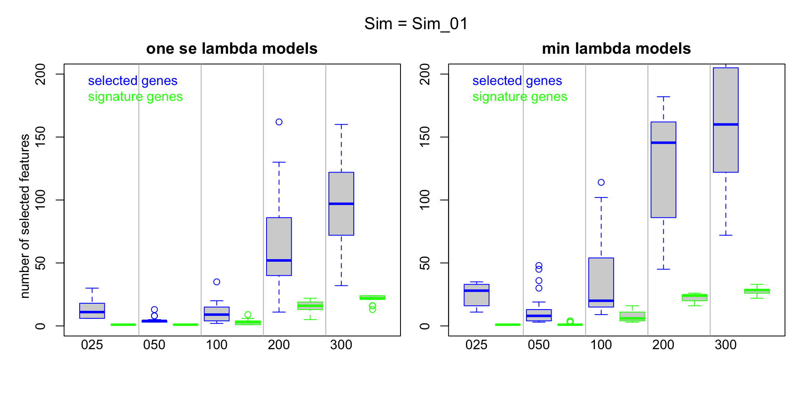
<p class="caption">(\#fig:brca-rnaseq-lasso-simRes-features-bySim)lasso Models Selected Features by Sample Size</p>
</div>

Compare with Figures
\@ref(fig:hcc5hmC-glmnetSuite-lasso-simRes-errors-bySim)
and 
 \@ref(fig:hcc5hmC-glmnetSuite-lasso-simRes-features-bySim)
for the HCC 5hmC data.


**Reader Note**
```
IN the case of discriminating between LumA and other breast cancer subtypes,
we could use features in the LumA breast cancer subtype signature as
positive controls for feature selection.

To Do.
```

<!-- 
In this one simulation, we see:

* The selected number of features in the smaller sample size analyses
are low, with few feaures belonging to the core signature identified in the
full data set.  

* As the sample size increases the number of features selected in the minimum 
lambda model remains variable, but the number of core signature features
selected in the samples of sizes 200 and 300 is stable and between 40 and 50.  
-->

### Summarize results across simulation runs.

#### Model Accuracy Assessment

Now look acoss all simulations.  In the figures that follow, each boxplot
summarizes the results of 30 simulations.  For a give sample size and a 
given simulation, each data point is the median across 30 repeated cv runs.


```r
### CLEAR CACHE

# get full model cv error ref
error_1se_vec <- sapply(brcaRna_cv_lassoAll_lst,
 function(cv_fit) cv_fit$cvm[cv_fit$lambda == cv_fit$lambda.1se])
error_1se_q2 <- quantile(error_1se_vec, prob=1/2)        

error_min_vec <- sapply(brcaRna_cv_lassoAll_lst,
 function(cv_fit) cv_fit$cvm[cv_fit$lambda == cv_fit$lambda.min])
error_min_q2 <- quantile(error_min_vec, prob=1/2)        

# Utility objects
SIZE0 <- stringr::str_pad(SIZE, width=3, pad='0')
stage_vec <- cut(1:nrow(brcaRna_sim_other_qual_mtx), c(0,SIZE), include.lowest = T)

par(mfrow=c(1,2), mar=c(4, 2, 2, 1), oma=c(0,2,2,0))
# 1se
#########################################
## cv
cv_1se_Bysize_lst <- lapply(unique(brcaRna_lasso_sim_results_frm$Size),
function(SizeVal) {
 sizeVal_results_frm <- brcaRna_lasso_sim_results_frm %>% dplyr::filter(Size==SizeVal)
 sizeVal_cv_1se_lst <- with(sizeVal_results_frm, split(cv_1se, SimNo))
 sapply(sizeVal_cv_1se_lst, median)
})
names(cv_1se_Bysize_lst) <- paste0(
 stringr::str_pad(unique(brcaRna_lasso_sim_results_frm$Size), width=3, pad='0'), '_cv')

## test
test_1se_Bysize_lst <- lapply(unique(brcaRna_lasso_sim_results_frm$Size),
function(SizeVal) {
 sizeVal_results_frm <- brcaRna_lasso_sim_results_frm %>% dplyr::filter(Size==SizeVal)
 sizeVal_test_1se_lst <- with(sizeVal_results_frm, split(test_1se, SimNo))
 sapply(sizeVal_test_1se_lst, median)
})
names(test_1se_Bysize_lst) <- paste0(
 stringr::str_pad(unique(brcaRna_lasso_sim_results_frm$Size), width=3, pad='0'), '_test')


error_1se_Bysize_lst <- c(cv_1se_Bysize_lst, test_1se_Bysize_lst)
error_1se_Bysize_lst <- error_1se_Bysize_lst[order(names(error_1se_Bysize_lst))]

boxplot(error_1se_Bysize_lst,
  col=0,
  border=c('blue','green'),
  ylim=c(0, .5),
  outline=F,
  xaxt='n'
)
mtext(side=2, outer=T,  'Misclassification Error')

for(JJ in 1:length(error_1se_Bysize_lst))
points(
   x=jitter(rep(JJ, length(error_1se_Bysize_lst[[JJ]])), amount=0.25), 
   y=error_1se_Bysize_lst[[JJ]], cex=0.5,
   col=ifelse(grepl('cv', names(error_1se_Bysize_lst)[JJ]),'blue', 'green')
)
LL <- -1
axis(side=1, tick=F, line = LL,
  at = match(paste0(SIZE0,'_cv'),names(error_1se_Bysize_lst)),
  SIZE0
 )
abline(v= match(paste0(SIZE0,'_cv'),names(error_1se_Bysize_lst))[-1] - 0.5, col='grey')
abline(h= error_min_q2, col = 'red')
legend('topright',
   #title='min errors', title.col = 'black',
   text.col = c('blue','green'),
   legend = c('cv error', 'test set'),
   bty='n'
 )
title(paste('one se lambda models'))


# min
#########################################
## cv
cv_min_Bysize_lst <- lapply(unique(brcaRna_lasso_sim_results_frm$Size),
function(SizeVal) {
 sizeVal_results_frm <- brcaRna_lasso_sim_results_frm %>% dplyr::filter(Size==SizeVal)
 sizeVal_cv_min_lst <- with(sizeVal_results_frm, split(cv_min, SimNo))
 sapply(sizeVal_cv_min_lst, median)
})
names(cv_min_Bysize_lst) <- paste0(
 stringr::str_pad(unique(brcaRna_lasso_sim_results_frm$Size), width=3, pad='0'), '_cv')

## test
test_min_Bysize_lst <- lapply(unique(brcaRna_lasso_sim_results_frm$Size),
function(SizeVal) {
 sizeVal_results_frm <- brcaRna_lasso_sim_results_frm %>% dplyr::filter(Size==SizeVal)
 sizeVal_test_min_lst <- with(sizeVal_results_frm, split(test_min, SimNo))
 sapply(sizeVal_test_min_lst, median)
})
names(test_min_Bysize_lst) <- paste0(
 stringr::str_pad(unique(brcaRna_lasso_sim_results_frm$Size), width=3, pad='0'), '_test')


error_min_Bysize_lst <- c(cv_min_Bysize_lst, test_min_Bysize_lst)
error_min_Bysize_lst <- error_min_Bysize_lst[order(names(error_min_Bysize_lst))]

boxplot(error_min_Bysize_lst,
  col=0,
  border=c('blue','green'),
  ylim=c(0, .5),
  outline=F,
  xaxt='n'
)
for(JJ in 1:length(error_min_Bysize_lst))
points(
   x=jitter(rep(JJ, length(error_min_Bysize_lst[[JJ]])), amount=0.25), 
   y=error_min_Bysize_lst[[JJ]], cex=0.5,
   col=ifelse(grepl('cv', names(error_min_Bysize_lst)[JJ]),'blue', 'green')
)
LL <- -1
axis(side=1, tick=F, line = LL,
  at = match(paste0(SIZE0,'_cv'),names(error_min_Bysize_lst)),
  SIZE0
 )
abline(v= match(paste0(SIZE0,'_cv'),names(error_min_Bysize_lst))[-1] - 0.5, col='grey')
abline(h= error_min_q2, col = 'red')
legend('topright',
   #title='min errors', title.col = 'black',
   text.col = c('blue','green'),
   legend = c('cv error', 'test set'),
   bty='n'
 )
title(paste('min lambda models'))


mtext(side=3, outer=T, cex=1.25, paste('lasso fit error rates summarized across simulations'))
```

<div class="figure">
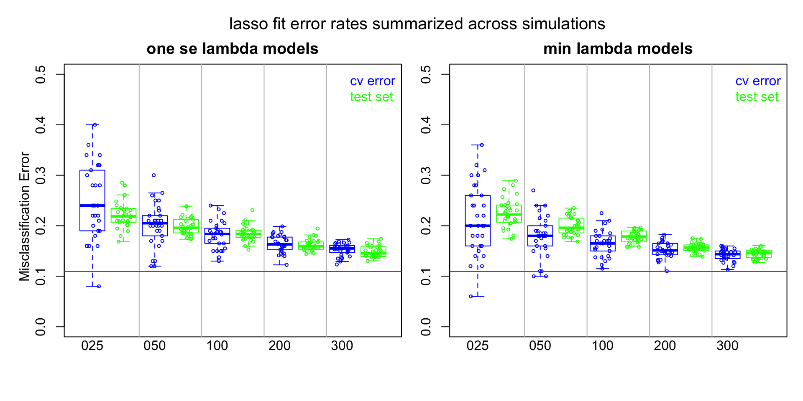
<p class="caption">(\#fig:brca-rnaseq-lasso-simRes-errors-overSim)lasso Model Errors by Sample Size</p>
</div>

<br/>

As in the case of the analysis of the HCC 5hmC data, we see that at lower
samples sizes the assessed performance is quite variable.
In this example cohorts of N=25 LumA and Other subtype samples
can yield classification error estimates ranging from less than %10 
to over 50%.  

<br/>


To appreciate how much variability can be encountered as samples are accrued over time
we need to look at a typical path the assessed model accuracy estimates might take.


```r
### CLEAR CACHE

error_1se_Bysize_mtx <- do.call('cbind', lapply(error_1se_Bysize_lst, function(LL) LL))

cv_error_1se_Bysize_mtx <- error_1se_Bysize_mtx[,grep('_cv', colnames(error_1se_Bysize_mtx))]

plot(x=c(1, ncol(cv_error_1se_Bysize_mtx)), y=c(0,0.6), 
  xlab='sample size', ylab='Misclassification Error', 
  type='n', xaxt='n')
axis(side=1, at=1:ncol(cv_error_1se_Bysize_mtx),
 labels=sub('_cv','',colnames(cv_error_1se_Bysize_mtx)))
for(JJ in 1:15)
lines(x=1:ncol(cv_error_1se_Bysize_mtx), y=cv_error_1se_Bysize_mtx[JJ,],
 type='b', pch=JJ, col=JJ)
title('Example Misclassification Error Paths')
```

<div class="figure">

<p class="caption">(\#fig:brca-glmnetSuite-lasso-simRes-errorsPath-overSim)lasso Model Error Paths</p>
</div>

We see how erratic the assessed model accuracy can be when sample sizes are small,
and that it would be hard to guess the ultimate level of accuracy the
is achievable, or the number of samples required to get a reasonable 
estimate of the achievable level of accuracy.

<br/>


<!--
* For the smaller samples sizes, cv error rates for the minimum lambda models tend to be
optimistic.  

* For lower sample sizes, assess performance is quite variable.
-->


#### Feature Selection


```r
### CLEAR CACHE

# Utility objects
SIZE0 <- stringr::str_pad(SIZE, width=3, pad='0')
stage_vec <- cut(1:nrow(brcaRna_sim_other_qual_mtx), c(0,SIZE), include.lowest = T)

par(mfrow=c(1,2), mar=c(4, 2, 2, 1), oma=c(0,2,2,0))
# 1se
#########################################
# selected features
p_1se_Bysize_lst <- lapply(unique(brcaRna_lasso_sim_results_frm$Size),
function(SizeVal) {
 sizeVal_results_frm <- brcaRna_lasso_sim_results_frm %>% dplyr::filter(Size==SizeVal)
 sizeVal_p_1se_lst <- with(sizeVal_results_frm, split(p_1se, SimNo))
 sapply(sizeVal_p_1se_lst, median)
})
names(p_1se_Bysize_lst) <- paste0(
 stringr::str_pad(unique(brcaRna_lasso_sim_results_frm$Size), width=3, pad='0'), '_p')

# selected signatue features
sign_p_1se_Bysize_lst <- lapply(unique(brcaRna_lasso_sim_results_frm$Size),
function(SizeVal) {
 sizeVal_results_frm <- brcaRna_lasso_sim_results_frm %>% dplyr::filter(Size==SizeVal)
 
  
 sizeVal_sign_genes_1se_lst <- lapply(1:nrow(sizeVal_results_frm), function(RR)
    intersect(unlist(sizeVal_results_frm[RR, 'genes_1se']), lasso_gene_sign_1se_vec))

 sizeVal_sign_p_1se_lst <- split(sapply(sizeVal_sign_genes_1se_lst, length),
    sizeVal_results_frm$SimNo)
 
 sapply(sizeVal_sign_p_1se_lst, median)
})
names(sign_p_1se_Bysize_lst) <- paste0(
 stringr::str_pad(unique(brcaRna_lasso_sim_results_frm$Size), width=3, pad='0'), '_signP')


p_singP_1se_Bysize_lst <- c(p_1se_Bysize_lst, sign_p_1se_Bysize_lst)
p_singP_1se_Bysize_lst <- p_singP_1se_Bysize_lst[order(names(p_singP_1se_Bysize_lst))]

boxplot(p_singP_1se_Bysize_lst,
  col=0,
  border=c('blue','green'),
  ylim=c(0, 300),
  xaxt='n'
)
mtext(side=2, outer=T,  'number of selected features')

for(JJ in 1:length(p_singP_1se_Bysize_lst))
points(
   x=jitter(rep(JJ, length(p_singP_1se_Bysize_lst[[JJ]])), amount=0.25),
   y=p_singP_1se_Bysize_lst[[JJ]], cex=0.5,
   col=ifelse(grepl('_p', names(p_singP_1se_Bysize_lst)[JJ]),'blue', 'green')
)

LL <- -1
axis(side=1, tick=F, line = LL,
  at = match(paste0(SIZE0,'_p'),names(p_singP_1se_Bysize_lst)),
  SIZE0
 )
abline(v= match(paste0(SIZE0,'_p'),names(p_singP_1se_Bysize_lst))[-1] - 0.5, col='grey')
#abline(h= nzero_1se_q2, col = 'red')
legend('topleft',
   #title='1se errors', title.col = 'black',
   text.col = c('blue', 'green'),
   legend= c('selected genes','signature genes'),
   bty='n'
 )
title(paste('one se lamdba models'))


# min
#########################################
# selected features
p_min_Bysize_lst <- lapply(unique(brcaRna_lasso_sim_results_frm$Size),
function(SizeVal) {
 sizeVal_results_frm <- brcaRna_lasso_sim_results_frm %>% dplyr::filter(Size==SizeVal)
 sizeVal_p_min_lst <- with(sizeVal_results_frm, split(p_min, SimNo))
 sapply(sizeVal_p_min_lst, median)
})
names(p_min_Bysize_lst) <- paste0(
 stringr::str_pad(unique(brcaRna_lasso_sim_results_frm$Size), width=3, pad='0'), '_p')

# selected signatue features
sign_p_min_Bysize_lst <- lapply(unique(brcaRna_lasso_sim_results_frm$Size),
function(SizeVal) {
 sizeVal_results_frm <- brcaRna_lasso_sim_results_frm %>% dplyr::filter(Size==SizeVal)
 
  
 sizeVal_sign_genes_min_lst <- lapply(1:nrow(sizeVal_results_frm), function(RR)
    intersect(unlist(sizeVal_results_frm[RR, 'genes_min']), lasso_gene_sign_min_vec))

 sizeVal_sign_p_min_lst <- split(sapply(sizeVal_sign_genes_min_lst, length),
    sizeVal_results_frm$SimNo)
 
 sapply(sizeVal_sign_p_min_lst, median)
})
names(sign_p_min_Bysize_lst) <- paste0(
 stringr::str_pad(unique(brcaRna_lasso_sim_results_frm$Size), width=3, pad='0'), '_signP')


p_singP_min_Bysize_lst <- c(p_min_Bysize_lst, sign_p_min_Bysize_lst)
p_singP_min_Bysize_lst <- p_singP_min_Bysize_lst[order(names(p_singP_min_Bysize_lst))]

boxplot(p_singP_min_Bysize_lst,
  col=0,
  border=c('blue','green'),
  ylim=c(0, 300),
  xaxt='n'
)
for(JJ in 1:length(p_singP_min_Bysize_lst))
points(
   x=jitter(rep(JJ, length(p_singP_min_Bysize_lst[[JJ]])), amount=0.25),
   y=p_singP_min_Bysize_lst[[JJ]], cex=0.5,
   col=ifelse(grepl('_p', names(p_singP_min_Bysize_lst)[JJ]),'blue', 'green')
)

LL <- -1
axis(side=1, tick=F, line = LL,
  at = match(paste0(SIZE0,'_p'),names(p_singP_min_Bysize_lst)),
  SIZE0
 )
abline(v= match(paste0(SIZE0,'_p'),names(p_singP_min_Bysize_lst))[-1] - 0.5, col='grey')
#abline(h= nzero_min_q2, col = 'red')
legend('topleft',
   #title='min errors', title.col = 'black',
   text.col = c('blue', 'green'),
   legend= c('selected genes','signature genes'),
   bty='n'
 )
title(paste('min lambda models'))

mtext(side=3, outer=T, cex=1.25, paste('lasso fit feature selection summarized across simulations'))
```

<div class="figure">

<p class="caption">(\#fig:brca-rnaseq-lasso-simRes-features-OverSim)lasso Models Selected Features by Sample Size</p>
</div>

Compare with Figures
\@ref(fig:hcc5hmC-glmnetSuite-lasso-simRes-errors-overSim)
and
\@ref(fig:hcc5hmC-glmnetSuite-lasso-simRes-features-OverSim)
for the HCC 5hmC data.


<!--

* The number of selected features incerase with sample size.  

*  The number of selected features is quite variable, even for larger sample sizes.

* The number of core signature features among selected features is stable for larger sample
sizes and represenst 30 to 40% of the selected features (for N=200 and 300 respectively).

-->

<!-- SKIP THIS
## Effect of sample consistency

**This is a bust ...**

To see the effect of sample consistency on classification results, we will
focus on the performance of the small sample fits where variability is the
greatest, and the context where investigators should be most aware of the
effect of sample selection over and beyond sample size concerns.
-->

```r
### CLEAR CACHE


other_samp25_qual_vec <- apply(brcaRna_sim_other_qual_mtx[1:25, ], 2, median)
LumA_samp25_qual_vec <- apply(brcaRna_sim_LumA_qual_mtx[1:25, ], 2, median)

samp25_qual_error_mtx <- cbind(
   `1se_cv` = error_1se_Bysize_lst[['025_cv']],
   `1se_test` = error_1se_Bysize_lst[['025_test']],
   `other_Q` = other_samp25_qual_vec,
   `LumA_Q` = LumA_samp25_qual_vec)
 

# Correlation panel
panel.cor <- function(x, y){
    usr <- par("usr"); on.exit(par(usr))
    par(usr = c(0, 1, 0, 1))
    r <- round(cor(x, y), digits=2)
    txt <- paste0("R = ", r)
    cex.cor <- 0.8/strwidth(txt)
    text(0.5, 0.5, txt, cex = 1.5) ###cex.cor * r)
}

pairs(samp25_qual_error_mtx,
 lower.panel = panel.cor)
```

<!-- for the HCC data we had:
We see that although the sample consistency effect is not strong, the consistency of the
LumA sample cohorts does have a measurable impact on the 1se cv and test set error
rates (cor = -0.32 and -0.27, respectively).  
-->

<!--chapter:end:08-glmnnetSuiteBrCaRNASeq.Rmd-->

# Conclusions {#conclusions}

We have found that ...

Other questions ...


<!--chapter:end:A1-summary.Rmd-->


# References {-}
<div id="refs"></div>


#  Appendix 1 - Sample size in elastic net fits to HCC 5hmC-Seq Data {.unnumbered #appendix-1}

Repeat the analyses from Section \@ref(model-suite), but using
the elastic net as classfication model.  


<!-- RUN ONCE -->

```r
set.seed(1)

start_time <-  proc.time()

hcc5hmC_cv_enetAll_lst <- lapply(1:30, function(REP) {
glmnet::cv.glmnet(
 x = all_lcpm_mtx,
 y = factor(hcc5hmC_hcc5hmC,levels = c('Control', 'HCC')),
 alpha = 0.5,
 family = 'binomial',
 type.measure  =  "class",
 keep = T,
 nlambda = 100
)
}
)

message("enetAll time: ", round((proc.time() - start_time)[3],2),"s")
```

<!-- enet-fit-all takes a while - save results -->
<!-- DO THIS ONCE -->


Examine the fits.


```r
### CLEAR CACHE
plot(
 log(hcc5hmC_cv_enetAll_lst[[1]]$lambda),
 hcc5hmC_cv_enetAll_lst[[1]]$cvm,
 lwd=2,
 xlab='log(Lambda)', ylab='CV Misclassification Error', type='l', ylim=c(0, .5)
)

for(JJ in 2:length(hcc5hmC_cv_enetAll_lst))
 lines(
  log(hcc5hmC_cv_enetAll_lst[[JJ]]$lambda),
  hcc5hmC_cv_enetAll_lst[[JJ]]$cvm,
  lwd=2
)
```

<div class="figure">
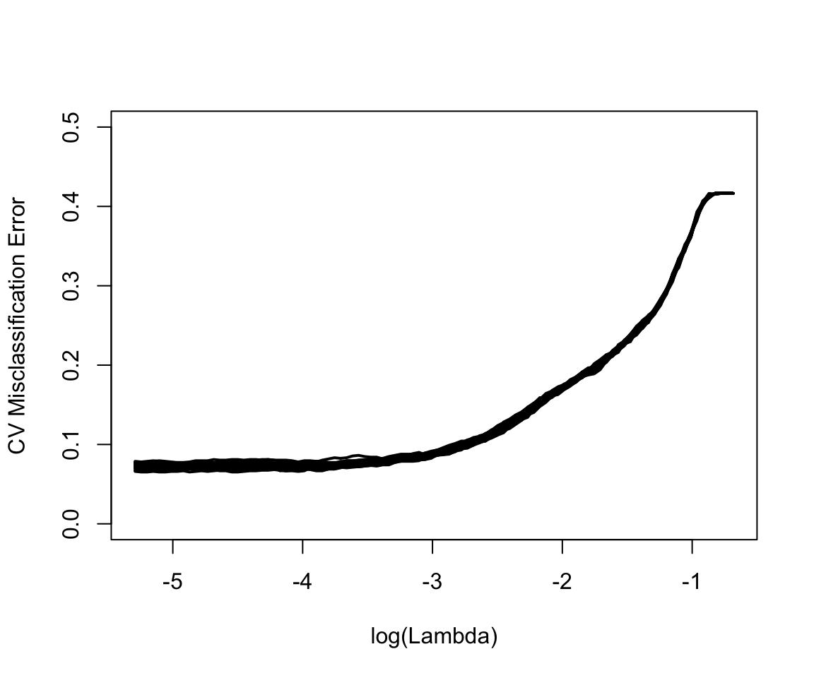
<p class="caption">(\#fig:hcc5hmC-glmnetSuiteB-enet-plot-enetAll)Repeated cv enet models fitted to all samples</p>
</div>

These cv curves are again remarkably consistent meaning that the determination of the size or sparsity
of the model through cross validation is fairly precise:

<!-- DONT CACHE THIS ??? -->


```r
library(magrittr)

par(mfrow=c(1,2), mar=c(3,4, 2, 1))

# nzero
nzero_1se_vec <- sapply(hcc5hmC_cv_enetAll_lst,
 function(cv_fit) cv_fit$nzero[cv_fit$lambda == cv_fit$lambda.1se])

nzero_min_vec <- sapply(hcc5hmC_cv_enetAll_lst,
 function(cv_fit) cv_fit$nzero[cv_fit$lambda == cv_fit$lambda.min])

boxplot(list(`1se`=nzero_1se_vec, min = nzero_min_vec), ylab="Full Model cv Summary")

# error
error_1se_vec <- sapply(hcc5hmC_cv_enetAll_lst,
 function(cv_fit) cv_fit$cvm[cv_fit$lambda == cv_fit$lambda.1se])

error_min_vec <- sapply(hcc5hmC_cv_enetAll_lst,
 function(cv_fit) cv_fit$cvm[cv_fit$lambda == cv_fit$lambda.min])

boxplot(
 list(`1se`=error_1se_vec, min = error_min_vec), 
 ylab=hcc5hmC_cv_enetAll_lst[[1]]$name,
 ylim=c(0.06, .10)
)
```

<div class="figure">

<p class="caption">(\#fig:hcc5hmC-glmnetSuiteB-model-size-enetAll)Feature selection and estimated error by repeated cv enet models</p>
</div>

```r
# tabular format
tmp <- data.frame(rbind(
 `features_1se` = summary(nzero_1se_vec),
 features_min = summary(nzero_min_vec),
 `features:min-1se` = summary(nzero_min_vec - nzero_1se_vec),
 `cv_error_1se` = summary(100*error_1se_vec),
 cv_error_min = summary(100*error_min_vec),
 `cv_error:1se-min` = summary(100*(error_1se_vec-error_min_vec))
))

knitr::kable(tmp %>% dplyr::select(-Mean),
  caption = "Number of selected features",
  digits=1) %>%
   kableExtra::kable_styling(full_width = F)
```

<table class="table" style="width: auto !important; margin-left: auto; margin-right: auto;">
<caption>(\#tab:hcc5hmC-glmnetSuiteB-model-size-enetAll)Number of selected features</caption>
 <thead>
  <tr>
   <th style="text-align:left;">   </th>
   <th style="text-align:right;"> Min. </th>
   <th style="text-align:right;"> X1st.Qu. </th>
   <th style="text-align:right;"> Median </th>
   <th style="text-align:right;"> X3rd.Qu. </th>
   <th style="text-align:right;"> Max. </th>
  </tr>
 </thead>
<tbody>
  <tr>
   <td style="text-align:left;"> features_1se </td>
   <td style="text-align:right;"> 94.0 </td>
   <td style="text-align:right;"> 174.0 </td>
   <td style="text-align:right;"> 183.0 </td>
   <td style="text-align:right;"> 215.0 </td>
   <td style="text-align:right;"> 406.0 </td>
  </tr>
  <tr>
   <td style="text-align:left;"> features_min </td>
   <td style="text-align:right;"> 183.0 </td>
   <td style="text-align:right;"> 271.5 </td>
   <td style="text-align:right;"> 357.5 </td>
   <td style="text-align:right;"> 457.2 </td>
   <td style="text-align:right;"> 501.0 </td>
  </tr>
  <tr>
   <td style="text-align:left;"> features:min-1se </td>
   <td style="text-align:right;"> 23.0 </td>
   <td style="text-align:right;"> 81.5 </td>
   <td style="text-align:right;"> 168.5 </td>
   <td style="text-align:right;"> 237.5 </td>
   <td style="text-align:right;"> 331.0 </td>
  </tr>
  <tr>
   <td style="text-align:left;"> cv_error_1se </td>
   <td style="text-align:right;"> 7.1 </td>
   <td style="text-align:right;"> 7.4 </td>
   <td style="text-align:right;"> 7.6 </td>
   <td style="text-align:right;"> 7.7 </td>
   <td style="text-align:right;"> 8.3 </td>
  </tr>
  <tr>
   <td style="text-align:left;"> cv_error_min </td>
   <td style="text-align:right;"> 6.5 </td>
   <td style="text-align:right;"> 6.8 </td>
   <td style="text-align:right;"> 7.0 </td>
   <td style="text-align:right;"> 7.2 </td>
   <td style="text-align:right;"> 7.5 </td>
  </tr>
  <tr>
   <td style="text-align:left;"> cv_error:1se-min </td>
   <td style="text-align:right;"> 0.2 </td>
   <td style="text-align:right;"> 0.5 </td>
   <td style="text-align:right;"> 0.6 </td>
   <td style="text-align:right;"> 0.7 </td>
   <td style="text-align:right;"> 0.9 </td>
  </tr>
</tbody>
</table>

The number of features selected by the minimum lambda model is larger
than the number selected by the "one standard error" rule by a median
of $168.5$ and results on
a median reduction in cv error rates of 
$0.6$%.  

The cv error rates observed in this set are comparable to the 
rates oberved in the enet models fitted to the training sample set
which consisted of 80% of the samples in this set.  See Table \@ref(tab:printErrors).
It's not clear at this point whether the minimum lambda model is better than
the  "one standard error" rule  model.  We would need and external validation
set to make this determination.  We can compare the two sets
of out-of-fold predicted values, averaged across cv replicates, to see if
there is a meaningful difference between the two.


```r
# predicted probs - 1se
enetAll_predResp_1se_mtx <- sapply(hcc5hmC_cv_enetAll_lst, function(cv_fit) { 
  ndx_1se <- match(cv_fit$lambda.1se,cv_fit$lambda)
  logistic_f(cv_fit$fit.preval[,ndx_1se])
 })
enetAll_predResp_1se_vec <- rowMeans(enetAll_predResp_1se_mtx)

# predicted probs - min
enetAll_predResp_min_mtx <- sapply(hcc5hmC_cv_enetAll_lst, function(cv_fit) { 
  ndx_min <- match(cv_fit$lambda.min,cv_fit$lambda)
  logistic_f(cv_fit$fit.preval[,ndx_min])
 })
enetAll_predResp_min_vec <- rowMeans(enetAll_predResp_min_mtx)

# plot
par(mfrow=c(1,2), mar=c(5,5,2,1))
tmp <- c(
 `1se` = split(enetAll_predResp_1se_vec, hcc5hmC_all_group_vec),
 min = split(enetAll_predResp_min_vec, hcc5hmC_all_group_vec)
)
names(tmp) <- sub('\\.', '\n', names(tmp))

boxplot(
 tmp,
 ylab='Predicted oof probability',
 border=c('green', 'red'),
 xaxt='n'
)
axis(side=1, at=1:length(tmp), tick=F, names(tmp))


# compare the two
plot(
 x = enetAll_predResp_1se_vec, xlab='1se model oof Prob',
 y = enetAll_predResp_min_vec, ylab='min lambda model oof Prob',
 col = ifelse(hcc5hmC_all_group_vec == 'HCC', 'red', 'green')
)
 
# Add referecne lines at 10% false positive
thres_1se <- quantile(enetAll_predResp_1se_vec[hcc5hmC_all_group_vec == 'Control'], prob=.9)
thres_min <- quantile(enetAll_predResp_min_vec[hcc5hmC_all_group_vec == 'Control'], prob=.9)
abline(v = thres_1se, h = thres_min, col='grey')
```

<div class="figure">

<p class="caption">(\#fig:hcc5hmC-glmnetSuiteB-enet-get-sample-pred)Predicted probabilities - averaged over cv replicates</p>
</div>

<!-- THIS PARAGRAPH REFERRED TO THE FITTED PROBS; NOT THE OOF PRED PROBS
We see that the minimum lambda models provide a better fit to the data,
which is to be expected as the minimum lambda models have more estimated
parameters than the one standard error rule models.  
-->

We see that there isn't a big difference in out-of-fold predicted
probabilities between the one-standard-error rule ans minimum lamda models.
One way to quantify
the difference in classification errors is to classify samples
according to each vector of predicted probabilities, setting
the thresholds to achieve a fixed false positive rate, 10% say.
These thresholds are indicated by the grey lines in the scatter plot
on the right side of Figure \@ref(fig:get-sample-pred).  

<!-- APPLIED TO THE FITTED VALUES
We note
that althouth predicted probability distributions are quite different
for the two models, the the class predictions at a 10% false discovery threshold
are largely in agreement.
-->


```r
enetAll_predClass_1se_vec <- ifelse(
 enetAll_predResp_1se_vec > thres_1se, 'HCC', 'Control')

enetAll_predClass_min_vec <- ifelse(
 enetAll_predResp_min_vec > thres_min, 'HCC', 'Control')

tmp <- cbind(
 table(truth=hcc5hmC_all_group_vec, `1se-pred`=enetAll_predClass_1se_vec),
 table(truth=hcc5hmC_all_group_vec, `min-pred`=enetAll_predClass_min_vec)
) 
# Hack for printing
colnames(tmp) <- c('1se-Control', '1se-HCC', 'min-Control', 'min-HCC')

knitr::kable(tmp,
  caption = "Classifications: rows are truth",
  digits=1) %>%
   kableExtra::kable_styling(full_width = F)
```

<table class="table" style="width: auto !important; margin-left: auto; margin-right: auto;">
<caption>(\#tab:hcc5hmC-glmnetSuiteB-enet-get-sample-class)Classifications: rows are truth</caption>
 <thead>
  <tr>
   <th style="text-align:left;">   </th>
   <th style="text-align:right;"> 1se-Control </th>
   <th style="text-align:right;"> 1se-HCC </th>
   <th style="text-align:right;"> min-Control </th>
   <th style="text-align:right;"> min-HCC </th>
  </tr>
 </thead>
<tbody>
  <tr>
   <td style="text-align:left;"> Control </td>
   <td style="text-align:right;"> 700 </td>
   <td style="text-align:right;"> 78 </td>
   <td style="text-align:right;"> 700 </td>
   <td style="text-align:right;"> 78 </td>
  </tr>
  <tr>
   <td style="text-align:left;"> HCC </td>
   <td style="text-align:right;"> 34 </td>
   <td style="text-align:right;"> 521 </td>
   <td style="text-align:right;"> 25 </td>
   <td style="text-align:right;"> 530 </td>
  </tr>
</tbody>
</table>

When we fix the false positive rate at 10%, the `1se` model makes 39 false
negative calls whereas the minimum lambda model makes 32.  A difference
of $1.3$%


<!-- APPLIED TO THE FITTED PROBABILITIES
We see that the min lambda model, makes no false negative calls at a 90% sensitivity
setting, and the sensitivity could be increased substantially at no false negative
cost.  This is definitely over-fitting the data set.  For the purpose
of computing sample quality scores - what do these differences mean? 
-->

<!-- SKIP THIS - can use lasso scores 
### Get quality scores {.unnumbered}  

To compute quality scores, we will use the out-of-fold predicted probabilities.
-->

<!-- HAVING TROUBLE TURNING NUMBERING OFF - add '###'  
-->

## Selected feature list stability  {.unnumbered}

Before moving on to the simulation, let's examine gene selection stability on the
full data set.  We have two sets of sellected features - one for the 
one standard deviation rile model, and one for the mimimum lambda model.
We saw in Table \@ref(tab:model-size-enetAll) that the number of features
selected by the minimum lambda models had an IQR of
$271.5-457.25$,
while the one standard error rule models had an IQR of
$174-215$.

Let's examine the stability of the gene lists across cv replicates.


```r
### CLEAR CACHE


# 1se
enetAll_coef_1se_lst <- lapply(hcc5hmC_cv_enetAll_lst, function(cv_fit){
 cv_fit_coef <- coef(
 cv_fit,
 s = "lambda.1se"
 )
 cv_fit_coef@Dimnames[[1]][cv_fit_coef@i[-1]]
 })

# put into matrix
enetAll_coef_1se_all <- Reduce(union, enetAll_coef_1se_lst)
enetAll_coef_1se_mtx <- sapply(enetAll_coef_1se_lst, 
  function(LL) is.element(enetAll_coef_1se_all, LL)
)
rownames(enetAll_coef_1se_mtx) <- enetAll_coef_1se_all

genes_by_rep_1se_tbl <- table(rowSums(enetAll_coef_1se_mtx))
barplot(
 genes_by_rep_1se_tbl,
 xlab='Number of Replicates',
 ylab='Number of features'

)
```

<div class="figure">

<p class="caption">(\#fig:hcc5hmC-glmnetSuiteB-enet-feature-list-1se)Feature list stability for one standard error rule models</p>
</div>

We see that $76$ features are included in every
cv replicate.  These make up between 
$35$%
and
$44$%
(Q1 and Q3) of the cv replicate one standard error rule models feature lists.


```r
### CLEAR CACHE


# min
enetAll_coef_min_lst <- lapply(hcc5hmC_cv_enetAll_lst, function(cv_fit){
 cv_fit_coef <- coef(
 cv_fit,
 s = "lambda.min"
 )
 cv_fit_coef@Dimnames[[1]][cv_fit_coef@i[-1]]
 })

# put into matrix
enetAll_coef_min_all <- Reduce(union, enetAll_coef_min_lst)
enetAll_coef_min_mtx <- sapply(enetAll_coef_min_lst, 
  function(LL) is.element(enetAll_coef_min_all, LL)
)
rownames(enetAll_coef_min_mtx) <- enetAll_coef_min_all

genes_by_rep_min_tbl <- table(rowSums(enetAll_coef_min_mtx))
barplot(
 genes_by_rep_min_tbl,
 xlab='Number of Replicates',
 ylab='Number of features'

)
```

<div class="figure">

<p class="caption">(\#fig:hcc5hmC-glmnetSuiteB-enet-feature-list-min)Feature list stability for minimum lambda models</p>
</div>

We see that $168$ features are included in every
cv replicate.  These make up between 
$37$%
and
$62$%
(Q1 and Q3) of the cv replicate min feature lists.
We will consider the genes that are selected in all cv replicates as a 
gene signature produced by each model.


```r
enet_gene_sign_1se_vec <- rownames(enetAll_coef_1se_mtx)[rowSums(enetAll_coef_1se_mtx)==30]
enet_gene_sign_min_vec <- rownames(enetAll_coef_min_mtx)[rowSums(enetAll_coef_min_mtx)==30]
```

76 out of
76 of the genes in the 1se model gene signature
are contained in the min lambda model gene signature.

<!-- USE SAME DESIGN AS lasso
## Simulation Design

We are now ready to run the simulations.

-->

## Run simulations - enet {.unnumbered}


As these make take a while to run, 
we will save the results of each similation to a different
object and store to disk.  These can be easily read from disk
when needed for analysis.


The simulation saves results to the file system and
only needs to be run once.  The simulation takes $\approx$ 8 minutes
per iteration, or 4 hours of run time on a laptop.
(Platform: x86_64-apple-darwin17.0 (64-bit)
Running under: macOS Mojave 10.14.6)

<!-- RUN ONCE - THEN GET FROM MEMORY -->

```r
### CLEAR CACHE
start_time <- proc.time()

# Get stage from SIZE
stage_vec <- cut(1:nrow(sim_control_qual_mtx), c(0, SIZE), include.lowest = T)

# ran in two runs 1:7, 8:ncol
for (SIMno in 8:ncol(sim_control_qual_mtx)) {

  #cat("Running simulation ", SIMno, "\n")

  sim_cv_lst <- lapply(1:length(levels(stage_vec)), function(STGno) {
    Stage_rows_vec <- which(stage_vec %in% levels(stage_vec)[1:STGno])
    #cat("Stage ", STGno, "- analyzing", length(Stage_rows_vec), "paired samples.\n")

    sim_stage_samples_vec <- c(
      all_control_vec[sim_control_mtx[Stage_rows_vec, SIMno]],
      all_affected_vec[sim_affected_mtx[Stage_rows_vec, SIMno]]
    )
    sim_stage_lcpm_mtx <- all_lcpm_mtx[sim_stage_samples_vec, ]
    sim_stage_group_vec <- hcc5hmC_all_group_vec[sim_stage_samples_vec]
    #print(table(sim_stage_group_vec))

    sim_stage_cv_lst <- lapply(1:CV_REP, function(CV) {
      cv_fit <- glmnet::cv.glmnet(
        x = sim_stage_lcpm_mtx,
        y = sim_stage_group_vec,
        alpha = 1,
        family = "binomial",
        type.measure = "class",
        keep = T,
        nlambda = 30
      )

      # Extract 1se metrics from cv_fit
      #######################
      ndx_1se <- which(cv_fit$lambda == cv_fit$lambda.1se)

      nzero_1se <- cv_fit$nzero[ndx_1se]
      cvm_1se <- cv_fit$cvm[ndx_1se]

      # test error
      sim_stage_test_samples_vec <- setdiff(rownames(all_lcpm_mtx), sim_stage_samples_vec)
      sim_stage_test_lcpm_mtx <- all_lcpm_mtx[sim_stage_test_samples_vec,]
      sim_stage_test_group_vec <- hcc5hmC_all_group_vec[sim_stage_test_samples_vec]

      test_pred_1se_vec <- predict(
       cv_fit,
       newx=sim_stage_test_lcpm_mtx,
       s="lambda.1se",
       type="class"
      )
      test_1se_error <- mean(test_pred_1se_vec != sim_stage_test_group_vec)

      # genes
      coef_1se <- coef(
        cv_fit,
        s = "lambda.1se"
      )
      genes_1se <- coef_1se@Dimnames[[1]][coef_1se@i[-1]]

      # Extract min metrics from cv_fit
      #######################
      ndx_min <- which(cv_fit$lambda == cv_fit$lambda.min)

      nzero_min <- cv_fit$nzero[ndx_min]
      cvm_min <- cv_fit$cvm[ndx_min]

      # test error
      sim_stage_test_samples_vec <- setdiff(rownames(all_lcpm_mtx), sim_stage_samples_vec)
      sim_stage_test_lcpm_mtx <- all_lcpm_mtx[sim_stage_test_samples_vec,]
      sim_stage_test_group_vec <- hcc5hmC_all_group_vec[sim_stage_test_samples_vec]

      test_pred_min_vec <- predict(
       cv_fit,
       newx=sim_stage_test_lcpm_mtx,
       s="lambda.min",
       type="class"
      )
      test_min_error <- mean(test_pred_min_vec != sim_stage_test_group_vec)

      # genes
      coef_min <- coef(
        cv_fit,
        s = "lambda.min"
      )
      genes_min <- coef_min@Dimnames[[1]][coef_min@i[-1]]

      # return cv_fit summary metrics
      list(
       p_1se = nzero_1se, 
       p_min = nzero_min, 
       cv_1se = cvm_1se, 
       cv_min = cvm_min, 
       test_1se=test_1se_error, 
       test_min=test_min_error, 
       genes_1se = genes_1se,
       genes_min = genes_min)
    })
    sim_stage_cv_lst
  })

  # save  sim_cv_lst
  fName <- paste0("enet_sim_", SIMno, "_cv_lst")
  assign(fName, sim_cv_lst)
  save(list = fName, file=file.path("RData", fName))

}
  message("simulation time: ", round((proc.time() - start_time)[3], 2), "s")
```


## enet Simulation results {.unnumbered}

<!--
First we extract simluation results and store into one big table:
-->


<!-- 
Have a table of simulation results - `enet_sim_results_frm`:
-->


### Simulation Results - look at one simulation {.unnumbered}


First examine results for one simulation run.


```r
### CLEAR CACHE

# get full model cv error ref
error_1se_vec <- sapply(hcc5hmC_cv_enetAll_lst,
 function(cv_fit) cv_fit$cvm[cv_fit$lambda == cv_fit$lambda.1se])
error_1se_q2 <- quantile(error_1se_vec, prob=1/2)        

error_min_vec <- sapply(hcc5hmC_cv_enetAll_lst,
 function(cv_fit) cv_fit$cvm[cv_fit$lambda == cv_fit$lambda.min])
error_min_q2 <- quantile(error_min_vec, prob=1/2)        

# Utility objects
SIZE0 <- stringr::str_pad(SIZE, width=3, pad='0')
stage_vec <- cut(1:nrow(sim_control_qual_mtx), c(0,SIZE), include.lowest = T)


#SIM <- "Sim_01"

for(SIM in unique(enet_sim_results_frm$SimNo)[1]){

SimNum <- as.numeric(sub('Sim_','',SIM))

simNo_results_frm <- enet_sim_results_frm %>% dplyr::filter(SimNo==SIM)


# errors
par(mfrow=c(1,2), mar=c(4, 2, 2, 1), oma=c(0,0,2,0))
###################
# 1se
####################
cv_1se_lst <- with(simNo_results_frm,
 split(cv_1se, Size))
names(cv_1se_lst) <- paste0(stringr::str_pad(names(cv_1se_lst), width=3, pad='0'),'_cv')

test_1se_lst <- with(simNo_results_frm,
 split(test_1se, Size))
names(test_1se_lst) <- paste0(stringr::str_pad(names(test_1se_lst), width=3, pad='0'),'_cv')

error_1se_lst <- c(cv_1se_lst, test_1se_lst)
error_1se_lst <- error_1se_lst[order(names(error_1se_lst))]

boxplot(error_1se_lst, 
  border=c('blue','green'), 
  ylim=c(0.05, .4),
  xaxt='n'
)
LL <- -1
axis(side=1, tick=F, line = LL,
  at = match(paste0(SIZE0,'_cv'),names(error_1se_lst)), 
  SIZE0
 )
abline(v= match(paste0(SIZE0,'_cv'),names(error_1se_lst))[-1] - 0.5, col='grey')
abline(h= error_1se_q2, col = 'red')
legend('topright', 
   #title='1se errors', title.col = 'black',
   text.col = c('blue','green'),
   legend = c('cv error', 'test set'),
   bty='n'
 )
title(paste('one se lambda - error rates'))

SKIP  <- function() {
# Add qual annotation
control_qual_vec <- sapply(split(sim_control_qual_mtx[,SimNum], stage_vec), median)
affected_qual_vec <- sapply(split(sim_affected_qual_mtx[,SimNum], stage_vec), median)
LL <- LL + 1
axis(side=1, tick=F, line = LL,
  at = match(paste0(SIZE0,'_cv'),names(error_1se_lst)),
  round(control_qual_vec, 2)
 )
LL <- LL + 1
axis(side=1, tick=F, line = LL,
  at = match(paste0(SIZE0,'_cv'),names(error_1se_lst)),
  round(affected_qual_vec, 2)
 )
}#SKIP

# min
####################
cv_min_lst <- with(simNo_results_frm,
 split(cv_min, Size))
names(cv_min_lst) <- paste0(stringr::str_pad(names(cv_min_lst), width=3, pad='0'),'_cv')

test_min_lst <- with(simNo_results_frm,
 split(test_min, Size))
names(test_min_lst) <- paste0(stringr::str_pad(names(test_min_lst), width=3, pad='0'),'_cv')

error_min_lst <- c(cv_min_lst, test_min_lst)
error_min_lst <- error_min_lst[order(names(error_min_lst))]

boxplot(error_min_lst, 
  border=c('blue','green'), 
  ylim=c(0.05, .4),
  xaxt='n'
)
LL <- -1
axis(side=1, tick=F, line = LL,
  at = match(paste0(SIZE0,'_cv'),names(error_min_lst)), 
  SIZE0
 )
abline(v= match(paste0(SIZE0,'_cv'),names(error_min_lst))[-1] - 0.5, col='grey')
abline(h= error_min_q2, col = 'red')
legend('topright', 
   #title='min errors', title.col = 'black',
   text.col = c('blue','green'),
   legend = c('cv error', 'test set'),
   bty='n'
 )
title(paste('min lambda - error rates'))

SKIP  <- function() {
# Add qual annotation
control_qual_vec <- sapply(split(sim_control_qual_mtx[,SimNum], stage_vec), median)
affected_qual_vec <- sapply(split(sim_affected_qual_mtx[,SimNum], stage_vec), median)
LL <- LL + 1
axis(side=1, tick=F, line = LL,
  at = match(paste0(SIZE0,'_cv'),names(error_min_lst)),
  round(control_qual_vec, 2)
 )
LL <- LL + 1
axis(side=1, tick=F, line = LL,
  at = match(paste0(SIZE0,'_cv'),names(error_min_lst)),
  round(affected_qual_vec, 2)
 )
}#SKIP
mtext(side=3, outer=T, cex=1.25, paste('Sim =',  SIM))

} # for(SIM
```

<div class="figure">
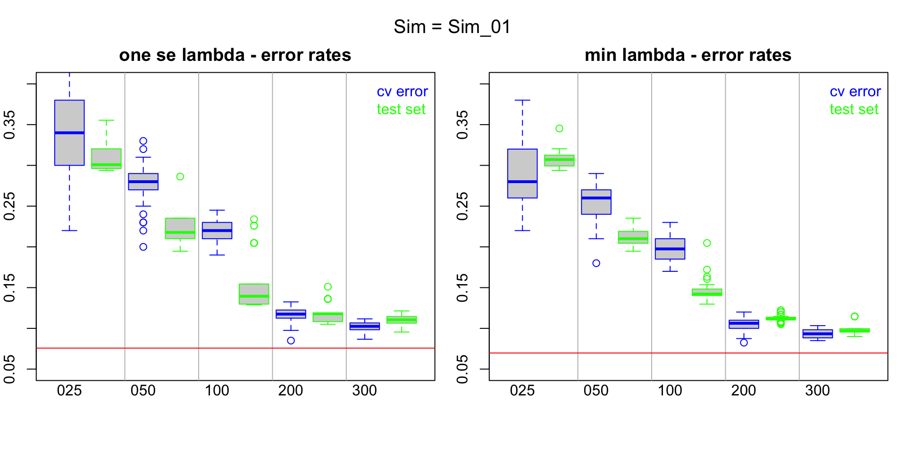
<p class="caption">(\#fig:hcc5hmC-glmnetSuiteB-enet-simRes-errors-bySim)enet Model Errors by Sample Size</p>
</div>


```r
### CLEAR CACHE

# get full model nzero ref
nzero_1se_vec <- sapply(hcc5hmC_cv_enetAll_lst,
 function(cv_fit) cv_fit$nzero[cv_fit$lambda == cv_fit$lambda.1se])
nzero_1se_q2 <- quantile(nzero_1se_vec, prob=c(2)/4)

nzero_min_vec <- sapply(hcc5hmC_cv_enetAll_lst,
 function(cv_fit) cv_fit$nzero[cv_fit$lambda == cv_fit$lambda.min])
nzero_min_q2 <- quantile(nzero_min_vec, prob=c(2)/4)

# Utility objects
SIZE0 <- stringr::str_pad(SIZE, width=3, pad='0')
stage_vec <- cut(1:nrow(sim_control_qual_mtx), c(0,SIZE), include.lowest = T)


#SIM <- "Sim_01"

for(SIM in unique(enet_sim_results_frm$SimNo)[1]){

SimNum <- as.numeric(sub('Sim_','',SIM))

simNo_results_frm <- enet_sim_results_frm %>% dplyr::filter(SimNo==SIM)


par(mfrow=c(1,2), mar=c(4, 2, 2, 1), oma=c(0,0,2,0))
###################
# 1se
####################
# selected feature counts
p_1se_lst <- with(simNo_results_frm,
 split(p_1se, Size))
names(p_1se_lst) <- paste0(stringr::str_pad(names(p_1se_lst), width=3, pad='0'),'_p')

# get selected features that are part of enet_gene_sign_1se_vec
# - the signature selected genes
sign_genes_1se_lst <- lapply(1:nrow(simNo_results_frm), function(RR)
    intersect(unlist(simNo_results_frm[RR, 'genes_1se']), enet_gene_sign_1se_vec))

sign_p_1se_lst <- split(sapply(sign_genes_1se_lst, length), simNo_results_frm$Size)
names(sign_p_1se_lst) <- paste0(stringr::str_pad(names(sign_p_1se_lst), width=3, pad='0'),'_signP')


p_singP_1se_lst <- c(p_1se_lst, sign_p_1se_lst)
p_singP_1se_lst <- p_singP_1se_lst[order(names(p_singP_1se_lst))]

boxplot(p_singP_1se_lst,
  border=c('blue','green'),
  #ylim=c(0, 300),
  xaxt='n'
)
LL <- -1
axis(side=1, tick=F, line = LL,
  at = match(paste0(SIZE0,'_p'),names(p_singP_1se_lst)),
  SIZE0
 )
abline(v= match(paste0(SIZE0,'_p'),names(p_singP_1se_lst))[-1] - 0.5, col='grey')
#abline(h= nzero_1se_q2, col = 'red')
legend('topleft',
   #title='1se errors', title.col = 'black',
   text.col = c('blue', 'green'),
   legend= c('selected genes','signature genes'),
   bty='n'
 )
title(paste('one se lamdba - selected gene counts'))

SKIP  <- function() {
# Add qual annotation
control_qual_vec <- sapply(split(sim_control_qual_mtx[,SimNum], stage_vec), median)
affected_qual_vec <- sapply(split(sim_affected_qual_mtx[,SimNum], stage_vec), median)
LL <- LL + 1
axis(side=1, tick=F, line = LL,
  at =  match(paste0(SIZE0,'_p'),names(p_singP_1se_lst)),
  round(control_qual_vec, 2)
 )
LL <- LL + 1
axis(side=1, tick=F, line = LL,
  at =  match(paste0(SIZE0,'_p'),names(p_singP_1se_lst)),
  round(affected_qual_vec, 2)
 )
}#SKIP

###################
# min
####################
# selected feature counts
p_min_lst <- with(simNo_results_frm,
 split(p_min, Size))
names(p_min_lst) <- paste0(stringr::str_pad(names(p_min_lst), width=3, pad='0'),'_p')

# get selected features that are part of enet_gene_sign_min_vec
# - the signature selected genes
sign_genes_min_lst <- lapply(1:nrow(simNo_results_frm), function(RR)
    intersect(unlist(simNo_results_frm[RR, 'genes_min']), enet_gene_sign_min_vec))

sign_p_min_lst <- split(sapply(sign_genes_min_lst, length), simNo_results_frm$Size)
names(sign_p_min_lst) <- paste0(stringr::str_pad(names(sign_p_min_lst), width=3, pad='0'),'_signP')


p_singP_min_lst <- c(p_min_lst, sign_p_min_lst)
p_singP_min_lst <- p_singP_min_lst[order(names(p_singP_min_lst))]

boxplot(p_singP_min_lst,
  border=c('blue','green'),
  #ylim=c(0, 300),
  xaxt='n'
)
LL <- -1
axis(side=1, tick=F, line = LL,
  at = match(paste0(SIZE0,'_p'),names(p_singP_min_lst)),
  SIZE0
 )
abline(v= match(paste0(SIZE0,'_p'),names(p_singP_min_lst))[-1] - 0.5, col='grey')
#abline(h= nzero_min_q2, col = 'red')
legend('topleft',
   #title='min errors', title.col = 'black',
   text.col = c('blue', 'green'),
   legend= c('selected genes','signature genes'),
   bty='n'
 )
title(paste('min lambda - selected gene counts'))

SKIP  <- function() {
# Add qual annotation
control_qual_vec <- sapply(split(sim_control_qual_mtx[,SimNum], stage_vec), median)
affected_qual_vec <- sapply(split(sim_affected_qual_mtx[,SimNum], stage_vec), median)
LL <- LL + 1
axis(side=1, tick=F, line = LL,
  at =  match(paste0(SIZE0,'_p'),names(p_singP_min_lst)),
  round(control_qual_vec, 2)
 )
LL <- LL + 1
axis(side=1, tick=F, line = LL,
  at =  match(paste0(SIZE0,'_p'),names(p_singP_min_lst)),
  round(affected_qual_vec, 2)
 )
}#SKIP

mtext(side=3, outer=T, cex=1.25, paste('Sim =',  SIM))

} # for(SIM
```

<div class="figure">

<p class="caption">(\#fig:hcc5hmC-glmnetSuiteB-enet-simRes-features-bySim)enet Models Selected Features by Sample Size</p>
</div>


### Summarize results across simulation runs  {.unnumbered}


```r
### CLEAR CACHE

# get full model cv error ref
error_1se_vec <- sapply(hcc5hmC_cv_enetAll_lst,
 function(cv_fit) cv_fit$cvm[cv_fit$lambda == cv_fit$lambda.1se])
error_1se_q2 <- quantile(error_1se_vec, prob=1/2)        

error_min_vec <- sapply(hcc5hmC_cv_enetAll_lst,
 function(cv_fit) cv_fit$cvm[cv_fit$lambda == cv_fit$lambda.min])
error_min_q2 <- quantile(error_min_vec, prob=1/2)        

# Utility objects
SIZE0 <- stringr::str_pad(SIZE, width=3, pad='0')
stage_vec <- cut(1:nrow(sim_control_qual_mtx), c(0,SIZE), include.lowest = T)

par(mfrow=c(1,2), mar=c(4, 2, 2, 1), oma=c(0,0,2,0))
# 1se
#########################################
## cv
cv_1se_Bysize_lst <- lapply(unique(enet_sim_results_frm$Size),
function(SizeVal) {
 sizeVal_results_frm <- enet_sim_results_frm %>% dplyr::filter(Size==SizeVal)
 sizeVal_cv_1se_lst <- with(sizeVal_results_frm, split(cv_1se, SimNo))
 sapply(sizeVal_cv_1se_lst, median)
})
names(cv_1se_Bysize_lst) <- paste0(
 stringr::str_pad(unique(enet_sim_results_frm$Size), width=3, pad='0'), '_cv')

## test
test_1se_Bysize_lst <- lapply(unique(enet_sim_results_frm$Size),
function(SizeVal) {
 sizeVal_results_frm <- enet_sim_results_frm %>% dplyr::filter(Size==SizeVal)
 sizeVal_test_1se_lst <- with(sizeVal_results_frm, split(test_1se, SimNo))
 sapply(sizeVal_test_1se_lst, median)
})
names(test_1se_Bysize_lst) <- paste0(
 stringr::str_pad(unique(enet_sim_results_frm$Size), width=3, pad='0'), '_test')


error_1se_Bysize_lst <- c(cv_1se_Bysize_lst, test_1se_Bysize_lst)
error_1se_Bysize_lst <- error_1se_Bysize_lst[order(names(error_1se_Bysize_lst))]

boxplot(error_1se_Bysize_lst,
  col=0,
  border=c('blue','green'),
  ylim=c(0.05, .5),
  outline=F,
  xaxt='n'
)
for(JJ in 1:length(error_1se_Bysize_lst))
points(
   x=jitter(rep(JJ, length(error_1se_Bysize_lst[[JJ]])), amount=0.25), 
   y=error_1se_Bysize_lst[[JJ]], cex=0.5,
   col=ifelse(grepl('cv', names(error_1se_Bysize_lst)[JJ]),'blue', 'green')
)
LL <- -1
axis(side=1, tick=F, line = LL,
  at = match(paste0(SIZE0,'_cv'),names(error_1se_Bysize_lst)),
  SIZE0
 )
abline(v= match(paste0(SIZE0,'_cv'),names(error_1se_Bysize_lst))[-1] - 0.5, col='grey')
abline(h= error_min_q2, col = 'red')
legend('topright',
   #title='min errors', title.col = 'black',
   text.col = c('blue','green'),
   legend = c('cv error', 'test set'),
   bty='n'
 )
title(paste('one se lambda - error rates'))


# min
#########################################
## cv
cv_min_Bysize_lst <- lapply(unique(enet_sim_results_frm$Size),
function(SizeVal) {
 sizeVal_results_frm <- enet_sim_results_frm %>% dplyr::filter(Size==SizeVal)
 sizeVal_cv_min_lst <- with(sizeVal_results_frm, split(cv_min, SimNo))
 sapply(sizeVal_cv_min_lst, median)
})
names(cv_min_Bysize_lst) <- paste0(
 stringr::str_pad(unique(enet_sim_results_frm$Size), width=3, pad='0'), '_cv')

## test
test_min_Bysize_lst <- lapply(unique(enet_sim_results_frm$Size),
function(SizeVal) {
 sizeVal_results_frm <- enet_sim_results_frm %>% dplyr::filter(Size==SizeVal)
 sizeVal_test_min_lst <- with(sizeVal_results_frm, split(test_min, SimNo))
 sapply(sizeVal_test_min_lst, median)
})
names(test_min_Bysize_lst) <- paste0(
 stringr::str_pad(unique(enet_sim_results_frm$Size), width=3, pad='0'), '_test')


error_min_Bysize_lst <- c(cv_min_Bysize_lst, test_min_Bysize_lst)
error_min_Bysize_lst <- error_min_Bysize_lst[order(names(error_min_Bysize_lst))]

boxplot(error_min_Bysize_lst,
  col=0,
  border=c('blue','green'),
  ylim=c(0.05, .5),
  outline=F,
  xaxt='n'
)
for(JJ in 1:length(error_min_Bysize_lst))
points(
   x=jitter(rep(JJ, length(error_min_Bysize_lst[[JJ]])), amount=0.25), 
   y=error_min_Bysize_lst[[JJ]], cex=0.5,
   col=ifelse(grepl('cv', names(error_min_Bysize_lst)[JJ]),'blue', 'green')
)
LL <- -1
axis(side=1, tick=F, line = LL,
  at = match(paste0(SIZE0,'_cv'),names(error_min_Bysize_lst)),
  SIZE0
 )
abline(v= match(paste0(SIZE0,'_cv'),names(error_min_Bysize_lst))[-1] - 0.5, col='grey')
abline(h= error_min_q2, col = 'red')
legend('topright',
   #title='min errors', title.col = 'black',
   text.col = c('blue','green'),
   legend = c('cv error', 'test set'),
   bty='n'
 )
title(paste('min lambda - error rates'))


mtext(side=3, outer=T, cex=1.25, paste('enet fit error rates summarized across simulations'))
```

<div class="figure">

<p class="caption">(\#fig:hcc5hmC-glmnetSuiteB-enet-simRes-errors-overSim)enet Model Errors by Sample Size</p>
</div>


```r
### CLEAR CACHE

error_1se_Bysize_sum_frm <- t(sapply(error_1se_Bysize_lst, function(LL) quantile(LL, prob=(1:3)/4)))
colnames(error_1se_Bysize_sum_frm) <- paste0('1se_', colnames(error_1se_Bysize_sum_frm))


error_min_Bysize_sum_frm <- t(sapply(error_min_Bysize_lst, function(LL) quantile(LL, prob=(1:3)/4)))
colnames(error_min_Bysize_sum_frm) <- paste0('min_', colnames(error_min_Bysize_sum_frm))


knitr::kable(cbind(`1se`=error_1se_Bysize_sum_frm, min=error_min_Bysize_sum_frm),
      caption = paste("elastic net error rates by sample size across simulations"),
    digits=2) %>%
   kableExtra::kable_styling(full_width = F)
```

<table class="table" style="width: auto !important; margin-left: auto; margin-right: auto;">
<caption>(\#tab:hcc5hmC-glmnetSuiteB-print-enet-simRes-errors-overSim)elastic net error rates by sample size across simulations</caption>
 <thead>
  <tr>
   <th style="text-align:left;">   </th>
   <th style="text-align:right;"> 1se_25% </th>
   <th style="text-align:right;"> 1se_50% </th>
   <th style="text-align:right;"> 1se_75% </th>
   <th style="text-align:right;"> min_25% </th>
   <th style="text-align:right;"> min_50% </th>
   <th style="text-align:right;"> min_75% </th>
  </tr>
 </thead>
<tbody>
  <tr>
   <td style="text-align:left;"> 025_cv </td>
   <td style="text-align:right;"> 0.30 </td>
   <td style="text-align:right;"> 0.32 </td>
   <td style="text-align:right;"> 0.40 </td>
   <td style="text-align:right;"> 0.26 </td>
   <td style="text-align:right;"> 0.29 </td>
   <td style="text-align:right;"> 0.38 </td>
  </tr>
  <tr>
   <td style="text-align:left;"> 025_test </td>
   <td style="text-align:right;"> 0.27 </td>
   <td style="text-align:right;"> 0.30 </td>
   <td style="text-align:right;"> 0.36 </td>
   <td style="text-align:right;"> 0.28 </td>
   <td style="text-align:right;"> 0.32 </td>
   <td style="text-align:right;"> 0.37 </td>
  </tr>
  <tr>
   <td style="text-align:left;"> 050_cv </td>
   <td style="text-align:right;"> 0.20 </td>
   <td style="text-align:right;"> 0.23 </td>
   <td style="text-align:right;"> 0.28 </td>
   <td style="text-align:right;"> 0.18 </td>
   <td style="text-align:right;"> 0.21 </td>
   <td style="text-align:right;"> 0.25 </td>
  </tr>
  <tr>
   <td style="text-align:left;"> 050_test </td>
   <td style="text-align:right;"> 0.22 </td>
   <td style="text-align:right;"> 0.24 </td>
   <td style="text-align:right;"> 0.26 </td>
   <td style="text-align:right;"> 0.21 </td>
   <td style="text-align:right;"> 0.24 </td>
   <td style="text-align:right;"> 0.26 </td>
  </tr>
  <tr>
   <td style="text-align:left;"> 100_cv </td>
   <td style="text-align:right;"> 0.16 </td>
   <td style="text-align:right;"> 0.18 </td>
   <td style="text-align:right;"> 0.20 </td>
   <td style="text-align:right;"> 0.15 </td>
   <td style="text-align:right;"> 0.17 </td>
   <td style="text-align:right;"> 0.18 </td>
  </tr>
  <tr>
   <td style="text-align:left;"> 100_test </td>
   <td style="text-align:right;"> 0.17 </td>
   <td style="text-align:right;"> 0.18 </td>
   <td style="text-align:right;"> 0.19 </td>
   <td style="text-align:right;"> 0.16 </td>
   <td style="text-align:right;"> 0.17 </td>
   <td style="text-align:right;"> 0.18 </td>
  </tr>
  <tr>
   <td style="text-align:left;"> 200_cv </td>
   <td style="text-align:right;"> 0.12 </td>
   <td style="text-align:right;"> 0.13 </td>
   <td style="text-align:right;"> 0.13 </td>
   <td style="text-align:right;"> 0.11 </td>
   <td style="text-align:right;"> 0.12 </td>
   <td style="text-align:right;"> 0.12 </td>
  </tr>
  <tr>
   <td style="text-align:left;"> 200_test </td>
   <td style="text-align:right;"> 0.11 </td>
   <td style="text-align:right;"> 0.12 </td>
   <td style="text-align:right;"> 0.13 </td>
   <td style="text-align:right;"> 0.11 </td>
   <td style="text-align:right;"> 0.12 </td>
   <td style="text-align:right;"> 0.12 </td>
  </tr>
  <tr>
   <td style="text-align:left;"> 300_cv </td>
   <td style="text-align:right;"> 0.10 </td>
   <td style="text-align:right;"> 0.10 </td>
   <td style="text-align:right;"> 0.11 </td>
   <td style="text-align:right;"> 0.09 </td>
   <td style="text-align:right;"> 0.10 </td>
   <td style="text-align:right;"> 0.10 </td>
  </tr>
  <tr>
   <td style="text-align:left;"> 300_test </td>
   <td style="text-align:right;"> 0.09 </td>
   <td style="text-align:right;"> 0.10 </td>
   <td style="text-align:right;"> 0.10 </td>
   <td style="text-align:right;"> 0.08 </td>
   <td style="text-align:right;"> 0.09 </td>
   <td style="text-align:right;"> 0.10 </td>
  </tr>
</tbody>
</table>


Now look at feature selection.


```r
### CLEAR CACHE

# Utility objects
SIZE0 <- stringr::str_pad(SIZE, width=3, pad='0')
stage_vec <- cut(1:nrow(sim_control_qual_mtx), c(0,SIZE), include.lowest = T)

par(mfrow=c(1,2), mar=c(4, 2, 2, 1), oma=c(0,0,2,0))
# 1se
#########################################
# selected features
p_1se_Bysize_lst <- lapply(unique(enet_sim_results_frm$Size),
function(SizeVal) {
 sizeVal_results_frm <- enet_sim_results_frm %>% dplyr::filter(Size==SizeVal)
 sizeVal_p_1se_lst <- with(sizeVal_results_frm, split(p_1se, SimNo))
 sapply(sizeVal_p_1se_lst, median)
})
names(p_1se_Bysize_lst) <- paste0(
 stringr::str_pad(unique(enet_sim_results_frm$Size), width=3, pad='0'), '_p')

# selected signatue features
sign_p_1se_Bysize_lst <- lapply(unique(enet_sim_results_frm$Size),
function(SizeVal) {
 sizeVal_results_frm <- enet_sim_results_frm %>% dplyr::filter(Size==SizeVal)
 
  
 sizeVal_sign_genes_1se_lst <- lapply(1:nrow(sizeVal_results_frm), function(RR)
    intersect(unlist(sizeVal_results_frm[RR, 'genes_1se']), enet_gene_sign_1se_vec))

 sizeVal_sign_p_1se_lst <- split(sapply(sizeVal_sign_genes_1se_lst, length),
    sizeVal_results_frm$SimNo)
 
 sapply(sizeVal_sign_p_1se_lst, median)
})
names(sign_p_1se_Bysize_lst) <- paste0(
 stringr::str_pad(unique(enet_sim_results_frm$Size), width=3, pad='0'), '_signP')


p_singP_1se_Bysize_lst <- c(p_1se_Bysize_lst, sign_p_1se_Bysize_lst)
p_singP_1se_Bysize_lst <- p_singP_1se_Bysize_lst[order(names(p_singP_1se_Bysize_lst))]

boxplot(p_singP_1se_Bysize_lst,
  col=0,
  border=c('blue','green'),
  #ylim=c(0, 300),
  xaxt='n'
)
for(JJ in 1:length(p_singP_1se_Bysize_lst))
points(
   x=jitter(rep(JJ, length(p_singP_1se_Bysize_lst[[JJ]])), amount=0.25),
   y=p_singP_1se_Bysize_lst[[JJ]], cex=0.5,
   col=ifelse(grepl('_p', names(p_singP_1se_Bysize_lst)[JJ]),'blue', 'green')
)

LL <- -1
axis(side=1, tick=F, line = LL,
  at = match(paste0(SIZE0,'_p'),names(p_singP_1se_Bysize_lst)),
  SIZE0
 )
abline(v= match(paste0(SIZE0,'_p'),names(p_singP_1se_Bysize_lst))[-1] - 0.5, col='grey')
#abline(h= nzero_1se_q2, col = 'red')
legend('topleft',
   #title='1se errors', title.col = 'black',
   text.col = c('blue', 'green'),
   legend= c('selected genes','signature genes'),
   bty='n'
 )
title(paste('one se lamdba - selected gene counts'))


# min
#########################################
# selected features
p_min_Bysize_lst <- lapply(unique(enet_sim_results_frm$Size),
function(SizeVal) {
 sizeVal_results_frm <- enet_sim_results_frm %>% dplyr::filter(Size==SizeVal)
 sizeVal_p_min_lst <- with(sizeVal_results_frm, split(p_min, SimNo))
 sapply(sizeVal_p_min_lst, median)
})
names(p_min_Bysize_lst) <- paste0(
 stringr::str_pad(unique(enet_sim_results_frm$Size), width=3, pad='0'), '_p')

# selected signatue features
sign_p_min_Bysize_lst <- lapply(unique(enet_sim_results_frm$Size),
function(SizeVal) {
 sizeVal_results_frm <- enet_sim_results_frm %>% dplyr::filter(Size==SizeVal)
 
  
 sizeVal_sign_genes_min_lst <- lapply(1:nrow(sizeVal_results_frm), function(RR)
    intersect(unlist(sizeVal_results_frm[RR, 'genes_min']), enet_gene_sign_min_vec))

 sizeVal_sign_p_min_lst <- split(sapply(sizeVal_sign_genes_min_lst, length),
    sizeVal_results_frm$SimNo)
 
 sapply(sizeVal_sign_p_min_lst, median)
})
names(sign_p_min_Bysize_lst) <- paste0(
 stringr::str_pad(unique(enet_sim_results_frm$Size), width=3, pad='0'), '_signP')


p_singP_min_Bysize_lst <- c(p_min_Bysize_lst, sign_p_min_Bysize_lst)
p_singP_min_Bysize_lst <- p_singP_min_Bysize_lst[order(names(p_singP_min_Bysize_lst))]

boxplot(p_singP_min_Bysize_lst,
  col=0,
  border=c('blue','green'),
  #ylim=c(0, 300),
  xaxt='n'
)
for(JJ in 1:length(p_singP_min_Bysize_lst))
points(
   x=jitter(rep(JJ, length(p_singP_min_Bysize_lst[[JJ]])), amount=0.25),
   y=p_singP_min_Bysize_lst[[JJ]], cex=0.5,
   col=ifelse(grepl('_p', names(p_singP_min_Bysize_lst)[JJ]),'blue', 'green')
)

LL <- -1
axis(side=1, tick=F, line = LL,
  at = match(paste0(SIZE0,'_p'),names(p_singP_min_Bysize_lst)),
  SIZE0
 )
abline(v= match(paste0(SIZE0,'_p'),names(p_singP_min_Bysize_lst))[-1] - 0.5, col='grey')
#abline(h= nzero_min_q2, col = 'red')
legend('topleft',
   #title='min errors', title.col = 'black',
   text.col = c('blue', 'green'),
   legend= c('selected genes','signature genes'),
   bty='n'
 )
title(paste('min lambda - selected gene counts'))

mtext(side=3, outer=T, cex=1.25, paste('enet fit feature selection summarized across simulations'))
```

<div class="figure">

<p class="caption">(\#fig:hcc5hmC-glmnetSuiteB-enet-simRes-features-OverSim)enet Models Selected Features by Sample Size</p>
</div>


```r
### CLEAR CACHE

p_sing_1se_Bysize_sum_frm <- t(sapply(p_singP_1se_Bysize_lst, function(LL) quantile(LL, prob=(1:3)/4)))
colnames(p_sing_1se_Bysize_sum_frm) <- paste0('1se_', colnames(p_sing_1se_Bysize_sum_frm))

p_sing_min_Bysize_sum_frm <- t(sapply(p_singP_min_Bysize_lst, function(LL) quantile(LL, prob=(1:3)/4)))
colnames(p_sing_min_Bysize_sum_frm) <- paste0('min_', colnames(p_sing_min_Bysize_sum_frm))

knitr::kable(cbind(p_sing_1se_Bysize_sum_frm, p_sing_min_Bysize_sum_frm),
    caption = paste("elastic net feature selection by sample size across simulations"),
    digits=2) %>%
   kableExtra::kable_styling(full_width = F)
```

<table class="table" style="width: auto !important; margin-left: auto; margin-right: auto;">
<caption>(\#tab:hcc5hmC-glmnetSuiteB-print-enet-simRes-features-OverSim)elastic net feature selection by sample size across simulations</caption>
 <thead>
  <tr>
   <th style="text-align:left;">   </th>
   <th style="text-align:right;"> 1se_25% </th>
   <th style="text-align:right;"> 1se_50% </th>
   <th style="text-align:right;"> 1se_75% </th>
   <th style="text-align:right;"> min_25% </th>
   <th style="text-align:right;"> min_50% </th>
   <th style="text-align:right;"> min_75% </th>
  </tr>
 </thead>
<tbody>
  <tr>
   <td style="text-align:left;"> 025_p </td>
   <td style="text-align:right;"> 3.00 </td>
   <td style="text-align:right;"> 8.50 </td>
   <td style="text-align:right;"> 14.75 </td>
   <td style="text-align:right;"> 6.25 </td>
   <td style="text-align:right;"> 15.0 </td>
   <td style="text-align:right;"> 27.75 </td>
  </tr>
  <tr>
   <td style="text-align:left;"> 025_signP </td>
   <td style="text-align:right;"> 1.00 </td>
   <td style="text-align:right;"> 1.25 </td>
   <td style="text-align:right;"> 2.75 </td>
   <td style="text-align:right;"> 2.00 </td>
   <td style="text-align:right;"> 3.0 </td>
   <td style="text-align:right;"> 3.75 </td>
  </tr>
  <tr>
   <td style="text-align:left;"> 050_p </td>
   <td style="text-align:right;"> 5.00 </td>
   <td style="text-align:right;"> 8.50 </td>
   <td style="text-align:right;"> 16.00 </td>
   <td style="text-align:right;"> 18.25 </td>
   <td style="text-align:right;"> 31.0 </td>
   <td style="text-align:right;"> 44.12 </td>
  </tr>
  <tr>
   <td style="text-align:left;"> 050_signP </td>
   <td style="text-align:right;"> 3.00 </td>
   <td style="text-align:right;"> 4.00 </td>
   <td style="text-align:right;"> 5.75 </td>
   <td style="text-align:right;"> 5.00 </td>
   <td style="text-align:right;"> 7.5 </td>
   <td style="text-align:right;"> 9.38 </td>
  </tr>
  <tr>
   <td style="text-align:left;"> 100_p </td>
   <td style="text-align:right;"> 17.25 </td>
   <td style="text-align:right;"> 22.50 </td>
   <td style="text-align:right;"> 36.00 </td>
   <td style="text-align:right;"> 42.25 </td>
   <td style="text-align:right;"> 55.0 </td>
   <td style="text-align:right;"> 65.88 </td>
  </tr>
  <tr>
   <td style="text-align:left;"> 100_signP </td>
   <td style="text-align:right;"> 8.12 </td>
   <td style="text-align:right;"> 10.50 </td>
   <td style="text-align:right;"> 14.00 </td>
   <td style="text-align:right;"> 15.25 </td>
   <td style="text-align:right;"> 16.0 </td>
   <td style="text-align:right;"> 19.00 </td>
  </tr>
  <tr>
   <td style="text-align:left;"> 200_p </td>
   <td style="text-align:right;"> 38.00 </td>
   <td style="text-align:right;"> 54.50 </td>
   <td style="text-align:right;"> 63.25 </td>
   <td style="text-align:right;"> 95.00 </td>
   <td style="text-align:right;"> 105.0 </td>
   <td style="text-align:right;"> 128.75 </td>
  </tr>
  <tr>
   <td style="text-align:left;"> 200_signP </td>
   <td style="text-align:right;"> 20.00 </td>
   <td style="text-align:right;"> 22.50 </td>
   <td style="text-align:right;"> 24.88 </td>
   <td style="text-align:right;"> 34.00 </td>
   <td style="text-align:right;"> 37.0 </td>
   <td style="text-align:right;"> 41.38 </td>
  </tr>
  <tr>
   <td style="text-align:left;"> 300_p </td>
   <td style="text-align:right;"> 50.00 </td>
   <td style="text-align:right;"> 67.75 </td>
   <td style="text-align:right;"> 71.88 </td>
   <td style="text-align:right;"> 95.88 </td>
   <td style="text-align:right;"> 111.5 </td>
   <td style="text-align:right;"> 152.75 </td>
  </tr>
  <tr>
   <td style="text-align:left;"> 300_signP </td>
   <td style="text-align:right;"> 30.00 </td>
   <td style="text-align:right;"> 32.50 </td>
   <td style="text-align:right;"> 36.75 </td>
   <td style="text-align:right;"> 48.12 </td>
   <td style="text-align:right;"> 55.0 </td>
   <td style="text-align:right;"> 61.50 </td>
  </tr>
</tbody>
</table>


<!--chapter:end:A2-references.Rmd-->

